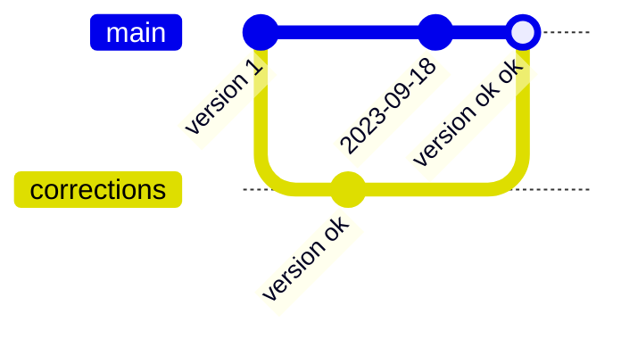

## Objectifs

* Comprendre la gestion de versions
* Découvrir GitHub
* Installer et configurer Git

## Pré-requis

`````stepper
# Être à l'aise avec l'utilisation du terminal
```bash
mkdir my-project
cd my-project
```
# Savoir installer un logiciel sur ton système
````tabs
!--- Ubuntu
```bash
sudo apt install <something>
```
!--- Mac OS
```bash
brew install <something>
```
!--- Windows
Télécharger le programme d'installation et double-cliquer dessus.
````
`````

## Introduction

Tu as peut-être déjà vécu cette situation :


Faire une copie d'un document pour le modifier tout en gardant une copie de sauvegarde au cas où. Mais après avoir fait plusieurs copies avec des noms plus ou moins inspirés, laquelle est la "bonne version" ?

Est-ce que le fichier "version ok" est vraiment mieux que "version ok ok" ? Est-ce que la version avec une date dans le nom de fichier est vraiment la plus récente ? Quelles sont les **différences entre chaque version** ?

Une application web est composée de dizaines de fichiers, voire plus. Imagine si tu devais gérer chaque version de fichier à la main, tout en restant synchronisé avec plusieurs personnes travaillant sur le même projet...

Heureusement, des outils existent pour résoudre ces problèmes de **gestion de versions**. Ces outils peuvent paraître complexes au début, mais ils sont adaptés à la sauvegarde et au partage de code source. En les utilisant tous les jours pour tes projets, tu seras capable en seulement quelques semaines de travailler de manière efficace et collaborative.

Découvrons ces outils ensemble.

## Sommaire

## La gestion de versions

Repense à notre exemple avec plusieurs versions d'un même fichier :


Tu as 4 fichiers dans ton répertoire :

* `rapport.odt` : peut-être la version originale, mais ce n'est pas sûr.
* `rapport 2023-09-18.odt` : certainement une version du 18 septembre 2023, mais ça ne te dit pas si elle est plus récente ou plus ancienne que les autres.
* `rapport (version ok).odt` et `rapport (version ok ok).odt` : des versions qui ont été "ok" un jour, mais quand ?

Je te propose une autre représentation :



Et une petite histoire pour aller avec :

* Tu as fait une première version de ton rapport avant le 18 septembre 2023 (disons le 17 pour les besoins de l'histoire).
* Tu as envoyé cette première version à une personne pour relecture et tu as récupéré une version corrigée (`version ok`).
* En parallèle, tu as toi-même fait des modifications le 18 septembre.
* Tu as réuni tes modifications avec les corrections que tu as reçues : `version ok ok` est la dernière version en date, et a priori la "bonne version".

Comment je connais cette histoire ? Chaque version représentée par un point dans le schéma "plan de métro" est connectée à une version plus ancienne : chaque version a une version **parente** à laquelle elle ajoute des modifications. Tu peux suivre l'histoire des versions en suivant les "lignes" de la gauche vers la droite.

Plusieurs "branches" peuvent exister en parallèle : c'est le cas ici avec les `corrections`. Tu peux voir une **branche** comme une copie envoyée à un ami et que tu récupéreras plus tard avec des modifications.

Tu devras alors **fusionner** la version de la branche avec ta version principale : mélanger les textes en t'assurant que le résultat reste cohérent.

Pour résumer, voici ce que tu peux faire avec la gestion de versions :

* Créer une version initiale.
* Ajouter des modifications à une version parente.
* Faire des branches pour gérer plusieurs versions en parallèle.
* Fusionner les versions.

## Utiliser GitHub en ligne

Dans un premier temps, tu vas utiliser une plateforme en ligne pour gérer des fichiers : GitHub.

```quests
2133
```

## Utiliser Git en local

Maintenant que tu as découvert GitHub, tu peux reproduire les mêmes opérations pour gérer des versions de fichiers sur ta machine, en ligne de commande avec Git.

### Installer Git

Commence par installer Git et familiarise-toi avec les principales commandes.

```quests
1309
```

### Lier Git et GitHub

Git sur ta machine et GitHub en ligne : en liant les deux, tu pourras sauvegarder ton travail sur un serveur et partager tes projets.

```quests
2138
```

## Mode collaboratif

Tu as maintenant un environnement de travail complet pour la gestion de versions : tu peux démarrer de nouveaux projets et travailler dessus avec plusieurs personnes.

Pour rendre le travail collaboratif plus fluide, tu peux apprendre à utiliser des branches et à résoudre des conflits entre plusieurs versions.

```quests
1313, 1312
```