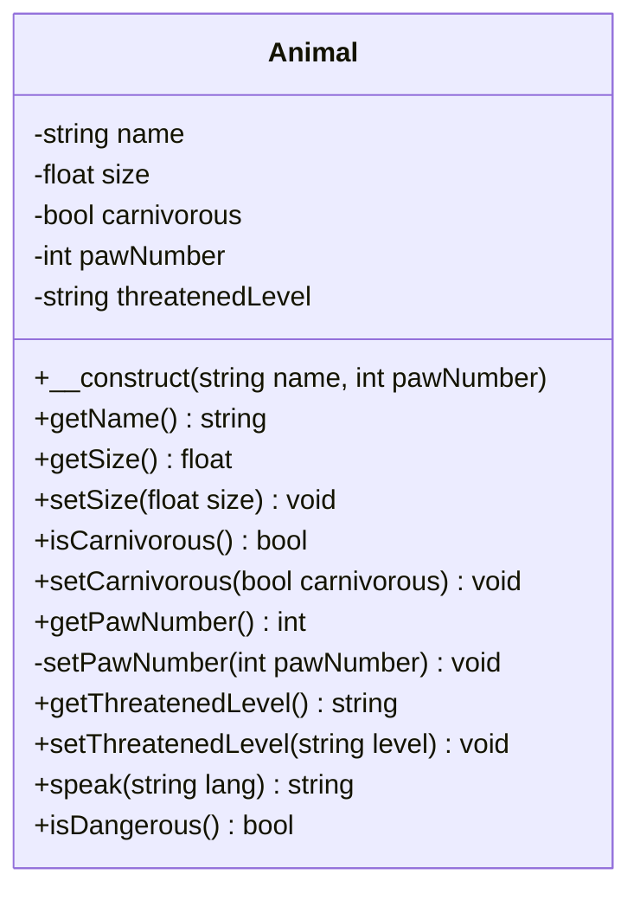

# Prérequis

```quests
2249
```

```title-book
Introduction
```

```story
Démarre de la branche **poo4** du [Wildzoo](https://github.com/WildCodeSchool/php-wildzoo). Tu dois voir un lion, un perroquet et un éléphant, leur niveau de menace et leur dangerosité. C'est bon ? La visite peu continuer !
Dans cette quête tu vas apprendre quelques nouvelles notions qui vont te faciliter l'utilisation des objets.
```

## 🤓 À la fin de cette quête, tu seras capable de :

* ✅ Utiliser un constructeur
* ✅ Comprendre la notion de visibilité
* ✅ Créer et utiliser des getters et setters
* ✅ Comprendre les bases de l'UML

# Constructeur

Pour commencer, nous allons casser du code :D
🖥️ Rends toi sur la page *index.php* et modifie le code comme ceci (une ligne à commenter et 2 lignes à ajouter)

```php
// $lion->name = 'lion';
var_dump($lion);
echo $lion->name;
```

On cherche ici à afficher la propriété `$name` du lion, or cette propriété n'est plus définie puisque la ligne du dessus a été commentée. Le message qui apparaît indique `Fatal error: Uncaught Error: Typed property Animal::$name must not be accessed before initialization in ...`
Si tu regardes le résultat du `var_dump`, tu vois que la propriété `$name` est `*uninitialized*`. Or, il est impossible d'afficher une propriété non initialisée.
Dans ce cas, comment s'assurer que le développeur utilisant la classe soit *forcé* de définir un nom, afin de ne pas tomber sur ce type d'erreur ? Ce que nous aimerions, c'est qu'au moment d'instancier l'objet **Animal**, il soit obligatoire de choisir ce nom.

Heureusement, il y a une solution, c'est le constructeur !


Un constructeur est une méthode particulière qui, si elle est définie, impose d'utiliser un certain nombre de paramètres au moment de l'instanciation de l'objet, c'est-à-dire au moment d'utiliser le mot clé `new`.

En PHP, le constructeur s'écrit `__construct()` avec **DEUX** *underscores*. C'est une "méthode magique", il y en a d'autres en PHP mais celle-ci est la plus utilisée. Voici le code correspondant :

```php
public string $name;

public function __construct(string $name)
{
    $this->name = $name;
}
```

```alert-warning
Un constructeur ne renvoie rien, tu ne dois donc pas y mettre de return.
```

🖥️ Ajoute ce code à ta classe et réactualise la page. Mais attention, une erreur peut en cacher une autre, et tu vois cette fois apparaître le message `Fatal error: Uncaught ArgumentCountError: Too few arguments to function Animal::__construct(), 0 passed`

En effet, puisque tu as mis un paramètre obligatoire dans ta méthode `__construct()`, tu es maintenant bien forcé de fournir ce paramètre au moment de l'instanciation de l'objet ! Corrige le fichier *index.php* afin de passer un paramètre "nom" pour chaque nouvelle instance. Enlève également les lignes de type `$lion->name('lion')`, elles sont redondantes ici puisque la valeur est déjà passée à la propriété `$name` via le constructeur. Ci-dessous le code que tu dois obtenir pour le lion (mais il faut le modifier pour chaque animal).

```php hl[1]
$lion = new Animal('lion');
$lion->pawNumber = 4;
$lion->carnivorous = true;
$lion->size = 70;
$lion->threatenedLevel = 'VU';
```

# Visibilité


## Public ou privé ?

Depuis le début de cette série de quêtes, tu as dû remarquer le mot clé `public` devant toutes les propriétés et méthodes. C'est ce qu'on appelle la visibilité, et il en existe trois niveaux :

* public
* protected
* private

Ils permettent de définir si une propriété ou une méthode est accessible **depuis l'extérieur de la classe** ou non.

Tu as déjà utilisé les propriétés depuis la classe **Animal**, dans les méthodes `speak()` et `isDangerous()` (associées à `$this`).
Mais tu as utilisé également propriétés et méthodes depuis le fichier *index.php*. Dans ce cas, tu te trouves **en dehors** de la classe **Animal**.

La visibilité permet d'autoriser ou non l'appel / l'utilisation de propriétés et méthodes en dehors de la classe elle-même. Si le mot-clé `public` est utilisé, la propriété/méthode sera utilisable partout. Au contraire si elle est définie `private`, tu ne pourras utiliser cette propriété/méthode que depuis la classe elle-même.
Pour `protected` c'est un peu entre les deux mais nous verrons cela dans une future quête lorsque nous aborderons la notion d'héritage.

🖥️ Modifie ta classe Animal pour passer la propriété `$size` en privé.

```php
private float $size;
```

Recharge ensuite ta page, ouch !

```alert-error
``php
Fatal error: Uncaught Error: Cannot access private property Animal::$size in ...`.
``
```


Tu ne peux plus modifier ou accéder à la propriété depuis **l'extérieur** de ta classe !

Comment faire, alors ? 😱

## Getters & Setters

Dans *Animal.php*, tu vas devoir définir une méthode publique `getSize()` qui va avoir pour rôle de retourner la propriété qui, elle, est privée.

```php hl[4:7]
private float $size;
//...

public function getSize(): float
{
    return $this->size;
}
```

Cette méthode, puisqu'elle se trouve dans la même classe, a le droit d'accéder aux propriétés `private`.

Ensuite, dans un fichier externe comme *index.php*, pour afficher la taille du lion tu feras
`echo $lion->getSize()` et non plus directement `$lion->size` , *size* n'étant plus accessible depuis l'extérieur.

Actuellement dans *index.php*, tu trouves plutôt du code permettant de modifier la valeur de `$size`, par ex `$lion->size = 70;`
C'est notamment cette ligne qui déclenche l'erreur vue précédemment, puisque tu n'as plus le droit d'utiliser directement la propriété `$size`. Tu vas créer une nouvelle méthode `setSize()` qui va prendre un entier en paramètre et va permettre de modifier la valeur de `$size`.

```php hl[9:12]
private float $size;
//...

public function getSize(): float
{
    return $this->size;
} 

public function setSize(int $size): void
{
    $this->size = $size;
}
```

Cette nouvelle méthode prend le **paramètre** `$size` et affecte cette valeur à la **propriété** `$size`, qui est ici récupérée via la syntaxe `$this->size`. Par convention, le paramètre de la méthode a le même nom que la propriété, mais le premier, accessible uniquement dans la méthode, sert uniquement à donner une valeur à la propriété qui elle est accessible dans toute la classe !
Cela peut porter à confusion au départ, donc garde bien en tête que le paramètre et la propriété sont deux *variables* différentes ! 

🖥️ Maintenant que `setSize()` existe, tu peux t’en servir dans ton *index.php* (puisque la méthode est publique) et ainsi corriger la précédente "Fatal error" que tu as pu rencontrer.

```php
$lion->setSize(70);
// TODO for other animals.
```

Ces deux types de méthodes, qui ont pour unique but de récupérer ou de modifier une propriété sont appelés des *getters* et *setters* (ou, pour les puristes de la francisation, des accesseurs et mutateurs). 

Ils ne sont pas obligatoires (si par exemple tu n'as jamais à modifier une propriété, tu n'as pas besoin de *setter*). Elles restent des méthodes comme les autres, que tu dois penser à typer. Mais retiens que leur utilisation (qui évite de manipuler directement les propriétés) est une bonne pratique, reconnue par la communauté des développeurs.

- Les *getters* (du verbe anglais *"get"*, *"obtenir"*) commencent généralement par le préfixe *get* (*is* est aussi utilisé si le type de la propriété est un booléen), suivi du nom de la propriété.
- Les *setters* (du verbe anglais *"set"*, *"mettre en place"*, *"définir"*), sont préfixés généralement par *set*, suivi du nom de la propriété.

Nous avons vu la définition des *getters* et *setters*, mais posons nous maintenant la question de *l'intérêt* d'y recourir ? À première vue, c’est plus long que d’interagir directement avec des propriétés qui seraient en `public`... En effet, mais il est important de **contrôler** son code et parfois de devoir y mettre des verrous.

Dans la vraie vie, il n'est par exemple pas possible d'avoir un animal avec un nombre de pattes "négatif", alors que rien n'empêcherait de le faire dans ce code. Or, en suivant le paradigme objet, on souhaite que le code reflète au mieux la réalité, il ne devrait donc pas être permis de passer une valeur inférieure à 0 à la propriété `$pawNumber`. C’est là que la visibilité `private` et le *setter* vont prendre tout leur sens !

🖥️ Maintenant que tu as compris le fonctionnement, passe `$pawNumber` en private et créé le *getter* et le *setter* associés. Tu vas pouvoir ajouter un peu d'algorithmique dans le *setter*, par exemple une condition.

```php

public function setPawNumber(int $pawNumber): void
{
    if($pawNumber < 0) {
        $pawNumber = 0;
    }
    $this->pawNumber = $pawNumber;
}
```

Avec ce nouveau code, il ne sera pas possible de créer de dangereux mutants aux pattes négatives 😛

Poussons maintenant la réflexion un peu plus loin. Certaines méthodes n'ont qu'un usage interne à la classe et n'ont pas vocation à être utilisées depuis l'extérieur, dans ce cas, il est recommandé de mettre ces méthodes en `private`. Dans le cas de `setPawNumber()`, y a t-il vraiment un intérêt de laisser l'utilisateur modifier cette valeur ? Lorsqu'un animal est créé, le nombre de ses pattes est connu et fixe (non, on ne va pas gérer le cas où un animal perdrait une patte...). Il est donc tout à fait logique de "réclamer" à l'utilisateur de la classe, d'indiquer ce paramètre lors de instanciation (donc dans le `__construct()`).
Cependant, on ne veut toujours pas que le nombre de patte soit négatif. Plutôt que de déplacer la logique de `setPawNumber()` directement dans le constructeur (au risque de l'alourdir inutilement), ce dernier va faire appel à `setPawNumber()`. La méthode n'ayant plus vocation à être appelée en direct, on peut la passer en `private`. 
Ça fait beaucoup d'informations ! Pas de panique, voici le code correspondant :

```php hl[5,8]
private string $name;
private int $pawNumber;
// ...

public function __construct(string $name, int $pawNumber) 
{
    $this->name = $name;
    $this->setPawNumber($pawNumber);
}

// method is private because only use inside the constructor 
private function setPawNumber(int $pawNumber): void
{
    if($pawNumber < 0) {
        $pawNumber = 0;
    }
    $this->pawNumber = $pawNumber;
}
```

🖥️ Il te faudra également modifier *index.php* en conséquence, pour ajouter le nombre de pattes au moment de l'instanciation.

```alert-info
Tu vas généralement être amené à créer des *getters* pour toutes tes propriétés, mais ce n'est pas systématique pour les *setters*, tout dépend s'il y a besoin d'ajouter une logique supplémentaire comme pour le nombre de pattes, et/ou si l'on souhaite laisser la possibilité à l'utilisateur de la classe de modifier cette valeur par la suite. Dans notre cas, un `setName()` semble plutôt inutile car on ne changera pas le nom de l'animal une fois créé. Par contre on peut imaginer que l'animal va grandir et donc un `setSize()` va être intéressant. C'est à déterminer au cas par cas.
```

```resource
https://youtu.be/zZ_tVAPfGAA
# La POO en PHP - 4/31 : La visibilité public / private
Cette vidéo résume ce que tu viens de voir sur la visibilité.
```

## [BONUS] Promotion des propriétés dans le constructeur
Depuis PHP 8, une nouvelle syntaxe est apparue pour simplifier l'écriture d'un constructeur. Cette syntaxe - encore peu utilisée - est facultative et cumulable avec la syntaxe classique.

```php
public function __construct(private string $name) {};
```

Ici, la visibilité est indiquée avec le paramètre du constructeur. Dans ce cas, PHP va créer la propriété et lui assigner la valeur passée en argument, il n'y a donc plus besoin de définir la propriété au dessus du constructeur. Le code est ainsi plus concis. Il est possible de mêler propriétés classiques et *promues*.

```ressource
https://www.php.net/manual/fr/language.oop5.decon.php#language.oop5.decon.constructor.promotion
# Promotion de propriétés de constructeurs - Documentation officielle.
```

# Diagramme de classe

Afin de représenter un ensemble de classes au sein d'une application, tu peux être amené à _dessiner_ un **diagramme de classe**. Le standard c'est l'**UML**. Un peu comme MERISE, c'est un standard de représentation d'éléments lors de la conception. Cela peut être utilisé pour un peu tout et n'importe quoi. Tu peux d'ailleurs schématiser tes bases de données avec UML.
Sans trop entrer dans les détails, voici à quoi ressemble une représentation UML de notre classe `Animal` :



Dans les différents blocs, tu retrouves :

1. le nom de ta classe,
1. les propriétés, avec leur type,
1. les méthodes

Pour les différents éléments, tu retrouves les signes suivants :

- un `+` pour _public_,
- un `-` pour _privé_,
- un `#` pour _protected_.

Ensuite, il y a d'autres normes, mais tu n'as pas besoin de plus pour le moment. Si la curiosité est insoutenable, tu peux jeter un oeil aux ressources ci-dessous.

```resource
https://youtu.be/UI6lqHOVHic
# UML Class Diagram Tutorial
Si, comme ton formateur, tu aimes modéliser les choses et que l'UML t'intéresse, tu peux regarder cette vidéo.
```

```resource
https://yuml.me/diagram/scruffy/class/draw
# yuml.me
Un petit outil sympa pour dessiner des diagrammes UML en ligne, gratuitement et rapidement (oui, tes formateurs ont une définition particulière de *"sympa"*). Évidemment, tu ne feras pas la conception de tout un logiciel avec ça. Quoique...
```

# 💪 Challenge
### Mise à jour
- En suivant le diagramme de classe fourni, mets à jour la classe **Animal** pour changer les visibilités et ajouter les getters/setters correspondants. 
- Mets également à jour *index.php* afin que tes animaux s'affichent toujours convenablement.
- Assure toi également que la taille de l'animal soit toujours positive.
- Poste en solution le code de ton fichier *Animal.php*
### Critères de validation
- Le code du fichier *Animal.php* est posté 
- Les visibilités des propriétés et méthodes sont correctes
- La méthode `setSize()` s'assure que l'animal ait toujours une valeur positive pour sa taille.
- Toutes les propriétés et méthodes sont définies comme sur le diagramme de classe.

==$==


```php
<?php

class Animal
{
    private string $name;
    private float $size = 100;
    private bool $carnivorous = false;
    private int $pawNumber;
    private string $threatenedLevel = 'NE';

    public function __construct(string $name, int $pawNumber)
    {
        $this->name = $name;
        $this->setPawNumber($pawNumber);
    }

    public function getName(): string
    {
        return $this->name;
    }

    public function getSize(): float
    {
        return $this->size;
    }

    public function setSize(float $size): void
    {
        if ($size < 0) {
            $size = 0;
        }

        $this->size = $size;
    }

    public function getPawNumber(): int
    {
        return $this->pawNumber;
    }

    private function setPawNumber(int $pawNumber): void
    {
        if ($pawNumber < 0) {
            $pawNumber = 0;
        }
        $this->pawNumber = $pawNumber;
    }

    public function getThreatenedLevel(): string
    {
        return $this->threatenedLevel;
    }

    public function setThreatenedLevel(string $threatenedLevel): void
    {
        $this->threatenedLevel = $threatenedLevel;
    }

    public function isCarnivorous(): bool
    {
        return $this->carnivorous;
    }

    public function setCarnivorous(bool $carnivorous): void
    {
        $this->carnivorous = $carnivorous;
    }

    public function speak($lang = 'fr'): string
    {
        if ($lang === 'fr') {
            $message = 'Bienvenue au zoo, je suis un ';
        } else {
            $message = 'Welcome to the zoo, I\'am a ';
        }

        return $message . $this->name;
    }

    public function isDangerous(): bool
    {
        return $this->size > 50 && $this->carnivorous === true;
    }
}
```