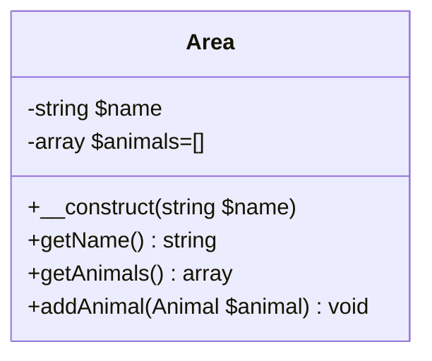

# Prérequis

```quests
2265
```

```title-book
Introduction
```

```story
Bonjour visiteur, lance toi sur la nouvelle branche **poo6** de ton [Wild zoo](https://github.com/WildCodeSchool/php-wildzoo). Dans cette quête, tu vas être amené à créer d'autres classes, et voir comment les objets peuvent interagir les uns avec les autres.

```

## 🤓 À la fin de cette quête, tu seras capable de :
- ✅ Comprendre le principe de *namespace*
- ✅ Créer des classes dans un espace de nom
- ✅ Comprendre le typage objet
- ✅ Injecter un objet dans un autre

# Les *namespaces*

En programmation orientée objet, il arrive que différentes classes, portent **le même nom**, parce que le projet peut être vaste et contenir des centaines de fichiers, ou parce que tu utiliseras souvent des classes venues de bibliothèques externes (pour ne pas réinventer la roue, on télécharge souvent des briques de codes réalisées par d'autres développeurs ;-)). Dans ce cas, tu ne maîtrises pas forcément le nom des classes récupérées. Afin d'éviter tout conflit de nom, PHP met à disposition des **espaces de noms** ou ***namespaces***.

Les *namespaces* permettent à une application d'utiliser des classes aux noms identiques au sein d'un même projet.

Le principe de *namespace* peut être comparé à un système d'arborescence de fichiers et de dossiers.

- Une arborescence de fichiers définit une structure **physique** de répertoires.
- Un namespace définit plutôt une structure **logique** de répertoires.

Prenons l'exemple de notre WildZoo.
Cette application comporte déjà la classe Animal dans le fichier *src/Animal.php* ! Imagine que tu utilises une bibliothèque externe, contenant elle même une classe nommée **Animal**, que tu rangeras dans le sous-répertoire, *src/Other/Animal.php*.

```alert-warning
Tu peux voir que ce répertoire et ce fichier sont déjà créés, la nouvelle classe Animal est vide, c'est juste pour l'exemple, tu pourras effacer ce répertoire *Other* à la fin de la quête.
```

🖥️ Maintenant, imaginons que l'on ait besoin d'utiliser ces deux classes dans un même fichier, mets à jour *index.php* en ajoutant le require de la nouvelle classe **Animal.**

```php hl[3]
<?php
require __DIR__ . '/../src/Animal.php';
require __DIR__ . '/../src/Other/Animal.php';

$animal = new Animal();
```

Actualise, tu obtiens alors cette erreur :

```alert-error 
PHP Fatal error:  Cannot declare class Animal, because the name is already in use in...
```

Au moment de l'instanciation de l'objet Animal, PHP ne sait pas quelle classe **Animal** utiliser, il y a un conflit de nom. 
Les espaces de noms vont pouvoir régler ce problème !

🖥️ Ajoute maintenant des *namespaces* dans les deux classes :

```php hl:2
<?php 
namespace App;

class Animal
{
    // (...) Code de ta classe Animal
}
```

```php hl:2
<?php
namespace App\Other;

class Animal
{
    // Code d'une autre classe Animal
}
```

L'effet de l'ajout de *namespace* sera de créer pour chacune de ces classes un :def[FQCN]{value="Fully Qualified Class Name"} (nom pleinement qualifié) construit comme ceci :

- `App\Animal` Pour la classe `src/Animal.php`
- `App\Other\Animal` Pour la classe `src/Other/Animal.php`

🖥️ Met maintenant *index.php* à jour pour permettre l'instanciation des deux classes (tu dois mettre le bon FQCN pour toutes les instanciations d'animaux) :

```php hl[6:7]
<?php
//index.php
require 'src/Animal.php';
require 'src/Other/Animal.php';

$lion = new App\Animal('lion', 4);
$otherAnimal = new App\Other\Animal();
```

```alert-info
Cette fois, aucune erreur et nous avons bien deux instances différentes. Pour PHP, le nom de la classe n'est plus juste "Animal", mais le FQCN (donc namespace + nom de classe), puisque les FQCN des deux classes sont différents, il n'y a plus de conflit de noms.
```

Pour simplifier un peu cette écriture, nous utiliserons le mot clé `use` (en début de fichier) plutôt que d'appeler les classes par leur FQCN à chaque instanciation, ce qui peut-être long à écrire.


🖥️ Mets à jour le code :

```php hl[5:6]
<?php
//index.php
require 'src/Animal.php';
require 'src/Other/Animal.php';
use App\Animal;
use App\Other\Animal as OtherAnimal;

$animal = new Animal();
$otherAnimal = new OtherAnimal();
```

Le `use` demande d'écrire le FQCN  une bonne fois pour toute (ton IDE t'aide généralement pour l'auto-complétion). Tu n'auras plus à le faire dans le reste du script, et tu appelleras ta classe avec la dernière partie du `use` (après le dernier antislash).
Pour `use App\Animal` tu pourras ensuite appeler ta classe juste `Animal` pour le reste de ton code dans ce fichier *index.php*. 
Cependant, si on en reste là, le problème de conflit de nom réapparaît avec l'autre `use App\Other\Animal` ! Heureusement, il y a une solution, les alias de nom. À l'aide du mot clé `as` après le FQCN, tu peux donner un autre nom (pour ce script) à ta classe. PHP considère ensuite uniquement ce nouveau nom pour l'usage de la classe. Donc ici, suite au `use App\Other\Animal as OtherAnimal`, pour instancier cette classe tu devras faire un `new OtherAnimal` et non un `new Animal` car c'est le nom de l'alias qui prime.

```alert-info
Dans ces exemples, on utilise un *namespace* appelé `App`. Ce n'est pas obligatoire mais c'est souvent le nom donné au *namespace* principal de ton **App**lication.
```

Tu connais maintenant le fonctionnement et l'intérêt des *namespaces*. Cela te permettra d'aborder sereinement le principe d'*autoload* (chargement automatique des classes) que tu verras bientôt et **spoiler** nous épargnera d'écrire les `require` :D !

```resource
https://www.php.net/manual/en/language.namespaces.php
# Les namespaces en PHP
Les namespaces en PHP.
```

```alert-error
Efface le répertoire Other, tu n'as pas besoin de cette classe Animal supplémentaire qui était donné juste pour illustrer cette quête.
```

# Un objet dans un autre

En POO, il est très fréquent de faire interagir les objets entre eux. Dans notre zoo, les animaux sont placés dans des zones.
Le lion et l'éléphant vont être dans la zone "savane", le perroquet dans la zone "jungle", le poisson dans l'aquarium, *etc*.


🖥️ Crée la classe **Area**, dans le fichier *src/Area.php* et dans le *namespace* `App`. Ajoute le *require* pour le fichier *Area.php* dans *index.php* ainsi que le `use` adéquat.

Actualise la page dans ton navigateur. Tu dois maintenant voir une nouvelle icône en forme de carte apparaître en haut à droite. Clique dessus pour ouvrir la carte des zones de ton zoo. Pour le moment, tu n'en a pas déclaré donc la carte est vide. Arrangeons vite cela.

🖥️ Dans la classe **Area**, ajoute (en typant bien)  :

* une propriété `$name`
* un constructeur pour indiquer le nom de la zone à l'instanciation d'un nouvelle Area.
* une méthode `getName()`

Dans *index.php*, instancie un objet `$savana` de type `Area`, en lui passant le nom 'savana'. Comme tu l'as fait pour les animaux, il faut aussi créer un tableau `$areas` dans lequel tu mettras tes objets **Area**, ce tableau est utilisé pour la partie l'affichage. Actualise ta page, tu vois ta nouvelle zone apparaître. Une image est choisie automatiquement depuis le dossier *images/areas* en fonction du nom de la zone, il en existe plusieurs de disponible (savana, aquarium, jungle...) donc n'hésite pas à en ajouter d'autres.

```php
$savana = new Area('savana');
$areas = [$savana];
```

Maintenant, tu veux pouvoir ajouter les animaux à tes Area. L'idée pour organiser tout ça, va être de créer une propriété `$animals`, qui sera un tableau contenant des animaux (c'est-à-dire des instances de la classe **Animal**).

Tes objets `Area` contiendront donc des objets `Animal` ! Voici le diagramme de classe :


🖥️ Dans la classe **Area**, ajoute  :
- une proriété `$animals` de type *array*, avec en tableau vide en valeur par défaut.
- un *getter* `getAnimals()` renvoyant un *array*. Un setter pour le nom n'est pas nécessaire, une zone ne va pas changer de nom.
- pour ajouter un nouvel animal, on *pourrait* créer un *setter* `setAnimals()` qui prendrait un tableau en paramètres. Cependant, cela serait compliqué de s'assurer que ce tableau contient uniquement des objets de type **Animal**. Une bonne alternative est plutôt de créer une méthode `addAnimal()` :

```php
public function addAnimal(Animal $animal): void
{
    $this->animals[] = $animal;
}
```

Cette méthode va prendre en paramètre un **objet de type Animal**.

```alert-info
Tu vois ici que le type utilisé est directement le nom de la classe **Animal** ! En PHP, tu as vu les types classiques (integer, string, array, float, booleen...) mais tu peux également typer avec des noms de classes. Cela te permet de restreindre le paramètre à un objet de cette classe, ce qui est extrêmement pratique pour t'assurer qu'on ne passe pas n'importe quoi en argument de ta méthode. Tu utiliseras très souvent cette façon de faire pour *injecter* des objets dans un autre.
```

## Challenge

- Fais en sorte de bien utiliser les *namespaces* et les *use*.

Ajoute au moins les zones *savana* et *jungle* à ta carte.

En utilisation `addAnimal()`, ajoutes-y des animaux :
- Pour la zone savane, ajoute le lion et l'éléphant. 
- Pour la zone jungle, ajoute le perroquet.

Une fois qu'une zone possède des animaux, tu peux cliquer sur l'icône de cette zone sur la carte, pour revenir sur la page des animaux, mais affichant uniquement ceux de la zone en question (regarde la *query string* dans l'URL).

- Poste le code de ta page *index.php*.

## Validation
- Le code de la page *index* possède les *use* pour **Area** et **Animal**
- Des objets de type **Area** sont instanciés pour la savane et la jungle, et les bons animaux sont mis dedans.

==$==


```php
<?php

/***************************************/
/******** ⚠️ WORK HERE ONLY ⚠️ ***********/

require __DIR__ . '/../src/Animal.php';
require __DIR__ . '/../src/Area.php';

use App\Area;
use App\Animal;

$lion = new Animal('lion', 4);
$lion->setCarnivorous(true);
$lion->setSize(70);
$lion->setThreatenedLevel('VU');

$parrot = new Animal('parrot', 2);
$parrot->setSize(30);

$elephant = new Animal('elephant', 4);
$elephant->setThreatenedLevel('LC');

$animals = [$lion, $parrot, $elephant];

$savana = new Area('savana');
$savana->addAnimal($lion);
$savana->addAnimal($elephant);
$jungle = new Area('jungle');
$jungle->addAnimal($parrot);

$areas = [$savana, $jungle];

/***************************************/
/***************************************/


// Do not modify code below
require 'view.php';
?>
```