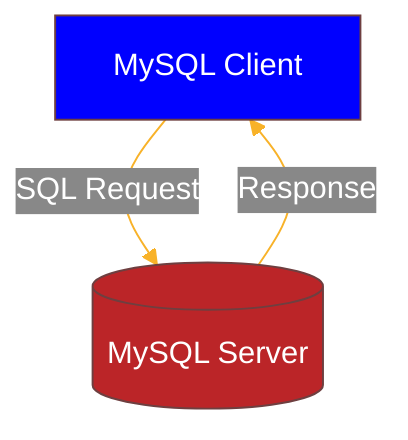

## Objectifs

* Comprendre ce qu'est un SGBD
* Installer et configurer MySQL
* Écrire ta première requête SQL

## Introduction

```story
Bienvenue jeune sorcier, dans le monde merveilleux et magique des bases de données. 


Une base de données permet de stocker des informations utiles pour ton application. Tu vas apprendre dans les prochaines quêtes comment manipuler ces données.

Pour le moment, tu dois installer un logiciel de base de données sur ta machine : un SGBD (Système de Gestion de Base de Données). Dans cette quête, nous te proposons d'installer MySQL. Il en existe d'autres comme MariaDB, PostgreSQL, Microsoft SQL Server, *etc.* et leur fonctionnement est globalement similaire. 
```

```alert-warning
**IMPORTANT**

Si tu as des difficultés avec l'installation de MySQL, n'hésite pas à demander de l'aide à ton formateur ! 
```

## Sommaire

## Un peu de vocabulaire

- **SQL** (Structured Query Language) est le langage standard pour interagir avec une base de données. Il est utilisé par tous les SGBD.
- Un **SGBD** est un logiciel de gestion de base de données, qui utilise donc SQL.
- **MySQL** est **un** SGBD très utilisé, appartenant à l'entreprise Oracle. Dans les prochaines quêtes, tu va apprendre à utiliser le SQL sur MySQL, mais puisque ce langage est un standard, tu seras en mesure de l'utiliser également sur les autres SGBD. Attention, il y a tout de même quelques différences entre les SGBD qui n'implémentent pas tous le standard SQL exactement de la même manière, mais pour les fonctionnalités les plus basiques tu ne verras pas de différence.

MySQL est un logiciel possédant une architecture **client-serveur**. C'est-à-dire que les données sont stockées sur un serveur MySQL. Mais ce serveur n'a pas d'interface graphique. Il est simplement là pour stocker, et répondre aux requêtes. Il faut donc utiliser un **client** compatible avec MySQL, pour envoyer des requêtes au serveur et interagir avec. Ces requêtes servent notamment à lire, mettre à jour ou ajouter des données dans la base.

```alert-info
Tu connais déjà cette architecture client-serveur pour les sites web. Le serveur HTTP traite les requêtes envoyées par le client (ton navigateur par exemple) et renvoie des réponses.
```

Le serveur MySQL peut donc se trouver sur une machine différente du client qui va l'interroger. Quand tu seras en train de développer, tu auras simultanément le client et le serveur sur ta machine en local.

De la même manière qu'un serveur HTTP peut-être interrogé par des clients HTTP différents, tu auras un serveur MySQL mais tu seras amené à utiliser différents clients MySQL.
Le premier (le plus basique) s'installe en même temps que le serveur MySQL, et s'utilise en ligne de commande uniquement. Pour te familiariser avec SQL, tu utiliseras au départ uniquement ce client dans ton terminal. Un peu plus tard durant ta formation, tu pourras installer des clients graphiques plus complets (citons par exemple MySQL Workbench, PHPMyAdmin, des extensions directement dans ton IDE, *etc.*).

Il y aura donc toujours 2 étapes fondamentales :
1. Le client envoie une requête SQL au serveur
2. Le serveur analyse cette requête et renvoie sa réponse au client qui l'affiche si nécessaire.



## Installation de MySQL

```alert-error
Avant d'aller plus loin, assure toi de ne pas avoir déjà installé MySQL ou un logiciel tel que MAMP, XAMP, WAMP, etc. qui pourrait déjà inclure un serveur MySQL. Cela pourrait créer des conflits par la suite. 

Si c'est le cas, la procédure d’installation de MySQL est évidemment à ignorer et tu peux passer à la partie sur la connexion à MySQL.
```

```alert-warning
Si tu n'as pas MySQL d'installé (ce qui devrait être le cas), surtout n'essaie pas de l'installer par toi même. Choisi l'onglet correspondant à ton système d'exploitation (Ubuntu, Mac OS ou Windows) et suis bien les procédures expliquées ci-dessous.
```

````tabs os
!--- Ubuntu
Pour installer MySQL, ouvre un terminal et tape : 

```sh
sudo apt update
sudo apt install mysql-server
```
Voilà tu viens de d'installer MySQL, c'est  fini... ou pas, car en fait, c'est la configuration ensuite qui sera un peu plus complexe

```resource
https://www.digitalocean.com/community/tutorials/how-to-install-mysql-on-ubuntu-22-04
# Digital Ocean - Install MySQL Ubuntu 22.04
🐧 Ressource très complète sur un installation de MySQL sur Ubuntu, notamment pour une installation sécurisée pour de la production (tu n'as pas besoin de suivre ces instructions dans la quête).
```
!--- Mac OS

A. Télécharger MySQL Server

Cliquez sur le lien suivant afin de vous rendre sur la page de téléchargement du serveur MySQL : https://dev.mysql.com/downloads/mysql/

Vous devriez voir cette page apparaître :


Dans la partie **« Select Operating System »**, vérifiez bien que « macOs » est sélectionné. 

Dans la partie **« Select OS Version »**, il va falloir aller sélectionner la version de votre macOS ainsi que de votre processeur (votre puce). Pour cela, prenez le temps de lire la suite.

Afin de connaître la version de l’OS de votre Mac ainsi qui le choix entre une puce ARM ou x64 / x86, je vous invite à suivre ces étapes :

1. Cliquez sur votre logo apple, en haut à gauche de votre Mac. Ensuite cliquez sur **« A propos de ce Mac »** 

2. Dans la pop up d’information qui apparait, vous devriez avoir les détails concernant votre **processeur (puce)**, votre capacité de stockage, votre numéro de série et enfin votre **version d’OS**

3. Sélectionnez la version d’OS correspondante dans la partie **« Select OS Version »**. 
*Si vous avez une version plus ancienne, rendez vous sur l’onglet « Archives » que vous trouvez en haut de page puis sélectionnez la version correspondante.*

4. Si votre puce est une INTEL, choisissez **x64 / x86**

5. Si votre puce est une Apple M1 ou M2, choisissez **ARM**


Cliquez ensuite sur **« Download »** à côté de l’installateur correspondant *(prenez les DMG archive, qui sont des fichiers exécutables sur Mac. Similaires aux .exe sur Windows)*

Vous arrivez ensuite sur la page ci dessous. Cliquez sur **« No thanks, just start my download »** 


B. Installer MySQL Server

Aller chercher le fichier téléchargé dans vos Téléchargements et double cliquez dessus. 

Cette fenêtre est censée s’ouvrir : 


Suivez la procédure d'installation en acceptant tous les choix par défaut.


**Installation**

Vous devrez saisir le mot de passe de votre Mac (celui que vous saisissez à l’ouverture de session en allumant votre Mac).


**Configuration**

Vous serez invité à saisir ou à créer un mot de passe pour l’utilisateur root. Quelle que soit la méthode choisie, bien **noter et conserver** ce mot de passe.

*N.B : si cette étape n’est pas proposée, pas de panique, on pourra définir ce mot de passe par la suite. Après validation de cette étape, il est possible que vous deviez à nouveau saisir le mot de passe de votre Mac.*


Une fois l’installation terminée, rendez vous dans les **Préférences système** de votre Mac.

MySQL est censé apparaître tout en bas à gauche de la liste des configurations possibles. Cliquez dessus puis : 

- Si les indicateurs sont en rouge,

Cliquez sur **Start MySQL Server**.
Saisir le mot de passe de votre Mac.

*N.B : Afin que MySQL soit lancé automatiquement à l’ouverture de votre Mac, cochez la case « Start MySQL when your computer starts up »*

- Si les indicateurs sont en vert, MySQL est bien lancé.

*N.B : si le mot de passe de l’utilisateur root n’avait pas pu être créé précédemment, cliquer sur « Initialize Database », saisir un mot de passe, le conserver, le noter, et valider.*

**BRAVO, VOUS AVEZ FINI L'INSTALLATION DE MYSQL SERVER** 🥳

!--- Windows

````stepper nonLinear

# Etape 1 - Téléchargement de MySQL

Tout d'abord, il va falloir télécharger le programme d'installation à cette adresse : https://dev.mysql.com/downloads/installer/. 

Il est conseillé de prendre le **second programme** de la liste, comme sur cette image 


Lorsque le téléchargement est terminé, **exécute le programme** que tu viens de télécharger. 

Autorise le programme à s'installer. Cette fenêtre devrait apparaître devant toi : 


Choisissez la version **Server Only** et appuyez sur le bouton **Next**. Sur la fenêtre suivante, appuyez sur **Execute**.

# Etape 2 - Installation de MySQL

Le logiciel va procéder à l'installation de MySQL. Jusqu'ici, tu n'as téléchargé que le programme d'installation, mais pas encore MySQL en tant que tel. 


Lorsque le téléchargement de MySQL est terminé, clique sur **Next** puis **Execute**.


Une fois cette étape passée, cliquez sur **Execute** et/ou **Next**.

Félicitations, MySQL est bien installé désormais mais ce n'est pas encore fini !! Il reste encore l'étape de configuration qui est très importante. 

Tu devrais être sur cette page  :


Il suffit simplement de cliquer sur **Next**. Sur la page suivante, on sélectionne **Use Strong Password**, puis **Next**..

Tu arrives donc sur cette fenêtre : 


```alert error
Cette étape est **très importante** car c'est maintenant que tu vas définir le mot de passe qui te permet d'accéder à ton serveur MySQL en tant que **root**. 

Il faut absolument que tu te souviennes de ce mot de passe, donc saisis en un que tu n'oublieras pas et de préférence non sensible ! En effet, pendant la formation, il t'arrive souvent de partager ton écran ou des fichiers par erreur, il se peut donc fortement que l'on puisse lire par accident ce mot de passe. Ne choisi pas un mot de passe personnel, un simple « password » peut tout à fait convenir car ton ordinateur n'est pas un serveur de production ;).
```

Ensuite, clique sur **Next**, puis **Next**, et sur cette page, clique sur **Execute** : 


Lorsque toute la configuration est terminée, clique sur **Finish**, **Next** et **Finish**. Félicitations, tout est installé !!

# Etape 3 - Lancement de MySQL

Tu vas maintenant exécuter l'invite de commandes qui te permet d'exécuter tes requêtes SQL. 

Pour cela, tape dans la barre de recherche de Windows "MySQL". Tu devrais avoir ce résultat : 


Sélectionnez **MySQL Command Line Client**. 

On va te demander de saisir le mot de passe que tu as renseigné dans les étapes de configuration plus haut. 

Une fois cela fait, tu devrais avoir ce programme qui apparait : 


````

## Configuration de MySQL

### Se connecter via le client MySQL

Avant de passer à la suite, il faut que tu comprennes un peu le fonctionnement de MySQL. MySQL permet de créer plusieurs utilisateurs possédant chacun un mot de passe (gérés par MySQL) et ayant chacun plus ou moins de droits. Par défaut, il te créé un super-utilisateur (appelé root), qui a le droit de tout faire, dont créer de nouveaux utilisateurs.


L'installation du serveur MySQL installe aussi automatiquement le client MySQL (celui en ligne de commande). 

````tabs os
!--- Ubuntu
Pour utiliser ce client, il faut utiliser la commande `mysql` dans ton terminal, en super utilisateur, et saisi ton mot de passe de session

Tu viens d'installer une version "récente" de MySQL. Dans les versions précédentes, au moment de l'installation, MySQL te demandait de choisir un mot de passe pour cet utilisateur root. Aujourd'hui, MySQL utilise un plugin appelé `auth_socket` qui permet de s'affranchir d'un mot de passe pour root, et d'utiliser plutôt le mot de passe de ton utilisateur Ubuntu. C'est pour cela que pour te connecter, tu as utilisé `sudo` devant `mysql`. Ainsi, ton mot de passe de session t'es demandé et tu es connecté automatiquement en root.

```sh
sudo mysql
```
!--- Mac OS

```alert-warning
Si tu tapes la commande `mysql` dans ton terminal tu auras sans doute l'erreur suivante : `zsh command not found: mysql`. Certaines commandes Zsh ne sont pas accessible suite à l'installation d'une application ou d'une mise à jour. Pour les rendre accessibles par le système il faut vérifier que la variable d'environnement `$PATH` est correctement configurée et l'ajouter au fichier ~/.zshrc:
- Ouvre ton terminal
- Vérifie que tu es sous `zsh` en tapant "zsh"
- Tape `nano ~/.zshrc` dans ton terminal
- Ajoute en copiant/collant cette variable "path" au fichier, `export PATH=${PATH}:/usr/local/mysql/bin/`
- Sauvegarde le fichier et sors de l'éditeur nano (`Ctrl + X`, même sur Mac).
- Pour exécuter les changements, tape `source ~/.zshrc`

Et voila ;)

```
Tu peux maintenant ouvrir ton terminal et taper `mysql -u root -p`. Cette commande sert à demander l'ouverture d'une session mysql dans ton terminal pour l'utilisateur root (-u root) avec le mot de passe que tu fourniras juste après (-p).

On te demande maintenant le mot de passe, il s'agit de celui que tu as choisi lors de l'installation de MySQL auparavant pour ton utilisateur Root. Entre ce mot de passe et te voila connecté.

!--- Windows

```alert-info
Même si une version du terminal directement connectée à MySQL est installée de base, tu dois faire les étapes suivantes pour pouvoir lancer la commande `mysql` dans n'importe quel terminal (git bash, terminal de VS Code...).
```

Il faut commencer par indiquer a Windows où ce dernier se trouve en passant par les variables d'environnement.

Pour commencer, tu vas te rendre dans le répertoire d'installation de MySQL, qui devrait être `C:\Program Files\MySQL` si tu as suivi les instructions de la vidéo.

Tu trouveras dans ce répertoire tous les composants MySQL que tu as choisi d'installer. Rends toi dans le dossier "MySQL Server" puis "bin" et cherche l'exécutable qui s'appelle *mysql.exe*.
Fais un clic droit dessus et "*copier en tant que chemin d'accès*" pour que Windows copie le chemin d'accès au fichier, par défaut le suivant : `"C:\Program Files\MySQL\MySQL Server 9.3\bin\mysql.exe"`. 

Ensuite, tape "environnement" dans la barre de recherche de ton menu démarrer et clique sur "Modifier les variables d'environnement système".

Dans la fenêtre qui s'ouvre, clique sur "Variables d'environnement" en bas à droite et tu verras apparaître deux sections : la première sert à définir des variables relatives au compte d'utilisateur actuel et la seconde s'appliquera à tous les utilisateurs.

Dans notre cas, tu vas sélectionner Path dans la catégorie du bas appelée "Variables systèmes" puis cliquer sur "Modifier...".

Dans la fenêtre qui s'ouvre, ne touche surtout pas aux différents chemins qui apparaissent, clique plutôt sur Nouveau en haut à droite, colle le chemin d'accès que tu as été chercher juste avant en faisant CTRL + V puis efface le *mysql.exe* à la fin de la ligne, tu devrais donc avoir en bas de ta liste `"C:\Program Files\MySQL\MySQL Server 9.3\bin\` si tu as suivi toutes les instructions précédentes en gardant les valeurs par défaut.


Tu peux maintenant ouvrir n'importe quel terminal (CMD Windows, Git Bash ...) et taper `mysql -u root -p`. Cette commande sert à demander l'ouverture d'une session mysql dans ton terminal pour l'utilisateur root (-u root) avec le mot de passe que tu fourniras juste après (-p).

On te demande maintenant le mot de passe, il s'agit de celui que tu as choisi lors de l'installation de MySQL auparavant pour ton utilisateur Root. Entre ce mot de passe et te voila connecté.

```alert-warning
Bien que nous indiquions que la commande `mysql` puisse désormais être utilisée dans n'importe quel terminal et  faisons mention de Git Bash, il est ***impératif*** d'activer le support pour les pseudo consoles de Git Bash au moment de l'installation de ce dernier pour que cette commande fonctionne sans avoir à utiliser winpty.
```
````

Une fois connecté, tu arrive sur un *prompt* qui a la forme `mysql >` et qui t'invite à saisir tes requêtes SQL. Pour obtenir de l'aide, tu peux simplement utiliser le mot `help` ou le caractère `?` ce qui te donnera 


### Créer un nouvel utilisateur

Une fois connecté avec root, tu vas pouvoir créer un nouvel utilisateur, celui dont tu te serviras au quotidien.

```alert-error
En effet, pour des raisons de sécurité, on n'utilisera **jamais** directement l'utilisateur root ! c'est pour cela que nous allons créer un nouvel utilisateur.
```

```xtext callout
Dans le cas d'un site web mis en production, on cherchera à créer un mot de passe extrêmement sécurisé pour ce nouvel utilisateur, ainsi que les droits les plus restreints possibles afin de limiter les dégâts si l'utilisateur était tout de même compromis. Mais pour le moment, tu fais juste du développement sur ta machine. Ton serveur de base de données n'est pas celui qui sera sur le serveur final de production. Il n'y a normalement que toi qui va t'en servir. Tu n'as donc pas besoin "en développement" de choisir un mot de passe complexe. Au contraire, tu seras sans doute amené à partager ton écran avec des collègues ou ton formateur, choisi donc un mot de passe trivial, que tu n'utilises pas ailleurs et qui ne te posera donc pas de problème de sécurité.
```

Dans les exemples ci-dessous, nous choisirons en nom d'utilisateur 'harry' et en mot de passe 'potter'. Bien entendu, change par les valeurs de ton choix dans l'exemple ci-dessous.

```alert-warning
Dans des exemples de commandes SQL comme ci-dessous, c'est une pratique courante de représenter le prompt `mysql >` : cela rappelle que les commandes doivent être lancées dans un prompt MySQL et pas dans un prompt "classique". Fais attenttion à reproduire les commandes sans le `mysql >`. Fais aussi attention à taper ces commandes dans un prompt MySQL : tu dois voir le `mysql >` là où tu tapes tes commandes SQL.
```
 
```sql
mysql > CREATE USER 'harry'@'localhost' IDENTIFIED BY 'potter';
```

````xtext arrow
Note la présence du `;` : dans le terminal, tu dois toujours terminer une instruction SQL par un `;`. Si tu l'oublies, l'invite de commande affichera quelque chose comme ça :

```sql
mysql > CREATE USER 'harry'@'localhost' IDENTIFIED BY 'potter'
  ->
```

La flèche `->` t'indique que ton instruction est considérée comme incomplète et que tu dois la terminer avec un `;` final. Il n'est jamais trop tard pour bien faire 😉

```sql
mysql > CREATE USER 'harry'@'localhost' IDENTIFIED BY 'potter'
  -> ;
```
````

Cette commande créé l'utilisateur 'harry' avec le mot de passe 'potter'. Saisis ensuite ces commandes :
```sql
mysql > GRANT ALL PRIVILEGES ON * . * TO 'harry'@'localhost';
mysql > FLUSH PRIVILEGES;
```
La commande `GRANT` permet de modifier les droits. Ici, on donne tous les droits au nouvel utilisateur (car de base il possède des droits trop limités pour ce qui nous intéresse). Ensuite, le `FLUSH PRIVILEGES` permet de recharger les données sur les droits des utilisateurs et donc de prendre en compte les modifications.

Pour sortir du prompt MySQL et revenir à ton terminal, tu peux saisir `exit` ou `\q`.

### Connexion avec le nouvel utilisateur

Et voilà ! À partir de maintenant, tu utiliseras uniquement ce nouvel utilisateur pour accéder à MySQL. Voici la commande pour te connecter, à saisir dans ton terminal (et non depuis le prompt mysql qui n'est justement pas encore lancé) :

```sql
$ mysql -u USERNAME_YOU_CHOSE_JUST_BEFORE -p
```
appuie sur entrée, l'option -p permet de demander le mot de passe pour cet utilisateur MySQL de manière cachée, saisi le mot de passe et appuie à nouveau sur entrée, bravo tu es connecté !
  
pour notre exemple :
```sql
$ mysql -u harry -p
```
puis on saisira le mot de passe "potter".

Ton terminal doit bien afficher ton prompt MySQL et donc ressembler à ça :

```bash
mysql >
```

## Challenge

Pour voir si tout fonctionne, tape cette première requête qui va te donner la version de MySQL installée :

```sql
mysql > SELECT VERSION();
```

N'oublie pas le point virgule qui indique à MySQL la fin d'une requête.
Tu dois obtenir en réponse la version dans ton terminal.