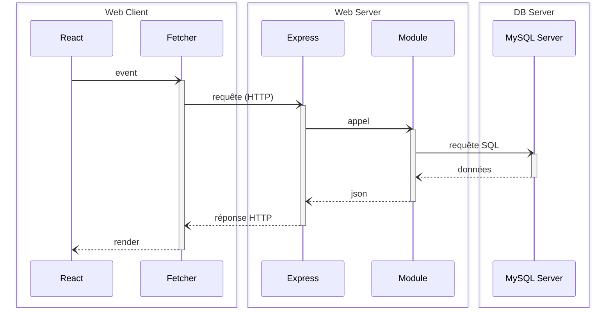

## Objectifs

* Découvrir des architectures logicielles
* Travailler sur un projet _fullstack_

## Pré-requis

````stepper
# Avoir envie de lire du JS avancé
```javascript
try {
  const response = await fetch(`${baseUrl}/${endpoint}`);
  if (!response.ok) throw new Error(`HTTP Error: ${response.status}`);
  return await response.json();
} catch (error) {
  console.error('Fetch Error:', error.message);
}
```
# Savoir te repérer sur une carte

````

## Introduction

Tu as vu comment créer un projet "polyrepo" : un dépôt pour une application React autonome et un dépôt pour une application Express autonome. Cette fois, tu vas apprendre à piloter un projet "monorepo" : un seul dépôt qui contient les 2 applications et définit de manière formelle la relation entre les 2.

## Sommaire

## Le brief

```xtext story
Hello 👋,

Bonne nouvelle : nous avons un nouveau projet qui manque de main d'oeuvre ! Et cette fois, tu vas faire l'application toi-même 😛.

Rassure-toi, nous avons trouvé un framework sympa pour te servir de base. Nous avons prévu une série de supports pour t'accompagner dans la découverte de ce framework et aussi pour t'accompagner dans la construction de ton projet : le **Wild Series** (toute ressemblance avec le site [Beta Series](https://www.betaseries.com/) ne serait pas purement fortuite).

Bon courage et bonne semaine 🙂,

Les équipes front, back et data.
```

## Monorepo

Tu vas utiliser un framework particulier : un Monorepo JS spécialement développé par la Wild Code School pour te donner un cadre de développement adapté à l'apprentissage. Une première introduction ici :

```quests
1549
```

## Wild Series

Nous parlons technique depuis le début, mais nous n'avons pas encore parlé du projet sur lequel tu dois travailler :

```quests
588
```

### Démarrer

C'est parti ! Première étape : créer le projet.

```quests
589
```

### Tracer ta route

Maintenant que tu as créé le projet, tu dois rentrer dans son architecture. Commence par mettre en place des routes :

```quests
590, 591
```

### Accéder aux données

Tes premières routes permettent de recevoir des requêtes côté serveur : pour aller plus loin, ton serveur doit communiquer avec une base de données. C'est ta prochaine étape :

```quests
592, 824
```

### Un projet "complet"

À ce stade, ton serveur permet de récupérer des listes de données. Une gestion complète d'une ressource implique de permettre des actions supplémentaires :

* Créer une ressource
* Mettre à jour une ressource
* Supprimer une ressource

C'est le moment d'apprendre le sens des acronymes CRUD et BREAD :

```quests
825
```

### Un début de sécurité

Maintenant que tu travailles sur un "vrai" projet, tu dois commencer à aborder des questions de sécurité. Une première approche est de t'intéresser à la validation des données :

```quests
1561
```

## Challenge

Publie ton projet Wild Series sur ton compte GitHub, et partage le lien en guise de solution au challenge.

### Critères de validation

* [ ] le projet est disponible sur GitHub
* [ ] les 2 applications "client" et "server" sont fonctionnelles
* [ ] les 2 applications communiquent entre elles
* [ ] le serveur implémente au moins un CRUD / BREAD
* [ ] le serveur implémente au moins un validateur