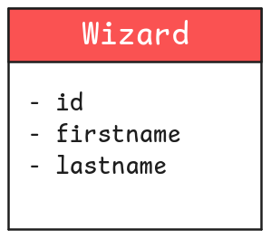
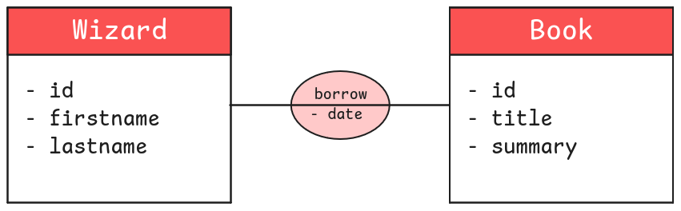
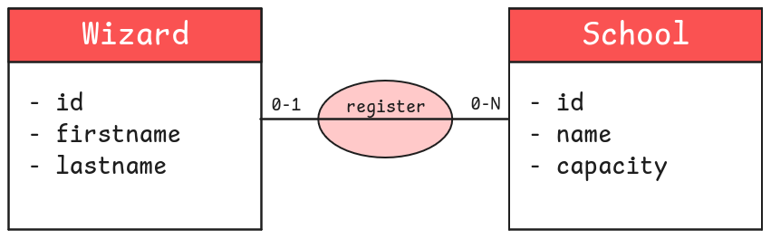
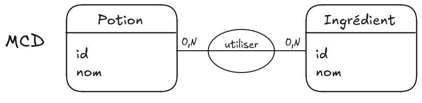

## Objectifs

- Découvrir la méthode Merise
- Apprendre à identifier des entités et des relations
- Comprendre la construction d'un MCD

## Introduction

Avant de pouvoir créer une base de données, les tables et les champs qui la composent, tu dois réfléchir à comment **architecturer** ces données. C’est l’étape de la modélisation.

## Sommaire

## La méthode Merise

Modéliser une base de données est une étape cruciale mais complexe. Elle dépend avant tout de la compréhension des règles métiers, c'est-à-dire des **besoins du client**. Parfois, plusieurs façons de modéliser une base peuvent répondre à ces besoins.

Bref, cela demande avant tout de la **rigueur** et de **l’expérience**. La méthodologie Merise (datant des années 70) apporte des règles précises pour t’aider à modéliser convenablement tes données.

```alert-warning
La méthode Merise est très vaste. Nous ne la couvrirons pas de manière exhaustive. Nous allons l'aborder de manière _pragmatique_.

Avec le contenu de cette quête, tu pourras réaliser rapidement des modélisations simples. N’hésite pas à t’intéresser davantage à Merise par la suite, afin d’acquérir un certain vocabulaire et des solutions pour résoudre des cas plus complexes.
```

Dans le cadre de la formation, tu ne vas utiliser "que" 3 modèles de la méthode Merise. Dans l'ordre :

* MCD : Modèle Conceptuel de Données
* MLD : Modèle Logique de Données
* MPD : Modèle Physique de Données

Cette quête décrit l'étape 1 : le MCD.

```resource
https://www.ibm.com/topics/data-modeling

Une explication du sujet sur le site d'IBM
```

## MCD : le schéma entité / relation

Le schéma “entité/relation” est une première étape dans la modélisation de la base de données. Ce schéma sera ensuite _transformé_ pour refléter la modélisation finale qui, elle, correspondra exactement aux tables et champs à créer en SQL.

### Les entités

La modélisation consiste à regrouper de manière logique des données (un élève, une école, un livre) dans des **entités**. Chaque entité possède un certain nombre d’**attributs** qui lui sont propres (un nom et un prénom pour un élève ; un nom et une capacité pour une école ; un titre et un nombre de pages pour un livre, etc.).

Une entité doit également posséder un **identifiant unique** (correspondant à un ou plusieurs attributs) pour caractériser sans ambiguïté possible une instance de cette entité (un exemplaire d'une entité "livre" par exemple).

```alert-info
De manière schématique, les entités sont représentées sous forme d’un carré. Le carré contient en haut le nom de la table, et en dessous une liste des attributs.
```



### Les relations

Les entités d'un système sont reliées par des **actions**. Une "relation" représente cette action entre au moins 2 entités.
 
Un exemple :

```xtext story
Dans la bibliothèque de Poudlard, un _sorcier_ peut **lire** un _livre_ ou l'**emprunter**.
```

Dans cet exemple, "sorcier" et "livre" sont des entités. "Lire" et "emprunter" sont des relations. Note que dans une phrase bien tournée, les entités sont des noms reliés par des verbes d'action. Si tu enlèves les mots "inutiles", tu commences presque à obtenir un schéma entité/relation :

* sorcier - lire - livre (un sorcier peut lire un ou des livres)
* sorcier - emprunter - livre (un sorcier peut emprunter un ou des livres)

```alert-warning
À cette étape, une relation n'a **pas de sens ni d'orientation**. Pour le dire autrement, tu peux la lire dans un sens ou dans l'autre :

* livre - lire - sorcier (un livre peut être lu par un ou des sorciers)
* livre - emprunter - sorcier (un livre peut être emprunté par un ou des sorciers)
```

De plus, une relation peut posséder des attributs. Pour l’emprunt, une date peut être enregistrée (pour calculer une date de retour limite). 


```alert-info
La relation est symbolisée par un cercle contenant généralement un verbe d’action (ici _borrow_ pour “emprunter”), éventuellement les champs propres à la relation, et un trait (passant par le cercle) reliant les deux entités.
```



### Les cardinalités

Les **cardinalités** décrivent le nombre d'interactions possibles entre un élément d’une entité et une autre entité. Reprenons une relation de notre exemple :

* sorcier - lire - livre
  * un sorcier peut lire un ou des livres
  * un livre peut être lu par un ou des sorciers

Réfléchir aux cardinalités, c'est se poser la question "combien ?" : un ou des ?

1. Un sorcier peut lire **combien** de livres ? Un livre ou des livres ?
2. Un livre peut être lu par **combien** de sorciers ? Un sorcier ou des sorciers ?

```solution
Dans la vie de la bibliothèque :

1. Un sorcier peut lire plusieurs livres.
2. Un livre peut être lu par plusieurs sorciers.
```

Essayons un autre exemple : l'inscription d'un sorcier dans une école de magie.

* sorcier - inscrire - école
  * un sorcier peut être inscrit dans une ou des écoles
  * Dans une école peuvent être inscrits un ou des sorciers

Qu'en penses-tu ?

1. Un sorcier peut être inscrit dans **combien** d'écoles ? Une école ou des écoles ?
2. Dans une école peuvent s'inscrire **combien** de sorciers ? Un sorcier ou des sorciers ?

```solution
Dans les histoires d'Harry Potter :

1. Un sorcier peut être inscrit dans une seule école.
2. Dans une école peuvent s'inscrire plusieurs sorciers.
```

```alert-warning
Note que la première entité dans la phrase est au singulier :

1. **Un sorcier**...

Pour l'entité **Sorcier**, tu considères un seul sorcier à la fois (Harry **ou** Ron **ou** Hermione...) et non l’ensemble des sorciers de l’entité.

2. Dans **une école**...

Pour l'entité **École**, tu considères une seule école à la fois et non l’ensemble des écoles de l’entité.
```

Dans sa langue "naturelle", un client peut dire une phrase comme “les sorciers peuvent avoir des familiers” (un familier est un animal de compagnie, par exemple Edwige, la chouette d’Harry Potter).

Notre langue doit être précise et exacte sur les cardinalités, jusqu'à préciser une borne minimale et une borne maximale pour chaque côté d'une relation.

À toi alors de poser les bonnes questions, afin de lever toute ambiguïté sur les relations et leurs cardinalités :

* Dois-tu seulement indiquer si le sorcier possède ou non un familier ?
* Dois-tu enregistrer des informations sur le familier ?
* Si oui, lesquelles (seulement son nom, ou l’espèce du familier également) ?
* Au niveau des cardinalités, un sorcier est-il obligé d’avoir un familier ?
* Peut-il posséder plusieurs familiers en même temps ?
* Ou au contraire, un familier peut-il être partagé entre plusieurs sorciers ?

Toutes ces questions entraînent des modélisations qui peuvent être très différentes.

```xtext arrow
Après discussion avec notre client fictif, **un** sorcier peut être inscrit dans une seule école (maximum) ou ne pas être inscrit du tout (minimum). La cardinalité de la relation Wizard -> School est donc 0-1 : un Wizard peut être inscrit dans 0 School au minimum et 1 School au maximum.
 
Dans **une** école peuvent s'inscrire plusieurs sorciers (maximum) ou aucun sorcier du tout (minimum, imagine que l'école vient juste d'ouvrir et n'est pas encore affichée dans Parcoursup). La cardinalité de la relation School -> Wizard est donc 0-N : dans une School peuvent s'inscrire 0 Wizard au minimum et N Wizard au maximum (N signifie ici "plusieurs", un nombre indéfini supérieur à 1).
```



Nous avons fini l’étape du MCD de la méthode Merise.

## Challenge

Bienvenue au cours de potions magiques !

Chaque potion que tu vas créer a un nom. Les potions utilisent des ingrédients, et chaque ingrédient est défini par son nom.

Ça fait beaucoup d’informations à retenir... Pour ne rien oublier, tu aimerais stocker en base de données quels ingrédients sont nécessaires pour chaque potion. Prends un papier et un crayon (ou rends-toi sur https://excalidraw.com/), et dessine **le MCD** permettant de modéliser cette problématique.

```alert-info
[Tu trouveras ici](https://harrypotter.fandom.com/fr/wiki/Potions) quelques potions et ingrédients, afin de mieux comprendre la problématique métier (même si tu n’as vraiment pas besoin des données pour réaliser l’étape de modélisation).
```

1. Crée les entités avec leurs attributs. Rappel : un attribut n'est pas une valeur. Par exemple, `firstname` est un attribut, mais `Harry` ou `Hermione` ne sont pas des attributs : ce sont des exemples de valeurs.
2. Ajoute les relations.
3. Décide des cardinalités.

### Critères de validation
- Une photo de la modélisation est postée
- La modélisation contient le MCD
- La modélisation permet de stocker les informations sur les ingrédients utilisés dans chaque potion.

Une solution possible :

