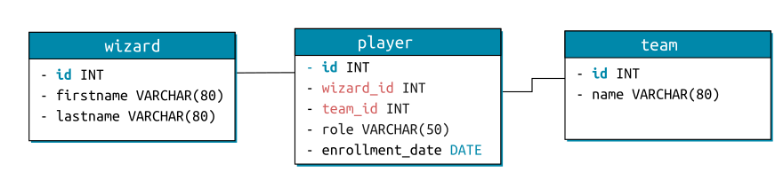

## Objectifs

- Reconnaître les principales fonctions SQL
- Comprendre comment grouper des données

## Introduction

Dans cette nouvelle quête, tu vas voir les fonctions SQL et apprendre comment grouper des données entre elles. Expecto Datatum !

````alert-warning
Commence par exécuter ces requêtes pour (re)créer une nouvelle base de données "bac à sable" :

```sql
DROP DATABASE IF EXISTS wild_db_quests_advanced;
CREATE DATABASE wild_db_quests_advanced;

USE wild_db_quests_advanced;

CREATE TABLE school(
  id INT NOT NULL AUTO_INCREMENT,
  name VARCHAR(100) NOT NULL,
  capacity INT,
  PRIMARY KEY (id)
);

CREATE TABLE wizard(
  id INT NOT NULL AUTO_INCREMENT,
  firstname VARCHAR(100) NOT NULL,
  lastname VARCHAR(100) NOT NULL,
  school_id INT,
  PRIMARY KEY (id),
  CONSTRAINT fk_wizard_school FOREIGN KEY (school_id) REFERENCES school(id)
);

INSERT INTO school
  (id, name, capacity)
  VALUES
  (1, 'Beauxbatons Academy of Magic', 550),
  (2, 'Castelobruxo', 380),
  (3, 'Durmstrang Institute', 570),
  (4, 'Hogwarts School of Witchcraft and Wizardry', 450),
  (5, 'Ilvermorny School of Witchcraft and Wizar', 300),
  (6, 'Koldovstoretz', 125),
  (7, 'Mahoutokoro School of Magic', 800),
  (8, 'Uagadou School of Magic', 350);

INSERT INTO wizard
  (firstname, lastname, school_id)
  VALUES
  ('fleur', 'delacour', 1),
  ('gabrielle', 'delacour', 1),
  ('viktor', 'krum', 3),
  ('gellert', 'grindelwald', 3),
  ('harry', 'potter', 4),
  ('hermione', 'granger', 4),
  ('lily', 'potter', 4),
  ('ron', 'weasley', 4),
  ('ginny', 'weasley', 4),
  ('fred', 'weasley', 4),
  ('george', 'weasley', 4),
  ('arthur', 'weasley', 4),
  ('molly', 'weasley', 4),
  ('drago', 'malefoy', 4),
  ('albus', 'dumbledore', 4),
  ('severus', 'rogue', 4),
  ('tom', 'jédusor', 4),
  ('dudley', 'dursley', 4),
  ('babajide', 'akingbade', 8),
  ('dudley', 'dursley', NULL);
```
````


## Sommaire

## Fonctions SQL

SQL possède un grand nombre de fonctions te permettant d’effectuer des calculs mathématiques, des manipulations de chaînes ou de dates, directement dans ta requête (ce qui évite souvent de déporter inutilement ce rôle au langage de programmation, et donc d’optimiser grandement le temps global d’exécution de ton code).

### Fonctions d’agrégation

Ces fonctions permettent de faire un calcul sur un **ensemble de lignes**.

Par exemple, la fonction `COUNT()` est très utile, car plutôt que de te renvoyer directement des tuples en résultat, elle va à la place te retourner le **nombre de tuples** concernés par la requête. Entre les parenthèses, tu peux préciser le nom du champ à compter (les lignes à NULL pour ce champ seront alors ignorées). Si tu veux vraiment compter toutes les lignes, tu peux simplement écrire `COUNT(*)`.

Par exemple, avec cette requête :

```sql
SELECT count(*) as nb_school FROM school;
```

Tu peux obtenir comme résultat :

```sql
+-----------+
| nb_school |
+-----------+
|         8 |
+-----------+
```

```alert-warning
Quand tu utilises des fonctions dont tu souhaites récupérer le résultat, pense à ajouter un alias pour faciliter la lisibilité (ici `nb_school`), sinon la colonne s’appellera `COUNT(*)`, ce qui n’est pas aisé à manipuler.

Remarque : Ce `COUNT()` peut être utile dans le cas d’une pagination, par exemple, afin de calculer le nombre total de pages.
```

Il existe plusieurs autres fonctions permettant d’effectuer un calcul sur un ensemble de tuples. En voici quelques-unes parmi les plus utiles :

- `SUM(champ)` : effectue la somme des valeurs pour le champ entre les parenthèses.
- `AVG(champ)` : effectue la moyenne des valeurs pour le champ entre les parenthèses.
- `MIN(champ)` et `MAX(champ)` : retourne la valeur minimale/maximale du champ sélectionné.

### Autres fonctions

Tu peux utiliser de nombreuses autres fonctions pour manipuler des chaînes de caractères (`LOWER()`, `UPPER()`, `LENGTH()`...), effectuer des calculs mathématiques (`ROUND()`, `ABS()`, `SIN()`...) ou manipuler des dates (`DATEDIFF()`, `MONTH()`, `NOW()`...). Reporte-toi aux ressources pour voir une liste exhaustive de ces dernières. Voici un exemple avec une fonction de concaténation :

```sql
SELECT CONCAT(firstname, ' ', lastname) AS fullname FROM wizard;
```

Pour obtenir ce résultat :

```sql
+---------------------+
| fullname            |
+---------------------+
| fleur delacour      |
| gabrielle delacour  |
| viktor krum         |
| gellert grindelwald |
| harry potter        |
| hermione granger    |
| lily potter         |
| ron weasley         |
| ginny weasley       |
| fred weasley        |
| george weasley      |
| arthur weasley      |
| molly weasley       |
| drago malefoy       |
| albus dumbledore    |
| severus rogue       |
| tom jédusor         |
| dudley dursley      |
| babajide akingbade  |
| dudley dursley      |
+---------------------+
```

```alert-info
Ces fonctions ne sont pas limitées au `SELECT` et peuvent tout aussi bien s’utiliser dans une clause `WHERE`.
```

```resource
https://sql.sh/fonctions
# Les fonctions SQL
Cette page de *sql.sh* présente quelques fonctions principales. Pour avoir une liste exhaustive, regarde la rubrique “Fonctions SQL” du menu sur la gauche du site.
```

## Grouper des données

### GROUP BY

Pour le moment, lorsque tu effectuais des requêtes de type `SELECT`, tu récupérais plus ou moins de tuples (en fonction des filtres imposés via la clause `WHERE`), mais chaque ligne de résultat était un tuple unique. Il y a cependant des cas de figure où tu aimerais récupérer des résultats, non pas individuels, mais regroupés selon des critères.

Reprends l’exemple des élèves inscrits dans des écoles. Ce serait intéressant de regrouper ensemble les élèves appartenant à la même école. En l’état, cela peut paraître inutile, mais couplé à des fonctions d'agrégation, cela prend tout son sens. Par exemple, tu peux compter le nombre de lignes dans tel ou tel groupe.

Reprenons une requête avec une jointure simple entre les tables `wizard` et `school` :

```sql
SELECT
  *
FROM
  wizard w
INNER JOIN
  school s ON s.id = w.school_id;
```

Elle nous donne ce résultat :

```sql
+----+-----------+-------------+-----------+----+--------------------------------------------+----------+
| id | firstname | lastname    | school_id | id | name                                       | capacity |
+----+-----------+-------------+-----------+----+--------------------------------------------+----------+
|  1 | fleur     | delacour    |         1 |  1 | Beauxbatons Academy of Magic               |      550 |
|  2 | gabrielle | delacour    |         1 |  1 | Beauxbatons Academy of Magic               |      550 |
|  3 | viktor    | krum        |         3 |  3 | Durmstrang Institute                       |      570 |
|  4 | gellert   | grindelwald |         3 |  3 | Durmstrang Institute                       |      570 |
|  5 | harry     | potter      |         4 |  4 | Hogwarts School of Witchcraft and Wizardry |      450 |
|  6 | hermione  | granger     |         4 |  4 | Hogwarts School of Witchcraft and Wizardry |      450 |
|  7 | lily      | potter      |         4 |  4 | Hogwarts School of Witchcraft and Wizardry |      450 |
|  8 | ron       | weasley     |         4 |  4 | Hogwarts School of Witchcraft and Wizardry |      450 |
|  9 | ginny     | weasley     |         4 |  4 | Hogwarts School of Witchcraft and Wizardry |      450 |
| 10 | fred      | weasley     |         4 |  4 | Hogwarts School of Witchcraft and Wizardry |      450 |
| 11 | george    | weasley     |         4 |  4 | Hogwarts School of Witchcraft and Wizardry |      450 |
| 12 | arthur    | weasley     |         4 |  4 | Hogwarts School of Witchcraft and Wizardry |      450 |
| 13 | molly     | weasley     |         4 |  4 | Hogwarts School of Witchcraft and Wizardry |      450 |
| 14 | drago     | malefoy     |         4 |  4 | Hogwarts School of Witchcraft and Wizardry |      450 |
| 15 | albus     | dumbledore  |         4 |  4 | Hogwarts School of Witchcraft and Wizardry |      450 |
| 16 | severus   | rogue       |         4 |  4 | Hogwarts School of Witchcraft and Wizardry |      450 |
| 17 | tom       | jédusor     |         4 |  4 | Hogwarts School of Witchcraft and Wizardry |      450 |
| 18 | dudley    | dursley     |         4 |  4 | Hogwarts School of Witchcraft and Wizardry |      450 |
| 19 | babajide  | akingbade   |         8 |  8 | Uagadou School of Magic                    |      350 |
+----+-----------+-------------+-----------+----+--------------------------------------------+----------+
```

La jointure ici ne sert à rien pour “grouper”, puisque c’est le `school_id` de la table `wizard` qui est utilisé. Mais elle est cependant utile pour récupérer le `name` de l’école. 

La syntaxe du `GROUP BY` est très simple. Elle attend une liste de champs sur lesquels grouper (tu peux indiquer plusieurs champs, elle fera alors les groupes dans l’ordre de ces champs).

Par exemple, voici comment récupérer le nombre d'étudiants par école :

```sql
SELECT
  s.name, COUNT(*) as nb_student
FROM
  wizard w
INNER JOIN
  school s ON s.id=w.school_id
GROUP BY
  s.id;
```

Ce qui nous donne :

```sql
+--------------------------------------------+------------+
| name                                       | nb_student |
+--------------------------------------------+------------+
| Beauxbatons Academy of Magic               |          2 |
| Durmstrang Institute                       |          2 |
| Hogwarts School of Witchcraft and Wizardry |         14 |
| Uagadou School of Magic                    |          1 |
+--------------------------------------------+------------+
```

### HAVING

Il est possible d’aller encore plus loin dans les regroupements, en y ajoutant des critères de filtre sur ces groupes. Par exemple, si tu souhaites ne ressortir que les groupes ayant plus de trois élèves, tu peux écrire :

```sql
SELECT
  s.name, COUNT(*) AS nb_student
FROM
  wizard w
INNER JOIN
  school s ON s.id=w.school_id
GROUP BY
  school_id
HAVING
  nb_student > 3;
```

Et obtenir une version filtrée du résultat précédent :

```sql
+--------------------------------------------+------------+
| name                                       | nb_student |
+--------------------------------------------+------------+
| Hogwarts School of Witchcraft and Wizardry |         14 |
+--------------------------------------------+------------+
```

Le `HAVING` a donc un fonctionnement très similaire à une clause `WHERE`, puisqu’il a également besoin d’une _condition_. Cependant, ces deux clauses sont **différentes** et ne sont **pas interchangeables**. 

En effet, lorsque tu fais un `SELECT`, tu ressors un certain nombre de tuples. Un `WHERE` va imposer un filtre qui va potentiellement diminuer ce nombre de résultats. Si tu ajoutes ensuite un `GROUP BY`, le regroupement ne se fera **QUE** sur les tuples préalablement filtrés par le `WHERE`.

Une fois le regroupement fait, si tu ajoutes un `HAVING`, ce dernier s’appliquera sur les résultats du regroupement. C’est pour cela qu’un `WHERE` s’écrit **toujours avant** un bloc `GROUP BY ... HAVING`.

```resource
https://www.youtube.com/watch?v=aLs8bvkeAFo
# Également en vidéo !
Présentation du `GROUP BY`, `HAVING` et de quelques fonctions d’agrégation.
```

```resource
https://sql.sh/cours/having
# HAVING
```

```resource
https://sql.sh/cours/group-by
# GROUP BY
```

## Challenge

**Tournoi de quidditch (suite)**

Le tournoi de quidditch continue. Reproduis les mêmes données que dans la quête précédente :

```sql
DROP DATABASE IF EXISTS wild_db_quests_advanced;
CREATE DATABASE wild_db_quests_advanced;

USE wild_db_quests_advanced;

CREATE TABLE wizard(
  id INT NOT NULL AUTO_INCREMENT,
  firstname VARCHAR(100) NOT NULL,
  lastname VARCHAR(100) NOT NULL,
  PRIMARY KEY (id)
);

CREATE TABLE team(
  id INT NOT NULL AUTO_INCREMENT,
  name VARCHAR(100) NOT NULL,
  PRIMARY KEY (id)
);

CREATE TABLE player(
  id INT NOT NULL AUTO_INCREMENT,
  wizard_id INT NOT NULL,
  team_id INT NULL,
  role VARCHAR(100) NOT NULL,
  enrollment_date DATE NOT NULL,
  PRIMARY KEY (id),
  CONSTRAINT fk_player_wizard FOREIGN KEY (wizard_id) REFERENCES wizard(id),
  CONSTRAINT fk_player_team FOREIGN KEY (team_id) REFERENCES team(id)
);

INSERT INTO team
  (id, name)
  VALUES
  (1, 'Gryffindor'), (2, 'Ravenclaw'), (3, 'Slytherin'), (4, 'Hufflepuff');

INSERT INTO wizard
  (id, firstname, lastname)
  VALUES
  (1, 'Hannah', 'Abbott'), (2, 'Katie', 'Bell'), (3, 'Cuthbert', 'Binns'), (4, 'Phineas', 'Nigellus'), (5, 'Regulus', 'Black'), (6, 'Sirius', 'Black'), (7, 'Amelia', 'Bones'), (8, 'Susan', 'Bones'), (9, 'Terry', 'Boot'), (10, 'Lavender', 'Brown'), (11, 'Millicent', 'Bulstrode'), (12, 'Cho', 'Chang'), (13, 'Penelope', 'Clearwater'), (14, 'Michael', 'Corner'), (15, 'Crabbe', ''), (16, 'Vincent', 'Crabbe'), (17, 'Colin', 'Creevey'), (18, 'Dennis', 'Creevey'), (19, 'Cedric', 'Diggory'), (20, 'Aberforth', 'Dumbledore'), (21, 'Albus', 'Dumbledore'), (22, 'Marietta', 'Edgecombe'), (23, 'Justin', 'Finch-Fletchley'), (24, 'Seamus', 'Finnigan'), (25, 'Marcus', 'Flint'), (26, 'Filius', 'Flitwick'), (27, 'Anthony', 'Goldstein'), (28, 'Gregory', 'Goyle'), (29, 'Hermione', 'Granger'), (30, 'Godric', 'Gryffindor'), (31, 'Rubeus', 'Hagrid'), (32, 'Helga', 'Hufflepuff'), (33, 'Angelina', 'Johnson'), (34, 'Lee', 'Jordan'), (35, 'Bellatrix', 'Lestrange'), (36, 'Rabastan', 'Lestrange'), (37, 'Rodolphus', 'Lestrange'), (38, 'Gilderoy', 'Lockhart'), (39, 'Alice', 'Longbottom'), (40, 'Frank', 'Longbottom'), (41, 'Augusta', 'Longbottom'), (42, 'Neville', 'Longbottom'), (43, 'Luna', 'Lovegood'), (44, 'Xenophilius', 'Lovegood'), (45, 'Remus', 'Lupin'), (46, 'Draco', 'Malfoy'), (47, 'Lucius', 'Malfoy'), (48, 'Narcissa', 'Malfoy'), (49, 'Minerva', 'McGonagall'), (50, 'Theodore', 'Nott'), (51, 'Garrick', 'Ollivander'), (52, 'Pansy', 'Parkinson'), (53, 'Padma', 'Patil'), (54, 'Parvati', 'Patil'), (55, 'Peter', 'Pettigrew'), (56, 'Harry', 'Potter'), (57, 'James', 'Potter'), (58, 'Lily', 'J.'), (59, 'Quirinus', 'Quirrell'), (60, 'Helena', 'Ravenclaw'), (61, 'Rowena', 'Ravenclaw'), (62, 'Tom', 'Riddle'), (63, 'Demelza', 'Robins'), (64, 'Newton', 'Scamander'), (65, 'Horace', 'Slughorn'), (66, 'Salazar', 'Slytherin'), (67, 'Hepzibah', 'Smith'), (68, 'Zacharias', 'Smith'), (69, 'Severus', 'Snape'), (70, 'Alicia', 'Spinnet'), (71, 'Pomona', 'Sprout'), (72, 'Dean', 'Thomas'), (73, 'Andromeda', 'Tonks'), (74, 'Nymphadora', 'Tonks'), (75, 'Sybill', 'Trelawney'), (76, 'Dolores', 'Umbridge'), (77, 'Romilda', 'Vane'), (78, 'Arthur', 'Weasley'), (79, 'William', 'Weasley'), (80, 'Charles', 'Weasley'), (81, 'Fred', 'Weasley'), (82, 'George', 'Weasley'), (83, 'Ginevra', 'Weasley'), (84, 'Molly', 'Weasley'), (85, 'Percy', 'Weasley'), (86, 'Ronald', 'Weasley'), (87, 'Oliver', 'Wood'), (88, 'Blaise', 'Zabini'), (89, 'Bloody', 'Baron'), (90, 'Cadogan', ''), (91, 'Fat', 'Friar'), (92, 'Myrtle', 'Warren');

INSERT INTO player
  (id, wizard_id, team_id, role, enrollment_date)
  VALUES
  (1, 1, 4, 'beater', '1995-10-09'), (2, 2, 1, 'chaser', '1995-08-17'), (3, 3, 1, 'seeker', '1994-12-03'), (4, 4, 3, 'chaser', '1995-03-24'), (5, 5, 3, 'keeper', '1997-07-16'), (6, 6, 1, 'beater', '1994-01-10'), (7, 7, 4, 'chaser', '1999-01-21'), (8, 8, 4, 'keeper', '1991-10-20'), (10, 10, 1, 'beater', '1991-08-03'), (11, 11, 3, 'beater', '1996-10-04'), (12, 12, 2, 'chaser', '1992-01-27'), (13, 13, 2, 'beater', '1991-01-11'), (14, 14, 2, 'seeker', '1995-08-17'), (16, 16, 3, 'beater', '1992-11-27'), (17, 17, 1, 'seeker', '1993-07-07'), (18, 18, 1, 'keeper', '1991-05-01'), (19, 19, 4, 'keeper', '1997-11-02'), (20, 20, 1, 'keeper', '1995-04-24'), (21, 21, 1, 'chaser', '1991-03-12'), (22, 22, 2, 'chaser', '1990-07-05'), (23, 23, 4, 'beater', '1995-01-06'), (24, 24, 1, 'beater', '1997-02-08'), (25, 25, 3, 'beater', '1996-12-16'), (26, 26, 2, 'chaser', '1997-02-07'), (27, 27, 2, 'chaser', '1999-07-31'), (28, 28, 3, 'seeker', '1994-05-13'), (29, 29, 1, 'chaser', '1997-08-14'), (30, 30, 1, 'seeker', '1993-08-30'), (31, 31, 1, 'beater', '1994-11-16'), (32, 32, 4, 'seeker', '1992-08-14'), (33, 33, 1, 'keeper', '1995-12-02'), (34, 34, 1, 'chaser', '1996-01-31'), (35, 35, 3, 'chaser', '1992-03-21'), (36, 36, 3, 'seeker', '1997-10-30'), (37, 37, 3, 'chaser', '1991-04-27'), (38, 38, 2, 'chaser', '1998-04-05'), (39, 39, 1, 'beater', '1992-02-17'), (40, 40, 1, 'chaser', '1995-10-15'), (41, 41, 1, 'chaser', '1999-10-25'), (42, 42, 1, 'chaser', '1998-05-06'), (43, 43, 2, 'chaser', '1998-03-01'), (44, 44, 2, 'chaser', '1991-03-11'), (46, 46, 3, 'chaser', '1993-11-02'), (47, 47, 3, 'chaser', '1992-03-12'), (48, 48, 3, 'seeker', '1993-03-17'), (49, 49, 1, 'beater', '1992-07-14'), (50, 50, 3, 'chaser', '1996-12-02'), (51, 51, 2, 'chaser', '1995-06-25'), (52, 52, 3, 'beater', '1991-12-14'), (55, 55, 1, 'chaser', '1991-05-14'), (56, 56, 1, 'beater', '1997-03-05'), (57, 57, 1, 'beater', '1996-12-07'), (58, 58, 1, 'chaser', '1999-02-23'), (59, 59, 2, 'beater', '1995-09-23'), (60, 60, 2, 'beater', '1992-04-12'), (61, 61, 2, 'seeker', '1992-10-09'), (62, 62, 3, 'chaser', '1990-02-27'), (64, 64, 4, 'chaser', '1999-01-12'), (66, 66, 3, 'seeker', '1991-02-23'), (67, 67, 4, 'beater', '1996-07-18'), (68, 68, 4, 'keeper', '1993-10-01'), (69, 69, 3, 'beater', '1997-03-06'), (70, 70, 1, 'chaser', '1995-11-08'), (71, 71, 4, 'beater', '1998-06-12'), (72, 72, 1, 'beater', '1997-11-23'), (73, 73, 3, 'chaser', '1994-01-28'), (74, 74, 4, 'beater', '1999-11-25'), (75, 75, 2, 'seeker', '1991-12-28'), (76, 76, 3, 'seeker', '1993-10-23'), (77, 77, 1, 'seeker', '1990-07-31'), (78, 78, 1, 'beater', '1992-01-01'), (79, 79, 1, 'seeker', '1991-04-27'), (81, 81, 1, 'seeker', '1998-03-29'), (82, 82, 1, 'chaser', '1991-08-26'), (83, 83, 1, 'keeper', '1992-04-17'), (85, 85, 1, 'beater', '1990-09-05'), (86, 86, 1, 'seeker', '1997-06-22'), (87, 87, 1, 'chaser', '1999-04-08'), (88, 88, 3, 'beater', '1991-07-08'), (89, 89, 3, 'chaser', '1996-09-25'), (90, 90, 1, 'keeper', '1993-01-04'), (91, 91, 4, 'beater', '1993-11-04'), (92, 92, 2, 'beater', '1997-12-14');
```

(pour rappel, le schéma des tables apparaît ci-dessous)



Écris les requêtes suivantes, et poste-les avec les résultats en guise de solution :

1. Retourne le nom des équipes et le nombre de joueurs par équipe, le tout classé par nombre de joueurs par équipe, de la plus nombreuse à la moins nombreuse.
2. Retourne uniquement les noms des équipes complètes (ayant 14 joueurs ou plus, c’est-à- dire 7 joueurs et 7 remplaçants minimum), classés par ordre alphabétique.
3. L’entraîneur des Gryffindor est superstitieux, son jour préféré est le lundi. Retourne la liste des joueurs de son équipe qui ont été enrôlés un lundi (il souhaite les faire jouer en priorité... si seulement il existait une [fonction SQL pour ça](https://sql.sh/fonctions/date-heure/dayofweek)...), et classe les résultats par date d’enrôlement chronologique.

### Critères de validation

* La solution contient bien les 3 requêtes.
* Lorsque tu testes les requêtes (sur le jeu de données fourni), les résultats de chaque requête sont corrects (fais attention aux champs retournés et au tri des résultats pour qu’ils correspondent précisément aux critères demandés)

1. Le nom des équipes et le nombre de joueurs par équipe, le tout classé par nombre de joueurs par équipe, de la plus nombreuse à la moins nombreuse :

```sql
select
  t.name, count(*) as players
from
  team as t
join
  player as p on t.id = p.team_id
group by
  t.id
order by
  players desc;

+------------+---------+
| name       | players |
+------------+---------+
| Gryffindor |      35 |
| Slytherin  |      21 |
| Ravenclaw  |      15 |
| Hufflepuff |      12 |
+------------+---------+
4 rows
```

2. Uniquement les noms des équipes complètes (ayant 14 joueurs ou plus, c’est-à- dire 7 joueurs et 7 remplaçants minimum), classés par ordre alphabétique :

```sql
select
  t.name, count(*) as players
from
  team as t
join
  player as p on t.id = p.team_id
group by
  t.id
having
  players >= 14
order by
  t.name;

+------------+---------+
| name       | players |
+------------+---------+
| Gryffindor |      35 |
| Ravenclaw  |      15 |
| Slytherin  |      21 |
+------------+---------+
3 rows
```

3. La liste des joueurs de Gryffindor qui ont été enrôlés un lundi, classés par date d’enrôlement chronologique :

```sql
select
  w.firstname, w.lastname, p.role, p.enrollment_date
from
  wizard as w
join
  player as p on w.id = p.wizard_id
join
  team as t on p.team_id = t.id
where
  t.name = 'Gryffindor'
  and DAYOFWEEK(p.enrollment_date) = 2
order by
  p.enrollment_date;

+-----------+------------+--------+-----------------+
| firstname | lastname   | role   | enrollment_date |
+-----------+------------+--------+-----------------+
| George    | Weasley    | chaser | 1991-08-26      |
| Alice     | Longbottom | beater | 1992-02-17      |
| Cadogan   |            | keeper | 1993-01-04      |
| Godric    | Gryffindor | seeker | 1993-08-30      |
| Sirius    | Black      | beater | 1994-01-10      |
| Aberforth | Dumbledore | keeper | 1995-04-24      |
| Augusta   | Longbottom | chaser | 1999-10-25      |
+-----------+------------+--------+-----------------+
7 rows
```