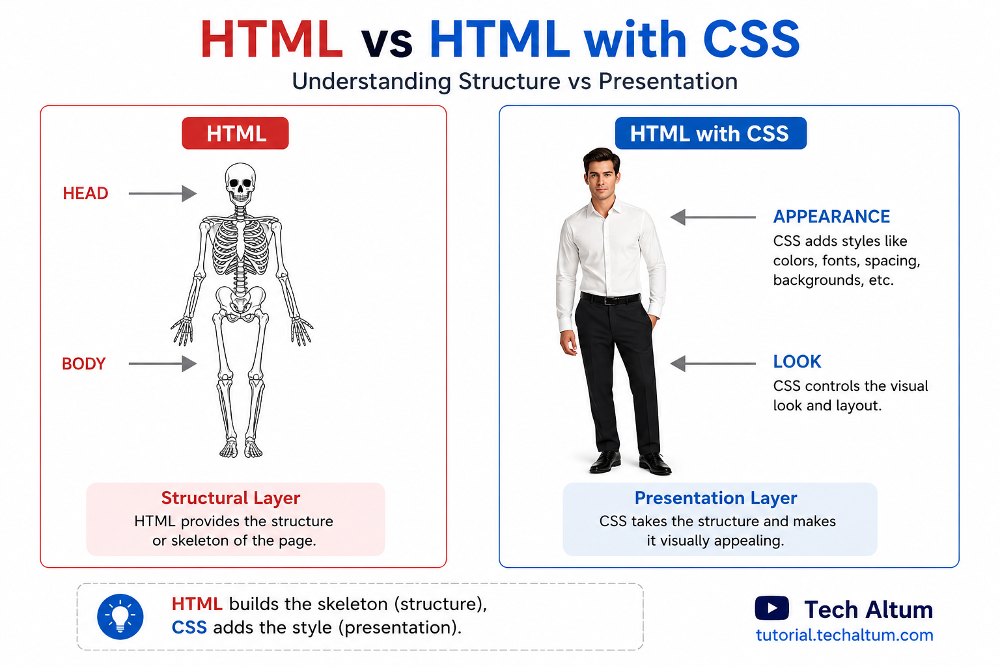
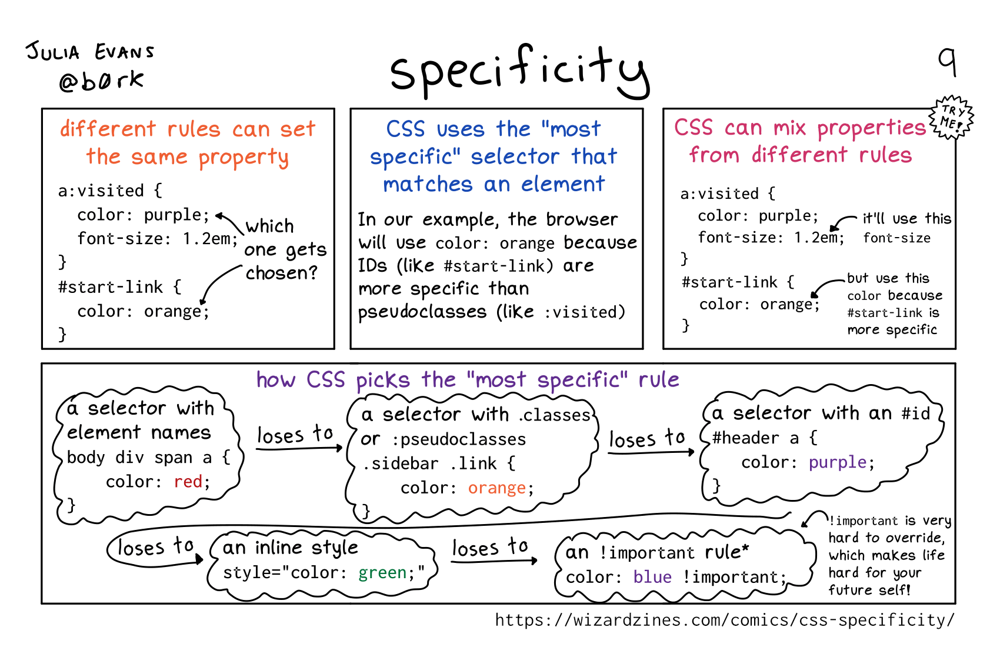

## Objectifs

* Comprendre le rôle du CSS dans l'architecture d'une page web
* Savoir lier le CSS au HTML
* Utiliser les principaux sélecteurs CSS
* Comprendre la notion de spécificité

## Introduction 

Découvre le CSS (*Cascading Style Sheets*, ou *feuilles de style en cascade*), un langage indispensable pour créer le visuel d'une page web !

## Sommaire

## Le CSS, qu'est-ce que c'est ?

Le **CSS** (*Cascading Style Sheets*, ou *feuilles de style en cascade*) est un langage apparu au milieu des années 1990, et qui n'a cessé d'évoluer depuis. Sur un site web, le but est de styliser les pages HTML (couleurs, typographie, positionnement, animations...).

 [Source techaltum.com](https://tutorial.techaltum.com/css.html) 

Voici une brève vidéo pour en avoir un aperçu.

```youtube
https://www.youtube.com/watch?v=6d_4sd_l7rQ
```

```ressource
https://developer.mozilla.org/fr/docs/Learn/CSS/First_steps/What_is_CSS
# Comment fonctionne CSS
Pour cette ressource (et beaucoup d'autres provenant de la Fondation Mozilla), tu peux basculer vers le français en cliquant sur *Languages* en haut à droite de la page.
```

## Comment lier CSS avec une page HTML ?

Tu viens de le voir, le CSS et le HTML fonctionnent main dans la main pour donner vie à une page web. Mais concrètement, comment les relie-t-on ?
Pour décrire ce processus, on dit communément qu'on « appelle le CSS » à partir d'un fichier HTML.

Trois possibilités s'offrent à toi :

1. **Inline** : ici, tu écris directement ton CSS au sein de ton fichier HTML – plus précisément, dans tes balises – en utilisant l'attribut style.

```cshtml
<h1 style="color:red; font-size:16px">Lorem ipsum</h1>
```

```alert-error
Cette façon de faire est à **éviter** ! En effet, cela implique de mélanger le CSS au HTML, alors que le but est, au contraire, de les séparer au maximum. Tu ne devras l'utiliser que dans des cas très particuliers, en dernier recours.
```

2. **Internal stylesheet** : là encore, le CSS est présent directement dans ton fichier HTML. Cependant, il est cette fois placé dans le `<head>` de ta page, à l'intérieur des balises `<style></style>`.

```cshtml
<!DOCTYPE html>
<html>
  <head>
    <style>
      body {
        background-color: green;
      }

      h1 {
        color: red;
        margin-left: 40px;
      }
    </style>
  </head>

  <body>
    <h1>This is a heading</h1>
    <p>This is a paragraph.</p>
  </body>
</html>
```

```alert-warning
Cette façon de procéder est également **déconseillée**, car la séparation HTML/CSS est faible.
```

3. **External stylesheet** :

Elle consiste à écrire ton CSS dans un/des fichier(s) séparé(s), puis à appeler ce(s) fichier(s) dans le `<head>` de ta page HTML, à l'aide de la balise `<link>`.

### index.html

```cshtml
<!DOCTYPE html>
<html>
  <head>
    <link rel="stylesheet" href="style.css">
  </head>

  <body>
    <h1>This is a heading</h1>
    <p>This is a paragraph.</p>
  </body>
</html>
```

### style.css

```css
body {
  background-color: lightblue;
}

h1 {
  color: navy;
  margin-left: 20px;
}
```

```alert-success
Tu l'auras compris, cette dernière solution qui sépare réellement la structure (HTML) du style (CSS) est celle à privilégier.
```

----

## Sélecteurs CSS

### Balises, classes, id

Nous venons de voir comment lier un fichier CSS à un fichier HTML. Maintenant, voyons comment écrire du CSS afin d'appliquer le style aux endroits voulus.

Commence par regarder cette explication rapide en vidéo (de 1 minute 34 à 2 minutes 48) !

```youtube
https://www.youtube.com/watch?v=mri5qNNX5WQ
```

> Tu constateras que la vidéo est en anglais. Même si tu as des difficultés avec cette langue, essaie tout de même de regarder : elle contient du vocabulaire de base en CSS qui te sera extrêmement utile lorsque tu auras besoin de fouiller le web à la recherche d'une solution.

Entrons maintenant dans les détails !

Tout d'abord, tu dois sélectionner le ou les éléments (balises) HTML que tu veux styliser dans la page. Pour cela, tu utiliseras un **sélecteur**. Il existe un grand nombre de manières d'écrire ces sélecteurs, permettant d'effectuer des sélections basiques ou au contraire très complexes. 

Une fois la cible sélectionnée, tu lui appliques des **propriétés** de style, qui peuvent être très simples (taille, couleurs, bordures) ou complexes (positionnement, orientation du texte, animations...). Chacune de ces propriétés va prendre une **valeur**.

```alert-warning
Cette quête s'attarde sur les sélecteurs et ne détaillera donc pas les **propriétés** CSS. Cependant, un certain nombre de propriétés (parmi les plus communes) sont utilisées pour illustrer les exemples (elles te sont peut-être déjà familières, sinon ne t'inquiète pas tu vas vite les connaître). Si tu as un doute, n'hésite pas à regarder leur signification sur le web, tu as plein de ressources pour cela, comme [CSS reference](https://cssreference.io/) ou [MDN](https://developer.mozilla.org/fr).
```

Le fonctionnement général est le suivant :

```css
my_selector {
  property1: value;
  property2: value;
}
```

Le sélecteur est suivi d'un bloc d'accolades qui contient les différentes propriétés et valeurs (séparées par deux points `:`). Chaque couple propriété-valeur est terminé par un point virgule `;`. 


Il existe une multitude de propriétés CSS, mais pour le moment, attardons-nous sur la notion de **sélecteurs**. Il en existe trois types principaux :

- **Sélecteur de balise** : tu peux utiliser directement un nom de balise comme sélecteur.

```css
div {
  background-color: blue;
}
```

Le style défini s'appliquera alors à toutes les balises `<div>` de ton site. Simple et rapide, mais souvent trop généraliste.

- **Sélecteur de classe** : tu peux définir un attribut `class` sur n'importe quelle balise HTML, et sur autant de balises que nécessaire. Par exemple, tu peux créer une classe _rounded_ (qui définit des angles arrondis) et l'appliquer sur plusieurs éléments : un champ de formulaire (`<input class="rounded">`), une bordure de div (`<div class="rounded">`), _etc._

```alert-info
Tu es libre de nommer tes classes comme tu le souhaites, la bonne pratique (comme tout nommage en informatique) est de le faire avec un nom compréhensible, qui a du sens, et en anglais.
```

En CSS, son sélecteur sera :

```css
.rounded {
  border: 1px solid grey;
  border-radius: 4px;
}
```

Attention, il faut ajouter un **point** devant le nom de la classe dans le sélecteur, sinon il sera considéré comme un sélecteur "balise". Par exemple, dans ce fichier HTML :

```cshtml
<section>My section</section>
<p class="section">Lorem ipsum</p>
```

Associé à ce fichier CSS :

```css
section {
  color: red;
}
.section {
  color: green;
}
```

La `<section>` est ciblée par le premier sélecteur de "balise". Elle n'est pas ciblée par le second car il y a un point devant, ce sélecteur cible les attributs `class` contenant "section" (et donc le `<p>` dans notre exemple).

Utiliser des classes est **LA bonne pratique** en CSS, car cela permet de définir un style une fois et de l'**appliquer à plusieurs éléments** – il y a donc moins de code à écrire (ce que les développeurs et développeuses aiment passionnément). De plus, si tu décides un jour de changer quelque chose (par exemple, faire un design moins rond), il te suffit de faire la modification à un seul endroit du CSS (dans les propriétés de la class _rounded_), et le changement se répercutera sur tous les éléments marqués par la classe. Le code est donc davantage **maintenable** (une autre notion importante en tant que *dev*).

```alert-info
Note qu'il est tout à fait possible (et même souvent conseillé) de mettre plusieurs noms dans un même attribut `class`, en les séparant par des espaces, par exemple `<div class="message success">` sera ciblé par le sélecteur `.message` ET `.success`.  
```

- **Sélecteurs d'identifiants** : Comme pour `class`, tu peux définir un attribut `id` sur n'importe quel élément de ta page.
_Exemple :_ `<div id="myId">Text</div>`.

```alert-error
Attention cependant, contrairement aux classes, un id doit impérativement être **unique** . Tu ne devras donc jamais avoir deux id avec le même nom sur une même page HTML, au risque de rencontrer des problèmes.
```

En CSS, le sélecteur correspondant sera alors :

```css
#myId {
  color: green;
}
```

> Note, cette fois, le **dièse** avant le nom de l'id.

De manière générale, en CSS, il faut éviter l'utilisation des `id` et privilégier les `class` (les *id* seront en revanche très utiles en JavaScript ou pour les ancres internes dans tes pages).

```ressource
https://css-tricks.com/css-basics-syntax-matters-syntax-doesnt
# Un peu d'aide
Emmêlé dans la **syntaxe** du CSS ? Jette un œil sur cet article, cela te prendra cinq minutes de lecture, mais t'épargnera probablement quelques heures de perplexité au moment où tu rencontreras tes premiers bugs en CSS.
```

## Sélecteurs avancés

Maintenant que tu as vu les trois principaux types de sélecteurs, voyons comment ils peuvent être combinés ensemble ou enrichis avec des *pseudo-classes* ou *pseudo-éléments*.
Il existe un très (très) grand nombre de possibilités pour écrire un sélecteur, ce qui est très intéressant car tu vas pouvoir faire des sélections très fines. Par exemple, tu pourras si tu le souhaites sélectionner (et donc appliquer un style) sur toutes les lignes impaires des tableaux suivant un `<h3>` dans des sections ayant la classe "my-section".


Il serait trop long de lister ici toutes les possibilités, mais tu vas pouvoir trouver toutes les informations utiles dans les ressources ci-dessous, **lis les avec attention**, cela te sera utile tout au long de la formation :

```ressource
https://developer.mozilla.org/fr/docs/Web/CSS/CSS_Selectors#les_combinateurs
# Sélecteurs combinateurs
Pour sélectionner une balise en fonction de ses parents ou ses voisins.
```

```ressource
https://developer.mozilla.org/fr/docs/Web/CSS/Pseudo-classes
# Pseudo-classes
Pour sélectionner une balise en fonction de son état. Les plus fréquents sont certainement `:hover` et `:nth-child` mais plus tu en connaîtras, plus tu seras efficace dans l'utilisation de CSS, par exemple `:target`, `:checked`, `:focus`, `:not`... 
```

```ressource
https://developer.mozilla.org/fr/docs/Web/CSS/Pseudo-elements
# Pseudo-éléments
Pour sélectionner un élément qui n'est pas directement une balise. Les plus utiles à connaître sont `::before` et `::after` (même si ce ne sont pas les plus simples à maîtriser), mais également `::first-letter`, `::first-line`, `::selection`...
```

---

## Spécificité

Comme tu viens de le voir, il y a de multiples manières de sélectionner des éléments sur une page. Mais que se passe t-il si un même élément est ciblé par plusieurs sélecteurs différents ? Deux cas se présentent : 

### CAS 1. Les propriétés ne sont pas en conflits

Si les sélecteurs ciblant le même élément appliquent des propriétés **différentes**, celles-ci se **cumulent**. 

Par exemple sur une balise `<figure class="card rounded">` :

```css
figure {
  color:white;
  font-size: 20px;
}

.card {
  background-color: black;
}

.rounded {
  border-radius: 4px;
}
```

Les trois sélecteurs s'appliquent sur la même balise figure qui affichera donc un fond noir, du texte blanc de 20px et des coins arrondis.


### CAS 2. Les propriétés rentrent en conflits

Maintenant, si les propriétés de ces sélecteurs sont les mêmes, cela pose des problèmes. Heureusement, CSS possède des règles de priorité prédéfinies, qui permet de résoudre cette situation. C'est ce qu'on appelle la spécificité du sélecteur. Cependant, du fait du nombre de cas différents, ces règles sont assez complexes.

Voici un petit schéma qui résume les principales règles.
 source https://wizardzines.com/comics/css-specificity/

Ce que tu peux retenir c'est l'ordre des priorités (de la plus faible à la plus forte) :

- Sélecteur de balise,
- Sélecteur de classe,
- Sélecteur d'id (non recommandé),
- Style CSS inline (non recommandé),
- Ajouter `!important` derrière une propriété (ne jamais l'utiliser).

```alert-error
`!important` est à proscrire, car il "casse" cette spécificité. En effet il "remporte" le match même s'il est mis dans un sélecteur de plus faible spécificité. Il y a toujours moyen de faire sans, ne l'utilise pas.
```

```ressource
https://stuffandnonsense.co.uk/archives/images/css-specificity-wars.png
# Plus de spécificité 
Il existe des cas de spécificité plus complexe, par exemple `div p` sera plus spécifique que `div` tout seul, on peut également mixer les différentes familles de sélecteurs (balise, classe, id). Cette ressource reprend tous les cas possibles si cela t'intéresse.
```

Prenons un exemple sur une balise `<section class="my-section" id="section1">` :

```css
#section1 {
  color:red;
}

body section {
  font-size: 16px;
}

section {
  color:white;
  font-size: 12px;
}

.my-section {
  background-color: lighgrey;
  color:blue;
}
```

Dans cet exemple, ces quatre sélecteurs ciblent la même balise. Tout d'abord, les propriétés qui ne sont pas en conflit s'appliquent, ici le `background-color`. Le fond sera donc gris clair.

Ensuite, pour le `font-size`, `body section` est plus spécifique que `section` seul, ce sera donc la taille de 16px qui s'appliquera.

Pour la couleur, le sélecteur d'id `#section1` est plus spécifique que le sélecteur de classe `.my-section` lui même plus spécifique que le sélecteur de balise `section`, c'est donc la couleur rouge qui s'applique, les autres propriétés `color` étant ignorées.

### CAS 3. Sélecteurs ET propriétés en conflits

En réalité, il existe un dernier cas : que se passe t-il si deux sélecteurs de **même** spécificité ciblent un même élément ET rentrent en conflit sur une propriété ? 
La réponse est simple, dans ce cas, c'est la **dernière** propriété trouvée qui sera appliquée. 

Lorsque tu relies ton CSS à ton HTML, tu peux charger plusieurs fichiers.

```css
<link rel="stylesheet" href="theme.css">
<link rel="stylesheet" href="homepage.css">
<link rel="stylesheet" href="section1.css">
```

Il faut imaginer que ces trois fichiers sont fusionnés en un seul **dans cet ordre**. Donc si ce troisième type de conflit arrive entre des sélecteurs de ces trois fichiers, c'est toujours le dernier fichier appelé qui remportera. Attention cependant, l'ordre passe bien **après** les autres règles de spécificités.

Il est donc important, lorsque tu travailles avec plusieurs fichier CSS, de toujours charger les fichiers les plus génériques en premiers et les plus spécifiques en derniers.

## Un dîner ~~presque~~ parfait


Maintenant que tu as vu la théorie, exerce-toi avec les sélecteurs sur le site [CSS Diner](https://flukeout.github.io/). Réalise au minimum les exercices 1 à 14 inclus et essaie si tu le peux d'aller jusqu'au dernier !

```ressource
https://flukeout.github.io/
# CSS Diner
```

Chaque exercice présente un type de sélecteur, avec une petite explication de son fonctionnement. Tu dois écrire le sélecteur correct (inutile d'écrire les accolades ouvrantes ou fermantes) pour sélectionner les bons éléments sur la table du dîner (indiqué au dessus de la table) et écrire ta solution dans la zone "CSS editor".