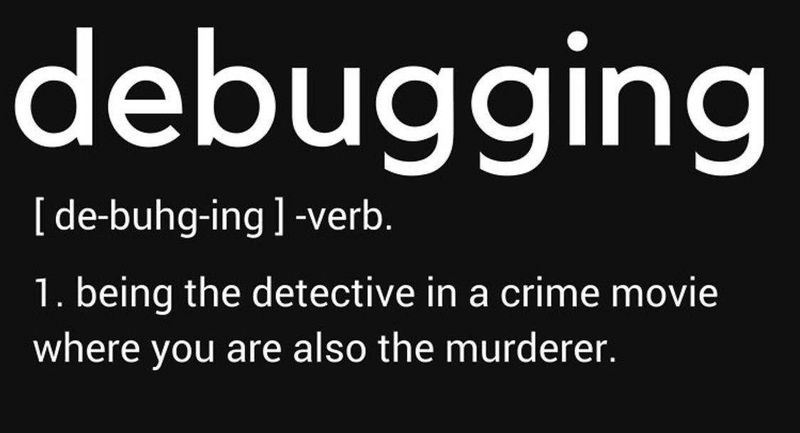

## Objectifs de cette (en)quête :

* Utiliser l'inspecteur d'un navigateur web pour la création et le débogage en CSS


## Introduction

Tu as commencé à explorer les bases d'HTML/CSS. Poursuis tes investigations et mène l'enquête en apprenant à te servir de l'inspecteur de ton navigateur !


## Inspecteur Dev Tools

```story
L'inspecteur du navigateur est un outil absolument indispensable, permettant aux développeurs web d'examiner et d’interagir avec le document HTML, le style CSS, débugger le Javascript, avoir des information sur les requêtes HTTP effectuées par le navigateur, et tout un tas d'autres actions. Tu seras amené à t'en servir tout le temps, donc il est important que tu maîtrises les bases de ce compagnon essentiel.
```

Voici une blague bien connue des développeurs amateurs de *memes* :



Source : [Me.me](https://me.me/i/debugging-de-buhg-ing-verb-1-being-the-detective-in-a-crime-8a83fb06c2dc420e91a78990dd46900d)

Et de fait, le vocabulaire du développement web se rapproche parfois dangereusement d'un film policier, notamment du fait de l'utilisation très répandue de l'**inspecteur**.

Commence à résoudre le mystère autour de cette entité merveilleuse en regardant la vidéo ci-dessous.

```youtube
https://www.youtube.com/watch?v=VXNw-elEFlo
```

> En complément, tu peux aussi voir [cette vidéo](https://youtu.be/VYyQv0CSZOE) en anglais . 


Alors Chrome ou Firefox ? Et pourquoi pas Safari, Edge, Brave ou Opéra ? Peu importe, aujourd'hui ces navigateurs (__*user agents*__) intègrent tous (chacun à sa manière) un inspecteur de code munis d'une console et des outils pour développeurs. Ton choix sera donc essentiellement une affaire d'affinités personnelles. Essaie les tous 🤓!  

> La suite de cette quête te propose des ressources pour apprendre à utiliser l'inspecteur de Firefox et une vidéo sur l'inspecteur de Chrome. À quelques détails près (le nom des onglets ou certains raccourcis par exemple), tu retrouveras les mêmes fonctionnalités si tu utilises un autre navigateur.

```resource
https://developer.mozilla.org/fr/docs/Tools/Page_Inspector/How_to/Open_the_Inspector
# Ouvrir l'inspecteur
Prise en main de l'inspecteur sur Firefox
```

```resource
https://developer.mozilla.org/fr/docs/Tools/Page_Inspector/How_to/Examine_and_edit_CSS
# Examiner et modifier le CSS
Interagir avec le CSS d'une page directement dans l'inspecteur de Firefox
```

```resource
https://developer.mozilla.org/fr/docs/Tools/Page_Inspector/How_to/Examine_and_edit_HTML
# Examiner et modifier le code HTML
Interagir avec le HTML d'une page directement dans l'inspecteur de Firefox
```

```resource
https://www.youtube.com/watch?v=x4q86IjJFag&ab_channel=TraversyMedia
# 🎥 Démonstration en vidéo
Présentation complète de l'inspecteur pour les utilisateurs Chrome 
(_Concentre toi sur les 17 premières minutes_).
```