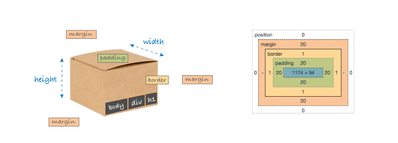
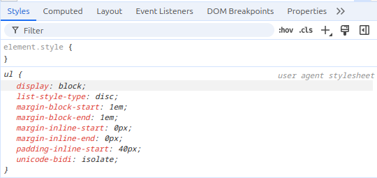
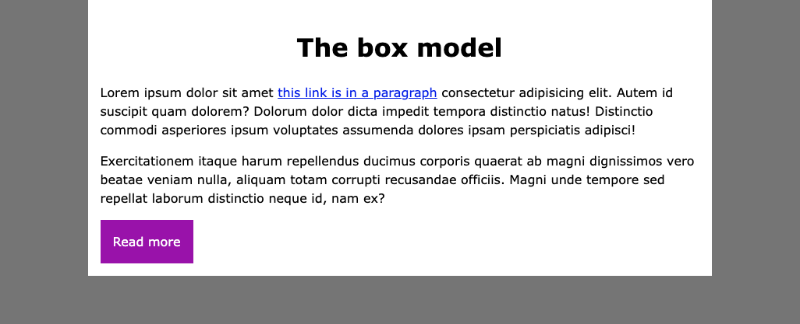

## Objectifs

* Connaître les principes du *box model* en CSS
* Manipuler les propriétés liées au *box model*



## Sommaire

## Box model

Tous les éléments CSS peuvent être assimilés à des boîtes dont les propriétés (taille, forme, *etc.*) sont décidées par le développeur. La vidéo ci-dessous te donne un aperçu de ce _**box model**_.

```resource 
https://www.youtube.com/watch?v=rIO5326FgPE
# 🎥 Apprendre le box-model 
Présentation simple et efficace du box model en 8 minutes
```

## Display block vs inline

Sur la vidéo précédente, les explications sont faites à partir d'éléments interprétés nativement avec la propriété `display: block;`. Cette propriété concerne les balises `<p>`, `<div>`, les intertitres `<h1>`, `<h2>`, … et plein d'autres encore. Les balises `<a>`, `<span>`, `<em>` ou encore `<strong>` seront quant à elles, interprétées avec la propriété `display: inline;`. 

Consulte la vidéo suivante pour bien comprendre la différence entre ces deux types d'affichage et les subtilités de leur _**box model**_.

```ressource
https://www.youtube.com/watch?v=x_i2gga-sYg&ab_channel=KevinPowell
# 🎥 Block, Inline, and Inline-Block explained

```


🗝️ Complète en lisant ce [chapitre](https://developer.mozilla.org/fr/docs/Learn/CSS/Building_blocks/The_box_model) qui te donne les clés principales de toutes les boîtes et notamment la [section display](https://developer.mozilla.org/fr/docs/Learn/CSS/Building_blocks/The_box_model#le_positionnement_display_inline-block) pour encore plus de détails.

En parallèle de ta lecture, garde sous le coude [ce guide](https://cssreference.io/box-model/), qui offre des exemples visuels des propriétés du *box model*, et n'hésite pas à le consulter si nécessaire.

## Quiz

```quiz
false|||false|||true
# En CSS, la boîte de modèle fait référence :
[] à l'apparence d'un élément HTML (couleur, bords arrondis, famille de police, etc.)
[x] aux propriétés définissant l'espace occupé par un élément HTML
#     Par défaut dans les navigateurs, les valeurs des propriétés padding et border viennent s'ajouter à la largeur (width) et à la hauteur (height) des éléments HTML :
[x] vrai, la boîte de contenu (content-box) est le modèle standard
[] faux, cela dépend des unités utilisées
#    Pour ne pas ajouter les valeurs des propriétés padding et border aux tailles des boîtes, on peut utiliser :
[] width: auto; height: auto;
[x] box-sizing: border-box (c'est le modèle alternatif)
#  Parmi les éléments ci-dessous, quels sont ceux qui utilisent le positionnement display: block par défaut :
[x] div
[x] h1, h2, etc.
[x] p
[] a
[] span
[] em
[x] ul
```

> La dernière question de ce quiz était peut-être alambiquée 🙃. 
>💡 Pour connaître les valeurs par défaut des éléments HTML, tu peux te servir de l'inspecteur de ton navigateur. 
> Pour cela, repère __*user agent stylesheet*__ dans l'onglet **Styles**. Par exemple, si tu fais un clic-droit sur la liste à puce ci-dessous pour l'inspecter, tu liras parmi les propriétés, la propriété `display: block` défini par défaut pour l'élément *ul*.
>- item 1
>- item 2
>- …



(_Active l'option « afficher les styles du navigateur » via les paramètres si tu utilises Firefox_).

```resource
https://internetingishard.netlify.app/html-and-css/css-box-model/index.html
# ESSENTIEL - Interneting Is Hard - CSS box model
Un superbe tutoriel pour tout apprendre sur le box model.
```

## Les unités

Lorsque tu dois intégrer une maquette à partir d'une image (jpeg, png, etc.) ou d'un fichier (ai, pdf, ...), tu n'as pas systématiquement accès aux dimensions et unités utilisées concernant le box-model.

Le piège à éviter est d'indiquer des unités fixes, comme le pixel (px) par exemple. Si tu commences à définir des largeurs ou autres propriétés de boîtes telles que `width: 253px` ou `margin-left: 27px` c'est que tu n'es probablement pas sur le bon chemin et que tu es en train de faire du bricolage. Ta page ne s'adaptera pas correctement aux différentes largeurs d'écran (responsive) ou aux niveaux de zoom des utilisteurs (accessibilité).
Par défaut, les navigateurs affichent des tailles de polices de caractère à `16px`. Certains utilisateurs ont besoin de modifier ce réglage. Utiliser l'unité `rem` t'assure que les proportions seront conservées.
De manière générale, il est conseillé d'utiliser l'unité `%` pour les largeurs de boîtes (et encore, bien souvent laisser la largeur se calculer "toute seule" sera une meilleure solution), et `rem` pour les unités de `padding`, `margin` et `font-size`. Ces deux unités sont du type relatif (proportionnel).

Suis [cette ressource](https://developer.mozilla.org/fr/docs/Learn/CSS/Building_blocks/Values_and_units) pour comprendre les unités disponibles en css.

```alert-info
# À retenir 👷‍♂️
- 1rem = 16px (réglage par défaut des navigateurs). Donc 8px peut s'écrire `.5rem`, 24px : `1.5rem`, etc. 
- préfère l'unité `%` lorsque tu dois définir les largeurs `width` de tes boîtes.
```

## Le Centre du Monde

Maintenant que tu as manipulé le _box model_, peut-être t'es-tu rendu compte (et si ce n'est pas déjà le cas, cela ne saurait tarder) que **centrer un élément en CSS** peut s'avérer être une entreprise étonnamment **compliquée**. Il existe de nombreuses façons de procéder notamment en utilisant l'affichage _**flex**_ ou _**grid**_, mais nous parlerons de ces derniers dans une prochaine quête. 

Pour le moment, la ressource suivante nous montre comment y parvenir uniquement à partir d'élément de type _**block**_ ou _**inline**_ et cela s'avère très souvent bien suffisant.


```resource
https://css-tricks.com/centering-css-complete-guide/
# ESSENTIEL - CSS-Tricks - Centering in CSS: A Complete Guide
Beau et hyper-utile.
```


## Exercice

C'est l'heure d'empiler les petites boîtes ! 
Commence par copier le code suivant dans un fichier HTML.

```html
<!DOCTYPE html>
<html lang="en">
<head>
    <meta charset="UTF-8">
    <meta http-equiv="X-UA-Compatible" content="IE=edge">
    <meta name="viewport" content="width=device-width, initial-scale=1.0">
    <title>The box model</title>
    <link rel="stylesheet" href="style.css">
</head>
<body>
    <main>
        <h1>The box model</h1>
        <p>
            Lorem ipsum dolor sit amet <a href="#">this link is in a paragraph</a> consectetur adipisicing elit. Autem id suscipit quam dolorem? Dolorum dolor dicta impedit tempora distinctio natus! Distinctio commodi asperiores ipsum voluptates assumenda dolores ipsam perspiciatis adipisci!
        </p>
        <p>
            Exercitationem itaque harum repellendus ducimus corporis quaerat ab magni dignissimos vero beatae veniam nulla, aliquam totam corrupti recusandae officiis. Magni unde tempore sed repellat laborum distinctio neque id, nam ex?
        </p>
        <a href="">Read more</a>
    </main>
</body>
</html>
```

Dans le même dossier, crée un fichier `style.css` et insère le code suivant :
```css
* {
   box-sizing: border-box;
}

body {
    margin: 0;
    line-height: 1.5;
    background-color: grey;
    font-family: Verdana, Geneva, Tahoma, sans-serif;
}
```

Utilise les propriétés du _box model_ fraîchement vues dans cette quête (_display_, _margin_, _padding_, etc.) pour modifier le fichier `style.css` de manière à ce que la page web reproduise cette capture écran.

 . 

### Quelques précisions
- Entre le titre et les paragraphes, seul le titre est centré.
- Le contenu principal (sur fond blanc) doit être au **centre de la page**, peu importe la largeur de ton écran, et **sa largeur ne doit pas dépasser 800px**.
- **Les paragraphes** et le bouton _**Read more**_ ont suffisamment d'espace entre eux ainsi qu'avec les bords de leur parent.

> **Tips :**
> - Le code du violet : #a306b6
> - Tu ne devrais pas avoir à modifier le code HTML fourni.
> - 🕵️‍♂️ N'hésite pas à __utiliser l'inspecteur de ton navigateur__ pour expérimenter l'ajout, la suppression ou la modification des propriétés CSS de tes boîtes lorsque tu écris la feuille de style.

### Solution
````solution

```css hl[12:27]
* {
   box-sizing: border-box;
}

body {
    margin: 0;
    line-height: 1.5;
    background-color: grey;
    font-family: Verdana, Geneva, Tahoma, sans-serif;
}

main {
    background-color: white;
    max-width: 800px;
    margin: 0 auto;
    padding: 1rem;
}
h1 {
    text-align: center;
}
main > a {
    display: inline-block;
    padding: 1rem;
    background-color: #A306B6;
    color: white;
    text-decoration: none;
}
```
### À noter
L'utilisation de `display: inline-block;` ligne 22 permet au lien situé à l'extérieur des paragraphes de se tenir à bonne distance du bloc voisin et parent. Modifie cette propriété avec ton inspecteur pour mieux te rendre compte.
````