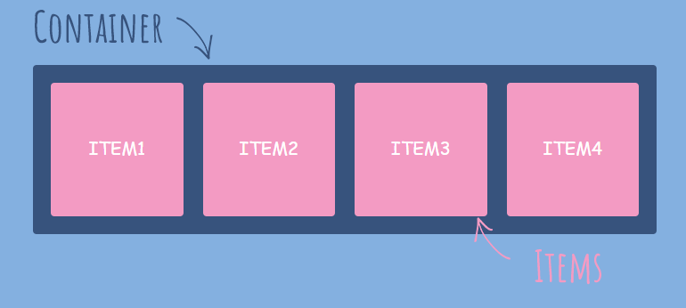
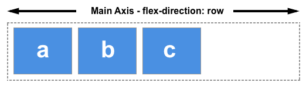
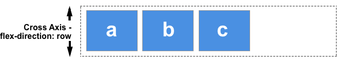
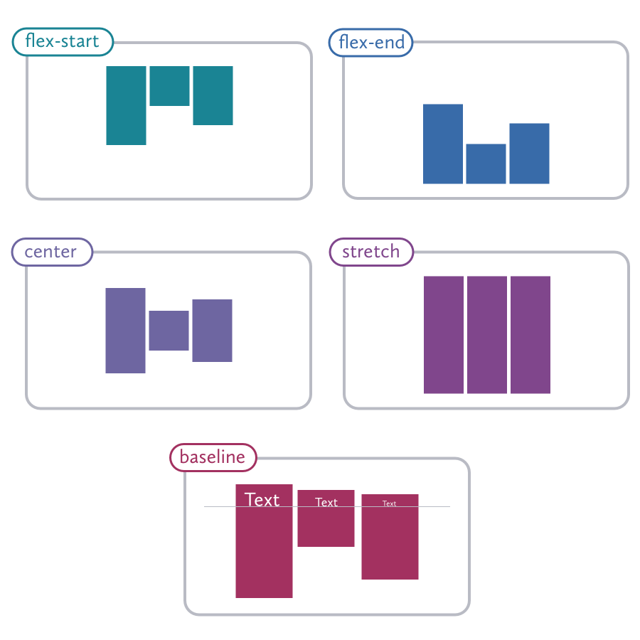
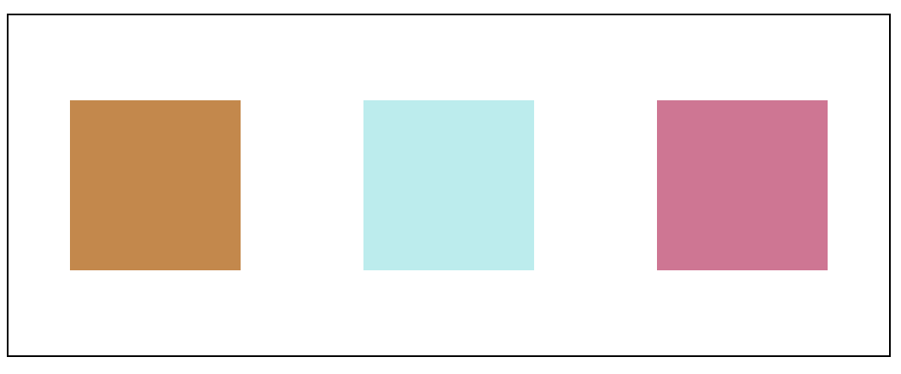
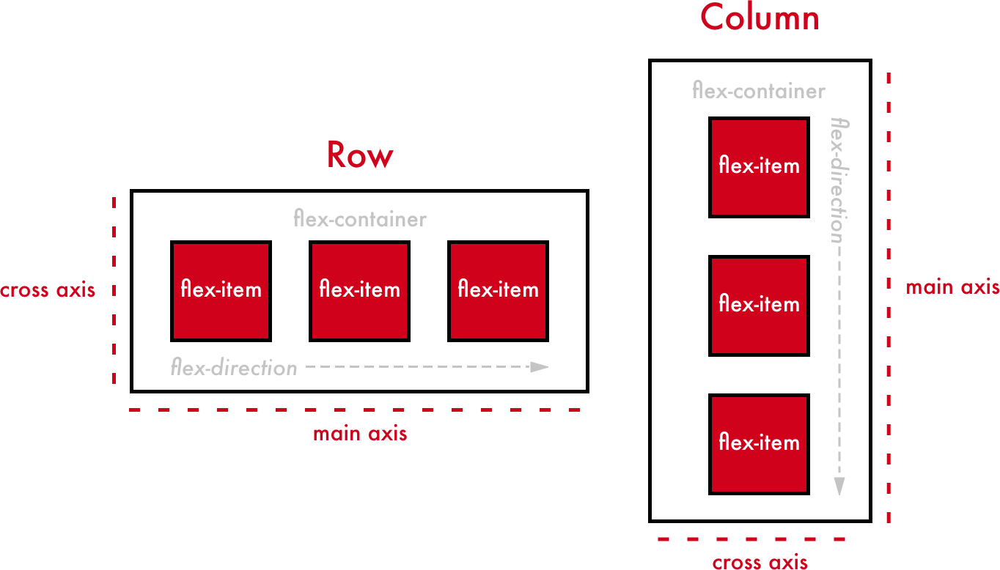
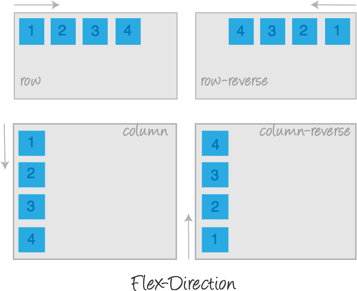
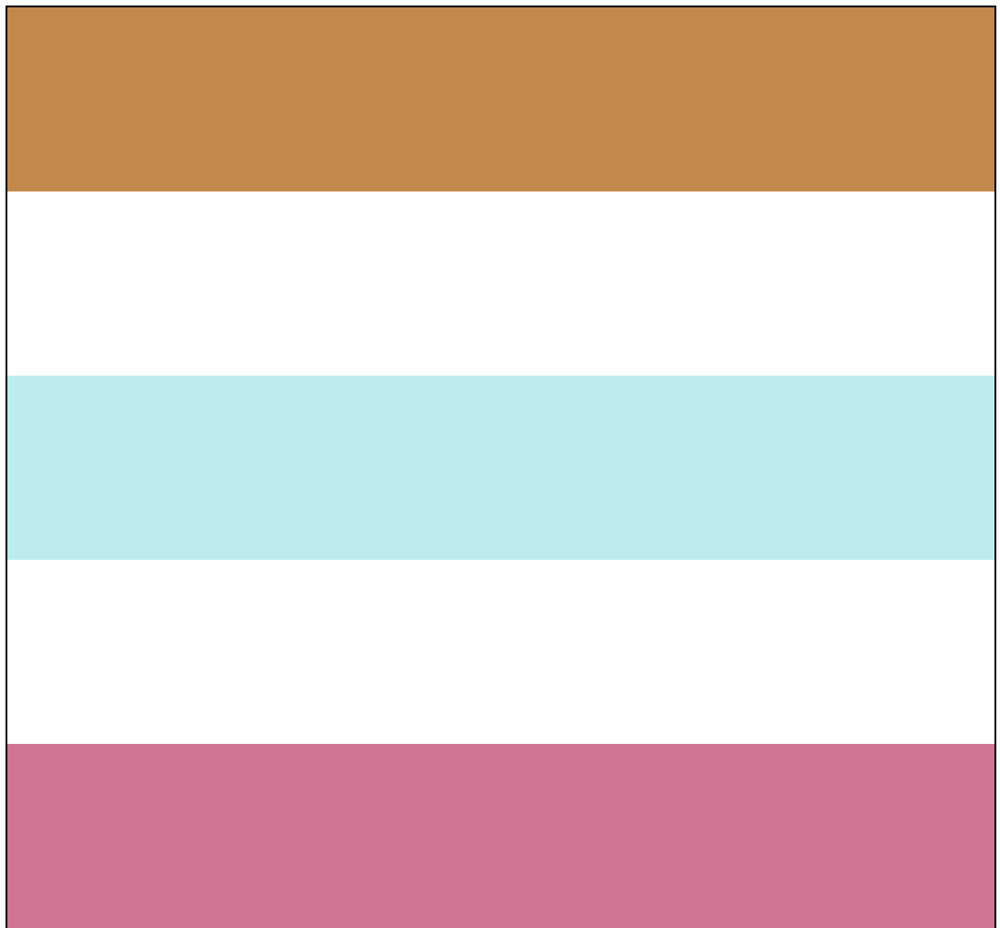
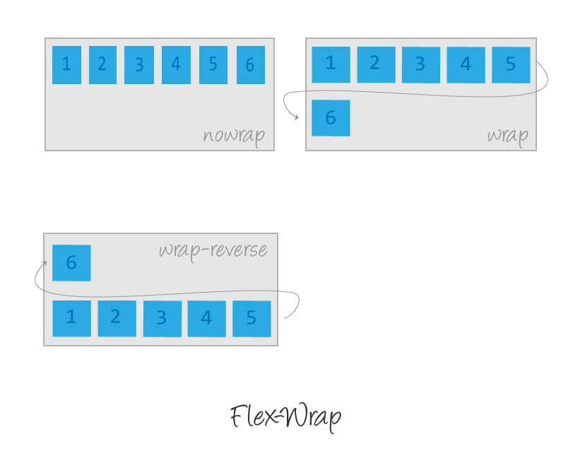
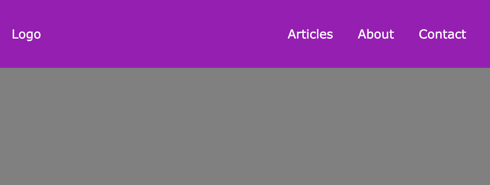

## Objectifs

* Créer des mises en page adaptées en utilisant flexbox
* Acquérir une compréhension approfondie de ce qu'est flexbox

## Introduction

Faire de la mise en page en CSS peut être difficile, il existe de nombreuses façons de créer une mise en page en CSS et certaines méthodes sont plus efficaces que d'autres.

Dans cette quête, nous apprendrons Flexbox, une méthode permettant de créer facilement des mises en page responsive.


## Sommaire

## Flexible Layout (Flexbox)

Le modèle Flexbox est un moyen **très efficace** d'**aligner et de répartir** l'espace entre les éléments.

Flexbox t'aidera à créer des **mises en page** très rapidement.

Flexbox peut être difficile au début, ce n'est pas le concept le plus simple, mais sois confiant, quand tu le comprendras et le maîtriseras correctement, tu verras que c'est un outil puissant !

## Créer un conteneur Flex

Pour utiliser flexbox, il suffit de **créer un conteneur flex.**
Le **conteneur flex** contiendra des **éléments enfants** auxquels nous appliquerons **certaines règles**.

```css
.parent{
  display: flex;
}
```

Une fois que le _**display**_ d'un parent passe en `flex`, **il devient un conteneur flex!**

**Source:** [https://sharkcoder.com/layout/flexbox](https://sharkcoder.com/layout/flexbox)

Dans un conteneur flex, tu peux **contrôler la façon dont les enfants sont présentés.**

Par **défaut**, le conteneur flexible est réglé sur **row** (ligne). Cette ligne a deux axes :

* L'axe principal (**main axis**) : horizontal
* L'axe transversal (**cross axis**) : vertical

*Source:* [https://developer.mozilla.org/en-US/docs/Web/CSS/CSS\_Flexible\_Box\_Layout/Basic\_Concepts\_of\_Flexbox](https://developer.mozilla.org/en-US/docs/Web/CSS/CSS_Flexible_Box_Layout/Basic_Concepts_of_Flexbox)


## Aligner des éléments avec flex

### Sur l'axe principal

Pour aligner des éléments le long de l'axe **principal**, utilise **justify-content** suivi d'une des valeurs suivantes :

* **flex-start** alignera les éléments au début du conteneur
* **flex-end** alignera les éléments à la fin du conteneur
* **center** alignera les éléments au centre du conteneur
* **space-between** répartira les éléments du conteneur (sur l'axe principal)
* **space-around** répartira les éléments du conteneur et ajoutera un espace avant le premier et après le dernier élément
* **space-evenly** : répartira les éléments de manière à ce que l'espace entre deux éléments (et l'espace par rapport aux bords) soit égal.


**Source:** [https://css-tricks.com/snippets/css/a-guide-to-flexbox/#aa-justify-content](https://css-tricks.com/snippets/css/a-guide-to-flexbox/#aa-justify-content)

### Sur l'axe transversal

Pour aligner les éléments sur l'axe transversal, nous pouvons utiliser les **align-items** en utilisant l'une des valeurs suivantes :

* **stretch** étirera les éléments le long de l'axe transversal
* **flex-start** alignera les éléments au départ
* **flex-end** alignera les éléments à la fin
* **center**  alignera les éléments au centre
* **baseline** s'alignera sur la ligne de base du conteneur



**🔬 Expérience**

Essaie d'espacer les éléments horizontalement et de les centrer verticalement.

Le résultat devrait ressembler à ceci :



```js live
!--- index.html
<!DOCTYPE html>
<html lang="en">
  <head>
    <meta charset="UTF-8" />
    <meta name="viewport" content="width=device-width, initial-scale=1.0" />
    <meta http-equiv="X-UA-Compatible" content="ie=edge" />
    <title>Static Template</title>
    <link rel="stylesheet" href="style.css" />
  </head>
  <body>
    <h1>
      Space the element horizontally and center them vertically
    </h1>
    <div class="bloc-container">
      <div class="blocs bg-peru"></div>
      <div class="blocs bg-turquoise"></div>
      <div class="blocs bg-violetred"></div>
    </div>
  </body>
</html>

!--- style.css
.bloc-container {
  display: flex;
  border: 1px solid black;
  height: 200px;
}
.blocs {
  width: 100px;
  height: 100px;
}
.bg-peru {
  background-color: peru;
}

.bg-turquoise {
  background-color: paleturquoise;
}
.bg-violetred {
  background-color: palevioletred;
}


!--- index.js
import "./style.css";
```

````solution

```css hl[4,5]
.bloc-container {
  display: flex;
  border: 1px solid black;
  justify-content: space-around;
  align-items: center;
  height: 200px;
}
```
````


## Répartir les éléments

Dans notre exemple, les éléments **prennent chacun une largeur de 100px.**
**100px est la taille principale de l'élément.**

Si nous modifions la largeur de l'élément à 100%, notre conteneur flexbox répartira les éléments sur la rangée.


```js live
!--- index.html
<!DOCTYPE html>
<html lang="en">
  <head>
    <meta charset="UTF-8" />
    <meta name="viewport" content="width=device-width, initial-scale=1.0" />
    <meta http-equiv="X-UA-Compatible" content="ie=edge" />
    <title>Static Template</title>
    <link rel="stylesheet" href="style.css" />
  </head>
  <body>
    <h1>
      Flexbox
    </h1>
    <div class="bloc-container">
      <div class="blocs bg-peru"></div>
      <div class="blocs bg-turquoise"></div>
      <div class="blocs bg-violetred"></div>
    </div>
  </body>
</html>


!--- style.css
.bloc-container {
  display: flex;
}
.blocs {
  width: 100%;
  height: 100px;
}
.bg-peru {
  background-color: peru;
}

.bg-turquoise {
  background-color: paleturquoise;
}
.bg-violetred {
  background-color: palevioletred;
}

!--- index.js
import "./style.css";
```

Donc maintenant, **en terme de ratio**, nous pourrions dire que **chaque élément prend 1 espace du conteneur flex**, n'est-ce pas ?

Nous pouvons utiliser la propriété **flex** pour décider de l'espace que nous voulons donner à chaque élément sur le conteneur.


```js live
!--- index.html
<!DOCTYPE html>
<html lang="en">
  <head>
    <meta charset="UTF-8" />
    <meta name="viewport" content="width=device-width, initial-scale=1.0" />
    <meta http-equiv="X-UA-Compatible" content="ie=edge" />
    <title>Static Template</title>
    <link rel="stylesheet" href="style.css" />
  </head>
  <body>
    <h1>
      Flexbox
    </h1>
    <div class="bloc-container">
      <div class="blocs box-1"></div>
      <div class="blocs box-2"></div>
      <div class="blocs box-3"></div>
    </div>
  </body>
</html>

!--- style.css
.bloc-container {
  display: flex;
  justify-content: center;
}
.blocs {
  height: 100px;
}
.box-1 {
  flex: 1;
  background-color: peru;
}

.box-2 {
  flex: 1;
  background-color: paleturquoise;
}
.box-3 {
  flex: 2;
  background-color: palevioletred;
}

!--- index.js
import "./style.css";
```

Dans cet exemple, **nous avons changé la propriété flex du dernier élément pour qu'il prenne 2 espaces sur l'axe principal**. **Les autres prendront alors 1 et 1.**

**🔬 Expérience**

Modifie la taille des éléments suivants en utilisant la propriété flex.
```js live
!--- index.html
<!DOCTYPE html>
<html lang="en">
  <head>
    <meta charset="UTF-8" />
    <meta name="viewport" content="width=device-width, initial-scale=1.0" />
    <meta http-equiv="X-UA-Compatible" content="ie=edge" />
    <title>Static Template</title>
    <link rel="stylesheet" href="style.css" />
  </head>
  <body>
    <h1>
      Change the size of the bloc
    </h1>
    <ul>
      <li>The first one should take 1</li>
      <li>The second one should take 3</li>
      <li>The third one should take 2</li>
      <li>The fourth one should take 1</li>
    </ul>
    <div class="bloc-container">
      <div class="blocs box-1"></div>
      <div class="blocs box-2"></div>
      <div class="blocs box-3"></div>
      <div class="blocs box-4"></div>
    </div>
  </body>
</html>


!--- style.css
.bloc-container {
  display: flex;
  justify-content: center;
}
.blocs {
  height: 100px;
  width: 100%;
}
.box-1 {
  background-color: peru;
}

.box-2 {
  background-color: paleturquoise;
}
.box-3 {
  background-color: palevioletred;
}

.box-4 {
  background-color: lightgray;
}


!--- index.js
import "./style.css";
```


````solution

```css hl[8,14,18]

.bloc-container {
  display: flex;
  justify-content: center;
}
.blocs {
  height: 100px;
  flex: 1;
}
.box-1 {
  background-color: peru;
}
.box-2 {
  flex: 3;
  background-color: paleturquoise;
}
.box-3 {
  flex: 2;
  background-color: palevioletred;
}
.box-4 {
  background-color: lightgray;
}

```

### À noter
Ligne 8 : la propriété `width: 100%;` a été retirée et remplacée par `flex: 1;` indiquant aux éléments `.blocs` de prendre **un espace flexible** par défaut.

````

## Changer de direction

Nous pouvons **changer la direction** du conteneur flex **en utilisant** `flex-direction`, par défaut la direction est **row** (ligne) mais nous pouvons aussi utiliser **column** (colonne).

```alert-warning
Lorsque tu changes la direction du flex, les axes changent, en mode column, l'axe principal est alors **vertical** et l'axe transversal devient **horizontal**. 
Cela signifie que si tu veux centrer horizontalement, tu dois maintenant utiliser _**align-items**_.
```

* Si la **direction** est **row** l'axe principal est **horizontal**
* si la **direction** est **row-reverse** les éléments s'afficheront de droite à gauche
* si la **direction** est **column** l'axe principal est **vertical**
* si la **direction** est **column-reverse**, les éléments s'afficheront de bas en haut

C'est la partie **délicate de Flexbox**, car l'axe principal change si l'on change la direction du conteneur.

Souviens-toi que `justify-content` alignera les éléments sur l'**axe principal** et `align-items` sur l'**axe transversal** et que tu peux changer l'axe en utilisant flex-direction.

****

```css
.parent{
  flex-direction: column;
}
```

**Source:** [https://tympanus.net/codrops/css\_reference/flexbox/](https://tympanus.net/codrops/css_reference/flexbox/)

**🔬 Expérience**

Modifie les éléments de manière à ce qu'ils soient **affichés dans une colonne** et qu'ils prennent **100% de la largeur**. 
Ils doivent être centrés sur l'axe principal.

Le résultat devrait ressembler à ceci.



```js live
!--- index.html
<!DOCTYPE html>
<html lang="en">
  <head>
    <meta charset="UTF-8" />
    <meta name="viewport" content="width=device-width, initial-scale=1.0" />
    <meta http-equiv="X-UA-Compatible" content="ie=edge" />
    <title>Static Template</title>
    <link rel="stylesheet" href="style.css" />
  </head>
  <body>
    <h1>
      The elements should be in column and take the full width
    </h1>
    <div class="bloc-container">
      <div class="blocs bg-peru"></div>
      <div class="blocs bg-turquoise"></div>
      <div class="blocs bg-violetred"></div>
    </div>
  </body>
</html>


!--- style.css
.bloc-container {
  display: flex;
  border: 1px solid black;
  height: 500px;
}
.blocs {
  width: 100px;
  height: 100px;
}
.bg-peru {
  background-color: peru;
}

.bg-turquoise {
  background-color: paleturquoise;
}
.bg-violetred {
  background-color: palevioletred;
}


!--- index.js
import "./style.css";
```


````solution

```css hl[5:7,11]
.bloc-container {
  display: flex;
  border: 1px solid black;
  height: 500px;
  flex-direction: column;
  align-items: flex-end;
  justify-content: space-between;
}

.blocs {
  width: 100%;
  height: 100px;
}
```

````

## Wrap


Il peut arriver que les **éléments soient trop grands pour le conteneur**. 
Nous pouvons utiliser la propriété **flex-wrap** pour décider comment les élements doivent se comporter lorsque le conteneur n'a pas assez de place pour les éléments.

Par défaut, le **flex-wrap est réglé sur `nowrap`**.
Si les éléments n'ont pas assez de place, alors **ils prendront la place disponible qu'ils peuvent.**

Avec **wrap les éléments passeront à la ligne suivante s'ils n'ont plus assez de place**.

**Source:** [https://tympanus.net/codrops/css\_reference/flexbox/](https://tympanus.net/codrops/css_reference/flexbox/)

Voyons un exemple :
```js live
!--- index.html
<!DOCTYPE html>
<html lang="en">
  <head>
    <meta charset="UTF-8" />
    <meta name="viewport" content="width=device-width, initial-scale=1.0" />
    <meta http-equiv="X-UA-Compatible" content="ie=edge" />
    <title>Static Template</title>
    <link rel="stylesheet" href="style.css" />
  </head>
  <body>
    <h1>
      Flex-wrap: nowrap
    </h1>
    <div class="bloc-container no-wrap">
      <div class="blocs bg-peru"></div>
      <div class="blocs bg-turquoise"></div>
      <div class="blocs bg-violetred"></div>
    </div>
    <h1>
      Flex-wrap: wrap
    </h1>
    <div class="bloc-container wrap">
      <div class="blocs bg-peru"></div>
      <div class="blocs bg-turquoise"></div>
      <div class="blocs bg-violetred"></div>
    </div>
  </body>
</html>


!--- style.css
.wrap {
  flex-wrap: wrap;
}
.no-wrap {
  flex-wrap: nowrap;
}
.bloc-container {
  display: flex;
  border: 1px solid black;
  padding: 50px 0;
  height: 100%;
}
.blocs {
  width: 200px;
  height: 200px;
}
.bg-peru {
  background-color: peru;
}

.bg-turquoise {
  background-color: paleturquoise;
}
.bg-violetred {
  background-color: palevioletred;
}

!--- index.js
import "./style.css";
```

## Résumé

* Flexbox est une bonne méthode pour créer une **mise en page responsive**.
* Le conteneur flex peut contrôler le comportement de ses enfants
* Un conteneur flex a **deux axes**, l'**axe principal** et l'**axe transversal**
    * L'axe principal est horizontal si la direction est en ligne et vertical si la direction est en colonne.
    * L'axe transversal est vertical si la direction est en ligne et horizontal si la direction est en colonne.
* On peut **aligner les éléments le long de l'axe principal en utilisant justify-content**.
* Nous pouvons **aligner les éléments le long de l'axe transversal en utilisant align-items**.
* Nous pouvons **changer la direction du conteneur en utilisant flex-direction**.
* La **propriété flex fixée sur un enfant** nous permet de **définir l'espace que nous voulons allouer à un élément**

```resource
https://www.youtube.com/watch?v=K74l26pE4YA
# Une vidéo qui résume tout ce que nous avons vu en 1 min
```

```resource
https://flexboxfroggy.com/#fr
# Entraîne-toi

Complète au moins 10 niveaux sur Flexbox Froggy - un jeu pour apprendre CSS Flexbox
```

```quiz
false|||false|||true
# Quelle propriété aligne les éléments le long de l'axe principal ?
[x] justify-content
[] align-items
# Quelle propriété aligne les éléments le long de l'axe transversal ?
[] justify-content
[x] align-items
# Quelle propriété change la direction du conteneur flex ?
[] flex-wrap
[x] flex-direction
```

## Challenge

À partir du code HTML suivant :

```html
<!DOCTYPE html>
<html lang="en">

<head>
    <meta charset="UTF-8">
    <meta name="viewport" content="width=device-width, initial-scale=1.0">
    <title>Exercise | Flexbox</title>
    <link rel="stylesheet" href="style.css">
</head>

<body>
    <nav>
        <div>Logo</div>
        <ul>
            <li><a href="#">Articles</a></li>
            <li><a href="#">About</a></li>
            <li><a href="#">Contact</a></li>
        </ul>
    </nav>
</body>

</html>
```

Essaie de reproduire la mise en forme de cette barre de navigation en utilisant le **display flex** :




### Précisions

- Les éléments sont verticalement alignés au centre.
- Le code couleur pour le violet : #A306B6;

````solution

Une solution possible.
```css
* {
    box-sizing: border-box;
}

body {
    margin: 0;
    line-height: 1.5;
    background-color: grey;
    font-family: Verdana, Geneva, Tahoma, sans-serif;
}

nav {
    display: flex;
    justify-content: space-between;
    align-items: center;
    padding: 1rem;
    background-color: #A306B6;
    color: #fff;
}

nav>ul {
    display: flex;
    list-style: none;
}

nav>ul>li>a {
    color: inherit;
    text-decoration: none;
    padding: 1rem;
}
```
````