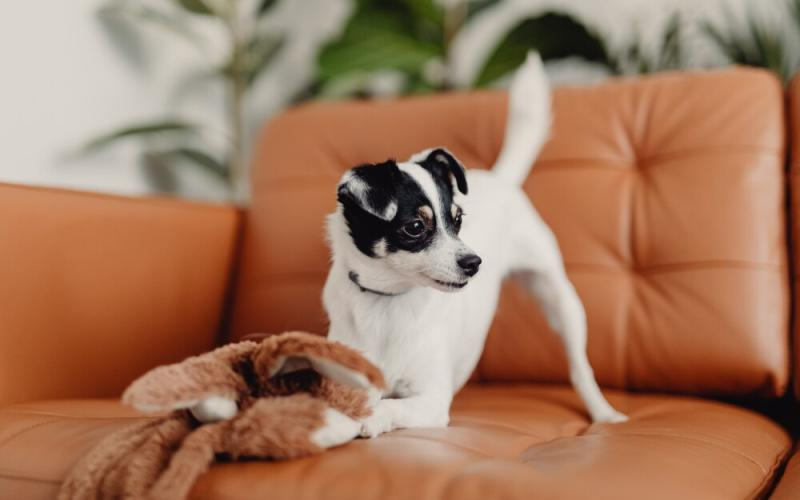
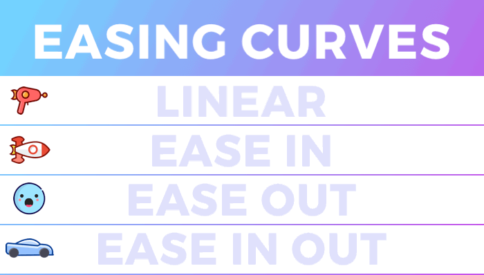
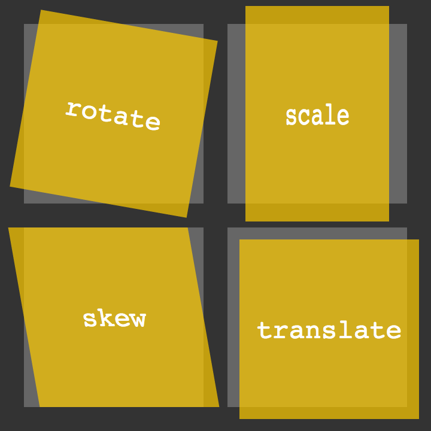
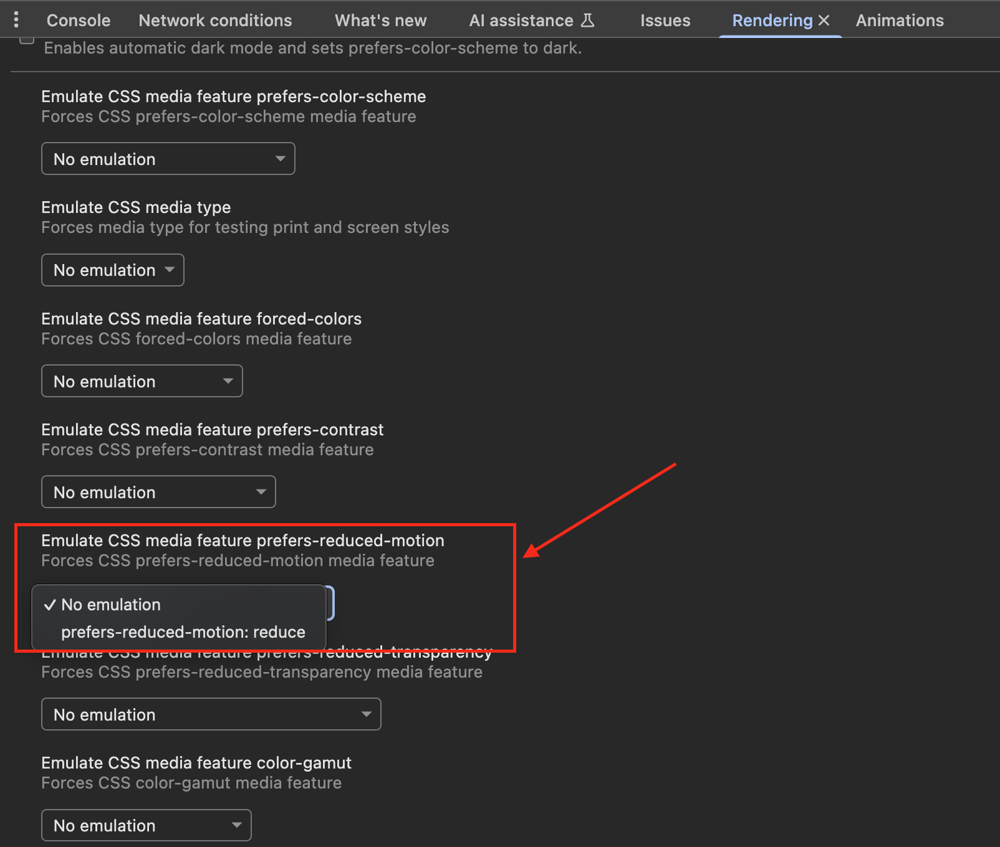

* Comment utiliser la **transition CSS**
* Transformer les boîtes avec la propriété **transform**
* Comment utiliser les **animations CSS**
* Respecter les recommandations :def[A11Y]{value="Accessibility"}

## Introduction

```xtext intro
Dans le passé, faire des animations sur un site web nécessitait l'utilisation de JavaScript en utilisant la manipulation du DOM.

Aujourd'hui, il est possible de **faire des animations en CSS**, qui sont **plus légères** et **plus faciles** à réaliser.

Dans cette quête, tu apprendras **ce que sont les animations en CSS** et **comment les utiliser.**
```

Sais-tu que tu peux faire de l'animation en utilisant du CSS pur ?
Sans avoir à utiliser JavaScript, tu peux rendre ton site web **plus interactif et plus agréable !**

Voyons les différentes méthodes que nous pouvons utiliser !

La première est la plus facile et s'appelle **CSS transition.**
Imaginons que tu aies une image et que tu veuilles l'animer au survol.

Prenons ce code, par exemple :

```css
.dog-img{
	width:200px;
}
.dog-img:hover{
	width:500px;
}
```

```js live
!--- index.html
<!DOCTYPE html>
<html>
  <head>
    <title>Parcel Sandbox</title>
    <meta charset="UTF-8" />
    <link rel="stylesheet" href="style.css" />
  </head>

  <body>
    <h1>Animate the image on hover</h1>
    
  </body>
</html>

!--- style.css
.dog-img {
  width: 500px;
}
.dog-img:hover {
  width: 550px;
}

!--- index.js
import "./style.css";
```
Comme tu peux le voir quand tu survoles l'image, la transition n'est pas vraiment douce, n'est-ce pas ?

Pour donner de la fluidité d'une taille à l'autre, on peut utiliser la transition **CSS**. La transition CSS ressemble à ça :

```css
element{
	transition: <property> <duration> <curve>;
}
```

* Le premier paramètre est la **propriété** que tu veux animer. Dans notre exemple, il s'agit la `width`, mais tu peux aussi utiliser `all` pour animer toutes les propriétés.
* Le second est la **durée** de l'animation
* Et le dernier est la **courbe de détente** (ton élément pourrait accélérer ou décélérer ou se déplacer à vitesse constante)


Source: [https://support.animaapp.com/en/articles/2601206-animation-easing-curve-explained](https://support.animaapp.com/en/articles/2601206-animation-easing-curve-explained#:~:text=Ease%2DIn%3A%20Causes%20the%20animation,fast%20middle%2C%20and%20slow%20end)

**🔬 Expérimente**

Essaie d'ajouter une transition sur le code suivant


```js live
!--- index.html
<!DOCTYPE html>
<html>
  <head>
    <title>Parcel Sandbox</title>
    <meta charset="UTF-8" />
    <link rel="stylesheet" href="style.css" />
  </head>

  <body>
    <h1>Animate the image on hover</h1>
    
  </body>
</html>


!--- style.css
.dog-img {
  width: 500px;
}
.dog-img:hover {
  width: 550px;
}


!--- index.js
import "./style.css";
```

```hidden 
Montrer la solution|||css|||Des problèmes pour trouver la solution ? |||0|||Masquer
.dog-img {
  width: 500px;
  transition: width 1s ease-in;
}
```

```resource
https://www.htmldog.com/guides/css/advanced/transitions/
# CSS Transition - HTMLDog 
```

La propriété `transform` permet de manipuler un élément en l'inclinant, en le faisant tourner, en le déplaçant ou en le mettant à l'échelle.


Source: [https://www.htmldog.com/guides/css/advanced/transformations/](https://www.htmldog.com/guides/css/advanced/transformations/)

### Rotation

Pour appliquer une rotation sur un élément tu peux utiliser la fonction `rotate` :

```css
transform: rotate(10deg);
```

### Mise à l'échelle

Tu peux changer l'échelle en utilisant la fonction `scale` dans une transformation CSS :

```css
transform: scale(1.5);
```

### Déplacer

Tu peux déplacer un élément horizontalement et verticalement en utilisant `translate`. C'est utile quand tu veux faire bouger tes éléments :

```css
transform : translate(200px,200px) ;
```

### Incliner

La fonction `skew` permet d'incliner l'élément :

```css
transform: skew(20deg,10deg);
```

### Combiner plusieurs transformations

Tu peux combiner plusieurs propriétés en une seule fois dans ta transformation :

```css
transform: rotate(10deg) scale(1.5);
```

Pour une utilisation plus avancée, les transformations 3D existent aussi et peuvent permettre des animations plus complexes et esthétiques. Si tu as le temps, tu peux consulter ces deux ressources optionnelles :

```resource
https://3dtransforms.desandro.com/perspective
# CSS 3D Transforms - Perspective
```

```resource
https://3dtransforms.desandro.com/3d-transform-functions
# CSS 3D Transforms functions
```

## 🔬 Expérimente


C'est ton tour maintenant ! Essaie de combiner les transitions CSS et les transformations CSS pour créer des animations au survol sur les éléments suivants :


```js live
!--- index.html
<!DOCTYPE html>
<html>
  <head>
    <title>Parcel Sandbox</title>
    <meta charset="UTF-8" />
    <link rel="stylesheet" href="style.css" />
  </head>

  <body>
    <h1>Animate the images on hover</h1>

    <h2>Rotation 20 deg</h2>
    

    <h2>Scale 2</h2>
    

    <h2>Translate 200px 200px</h2>
    

    <h2>skew 20deg 10deg</h2>
    

    <h2>Rotate 20 deg translate 100px 50px</h2>
    
  </body>
</html>


!--- style.css
/* TODO */

!--- index.js
import "./style.css";
```

```hidden 
Montrer la solution|||css|||Des problèmes pour trouver la solution ? |||0|||Masquer
.dog-img {
  transition: all 1s ease-in-out;
}

#dog-img-1:hover {
  transform: rotate(20deg);
}

#dog-img-2:hover {
  transform: scale(2);
}

#dog-img-3:hover {
  transform: translate(200px, 200px);
}

#dog-img-4:hover {
  transform: skew(20deg, 10deg);
}

#dog-img-5:hover {
  transform: rotate(20deg) translate(100px, 50px);
}
```

Les transitions CSS sont souvent utilisées avec `:hover` mais elles peuvent être utilisées avec d'autres pseudo-classes, comme `:focus`, `:target`, `:checked`, etc.

Les animations que nous avons créées en utilisant des transitions CSS sont assez simples, n'est-ce pas ?

Et si nous voulons créer des animations plus complexes ? Ou une animation qui peut être lancée sans interaction avec l'utilisateur.
Et bien bonne nouvelle, c'est possible avec les [animations CSS](https://developer.mozilla.org/fr/docs/Web/CSS/animation) !

Pour créer une animation avec CSS, tu dois utiliser des `@keyframes`.

### Animations simples

Un exemple vaut des milliers d'explications :

```css
@keyframes slideIn {
  from {
    transform: translate(0px, 0px);
  }
  to {
    transform: translate(200px, 0px);
  }
}
```

**From** est l'état de départ de l'élément et **to** est l'état de l'élément souhaité à la fin de l'animation.

Ensuite, pour appliquer l'animation à un élément, tu dois utiliser les propriétés `animation-name` et `animation-duration` :

```css
.my-div{
  animation-name: slideIn;
  animation-duration: 1s;
}
```

Tu peux aussi ajouter une propriété `animation-iteration-count` pour définir **le nombre d'itérations souhaitées**.

```css
animation-iteration-count: infinite; /* boucle infinie */
animation-iteration-count: 3; /* animation jouée 3 fois */
```

Et bien d'autres réglages encore…

### Animations complexes

```js live
!--- index.html
<!DOCTYPE html>
<html>
  <head>
    <title>Parcel Sandbox</title>
    <meta charset="UTF-8" />
    <link rel="stylesheet" href="style.css" />
  </head>

  <body>
    <h1>CSS animation demo</h1>
    
  </body>
</html>

!--- style.css
#dog-img-1 {
  animation-name: slideIn;
  animation-duration: 4s;
  animation-iteration-count: infinite;
}

@keyframes slideIn {
  from {
    transform: translate(0px, 0px);
  }
  to {
    transform: translate(200px, 0px);
  }
}

!--- index.js
import "./style.css";
```

Dans cet exemple, tu peux voir que lorsque l'animation est terminée, le chien revient à sa place d'origine **sans être animé.**

C'est normal car l'animation **démarre à nouveau**. 

Si nous voulons que le chien revienne à sa position d'origine de manière fluide, nous devons faire une animation plus complexe : 

```css
@keyframes slideIn {
  0% {
    transform: translate(0px, 0px);
  }
  50% {
    transform: translate(200px, 0px);
  }
  100% {
    transform: translate(0px, 0px);
  }
}
```

Ici, **nous utilisons des pourcentages** qui représentent le % d'avancement de l'animation.

Dans cet exemple, l'image commencera à la **position 0**, se déplacera ensuite à la **position 200px** et reviendra à la **position 0** à la fin de l'animation.

Voici le résultat final :


```js live
!--- index.html
<!DOCTYPE html>
<html>
  <head>
    <title>Parcel Sandbox</title>
    <meta charset="UTF-8" />
    <link rel="stylesheet" href="style.css" />
  </head>

  <body>
    <h1>CSS animation demo</h1>
    
  </body>
</html>


!--- style.css
#dog-img-1 {
  animation-name: slideIn;
  animation-duration: 4s;
  animation-iteration-count: infinite;
}
@keyframes slideIn {
  0% {
    transform: translate(0px, 0px);
  }
  50% {
    transform: translate(200px, 0px);
  }
  100% {
    transform: translate(0px, 0px);
  }
}


!--- index.js
import "./style.css";
```
Tu peux utiliser les pourcentages que tu veux pour personnaliser ton animation :

```css
@keyframes slideIn {
  0% {
    transform: translate(0px, 0px);
  }
  15% {
    transform: translate(0px, 200px);
  }
  50% {
    transform: translate(200px, 0px);
  }
  75% {
    transform: translate(200px, 200px);
  }
  100% {
    transform: translate(0px, 0px);
  }
}
```


```js live
!--- index.html
<!DOCTYPE html>
<html>
  <head>
    <title>Parcel Sandbox</title>
    <meta charset="UTF-8" />
    <link rel="stylesheet" href="style.css" />
  </head>

  <body>
    <h1>CSS animation demo</h1>
    
  </body>
</html>


!--- style.css
#dog-img-1 {
  animation-name: slideIn;
  animation-duration: 4s;
  animation-iteration-count: infinite;
}
@keyframes slideIn {
  0% {
    transform: translate(0px, 0px);
  }
  15% {
    transform: translate(0px, 200px);
  }
  50% {
    transform: translate(200px, 0px);
  }
  75% {
    transform: translate(200px, 200px);
  }
  100% {
    transform: translate(0px, 0px);
  }
}


!--- index.js
import "./style.css";
```

## 🔬 Expérimente


Essaie de créer une animation en respectant ces consignes :

1. Entre 0 et 50% de l'animation, faire rouler le disque vinyl vers la droite de sorte qu'il tourne d'un demi-tour.
2. Puis revenir à l'état initial de 50 à 100%
3. L'animation doit avoir un effet de balancier, c'est-à-dire une accélération au démarrage et un ralentissement en fin de séquence
4. L'animation doit tourner en boucles de 5 secondes

Aide-toi de la [documentation](https://developer.mozilla.org/fr/docs/Web/CSS/animation) si tu es perdu.

```js live
!--- index.html
<!DOCTYPE html>
<html>
  <head>
    <title>Parcel Sandbox</title>
    <meta charset="UTF-8" />
    <link rel="stylesheet" href="style.css" />
  </head>

  <body>
    
  </body>
</html>


!--- style.css
#vinyl-img {
  border-radius: 50%;
  /* your code */
}


!--- index.js
import "./style.css";
```

```hidden 
Montrer la solution|||css|||Des problèmes pour trouver la solution ? |||0|||Masquer
#vinyl-img {
  border-radius: 50%;
  animation-name: vinylAnimation;
  animation-duration: 5s;
  animation-timing-function: ease-in-out;
  animation-iteration-count: infinite;
}

@keyframes vinylAnimation {
  0% {
    transform: translate(0px, 0px);
  }

  50% {
    transform: translate(100%, 0px) rotate(180deg);
  }

  100% {
    transform: translate(0px, 0px) rotate(0deg);
  }
}
```

Comme cela est précisé dans le [:def[RGAA]{value="Référentiel général d’amélioration de l’accessibilité"}](https://accessibilite.numerique.gouv.fr/), les transitions et animations doivent être manipulées avec beaucoup de précaution. Le risque étant de rendre une partie du contenu inaccessible aux utilisateurs souffrant de troubles de la vue ou de l'attention.

Voici ce qui est indiqué au [critère 13.8 du RGAA](https://accessibilite.numerique.gouv.fr/methode/criteres-et-tests/#13.8) :
>**Dans chaque page web, chaque contenu en mouvement déclenché automatiquement, vérifie-t-il une de ces conditions ?** 
>- La durée du mouvement est inférieure ou égale à 5 secondes ;
>- L’utilisateur peut arrêter et relancer le mouvement ;
>- L’utilisateur peut afficher et masquer le contenu en mouvement ;
>- L’utilisateur peut afficher la totalité de l’information sans le mouvement.


Comme dans de nombreux cas concernant l'accessibilité numérique, une méthode pour répondre à ces critères de test repose sur une fonctionnalité native des navigateurs et des systèmes d'exploitation.
Le media query `prefers-reduced-motion` va permettre d'activer ou non l'animation en fonction des réglages de l'utilisateur (via l'OS généralement).

Dans l'exemple précédent, le balancement du vinyl pourra être désactivé selon les préférences de l'utilisateur, le cas échéant, grâce à ces quelques lignes de code :

```css
@media (prefers-reduced-motion: reduce) {
  #vinyl-img {
    animation: none;
  }
}
```

Tu trouveras plus d'explications sur la _media query_ `prefers-reduced-motion` en lisant la documentation MDN : https://developer.mozilla.org/fr/docs/Web/CSS/@media/prefers-reduced-motion


```alert info
Pour tester un tel réglage :
- **Chromium** (Chrome, Edge, Brave…) : **Dev tools > More tools > Rendering**

- **Firefox** :
  1. Taper `about:config` dans la barre d'adresse.
  2. Chercher `ui.prefersReducedMotion`.
  3. Régler la valeur sur `1` pour activer reduce.
- **Safari** : Utiliser la configuration de macOS et iOS.
```

## Résumé

* Tu peux utiliser les **animations CSS** pour animer les éléments de ton site
* Tu peux utiliser **CSS transform** pour changer la manière dont est rendu un élément (modification de l'échelle, de l'inclinaison, etc)
* Il y a deux façons d'animer les éléments : **Transition ou Animation**
* Reste vigilant en évitant les animations ou effets de flash qui rendraient l'interface inaccessible et pense à prendre en compte les réglages de l'utilisateur avec le _media query_ `prefers-reduced-motion`