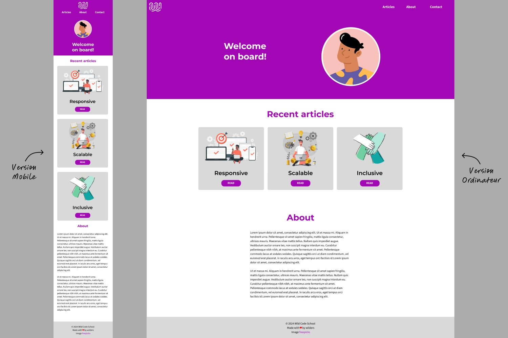
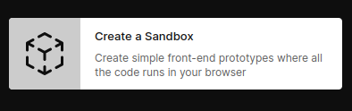

## Objectifs

- Réaliser l'intégration HTML/CSS de la maquette d'une page basique
- Découvrir et mettre en application les notions suivantes :
  - **Sémantique HTML**
  - Le _**box model**_
  - Les _**display flex et grid**_
  - Le _**responsive design**_
  - Les **variables CSS**

## Introduction

Une de tes missions en tant que développeur web sera l'assemblage de code HTML et CSS pour réaliser la mise en page web d'une maquette. C'est ce que tu peux appeler « réaliser l'intégration front-end ». C'est le sujet de cette première quête.

## Sommaire

## Bienvenue à bord !


Si tu démarres ton apprentissage des langages HTML et CSS, tu dois penser à la lecture des objectifs que ta mission ne va pas être une mince affaire. Rassure-toi : tu as à ta disposition un ensemble de ressources, d'explications et de conseils disponibles dans des quêtes complémentaires. Tu trouveras les liens et leur utilisation au gré de ce contenu.
Ainsi, en suivant ces quêtes "ressources", tu trouveras des exercices corrigés très utiles pour le challenge de cette quête principale. Tu peux bien évidemment te lancer directement dans la réalisation du challenge si tu t'en sens capable.

Pour être au plus proche des conditions réelles que tu rencontreras dans tes missions quotidiennes, le challenge de cette quête t'est proposé sous forme de « brief web-design ». 

Le voici.


## Le brief

```xtext story
Hello 👋,

La journée démarre avec une bonne nouvelle : le client vient de valider la maquette de son projet web ! 
Tu peux démarrer l'intégration de la page d'accueil pendant que nous finalisons les autres planches.
Pour rappel, comme discuté lors de la dernière réunion, le client souhaiterait que son mini site s'adapte correctement sur mobile et sur écran d'ordinateur standard.
Voici la maquette en question.



Quelques précisions si besoin.
- **La couleur principale** : le client aura sans doute besoin de pouvoir la changer facilement pour l'adapter à sa charte graphique. Actuellement c'est un violet dont le code hex est : **#A306B6**.
- La page est sur fond blanc et les articles sur fond gris dont le code hex : **#D9D9D9**.
- Cela ne se voit pas forcément bien au premier coup d'œil, mais pour les deux versions, le `header` sur fond violet (qui contient la barre de navigation et le titre « Welcome on board! ») prend la moitié de la fenêtre en hauteur. Essaie de le respecter si tu peux 😉.
- **Pour la typo** : ont été validées les deux *Google fonts* suivantes :
  - Titres de niveau 1, 2 et 3 : **Montserrat**
  - Paragraphes et liens de navigation : **Source sans 3**
- Pour les deux tailles d'écran, tu peux utiliser **992px** comme point de rupture, ça fera l'affaire !

Tu trouveras les images utilisées ainsi que les deux versions de la maquette en pièce jointe.
Bon courage et bonne journée 🙂,

L'équipe design.
[Télécharger les images ⬇](https://github.com/WildCodeSchool/quest-material-html-css-1/raw/main/html-css-quest-welcome-on-board-material.zip)
```

## Le debrief

Garde ce message sous la main, il contient des informations précieuses. 
Regardons maintenant ce dont nous avons besoin et comment réaliser cette mission.


### Préparer ton environnement de travail

>Tu es libre de faire à ta manière, cette section n'est qu'une proposition.
Mais accordons-nous sur un point. À chaque fois que tu vas travailler sur un projet (une quête, un atelier ou un vrai projet), tu dois ranger tes fichiers dans des dossiers séparés pour ne pas te mélanger. Le but étant de pouvoir les retrouver facilement (pour toi et les personnes avec qui tu travailles). 

Voici quelques étapes basiques pour t'organiser.
- Crée un dossier _**quête-bienvenue-à-bord**_ (ou tout autre nom de ton choix)  que tu retrouveras facilement dans l'arborescence de tes documents.
- Télécharges-y les images fournies dans le brief (qu'il faudra décompresser).
- Au même emplacement, crée un autre dossier _**integration-welcome-on-board**_ (par exemple). C'est dans ce dossier que résideront les fichiers HTML et CSS du mini-site.
- Enfin, **ouvre ton IDE sur ce dernier dossier**.


Voici une première quête à suivre si tu n'as jamais utilisé d'éditeur de code (IDE).
```quests
2114
```

### Les bases pour démarrer

Pour t'assurer d'avoir les bonnes bases, tu peux te pencher sur les quêtes traitant du HTML et notamment celle présentant comment structurer correctement une page grâce aux balises sémantiques.
```quests
2113,2118,2119,2123,2122
```

Tu peux ensuite faire de même en découvrant les fondamentaux du CSS grâce à la quête suivante.

```quests
1924
```

Enfin, après ton **IDE**, le deuxième outil indispensable pour intégrer correctement et confortablement une page web est logé dans ton navigateur. C'est l'inspecteur.

```quests
2427
```


### Boîtes, alignements, grilles et tailles d'écran

Bien, revenons à notre projet et entrons un peu plus dans le vif du sujet.
Voici les premières questions que tu peux te poser en regardant la maquette :
1. Quels différents blocs composent la page ?
2. Avec quelles balises HTML je vais délimiter et identifier ces blocs ? 
3. Quelles propriétés CSS me permettront de positionner facilement ces différents éléments ?

Tu te rendras vite compte qu'il existe souvent plusieurs réponses à ces questions et donc autant de solutions pour intégrer une maquette. Chaque piste et solution aura des qualités et probablement des défauts. C'est avec l'expérience que le développeur bonifie ses intégrations et favorise certains choix. Cependant, certaines règles sont communes à toutes les bonnes solutions :
- Respecter les bonnes pratiques d'utilisation des balises HTML.
- Écrire un code facilement lisible et modifiable par d'autres développeurs.


#### About

Réalise d'abord la section « **About** » : c'est la plus "simple". 
Tu peux apprendre dans la quête suivante, entre autres, les rôles des propriétés CSS _**margin**_, _**padding**_ et les rudiments des affichages _**bloc**_ et _**inline**_. Cela t'aidera à réaliser cette partie.

```quests
1680
````

#### Header et barre de navigation

Poursuis tes lectures en découvrant l'affichage _**flex**_ grâce à la quête du même nom qui t'aidera de monter la partie _**header**_.

```quests
1287
````

#### Les articles

Passons à la section des articles. 
C'est l'occasion d'apprendre un type affichage un peu plus compliqué mais très puissant : le _**display grid**_.


```quests
1292
````

#### Le responsive

Tu te souviens du brief. Le client souhaite que son site s'affiche correctement sur mobile et sur ordinateur. Pour gérer cette contrainte devenue obligatoire pour tous les sites modernes, tu peux t'appuyer sur la quête traitant du _**Responsive design**_ et découvrir les _**media queries**_.

```quests
1285
```

#### Lectures complémentaires

Pour finir, voici quelques quêtes supplémentaires qui complèteront toutes ces premières notions. 


```quests
1345,1307, 492
```

La quête traitant des variables CSS te permettra très certainement de remplir une autre demande du client : « *pouvoir changer facilement la couleur principale pour l'adapter à sa charte graphique* ».


## Challenge

Publie ta solution sur [https://codesandbox.io](https://codesandbox.io/) dans un sandbox "simple", et partage le lien en guise de solution au challenge.


```ressource
https://wildcodeschool.github.io/discovery-course-dev-material/
# Les outils du développeur : conseils et tutoriels
Des ressources pour découvrir comment fonctionne la plateforme [Codesandbox.io]((https://codesandbox.io/)).
- Créer un Sandbox
- Faire un **Fork**
- Publier et partager un Sandbox
```


### Critères de validation

- [ ] La mise en page est conforme à la maquette et au brief donné.
- [ ] Un point de rupture permet de distinguer la version mobile de la version ordinateur.

## Une solution possible

Regarde les onglets `index.html` et `style.css` ci-dessous pour lire la solution qui t'est proposée.
Tu peux aussi ouvrir le code sur Codesanbox pour plus de lisibilité.
Pour des raisons techniques, les images ont été remplacées par des png générés dynamiquement. À toi d'adapter avec les vrais fichiers.

```js live
!--- index.html

<!DOCTYPE html>
<html lang="en">

<head>
    <meta charset="UTF-8">
    <meta name="viewport" content="width=device-width, initial-scale=1.0">
    <title>Welcome on board</title>
    <link rel="stylesheet" href="style.css">
    <link rel="preconnect" href="https://fonts.googleapis.com">
    <link rel="preconnect" href="https://fonts.gstatic.com" crossorigin>
    <link
        href="https://fonts.googleapis.com/css2?family=Montserrat:ital,wght@0,100..900;1,100..900&family=Source+Sans+3:ital,wght@0,200..900;1,200..900&display=swap"
        rel="stylesheet">
</head>

<body>
    <header>
        <nav>
            <a href="#">
                
            </a>
            <ul>
                <li><a href="#">Articles</a></li>
                <li><a href="#">About</a></li>
                <li><a href="#">Contact</a></li>
            </ul>
        </nav>
        <div class="container">
            <h1>Welcome on board!</h1>
            
        </div>
    </header>
    <main>
        <section class="container">
            <h2>Recent articles</h2>
            <div class="articles">
                <article>
                    
                    <h3>Responsive</h3>
                    <a href="#">Read</a>
                </article>
                <article>
                    
                    <h3>Scalable</h3>
                    <a href="#">Read</a>
                </article>
                <article>
                    
                    <h3>Inclusive</h3>
                    <a href="#">Read</a>
                </article>
            </div>
        </section>
        <section class="container">
            <h2>About</h2>
            <p>
                Lorem, ipsum dolor sit amet consectetur adipisicing elit. Animi rerum debitis fugit similique laborum,
                eveniet nam ratione sed, itaque, minus in hic dolores suscipit molestias quis quibusdam error blanditiis
                sapiente.
                Laborum laudantium aut, consequuntur voluptatum animi eaque mollitia? Saepe neque facilis minima
                laborum, provident numquam ipsum laudantium totam porro placeat exercitationem voluptates quia explicabo
                temporibus sapiente non. Quo, repellat corrupti.
            </p>
            <p>
                Excepturi dolore saepe, temporibus est voluptate necessitatibus molestiae sit minima eum quisquam et qui
                quaerat nemo nam, consequuntur nisi alias in praesentium. Fuga amet esse nam doloremque ut nemo nostrum.
            </p>
        </section>
    </main>
    <footer>
        <p>&copy; 2024 Wild Code School</p>
        <p>Made with ❤️ by wilders</p>
        <p>Images <a href="#">freepick</a></p>
    </footer>
</body>

</html>

!--- style.css
:root {
    --primary-color: #A306B6;
    --primary-color-inverse: #fff;
    --grey: #D9D9D9;

    --spacing: 1rem;
    --spacing-2: calc(var(--spacing) * 2);
    --spacing-3: calc(var(--spacing) * 3);
}

* {
    box-sizing: border-box;
}

body {
    margin: 0;
    line-height: 1.5;
    background-color: #fff;
    font-family: "Source Sans 3", Verdana, Geneva, Tahoma, sans-serif;
}

h1, h2, h3 {
    font-family: "Montserrat", Verdana, Geneva, Tahoma, sans-serif;
}

h2 {
    color: var(--primary-color);
    text-align: center;
}

a {
    color: var(--primary-color);
}

img {
    max-width: 100%;
    height: auto;
}

.container {
    max-width: 800px;
    margin: auto;
    padding: 0 var(--spacing);
}

/* Style the header */
header {
    display: flex;
    flex-direction: column;
    background-color: var(--primary-color);
    color: #fff;
    text-align: center;
    min-height: 50vh;
}

header h1 {
    max-width: 8ch;
}

header .container {
    display: flex;
    flex-direction: column-reverse;
    align-items: center;
}

@media screen and (min-width: 992px) {
    header .container {
        width: 800px;
        flex-direction: row;
        justify-content: space-around;
    }

}

header .container img {
    max-width: 130px;
    border-radius: 50%;
    box-shadow: inset 0 0px 0px 4px var(--primary-color-inverse);
}

@media screen and (min-width: 992px) {
    header .container img {
        max-width: 250px;
    }

}

/* Style the navigation menu */
nav {
    display: flex;
    flex-direction: column;
    justify-content: center;
    align-items: center;
    background-color: var(--primary-color);
    padding: 1rem;
}

@media screen and (min-width: 992px) {
    nav {
        flex-direction: row;
        justify-content: space-between;
    }

}

nav .logo {
    width: 60px;
}

nav>ul {
    display: flex;
    list-style: none;
    padding: 0;
}

nav>ul>li>a {
    padding: 1rem;
    color: var(--primary-color-inverse);
    text-decoration: none;
}


/* Style the main section */
section.container {
    margin-top: var(--spacing-2);
    margin-bottom: var(--spacing-3);
}

section p {
    max-width: 60ch;
    margin-inline: auto;
}

/* Style section articles */
.articles {
    display: grid;
    grid-template-columns: 1fr;
    gap: var(--spacing);
}

@media screen and (min-width: 992px) {
    .articles {
        grid-template-columns: repeat(3, 1fr);
    }

}

article {
    display: flex;
    flex-direction: column;
    align-items: center;
    padding: 1rem;
    background-color: var(--grey);
    border-radius: 5px;
}

article h3 {
    margin-top: auto;
}

article a {
    padding: .25rem 1.75rem;
    background-color: var(--primary-color);
    color: var(--primary-color-inverse);
    border-radius: 1rem;
    text-decoration: none;
    text-transform: uppercase;
}

article img {
    max-height: 150px;
}

/* Style the footer */
footer {
    padding: var(--spacing);
    background-color: var(--grey);
    text-align: center;
    font-size: .875rem;
}

footer p {
    margin: 0;
}

!--- index.js

import "./style.css";

```