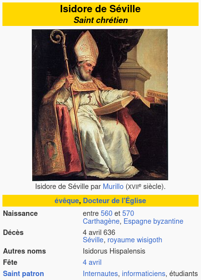
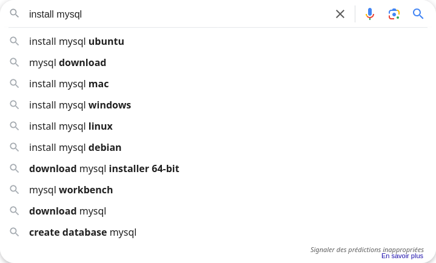
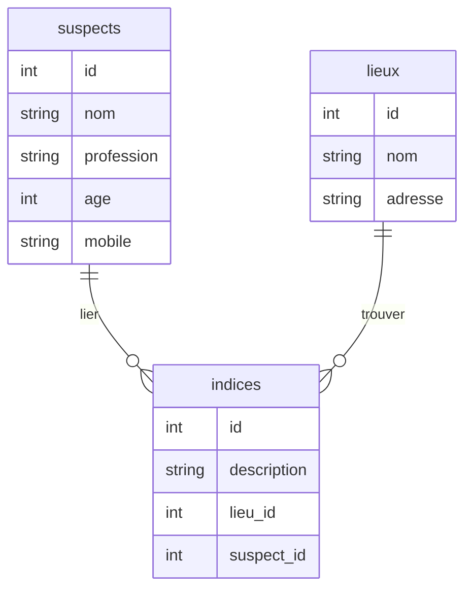
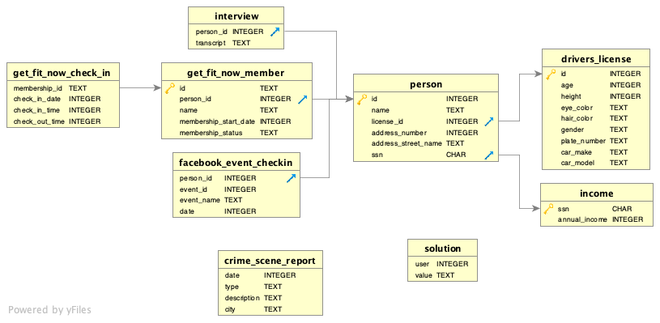
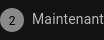
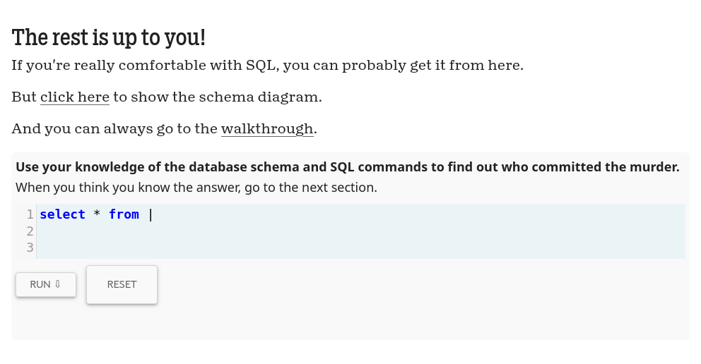

## Objectifs

- Installer MySQL
- Découvrir le langage SQL
- Pratiquer des requêtes simples

## Introduction

Bienvenue dans cette aventure où enquête et technologie se rencontrent ! Ce support va t’initier aux bases de données et au langage SQL, des outils indispensables pour organiser et manipuler des informations.

Pour rendre cet apprentissage aussi immersif que ludique, tu vas participer à une Murder Party en ligne. L’enquête, pleine de mystère, te guidera dans la découverte des bases de données, tout en te permettant de t’initier aux requêtes SQL.

## Sommaire

## Invitation à une Murder Party en équipe !

_(Cette partie est uniquement du story-telling pour te mettre dans l'ambiance : elle ne contient pas d'information indispensable pour le reste de la quête)_

```xtext story
Bonjour à tous,

L'équipe database vous invite à participer à une Murder Party en ligne sur Mystery Knight Lab. C'est l'occasion parfaite de tester vos talents de détectives et de résoudre une enquête en équipe !

Ça se passe où ? En ligne, sur https://mystery.knightlab.com/

On vous attend nombreux pour ce moment fun et plein de mystère ! 😎

À bientôt,
L'équipe database
```

## Database ?

Avant de commencer notre enquête, parlons des bases de données ! Ce sont des outils essentiels pour organiser et gérer des informations. Par exemple, dans notre Murder Party, la base de données peut contenir des détails sur les personnages, les lieux, et les indices.

````xtext story
**Le sachiez-tu ? 🤓**

```columns
Saint Isidore de Séville, un évêque espagnol du VIIe siècle, est souvent considéré comme le **saint patron des développeurs et de l'informatique** ! Pourquoi ? Parce qu'il a compilé **les "Étymologies"**, une sorte de **première base de données** du savoir de l'époque. Cet ouvrage monumental rassemblait des informations sur divers domaines, de la théologie à la grammaire, et constituait une véritable encyclopédie de la connaissance.

Il est donc vénéré par les devs pour avoir créé un système d'organisation de données... avant même l'invention des ordinateurs ! 📚💻

https://fr.m.wikipedia.org/wiki/Isidore_de_S%C3%A9ville
!---

```
````

### Installer MySQL

Pour résoudre l'enquête, tu vas utiliser un logiciel de gestion de bases de données relationnelles en ligne, comme MySQL.

Afin de t'entraîner et aussi d'utiliser MySQL dans tes projets à venir, tu dois l'installer sur ta machine :

````columns
Cherche "install mysql" sur ton moteur de recherche préféré ([sur Google ?](https://www.google.com/search?q=install+mysql))


```xtext arrow
Complète la recherche en précisant ton OS.

Par exemple "install mysql ubuntu".
```
!---
Nos recherches (qui peuvent te correspondre... ou pas) :

```quests
2472
```
````

### Le langage SQL

SQL (Structured Query Language) est le langage utilisé pour interagir avec une base de données. Avec SQL, tu peux insérer des données, interroger des informations ou encore modifier la structure de la base. Voici quelques bases pour commencer :

```quests
479, 484, 485
```

## Comprendre un schéma de base de données

Un schéma de base de données est une représentation graphique des tables et des relations entre elles. Cela te permet de visualiser l'organisation des données. Dans notre enquête, un schéma pourrait inclure :

* Une table suspects (les personnages)
* Une table indices (les objets trouvés)
* Une table lieux (les endroits où les indices sont trouvés)

Exemple de schéma :



Dans cet exemple, un suspect peut être lié à un indice trouvé dans un lieu.

```alert-warning
Ce schéma utilise une _notation en patte d'oie_ (_Crow's foot notation_ en anglais). Tu peux voir ces pattes d'oies ᛉ sur certaines extrémités des traits qui relient les tables.
```

De nombreuses notations différentes existent pour les schémas de base de données. Le site https://mystery.knightlab.com/ utilise une notation avec des flèches :



Aujourd'hui, tu découvres ces schémas : tu dois apprendre une première notation pour avoir un langage commun avec tes camarades pendant la formation. Ces quêtes te présentent des schémas de modélisation en utilisant la **méthode Merise** :

```quests
29, 30, 574
```

## Requêtes avancées

Maintenant que tu sais manipuler des données de base, tu en sais assez pour résoudre l'enquête finale. Avec des notions plus avancées, tu peux la résoudre avec moins de requêtes... mais en contrepartie, ces requêtes seront plus complexes. Tu peux y jeter un oeil maintenant si tu le souhaites. Quel que soit ton choix, tu verras ces notions avancées plus tard dans la formation : rien ne presse.

````stepper nonLinear
# Comment tu te sens ?

```columns
Tu te sens de les aborder maintenant ? Clique sur l'étape :

!---
Tu te sens de les aborder plus tard ? Clique sur l'étape :

```

# Maintenant

Ok. Explorons ces requêtes plus complexes :

```quests
519, 520
```

# Plus tard

Tu as raison. À chaque jour suffit sa peine :)
````

## Challenge

Réunis une équipe et rendez vous sur https://mystery.knightlab.com/.

À vous de trouver le ou la coupable en enquêtant avec des requêtes SQL :



Publie le nom du meurtrier en solution.


### Critères de validation

- [ ] Le nom du meurtrier est correct

Un déroulé possible :

```sql
select
  *
from
  crime_scene_report
where
  date = "20180115"
  and type = "murder"
  and city = "SQL City";
```

```xtext story
Security footage shows that there were 2 witnesses. The first witness lives at the last house on "Northwestern Dr". The second witness, named Annabel, lives somewhere on "Franklin Ave".
```

```sql
select
  *
from
  person
where
  address_street_name = "Northwestern Dr"
order by
  address_number desc
limit
  1;
```

```alert-info
14887
```

```sql
select
  *
from
  person
where
  name like "Annabel%"
  and address_street_name = "Franklin Ave";
```

```alert-info
16371
```

```sql
select
  *
from
  interview
where
  person_id in (14887, 16371);
```

```xtext story
I heard a gunshot and then saw a man run out. He had a "Get Fit Now Gym" bag. The membership number on the bag started with "48Z". Only gold members have those bags. The man got into a car with a plate that included "H42W".
```

```xtext story
I saw the murder happen, and I recognized the killer from my gym when I was working out last week on January the 9th.
```

```sql
select
  *
from
  get_fit_now_member
where
  id like "48Z%"
  and membership_status = "gold";
```

```alert-info
28819
67318
```

```sql
select
  person.name
from
  drivers_license
  join person on person.license_id = drivers_license.id
where
  person.id in (28819, 67318);
```

```title attention1
Jeremy Bowers
```

```xtext story
Congrats, you found the murderer! But wait, there's more... If you think you're up for a challenge, try querying the interview transcript of the murderer to find the real villain behind this crime. If you feel especially confident in your SQL skills, try to complete this final step with no more than 2 queries. Use this same INSERT statement with your new suspect to check your answer.
```

```sql
select
  *
from
  interview
where
  person_id = 67318;
```

```xtext story
I was hired by a woman with a lot of money. I don't know her name but I know she's around 5'5" (65") or 5'7" (67"). She has red hair and she drives a Tesla Model S. I know that she attended the SQL Symphony Concert 3 times in December 2017. 
```

```sql
select
  person.name
from
  drivers_license
  join person on person.license_id = drivers_license.id
  join facebook_event_checkin on person.id = facebook_event_checkin.person_id
where
  height between 65 and 67
  and hair_color = "red"
  and car_make = "Tesla"
  and car_model = "Model S"
  and event_name = "SQL Symphony Concert"
  and date like "201712%"
group by
  person_id
having
  count(*) = 3;
```

```title attention1
Miranda Priestly
```

```xtext story
Congrats, you found the brains behind the murder! Everyone in SQL City hails you as the greatest SQL detective of all time. Time to break out the champagne!
```