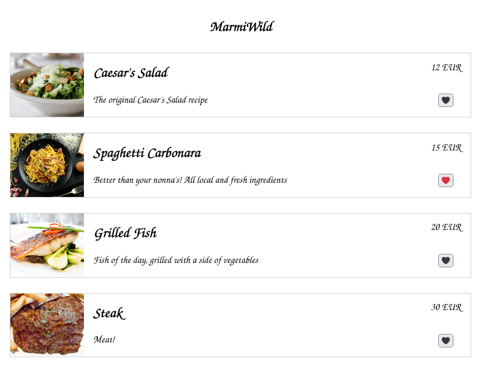
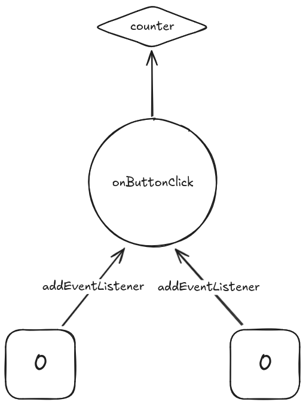
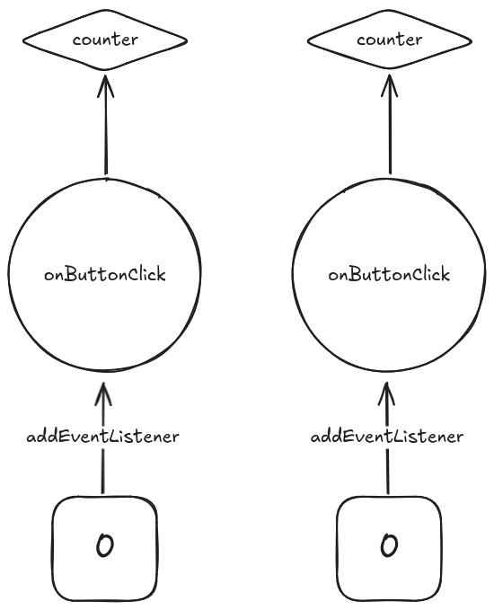

## Objectifs

* Découvrir la bibliothèque React
* Développer une interface web dynamique avec React

## Pré-requis

````stepper
# Connaitre les bases avancées du JS
```javascript
function say({ word, name }) {
  console.log(`${word} ${name}!`);
}

say({ word: "Hello", name: "World"});
```
# Être à l'aise avec les méthodes fonctionnelles des tableaux 
```javascript
const numbers = [1, 56, 35, 23, 45];

const halfNumbers = numbers.map(number => number / 2);

console.log(halfNumbers);

// Expected output : [0.5, 28, 17.5, 11.5, 22.5]

const numbers = [1, 2, 3, 4, 5];
const evenNumbers = numbers.filter(number => number % 2 === 0);

console.log(evenNumbers); 

// Expected output : [2, 4]
```
````

## Introduction

React est une bibliothèque JavaScript **open-source**, principalement utilisée pour construire des **interfaces utilisateurs (UI)**. Créée par Facebook en 2013, elle permet de développer des applications web interactives et performantes.

Dans cette quête, tu vas découvrir les concepts fondamentaux de React : les composants, les props, les states. Tu vas apprendre à manipuler ces concepts jusqu'à construire une application "simple".

## Sommaire

## Le brief

```xtext story
Hello 👋,

Notre restaurant local préféré, **MarmiWild**, a demandé notre aide pour son menu en ligne ! Nous avons pensé à toi pour relever le défi.



Une précision : tu dois utiliser React pour rendre l'interface web du menu dynamique. C'est l'occasion pour toi d'apprendre un nouvel outil. Tu trouveras une base de code en pièce jointe.

Bon courage et bonne journée 🙂,

L'équipe front.
```
````xtext callout
```jsx live
!--- App.js
import MenuList from './components/MenuList';

import './App.css';

const foodItems = [
  {
    id: 1,
    itemName: "Caesar's Salad",
    description: "The original Caesar's Salad recipe",
    foodImage: 'https://cdn.britannica.com/14/234014-050-CB842159/Caesar-salad-side-view.jpg',
    price: 12,
    isFavorite: false,
  },
  {
    id: 2,
    itemName: 'Spaghetti Carbonara',
    description: "Better than your nonna's! All local and fresh ingredients",
    foodImage: 'https://cdn.britannica.com/96/238196-050-C5560987/Plate-of-traditional-Italian-spaghetti-carbonara-surrounded-by-the-ingredients-use-to-make-it.jpg',
    price: 15,
    isFavorite: true,
  },
  {
    id: 3,
    itemName: 'Grilled Fish',
    description: 'Fish of the day, grilled with a side of vegetables',
    foodImage: 'https://cdn.britannica.com/38/235438-050-08E3AE20/Grilled-barramundi-steak-on-a-bed-of-vegetables.jpg',
    price: 20,
    isFavorite: false,
  },
  {
    id: 4,
    itemName: 'Steak',
    description: 'Meat!',
    foodImage: 'https://cdn.britannica.com/70/189770-050-AA419662/New-York-City-steak-Delmonico-rib-eyes.jpg',
    price: 30,
    isFavorite: false,
  }
];

function App() {
  return (
    <main>
      <h1>MarmiWild</h1>
      {/* pass the variable foodItems as props to MenuList component */}
      <MenuList />
    </main>
  );
};

export default App;
!--- App.css
body {
  max-width: 800px;
  margin: auto;
  padding: 1rem;
  font-family: "Grandstander", cursive;
}

h1 {
  text-align: center;
}

figure {
  margin: 0;
  grid-row: 1 / -1;
  place-self: stretch;
  display: flex;
}

figure img {
  width: 120px;
  height: 100%;
  object-fit: cover;
}

figure figcaption {
  padding-left: 15px;
}

.itemContainer {
  display: grid;
  grid-template-columns: 1fr auto;
  grid-template-rows: repeat(2, auto);
  place-items: center;
  border: 1px solid lightgrey;
  margin-top: 25px;
  padding-right: 1rem;
}
!--- components/MenuList.js
import MenuItem from './MenuItem';

function MenuList({ foodItems }) {
  console.log(foodItems);

  return (
    <>
      {/* render a MenuItem component for each element of the foodItems array */}
    </>
  );
}

export default MenuList;
!--- components/MenuItem.js
function MenuItem(props) {
  //create a state isFavorite that has the inital value of isFavorite that comes from the props

  return (
    <section className="itemContainer">
      <figure className="imgContainer">
        {/* the image will receive the url src from the props */}
        
        <figcaption>
          {/* the h2 will receive the item name from the props */}
          <h2>{}</h2>
          {/* the p will receive the item description from the props */}
          <p>{}</p>
        </figcaption>
      </figure>
      {/* the span will receive the item price from the props */}
      <aside>{} EUR</aside>

      {/* the button to play with the isFavorite state:
              - onClick, will toggle the isFavorite state,
              - content will be conditionally rendered as "❤️" or "🖤", depending on the value of isFavorite
          */}
      <button type="button">{}</button>
    </section>
  );
}

export default MenuItem;
```
````

## Une interface web dynamique

Une interface web dynamique est une interface qui s’adapte en temps réel à ce que fait l’utilisateur. Elle réagit instantanément sans devoir recharger toute la page, rendant l'expérience beaucoup plus fluide et agréable.

Dans les exemples qui vont suivre, nous allons interagir avec un bouton pour ajouter des articles à un panier et ainsi changer l’état de notre panier.

### Mais c’est quoi un état ?

Un état, c'est l'information qu'un composant garde en mémoire et qui peut changer au fil du temps : l'état "coché" d'une case à cocher par exemple. Dans un panier, l'état pourrait être le nombre de fois où un article a été ajouté. Chaque fois que cet état change, l'affichage du composant se met à jour pour montrer la nouvelle valeur.

```js live
!---index.js
let counter = 0;

function onButtonClick(event) {
  counter++;

  const button = event.target;
  button.innerHTML = "Nombre d'articles : " + counter;
}

const button = document.querySelector("button")
button.addEventListener("click", onButtonClick);
!---index.html
<!DOCTYPE html>
<html lang="en">
  <head>
    <title>WildShop</title>
  </head>
  <body>
    <p>Panier</p>
    <button type="button">Nombre d'articles : 0</button>
  </body>
</html>
```

```xtext arrow
Le document HTML contient un bouton et le code JS stocke un code à exécuter à chaque clic sur ce bouton : la fonction `onButtonClick`. La fonction `onButtonClick` incrémente la variable `counter` qui représente l'état du panier, et met à jour l'affichage du bouton.
```

J'ai tenté d'ajouter un système de "wishlist", mais quelque chose ne marche pas : si tu cliques sur tous les boutons, les états ont l'air de se mélanger...

```js live
!---index.js
let counter = 0;

const onButtonClick = (event) => {
  counter++;

  const button = event.target;
  button.innerHTML = "Nombre d'articles : " + counter;
}

for (const button of document.querySelectorAll("button")) {
  button.addEventListener("click", onButtonClick);
}
!---index.html
<!DOCTYPE html>
<html lang="en">
  <head>
    <title>WildShop</title>
  </head>
  <body>
    <p>Panier</p>
    <button type="button">Nombre d'articles : 0</button>
    <p>Liste de souhaits</p>
    <button type="button">Nombre d'articles : 0</button>
  </body>
</html>
```

Est-ce que tu vois mon erreur ?

````solution
Le code déclare une seule fonction `onButtonClick` et l'utilise avec tous les boutons. Cette fonction `onButtonClick` modifie toujours la même variable `counter`, peu importe le bouton que tu cliques : l'état `counter` est partagé par tous les boutons.



Voici une bonne version du code :

```js live
!---index.js
for (const button of document.querySelectorAll("button")) {
  let counter = 0;

  const onButtonClick = () => {
    counter++;

    button.innerHTML = "Nombre d'articles : " + counter;
  }

  button.addEventListener("click", onButtonClick);
}
!---index.html
<!DOCTYPE html>
<html lang="en">
  <head>
    <title>WildShop</title>
  </head>
  <body>
    <p>Panier</p>
    <button type="button">Nombre d'articles : 0</button>
    <p>Liste de souhaits</p>
    <button type="button">Nombre d'articles : 0</button>
  </body>
</html>
```

Ici, les déclarations de `counter` et de `onButtonClick` sont *dans la boucle* : elles sont répétées à chaque passage dans la boucle, donc une fois pour chaque bouton. De cette manière, chaque bouton a sa propre variable `counter` et sa propre fonction `onButtonClick`.


````

C'est ainsi que tu dois commencer à penser tes applications : comme des "briques" d'affichage, où chaque brique est associée à une logique (les instructions de `onButtonClick`) et à un état (la variable `counter`).

Dans notre exemple, chaque bouton gère son propre état `counter`, et chaque mise à jour de cet état se répercute sur l'affichage du bouton. Actuellement, le code du `<button>` dans `index.html` est séparé de sa logique et de son état dans `index.js` : avec React, tu peux créer des *composants* qui regroupent l'affichage, la logique et l'état dans une même "capsule". Cela simplifie la gestion pour une application complexe.

```xtext story
**React** (aussi appelé **React.js** ou **ReactJS**) est une **bibliothèque open source JavaScript** pour créer des interfaces utilisateurs. Elle est maintenue par **Meta** (anciennement **Facebook**) ainsi que par une communauté de développeurs individuels et d'entreprises **depuis 2013**.

Le but principal de cette bibliothèque est de faciliter la création d'application web monopage, via la création de composants dépendant d'un état et générant une page (ou portion) HTML à chaque changement d'état.

React est une bibliothèque qui ne gère que l'interface de l'application [...]
```

Source : https://fr.m.wikipedia.org/wiki/React

### Démarrer avec React

La meilleure façon de démarrer avec React est de parcourir la **documentation officielle**. Tu y trouveras tout ce que tu dois savoir, expliqué par l'équipe de développement de React elle-même, et — chose rare — traduit en français par la communauté :


````resource
https://fr.react.dev/learn
# Best. Doc. Ever.
````

Pour mettre en pratique ce que tu liras dans la doc de React, nous te proposons un parcours de quêtes pour réaliser pas à pas une application. Le parcours commence avec cette quête : 

```quests
2328
```

### Composer ton interface

Les composants sont les briques de base dans React. Je te conseille ces chapitres de la doc pour te familiariser avec le concept, avec notre quête dédiée :

````columns

```resource
https://fr.react.dev/learn/your-first-component
Votre premier composant
```

```resource
https://fr.react.dev/learn/importing-and-exporting-components
Importer et exporter des composants
```
!---
```quests
2332
```
````

Pour continuer, tu dois apprendre à utiliser la syntaxe JSX :

````columns
```resource
https://fr.react.dev/learn/writing-markup-with-jsx
Écrire du balisage avec JSX
```

```resource
https://fr.react.dev/learn/javascript-in-jsx-with-curly-braces
JavaScript dans JSX grâce aux accolades
```
!---
```quests
2336
```
````

### Props and State

Les *props* et le *state* sont les outils principaux pour dynamiser ton affichage.

Regarde ce code HTML :

```html

```

Que se passe-t-il en interne dans la balise `img` ? Si tu devais coder un composant `Img` en React, le code ressemblerait à ceci :

```jsx
function Img(/* src et alt seraient accessibles ici */) {
  return (
    // ton affichage en fonction de src et alt
  );
}
```

Pour s'afficher, ton composant a besoin de *recevoir* des valeurs pour les attributs `src` et `alt` : c'est le système des **props**. Plus d'informations par ici :

````columns
```resource
https://fr.react.dev/learn/passing-props-to-a-component
Passer des props à un composant
```
!---
```quests
2374, 2375
```
````

Maintenant, regardons ensemble un autre code HTML :

```html
<input type="checkbox" checked />
```

La balise `input` qui s'afficherait avec ce code recevrait un type `checkbox` pour déterminer le type d'affichage du champs. L'attribut `checked` cocherait la case par défaut pour le *premier affichage*. Ensuite, une personne pourrait cliquer sur la case pour la décocher/recocher. Ta case à cocher garde en mémoire un *état* qui dépend des actions de l'utilisateur.

Un composant `Input` en React pourrait ressembler à ceci :

```jsx
function Input({ type, checked: initialValue }) {
  // utilse un state à l'intérieur du composant

  return (
    // ton affichage en fonction du state
  );
}
```

À toi d'explorer le sujet :

````columns
```resource
https://fr.react.dev/learn/state-a-components-memory
L'état : la mémoire d'un composant
```
!---
```quests
2376
```
````

### Répéter avec .map()

Dans une application, tu pourras répéter un composant avec des données différentes envoyées dans les props :

```jsx
const pokemonList = [/* ... */];

function App() {
  return (
    <>
      <Pokemon data={pokemonList[0]} />
      <Pokemon data={pokemonList[1]} />
      <Pokemon data={pokemonList[2]} />
      <Pokemon data={pokemonList[3]} />
      <Pokemon data={pokemonList[4]} />
    </>
  );
}
```

Pour ce genre de code, tu peux avoir envie d'utiliser une boucle. Quelque chose comme ça :

```jsx
const pokemonList = [/* ... */];

function App() {
  return (
    <>
      for (const pokemon of pokemonList) {
        <Pokemon data={pokemon} />
      }
    </>
  );
}
```

```xtext arrow
MAIS derrière le mot-clé `return` tu dois écrire une *expression* : quelque chose qui peut être remplacé par une *valeur*. Le mot-clé `for` est une *instruction* : dans ce contexte, disons que c'est le contraire d'une expression. Bref, la construction `return for` est impossible en JS.
```

Alors comment répéter un morceau d'affichage sans instruction, uniquement avec des expressions ? De base, JS fournit des outils que tu peux utiliser pour afficher des listes dans un composant React :

````columns
```resource
https://fr.react.dev/learn/rendering-lists
Afficher des listes
```
!---
```quests
2378
```
````

### Aller plus loin

Si tu as un peu de temps libre, tu peux compléter ton pokédex en étudiant les différentes manières d'utiliser du CSS avec React :

```quests
1795
```

## Challenge

```alert-warning
Le codesandbox que tu as reçu est en JS, pas en TS : tu n'auras pas à typer les choses, mais c'est toi qui devras vérifier la cohérence de ton code.
```

Tout d'abord, fork la base de code que tu as reçue :

```jsx live
!--- App.js
import MenuList from './components/MenuList';

import './App.css';

const foodItems = [
  {
    id: 1,
    itemName: "Caesar's Salad",
    description: "The original Caesar's Salad recipe",
    foodImage: 'https://cdn.britannica.com/14/234014-050-CB842159/Caesar-salad-side-view.jpg',
    price: 12,
    isFavorite: false,
  },
  {
    id: 2,
    itemName: 'Spaghetti Carbonara',
    description: "Better than your nonna's! All local and fresh ingredients",
    foodImage: 'https://cdn.britannica.com/96/238196-050-C5560987/Plate-of-traditional-Italian-spaghetti-carbonara-surrounded-by-the-ingredients-use-to-make-it.jpg',
    price: 15,
    isFavorite: true,
  },
  {
    id: 3,
    itemName: 'Grilled Fish',
    description: 'Fish of the day, grilled with a side of vegetables',
    foodImage: 'https://cdn.britannica.com/38/235438-050-08E3AE20/Grilled-barramundi-steak-on-a-bed-of-vegetables.jpg',
    price: 20,
    isFavorite: false,
  },
  {
    id: 4,
    itemName: 'Steak',
    description: 'Meat!',
    foodImage: 'https://cdn.britannica.com/70/189770-050-AA419662/New-York-City-steak-Delmonico-rib-eyes.jpg',
    price: 30,
    isFavorite: false,
  }
];

function App() {
  return (
    <main>
      <h1>MarmiWild</h1>
      {/* pass the variable foodItems as props to MenuList component */}
      <MenuList />
    </main>
  );
};

export default App;
!--- App.css
body {
  max-width: 800px;
  margin: auto;
  padding: 1rem;
  font-family: "Grandstander", cursive;
}

h1 {
  text-align: center;
}

figure {
  margin: 0;
  grid-row: 1 / -1;
  place-self: stretch;
  display: flex;
}

figure img {
  width: 120px;
  height: 100%;
  object-fit: cover;
}

figure figcaption {
  padding-left: 15px;
}

.itemContainer {
  display: grid;
  grid-template-columns: 1fr auto;
  grid-template-rows: repeat(2, auto);
  place-items: center;
  border: 1px solid lightgrey;
  margin-top: 25px;
  padding-right: 1rem;
}
!--- components/MenuList.js
import MenuItem from './MenuItem';

function MenuList({ foodItems }) {
  console.log(foodItems);

  return (
    <>
      {/* render a MenuItem component for each element of the foodItems array */}
    </>
  );
}

export default MenuList;
!--- components/MenuItem.js
function MenuItem(props) {
  //create a state isFavorite that has the inital value of isFavorite that comes from the props

  return (
    <section className="itemContainer">
      <figure className="imgContainer">
        {/* the image will receive the url src from the props */}
        
        <figcaption>
          {/* the h2 will receive the item name from the props */}
          <h2>{}</h2>
          {/* the p will receive the item description from the props */}
          <p>{}</p>
        </figcaption>
      </figure>
      {/* the span will receive the item price from the props */}
      <aside>{} EUR</aside>

      {/* the button to play with the isFavorite state:
              - onClick, will toggle the isFavorite state,
              - content will be conditionally rendered as "❤️" or "🖤", depending on the value of isFavorite
          */}
      <button type="button">{}</button>
    </section>
  );
}

export default MenuItem;
```

Ensuite, suis ces étapes :

```stepper
# Dans le composant App
Passe la variable `foodItems` en props à `MenuList`.
# Dans le composant MenuList
Affiche un composant `MenuItem` pour chaque élément du tableau et transmets toutes les propriétés de l'objet en tant que props.
# Dans le composant MenuItem
Accède à chaque *props* pour afficher le nom, l'image, la description et le prix de l'item.
# Dans le composant MenuItem
Crée un état `isFavorite` qui aura une valeur initiale définie sur `props.isFavorite`.
# Dans le composant MenuItem
Crée une fonction `handleClickFavorite` qui fera passer l'état `isFavorite` de vrai à faux.
# Dans le composant MenuItem
À l'intérieur du `button` favori, appelle la méthode `handleClickFavorite` lorsqu'un événement de clic se produit.
# Dans le composant MenuItem
Sur le même `button`, modifie conditionnellement le contenu, en fonction de l'état `isFavorite`.
```

Partage le lien de ton fork en solution.

### Critères de validation

* [ ] l'application affiche correctement les éléments du menu ;
* [ ] quand tu cliques sur l'image du coeur, elle passe de favorite à non favorite.

Une solution possible :

```jsx live
!--- App.js
import MenuList from './components/MenuList';

import './App.css';

const foodItems = [
  {
    id: 1,
    itemName: "Caesar's Salad",
    description: "The original Caesar's Salad recipe",
    foodImage: 'https://cdn.britannica.com/14/234014-050-CB842159/Caesar-salad-side-view.jpg',
    price: 12,
    isFavorite: false,
  },
  {
    id: 2,
    itemName: 'Spaghetti Carbonara',
    description: "Better than your nonna's! All local and fresh ingredients",
    foodImage: 'https://cdn.britannica.com/96/238196-050-C5560987/Plate-of-traditional-Italian-spaghetti-carbonara-surrounded-by-the-ingredients-use-to-make-it.jpg',
    price: 15,
    isFavorite: true,
  },
  {
    id: 3,
    itemName: 'Grilled Fish',
    description: 'Fish of the day, grilled with a side of vegetables',
    foodImage: 'https://cdn.britannica.com/38/235438-050-08E3AE20/Grilled-barramundi-steak-on-a-bed-of-vegetables.jpg',
    price: 20,
    isFavorite: false,
  },
  {
    id: 4,
    itemName: 'Steak',
    description: 'Meat!',
    foodImage: 'https://cdn.britannica.com/70/189770-050-AA419662/New-York-City-steak-Delmonico-rib-eyes.jpg',
    price: 30,
    isFavorite: false,
  }
];

function App() {
  return (
    <main>
      <h1>MarmiWild</h1>
      {/* pass the variable foodItems as props to MenuList component */}
      <MenuList foodItems={foodItems} />
    </main>
  );
};

export default App;
!--- App.css
body {
  max-width: 800px;
  margin: auto;
  padding: 1rem;
  font-family: "Grandstander", cursive;
}

h1 {
  text-align: center;
}

figure {
  margin: 0;
  grid-row: 1 / -1;
  place-self: stretch;
  display: flex;
}

figure img {
  width: 120px;
  height: 100%;
  object-fit: cover;
}

figure figcaption {
  padding-left: 15px;
}

.itemContainer {
  display: grid;
  grid-template-columns: 1fr auto;
  grid-template-rows: repeat(2, auto);
  place-items: center;
  border: 1px solid lightgrey;
  margin-top: 25px;
  padding-right: 1rem;
}
!--- components/MenuList.js
import MenuItem from './MenuItem';

function MenuList({ foodItems }) {
  console.log(foodItems);

  return (
    <>
      {/* render a MenuItem component for each element of the foodItems array */}
      {foodItems.map((foodItem) => (
        <MenuItem
          key={foodItem.id}
          itemName={foodItem.itemName}
          description={foodItem.description}
          foodImage={foodItem.foodImage}
          price={foodItem.price}
          isFavorite={foodItem.isFavorite}
        />
      ))}
    </>
  );
}

export default MenuList;
!--- components/MenuItem.js
import { useState } from "react";

function MenuItem(props) {
  //create a state isFavorite that has the inital value of isFavorite that comes from the props
  const [isFavorite, setIsFavorite] = useState(props.isFavorite);

  return (
    <section className="itemContainer">
      <figure className="imgContainer">
        {/* the image will receive the url src from the props */}
        
        <figcaption>
          {/* the h2 will receive the item name from the props */}
          <h2>{props.itemName}</h2>
          {/* the p will receive the item description from the props */}
          <p>{props.description}</p>
        </figcaption>
      </figure>
      {/* the span will receive the item price from the props */}
      <aside>{props.price} EUR</aside>

      {/* the button to play with the isFavorite state:
              - onClick, will toggle the isFavorite state,
              - content will be conditionally rendered as "❤️" or "🖤", depending on the value of isFavorite
          */}
      <button
        type="button"
        onClick={() => setIsFavorite(!isFavorite)}
      >
        {isFavorite ? "❤️" : "🖤"}
      </button>
    </section>
  );
}

export default MenuItem;
```