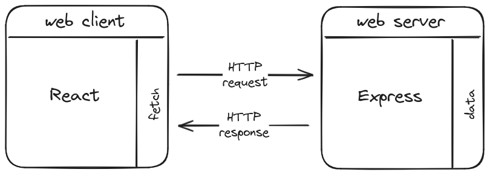
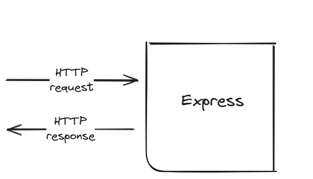

## Objectifs

* Découvrir Express.js et **comprendre son rôle** dans le développement d'applications web.
* Créer une application avec Express.js.

## Pré-requis

````stepper
# Valider les quêtes suivantes
```quests
1555, 1334
```
# Garder en tête la notion de callback
```xtext story
Une fonction de rappel (callback) est une fonction passée en paramètre d'une autre fonction.
```

Par exemple, dans cet extrait de code, `handleClick` est un callback :
```javascript
function handleClick() {
  alert("you clicked!");
}

button.addEventListener("click", handleClick);
```
# Identifier le callback dans cet extrait de code
```javascript
function sayGoodBye() {
  console.log("Goodbye!");
}

greet("Alice", sayGoodBye);
```

```solution
La fonction `sayGoodBye` est le callback. Dans cet exemple, la fonction `sayGoodBye` est exécutée par la fonction `greet`.
```
````

## Sommaire

## L'architecture client-serveur du web

Tu as peut-être déjà vu un schéma de ce genre ?


Il représente l'architecture client-serveur du web : le client web (navigateur web, mobile...) envoie une requête HTTP à un serveur web ; le serveur web traite la requête et retourne une réponse HTTP (le contenu HTML d'une page par exemple).

Cette représentation est un peu simple, et ne montre pas la place des différents outils comme React notamment. Je te propose une version alternative :



Dans ce schéma, le client web est constitué de 2 "parties" :

* React qui permet de produire un affichage, et de capter les interactions de l'utilisateur.
* Une brique qui permet de communiquer avec l'extérieur, à travers le système de requête/réponse HTTP. Ici, c'est la fonction `fetch` qui est une API pour effectuer des requêtes HTTP côté client.

Le serveur web est constitué de 2 "parties" :

* Un bloc Express, dont le but est de recevoir la requête HTTP et de remplir la réponse HTTP pour son client.
* Les données, qui peuvent être stockées directement sur le serveur web, ou sur un autre serveur : un serveur de base de données.

```xtext callout
Ce schéma présente une "stack", une chaine d'outils, parmi d'autres : tu pourrais utiliser d'autres outils à la place de React et d'Express.

Mais l'idée générale avec du **code exécuté côté client** et du **code exécuté côté serveur** existera toujours sous une forme ou une autre.

Quels que soient les outils, c'est la définition fondamentale du web. Cette architecture est utilisée dans les sites e-commerce, les réseaux sociaux... tous les sites que tu consultes chaque jour. 
```

Lors du développement d'applications web et mobiles, comprendre l'interaction entre le client et le serveur est important. Cette compréhension permet de structurer efficacement les applications et d'optimiser les échanges de données.

L'architecture client-serveur est un modèle fondamental dans le développement d'applications web, où les clients font des requêtes au serveur (**REQUEST**), qui traite ces requêtes et renvoie les réponses appropriées (**RESPONSE**).

### Le Rôle du Client

Le client peut être un navigateur web, une application mobile, ou tout autre dispositif capable d'**envoyer des requêtes à un serveur**. Le client est l'interface à travers laquelle tu interagis avec le web : sans lui, tu ferais tes requêtes HTTP "à la main" dans un terminal avec ce genre de commandes :

```
curl https://fr.wikipedia.org/wiki/Wikip%C3%A9dia:Accueil_principal
```

```xtext callout
La commande `curl` est aussi un exemple de client web. C'est l'équivalent en ligne de commande de la barre d'URL de ton navigateur.
```

Lorsqu'un utilisateur effectue une action nécessitant des données (par exemple, afficher une liste d'articles), le client envoie une requête au serveur pour obtenir ces données.

### Le Rôle du Serveur

Le serveur est responsable de la réception des requêtes du client, et de l'envoi des réponses au client. Pour produire une réponse, le serveur exécutera une action "sur mesure" en fonction de la requête. Cette action peut impliquer d'interroger une base de données par exemple.

Le serveur web agit comme un intermédiaire entre le client et le web, s'assurant que les bonnes actions sont déclenchées, et de manière sécurisée.

Si tu souhaites en savoir plus sur les serveurs web :

```resource
https://developer.mozilla.org/fr/docs/Apprendre/Qu_est-ce_qu_un_serveur_web
Qu'est-ce qu'un serveur web ?
```

## Zoom sur Express

Express est la pièce du puzzle qui nous intéresse aujourd'hui :



Express.js (ou plus simplement Express) est un [framework](https://fr.wikipedia.org/wiki/Framework) minimaliste pour [Node.js](https://nodejs.org/) qui permet de créer des applications web et des APIs en JavaScript.

Express simplifie le développement de code serveur en gérant les requêtes HTTP et en intégrant de nombreux outils pour tracer le chemin entre la requête et la réponse. Cela inclut analyser les URLs, choisir les routes appropriées...

### Pourquoi utiliser Express ?

* **Simplicité et flexibilité :** Express offre une approche **minimaliste** du développement web, te permettant de choisir les outils et les bibliothèques que tu souhaites intégrer.

* **Rapidité de développement :** grâce à sa structure minimaliste, tu peux mettre en place une **API robuste en quelques lignes de code**.

* **Communauté et support :** c'est l'**un des frameworks les plus utilisés dans l'écosystème `node`**, et il bénéficie d'une grande communauté et d'une vaste gamme de ressources d'apprentissage.

* **Performances :** Express est conçu pour offrir une **gestion efficace** des requêtes et des réponses HTTP.

## Créer une application Express

```xtext callout
Tu peux suivre la [documentation d'Express](https://expressjs.com/) pour te familiariser avec ses explications : c'est la ressource de référence où tu trouveras les meilleures infos à jour. Tu peux aussi continuer à lire cette quête si tu le souhaites.
```

````stepper nonLinear
# Créé un nouveau répertoire
Créé un nouveau répertoire pour contenir ton application, et déplace-toi dedans :

```
mkdir hello-express
cd hello-express
```
# Initialise un module 
Créé un fichier `package.json` pour ton application :

```
npm init -y
```

Ajoute la propriété `"type": "module"` dans ton `package.json` :

```diff
{
  "name": "hello-express",
+  "type": "module",
  "version": "1.0.0",
  "main": "index.ts",
  "scripts": {
    "test": "echo \"Error: no test specified\" && exit 1"
  },
  "keywords": [],
  "author": "",
  "license": "ISC",
  "description": ""
}
```

```xtext callout
Pour rappel, c'est cette ligne qui te permet d'utiliser les instructions `import` et `export` à la place des syntaxes CommonJS `require` et `module.exports`.
```

# Installe Express (et d'autres choses)
Via `npm` en utilisant la commande suivante dans ton terminal :

```
npm install express 
```

C'est également le bon ce moment pour installer **TypeScript** (plus exactement le module *TypeScript Execute* qui simplifie l'exécution de TypeScript par rapport au compilateur TypeScript classique, voir https://tsx.is/) et les **déclaration des types pour Express** :

```
npm install --save-dev tsx @types/express
```

# Crée une application Express
Crée un fichier `index.ts` dans ton dossier `hello-express`, et copie ce code à l'intérieur :

```typescript
import express from "express";

const app = express();

app.get("/", (req, res) => {
  res.send("Hello World!");
});

const port = 3310;

app.listen(port, () => {
  console.log(`Example app listening on port ${port}`);
});
```

Ce code crée un serveur Express qui écoute les requêtes sur le port `3310` et répond par un message `"Hello World!"` à toute requête de type `GET` à la racine `/` du serveur web.

# Démarre le serveur
Avant de relire ce code ensemble, lance ton application avec la commande suivante dans ton terminal :

```
npx tsx --watch index.ts
```

```alert-warning
Le port `3310` peut être déjà utilisé par une autre application sur ta machine. Si c'est le cas, essaie une autre valeur (`8080` ?) et sauvegarde ton fichier : l'application redémarrera automatiquement.
```

```alert-info
L'option `--watch` provoque le redémarrage de l'application à chaque modification d'un fichier.

Sans l'option `--watch`, si tu modifies ton fichier, par exemple pour changer le message `"Hello World!"` *après* avoir lancé la commande `npx tsx index.ts`, ton application ne redémarrera pas automatiquement. Tu devras arrêter le serveur avec `Ctrl + C` et le relancer à chaque fois que tu apporteras des modifications à ton fichier.
```

```xtext arrow
Pour la culture, Avant que l'option `--watch` soit disponible dans node, une pratique courante dans un projet Express était d'installer le package [nodemon](https://nodemon.io/) pour redémarrer automatiquement le serveur à chaque modification du code.
```

Maintenant tu peux ouvrir ton navigateur à l'adresse http://localhost:3310/ (change le 3310 dans l'URL si tu as utilisé un autre port) pour voir le message `"Hello World!"` s'afficher.
````

## Retour sur le code

Pour mieux comprendre comment fonctionne notre application Express, examinons le code, étape par étape.

### Création de l'application Express

Tout d'abord, nous importons le module Express et initialisons une application. Cela crée notre application Express de base :

```typescript
import express from "express";

const app = express();
```

Ce code doit être écrit ainsi, sans raison particulière : c'est le fonctionnement d'Express qui nous l'impose.

Cette partie pourrait contenir beaucoup plus de lignes sur la configuration de l'application. Tu les découvriras au fur et à mesure de ton apprentissage. L'application "basique" nous suffit à ce stade.

### Déclaration d'une route

Ensuite, nous définissons une route à la racine `/` de notre application. Lorsqu'un utilisateur accède à cette route via une requête HTTP `get`, notre application renvoie la réponse `"Hello World!"` :

```typescript
app.get("/", (req, res) => {
  res.send("Hello World!");
});
```

Une autre façon d'écrire le code pour mieux faire ressortir les informations de la ligne `app.get()` :

```typescript
const sayHello = (req, res) => {
  res.send("Hello World!");
};

app.get("/", sayHello);
```

La méthode `app.get()` attend deux arguments :

* le chemin de la route (dans notre cas, `"/"`) ;
* un callback qui spécifie ce que notre application doit faire quand une requête est envoyée au serveur à la racine `/` avec la méthode `get`.

Dis autrement, chaque fois que tu envoies une requête GET à la racine de ton serveur (c'est ce que tu fais en ouvrant l'adresse http://localhost:3310 dans ton navigateur), l'application express exécute les instructions de `sayHello`.

Tu l'as peut-être deviné : les paramètres `req` et `res` du callback `sayHello` représentent la requête HTTP que tu vas recevoir et la réponse HTTP que tu dois remplir. Ce sont des objets fournis automatiquement par Express (voir la documentation des objets [Request](https://expressjs.com/en/4x/api.html#req) et [Response](https://expressjs.com/en/4x/api.html#res)).

Dans cet exemple, avec l'instruction :

```typescript hl[2]
const sayHello = (req, res) => {
  res.send("Hello World!");
};

app.get("/", sayHello);
```

Nous répondons avec la chaîne de caractères `"Hello World!"` en utilisant la méthode `res.send()`.

````alert-info
Dans le contexte d'Express, la fonction callback `sayHello` est appellée un **middleware**. C'est un terme que tu verras en détail plus tard dans ton parcours. Retiens pour l'instant que le mot "middleware" fait partie du vocabulaire d'Express : c'est une fonction de rappel (callback) qui prend en paramètres une requête et une réponse HTTP. Dis en code :

```typescript
// Ce callback avec des paramètres req et res est un middleware Express

(req, res) => {
  /* ... */
}
```
````

Dans tes projets, tu répondras plus souvent avec un objet ou un tableau formaté en JSON. Ton code utiliserait alors la méthode `res.json()` à la place de `res.send()` :

```typescript
const walterWhite = { sayMyName: "Heisenberg" };

const youKnowWhoIAm = (req, res) => {
  res.json(walterWhite);
};

app.get("/who-are-you", youKnowWhoIAm);
```

````xtext callout
Peu importe la logique de ta route ou le contenu de ta réponse, la déclaration d'une route suit toujours ce schéma : associer un callback à un verbe HTTP (GET, POST...) et un chemin d'URL. Prends le temps de déchiffrer cette syntaxe car tu vas la reproduire très souvent : 

```typescript
const someCallback = (req, res) => {
  // do something, and use res.send() or res.json()
};

app.get("/some-url-path", someCallback);
```
````

### Écoute du port

Dernière partie dans `index.ts`, nous spécifions le port sur lequel notre application Express écoutera les requêtes entrantes. Une fois que le serveur est en écoute sur ce port, il peut recevoir et répondre aux requêtes HTTP *pour les routes qui ont été définies sur l'application* :

```typescript
const port = 3310;

app.listen(port, () => {
  console.log(`Example app listening on port ${port}`);
});
```

````xtext callout
Si tu veux te rendre compte de l'intérêt d'Express pour créer une application serveur, tu peux regarder cette quête supplémentaire sur comment créer un serveur *sans* Express.

C'est un bonus pour ta culture, et tu n'en auras pas besoin pendant la formation.

```quests
383
```
````

## Challenge

Crée un nouveau projet qui crée une application Express dans un fichier `index.ts`, et qui déclare une route `GET /words`.

Ta route doit répondre avec le tableau de données suivant au format JSON :

```typescript
const data = ["lorem", "ipsum", "dolor", "sit", "amet"];
```

Poste le contenu de ton fichier `index.ts` en solution.


## Critères de validations

* [ ] Le code crée une application Express
* [ ] Le code déclare une route `GET /words`
* [ ] La route répond avec le tableau `data` au format JSON

````tabs files
!--- index.ts

```typescript
import express from "express";

const app = express();

const data = ["lorem", "ipsum", "dolor", "sit", "amet"];

app.get("/words", (req, res) => {
  res.json(data);
});

const port = 3310;

app.listen(port, () => {
  console.log(`Example app listening on port ${port}`);
});
```
````