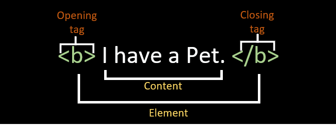

## Objectifs

* Maitriser le texte en HTML.
* Utiliser correctement les balises de titre.
* Donner du sens et de la sémantique à ton texte.

## Pré-requis

````stepper
# Valider la quête suivante
```quests
2113
```
# Être à l'aise avec la syntaxe des balises HTML

````

## Introduction

Précédemment, tu as vu les principes de bases du langage HTML.

Dans cette quête nous allons aller plus en profondeur sur le texte en HTML. Nous verrons comment utiliser des balises pour lui donner du sens, comment structurer des **titres**, des **citations** et pleins de nouvelles balises qui vont améliorer la sémantique de tes pages web !

## Sommaire

## Les balises de titrages

Nous l'avons vu dans les quêtes précédentes, il existe **6 balises de titrages différentes** : de `<h1>` à `<h6>`.

Ces balises sont utiles pour définir si l'élément est **un titre, un sous-titre, ou un sous sous-titre, etc, etc...**

```html
<!-- Titre principal de la page -->
<h1>Apprendre le HTML en s'amusant</h1>

<p>Le HTML est un langage de balisage qui permet de structurer le contenu d'une page web. Le plus souvent, il est associé au CSS pour gérer l'aspect visuel des pages web.</p>

<!-- Sous-titre -->
<h2>Chapitre 1 : Les balises de base</h2>

<!-- Sous sous-titre -->
<h3>1.1 Les différentes balises</h3>

<p>On appelle balise tout mot clé entouré de deux < >. Les balises permettent de structurer le contenu d'une page web en lui donnant un sens. </p>
```

Tu dois **garder une cohérence** dans la hiérarchie de tes titres. C'est-à-dire ne pas faire de titre principal `<h1>` suivi d'un titre secondaire `<h2>` puis d'un titre principal `<h1>` à nouveau. Ou bien utiliser un `<h3>` pour le titre principal, ou de passer de `<h1>` à `<h3>` directement. 

Également une page web ne devrait avoir **qu'un seul titre principal**, donc qu'une seule balise `<h1>`.

Il existe deux raisons principales à cela:

* C'est mieux pour le référencement des pages.
* C'est plus accessible pour les personnes qui utilisent des lecteurs d'écran, comme les personnes malvoyantes par exemple.

````xtext arrow
**🎯 À toi de jouer !**

Exerce-toi sur les titres. Voici un article sur les chats : cet article ne contient que du texte brut. À toi d'utiliser les bonnes balises HTML pour les titres :

```html
Qui sont les chats ?

Les chats sont les membres de la famille des félins, et ils partagent de nombreuses caractéristiques avec leurs cousins ​​les lions, les tigres et les panthères. Les chats domestiques sont les plus populaires au monde et sont adorés par des millions de personnes pour leur compagnie et leur affectueuse nature.

Quelle est l'histoire des chats ?


Les premiers chats domestiques

Les chats sont originaires d'Afrique, d'Asie et d'Europe, et ils ont été domestiqués il y a environ 9 000 ans. Les premiers chats domestiques étaient probablement des chats sauvages qui se sont approchés des humains pour profiter de leur nourriture. Au fil du temps, les chats et les humains ont développé une relation symbiotique, et les chats ont été apprivoisés et domestiqués.

La domestication des chats en Europe

Les chats ont été introduits en Europe au Moyen Âge, où ils ont été utilisés pour chasser les rats et les souris. Les nobles européens ont rapidement adopté les chats comme animaux de compagnie, et ils ont été très appréciés pour leur beauté et leur personnalité. Au fil du temps, les chats ont été introduits dans d'autres parties du monde, et ils ont rapidement gagné en popularité.


Quelles sont les caractéristiques des chats ?

Les chats sont des animaux très intelligents et ils ont un sens aigu de l'observation. Ils sont également très flexibles, et ils peuvent se contorsionner pour atteindre des endroits inaccessibles. Les chats sont capables de sauter jusqu'à cinq fois leur hauteur, et ils peuvent courir à des vitesses allant jusqu'à 45 km/h.

Les chats ont une excellente vision nocturne, et ils sont très sensibles aux mouvements. Ils ont également un excellent sens de l'odorat, et ils peuvent détecter des odeurs à des distances allant jusqu'à 100 mètres. 
```

N'oublie pas de créer un nouveau document HTML, d'ajouter la structure, et de bien remplir la balise `<head>` comme nous l'avons vu précédemment.
````

## Mettre en avant du texte 

Tu peux utiliser plusieurs balises pour mettre en évidence du texte, **en fonction de la manière dont tu veux mettre le texte en avant**.

Voyons quelques exemples concrets.

### Emphase

La balise `<em>` est utilisée pour marquer **l'emphase d'un texte**. 

Par exemple dans la phrase :

```xtext story
Les chats sont les membres de la famille des *félins*, et ils partagent de nombreuses caractéristiques avec leurs cousins ​​les lions, les tigres et les panthères.
```

Le mot "félins" est marqué avec insistance, et tu peux le mettre en avant avec la balise `<em>`. Le texte s'affichera **en italique** sur la plupart des navigateurs, et sera lu par les lecteurs d'écran comme un élément remarquable. 

```html
Les chats sont les membres de la famille des <em>félins</em>, et ils partagent de nombreuses caractéristiques avec leurs cousins ​​les lions, les tigres et les panthères.
```

### Importance 

Lorsqu'un texte est **important**, tu peux utiliser la balise `<strong>` pour le mettre en avant.

Par exemple dans la phrase :

```xtext story
Les **chats** sont les membres de la famille des félins, et ils partagent de nombreuses caractéristiques avec leurs cousins ​​les lions, les tigres et les panthères.
```

Le mot "chats" est très important, et tu peux le mettre en avant avec la balise `<strong>`. Le texte s'affichera en gras sur la plupart des navigateurs, et sera lu par les lecteurs d'écran comme un élément important. 


```html
Les <strong>chats</strong> sont les membres de la famille des félins, et ils partagent de nombreuses caractéristiques avec leurs cousins ​​les lions, les tigres et les panthères.
```

```xtext arrow
**🎯 À toi de jouer !**

Reprends le document que tu as créé avec le texte sur les chats, et ajoute de l'emphase et de l'importance sur les passages pertinants.
```

### Gras, Italique et soulignement

Tu as peut-être déjà vu ou tu verras peut-être à l'avenir les balises `<b>`,  `<i>` ou `<u>`, pour mettre du texte en gras, en italique ou souligner du texte.

Ces balises **doivent être évitées** pour des raisons d'accessibilité et de référencement car elles ne donnent aucune sémantique. Elles changent **uniquement le style des éléments.**

Si tu veux afficher du texte en gras, italique ou souligné pour des questions esthétiques, tu dois passer par du CSS (que nous verrons dans de prochaines quêtes). 

Également, le texte souligné est associé à des liens hypertextes. Tu dois donc éviter d'utiliser cette balise pour souligner du texte, car tes utilisateurs pourraient penser qu'il s'agit d'un lien.

## Bloc de citation

Tu peux réaliser des blocs de citations en HTML en utilisant la balise `<blockquote>`.

Tu peux ajouter l'attribut `cite` avec en valeur le lien de la source de la citation :

```html
<blockquote cite="https://fr.wikipedia.org/wiki/Chat">
  Les chats sont les membres de la famille des félins, et ils partagent de nombreuses caractéristiques avec leurs cousins ​​les lions, les tigres et les panthères.
</blockquote>
```

```xtext arrow
**🎯  À toi de jouer !**

Cherche une citation sur internet et ajoute la sur ta page. 
```

## Abréviations

Tu peux indiquer des abréviations en HTML en utilisant la balise `<abbr>` :

```html
<abbr title="World Wide Web">WWW</abbr>
```

```xtext arrow
**🎯  À toi de jouer !**

Ajoute les abréviations sur "km" et "h" dans la phrase "Ils sont également très flexibles, et ils peuvent se contorsionner pour atteindre des endroits inaccessibles. Les chats sont capables de sauter jusqu'à cinq fois leur hauteur, et ils peuvent courir à des vitesses allant jusqu'à 45 km/h." 
```

## Extrait de code 

Tu peux indiquer qu'un bloc contient du code dans un langage de programmation avec la balise `<pre>` suivi de la balise `<code>`. 

La balise `<pre>` est utilisée pour les textes dont le formatage typographique affecte le sens du contenu, comme des poèmes, de l'art ASCII, des transcriptions et, bien sûr, des exemples de code informatique.

**Attention:** Si tu essaies d'écrire du code HTML dans ton document HTML, ton navigateur va l'interpréter comme du code HTML. 

Pour éviter cela,  remplace tous les caractères "&" par `&amp;`, tous les "<" par `&lt;`, tous les ">" par `&gt;` et tous les """ par `&quot;` pour obtenir une version encodée en entités HTML.

Par exemple :

```html
<pre>
    <code>
&lt;h1&gt;Hello, world&lt;/h1&gt;
&lt;h2&gt;Welcome to my Website&lt;/h2&gt;
    </code>
</pre>
```

```xtext arrow
**🎯 À toi de jouer !**

Ajoute un bloc de code à la fin de ton article pour essayer ces balises. 
```

## Récapitulatif

* En HTML, la sémantique est très importante : utiliser la bonne balise est nécessaire pour des raisons d'accessibilités et de SEO. 

* Pense à toujours utiliser la bonne hiérarchie des titres, et de n'utiliser qu'un seul `<h1>` sur chaque page.

* Tu peux mettre en avant du texte en utilisant les balises `<em>` ou `<strong>`. En revanche, tu ne dois pas utiliser les balises `<b>` `<i>` et `<u>` puisqu'elles ne donnent aucune sémantique au texte.

## Challenge

Mets en forme le travail que tu as réalisé durant cette quête et compare le résultat avec la solution qui est proposée ! 

### Critères de validation

* [ ] Les titres respectent les principes hiérarchiques
* [ ] Le texte de chaque paragraphe est dans une balise `<p>`
* [ ] La page contient des éléments d'emphase et des éléments importants
* [ ] Un bloc citation est présent
* [ ] Un bloc abréviation est présent 
* [ ] Un bloc de code est présent et le code est lisible


````solution
```html
<!DOCTYPE html>
<html lang="en">

<head>
    <title>Qui sont les chats | Le monde des chats</title>
    <link rel="shortcut icon" href="favicon.ico" type="image/x-icon">
    <meta name="author" content="Bob Smith">
    <meta name="description"
        content="Les chats sont des animaux fascinants, mais qui sont-ils vraiment? Découvrez-le dans cet article.">
</head>

<body>
    <h1>Qui sont les chats ?</h1>

    <p>Les <strong>chats</strong> sont les membres de la famille des <em>félins</em>, et ils partagent de nombreuses
        caractéristiques avec leurs
        cousins ​​les lions, les tigres et les panthères. Les chats domestiques sont les plus populaires au monde et
        sont adorés par des millions de personnes pour leur compagnie et leur affectueuse nature.</p>

    <h2>Quelle est l'histoire des chats ?</h2>


    <h3>Les premiers chats domestiques</h3>

    <p>Les chats sont originaires d'Afrique, d'Asie et d'Europe, et <em>ils ont été domestiqués il y a environ 9 000
            ans</em>.
        Les premiers chats domestiques étaient probablement des chats sauvages qui se sont approchés des humains pour
        profiter de leur nourriture. Au fil du temps, les chats et les humains ont développé une relation symbiotique,
        et les
        chats ont été apprivoisés et domestiqués.</p>

    <h3>La domestication des chats en Europe</h3>

    <p>Les chats ont été introduits en Europe au <strong>Moyen Âge</strong>, où ils ont été utilisés pour <em>chasser
            les rats et les souris</em>.
        Les nobles européens ont rapidement adopté les chats comme animaux de compagnie, et ils ont été très appréciés
        pour
        leur beauté et leur personnalité. Au fil du temps, les chats ont été introduits dans d'autres parties du monde,
        et
        ils ont rapidement gagné en popularité.</p>


    <h2>Quelles sont les caractéristiques des chats ?</h2>

    <p>Les chats sont des animaux très <strong>intelligents</strong> et ils ont un sens aigu de l'observation. Ils sont
        également très
        flexibles, et ils peuvent se contorsionner pour atteindre des endroits inaccessibles. Les chats sont capables de
        sauter jusqu'à cinq fois leur hauteur, et <em>ils peuvent courir à des vitesses allant jusqu'à 45 <abbr
                title="Kilomètres">km</abbr>/<abbr title="heure">h</abbr></em>.

        Les chats ont une <em>excellente vision nocturne</em>, et ils sont très sensibles aux mouvements. Ils ont
        également un
        <em>excellent sens de l'odorat</em>, et ils peuvent détecter des odeurs à des distances allant jusqu'à <em>100
            mètres.</em>
    </p>
    <h2>Citation sur les chats:</h2>
    <blockquote cite="https://absolumentchats.com/60-citations-sur-les-chats/">
        « Lorsqu’un chat accorde sa confiance à un homme, c’est sa plus belle offrande. »
    </blockquote>

    <h2>Envie de coder?</h2>

    <pre>
        <code>
&lt;h1&gt;Hello, world&lt;/h1&gt;
&lt;h2&gt;Welcome to my Website&lt;/h2&gt;
        </code>
    </pre>
</body>

</html>
```
````