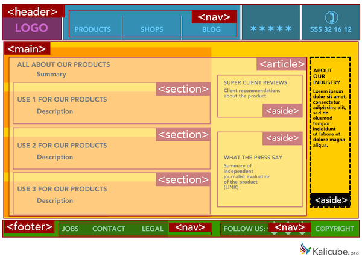
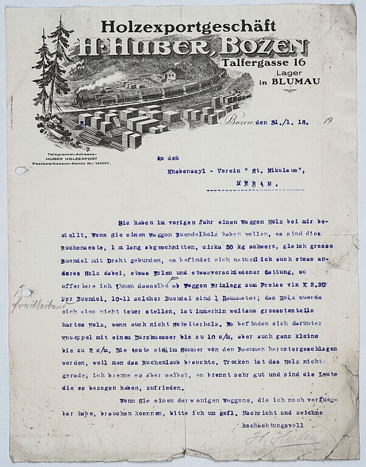

## Objectifs

* Structurer tes pages web
* Utiliser des balises sémantiques

## Pré-requis

````stepper
# Valider la quête suivante
```quests
2113
```
# Être à l'aise avec l'imbrication de balises HTML
```html
<p>Bienvenue sur mon incroyable <strong>site web</strong> !</p>
```
````

## Introduction

Précédemment, tu as vu les principes de bases du langage HTML.

Dans cette quête nous allons nous concentrer sur l'organisation et la structure des pages avec des balises sémantiques.

## Sommaire

## La structure d'une page HTML

As-tu déjà remarqué que la plupart des sites internet suivent plus ou moins une structure similaire ?

La plupart des sites sont composés de plusieurs "zones", comme l'en tête (en anglais "Header") la navigation, le pied de page ("Footer"), différentes sections, des articles, etc.



Utiliser des balises sémantiques pour rendre la structure lisible par des programmes est encore une fois très important pour le référencement et l'accessibilité.

Les balises que tu vas voir dans cette quête n'ont pas d'impact sur la manière dont les éléments s'affichent. Comme nous l'avons vu, le HTML nous permet de décrire la structure d'une page : nous verrons bientôt comment nous pouvons styliser les éléments grâce au CSS. 

## La balise <header> 

La balise `<header>` est une balise que tu peux utiliser pour spécifier l'en-tête d'une page, d'un article ou d'une section. 

```alert-warning
Tu dois bien faire la différence entre la balise `<head>` et la balise `<header>` : les 2 correspondent à la notion "d'en-tête". La balise `<head>` représente l'en-tête du document : elle contient des informations techniques pour le navigateur. La balise `<header>` représente un en-tête dans la page : elle contient du contenu visible sur la page, comme sur du [papier à en-tête](https://fr.wikipedia.org/wiki/Papier_%C3%A0_en-t%C3%AAte).


```

Tu peux utiliser plusieurs `<header>` au sein d'une page web :

```html
<!DOCTYPE html>
<html lang="fr">
<head>
    <meta charset="UTF-8">
    <meta name="viewport" content="width=device-width, initial-scale=1.0">
    <title>Qui sont les chats | Le monde des chats</title>
</head>
<body>

<header>
    <h1>Bienvenue sur Le Monde des chats</h1>
    <p>Le premier site sur vos animaux favoris</p>
</header>

<section>
    <header>
        <h2>Qui sont les chats ?</h2>
    </header>
        <p>Les <strong>chats</strong> sont les membres de la famille des <em>félins</em>, et ils partagent de nombreuses
        caractéristiques avec leurs
        cousins ​​les lions, les tigres et les panthères. Les chats domestiques sont les plus populaires au monde et
        sont adorés par des millions de personnes pour leur compagnie et leur affectueuse nature.</p>
</section>

</body>
</html>
```

```xtext arrow
**🎯 À toi de jouer !**

Utilise le document HTML `index.html` créé dans les quêtes précédentes et ajoute la balise `<header>` dans l'en-tête de ta page web (pour le moment, laisse la balise vide).
```

## La balise <nav> 

La plupart des sites internet (si ce n'est la totalité) possède une navigation. La navigation permet aux utilisateurs de naviguer entre les différentes pages de ton site et est représentée en HTML grâce à la balise `<nav>`. Tu peux intégrer ta `<nav>` dans le `<header>` ou la placer comme un bloc indépendant :

```html
<nav>
</nav>
```

À l'intérieur de la navigation, utilise une liste non ordonnée de liens :

```html
<nav>
    <ul>
        <li><a href="index.html"></a></li>
        <li><a href="informations.html">S'informer</a></li>
        <li><a href="adoption.html">Adopter</a></li>
        <li><a href="blog.html">Blog</a></li>
        <li><a href="about.html">À propos</a></li>
        <li><a href="contact.html">Contact</a></li>
    </ul>
</nav>
```

Ce format de liste est plus accessible : il fournit d'avantage de repères à des logiciels de lecture d'écran.

```xtext arrow
**🎯 À toi de jouer !**

Ajoute **à l'intérieur de la balise `<header>`** la navigation sur la page `index.html` avec les liens suivant:

* Accueil (redirige vers "index.html")
* À propos (redirige vers "about.html")
* Contact (redirige vers "contact.html")
```

## La balise <main>

La balise `<main>` est utilisé pour représenter le contenu principal d'une page web : c'est typiquement le contenu qui change d'une page à l'autre d'un même site. Par opposition, le `<header>` et la `nav` sont des parties qui restent les mêmes.

Une page ne doit avoir qu'une seule balise `<main>` :

```html
<main>
    <h1>Blog</h1>

    <h2>Qui sont les chats ?</h2>

    <p>Les <strong>chats</strong> sont les membres de la famille des <em>félins</em>, et ils partagent de nombreuses
        caractéristiques avec leurs
        cousins ​​les lions, les tigres et les panthères. Les chats domestiques sont les plus populaires au monde et
        sont adorés par des millions de personnes pour leur compagnie et leur affectueuse nature.
        ...
     </p>
</main>
```

La balise main contient généralement d'autres balises comme la balise `<article>` pour des compositions et `<section>` pour délimiter chaque section du site web. 

Voyons-les plus en détail. 

## La balise <article> 

La balise `<article>` est un *conteneur* : littéralement un élément qui contient du contenu. Par exemple un article de blog, un message sur un forum, une fiche produit, etc.

Une page HTML peut contenir plusieurs `<article>`. Chaque `<article>` doit pouvoir être sorti du contexte de la page et avoir du sens seul : c'est la caractéristique des articles. Comme un article que tu pourrais découper dans un journal pour le garder en souvenir.

```html
<main>
    <h1>Blog</h1>
    <article>
        <header>
            <h2>Qui sont les chats ?</h2>
        </header>
        <p>Les <strong>chats</strong> sont les membres de la famille des <em>félins</em>, et ils partagent de
            nombreuses
            caractéristiques avec leurs
            cousins ​​les lions, les tigres et les panthères. Les chats domestiques sont les plus populaires au
            monde et
            sont adorés par des millions de personnes pour leur compagnie et leur affectueuse nature.</p>
        ...
    </article>
    <article>
        <header>
            <h2>Comment adopter un chat ?</h2>
        </header>
        <p>Les <strong>chats</strong> sont les membres de la famille des <em>félins</em>, et ils partagent de
            nombreuses
            caractéristiques avec leurs
            cousins ​​les lions, les tigres et les panthères. Les chats domestiques sont les plus populaires au
            monde et
            sont adorés par des millions de personnes pour leur compagnie et leur affectueuse nature.</p>
        ...
    </article>
</main>
```

## La balise <section>

La balise `<section>` est un conteneur, comme la balise `<article>`. La différence est qu'une section n'est pas indépendante des autres sections autour. Pour reprendre l'image du journal, la section "sport" a du sens par ce qu'il existe une section "faits divers" à côté : s'il n'y avait qu'une section, ce ne serait pas nécessaire d'utiliser une balise `<section>`.

Attention à ne pas confondre `<article>` et `<section>`, 

```xtext arrow
**🎯 À toi de jouer !**

Dans notre page `index.html`, ajoute une balise `<main>` à la suite du header. 

Mets le titre de la page à l'intérieur de la balise `<main>` puis ajoute une balise `<section>` avec un titre "Blog" (attention à utiliser le bon niveau de titre). 

À l'intérieur de la section blog, ajoute deux articles avec chacun un header avec un titre et un paragraphe.

Si tu n'as pas d'inspiration pour le texte, tu peux utiliser du faux texte comme le [Lorem Ipsum](https://fr.wikipedia.org/wiki/Lorem_ipsum). 
```

## La balise <aside>

La balise `<aside>` représente une partie d'une page, d'un article ou d'une section qui donne des informations complémentaires sur la page, l'article ou la section. 

Il s'agit souvent de contenu facultatif. Il est utilisé par exemple pour :

* les publicités,
* les barres de recherche,
* les encadrés.

Une page peut avoir plusieurs blocs `<aside>`, et chacun de ces blocs peut être placé soit avant, soit après le contenu qu'il complémente.

```html
<section>
    <h1>Blog</h1>
    <article>
        <!-- Article #1 de la section blog -->
        <header>
            <h2>Qui sont les chats ?</h2>
        </header>
        <p>Les <strong>chats</strong> sont les membres de la famille des <em>félins</em>, et ils partagent de
            nombreuses
            caractéristiques avec leurs
            cousins ​​les lions, les tigres et les panthères. Les chats domestiques sont les plus populaires au
            monde et
            sont adorés par des millions de personnes pour leur compagnie et leur affectueuse nature.</p>

        <aside>
            <!-- Commentaires de l'article-->
            <header>
                <h2>Commentaires</h2>
            </header>
            <article>
                <!-- Commentaire #1 de l'article-->
                <header>
                    <h3>Laurent</h3>
                </header>
                <p>J'adore les chats !</p>
            </article>
        </aside>
    </article>
</section>
```

```xtext arrow
**🎯 À toi de jouer !**

Ajoute un `<aside>` dans tes deux articles avec un commentaire. 
```

## La balise <footer>

La balise `<footer>` est utilisée pour le pied de page, généralement pour des informations sur la page comme une mention de copyright ou des liens vers des pages supplémentaires :

```html
<footer>
    <nav>
        <ul>
            <li><a href="/">Accueil</a></li>
            <li><a href="/articles">Articles</a></li>
            <li><a href="/about">À propos</a></li>
        </ul>
    </nav>
    <p>Contact : <a href="mailto:bob.smith@gmail.com">bob.smith@gmail.com</a> </p>
    <p>Copyright 2022</p>
</footer>
```

La balise `<footer>` peut aussi être utilisée pour créer un pied de section ou d'article :

```html
<article>
    <h1>Titre de mon article</h1>
    <p>...</p>
    <footer>
        <p>© 2022</p>
    </footer>
</article>
```

```xtext arrow
**🎯 À toi de jouer !**

Ajoute un pied de page à ta page `index.html` avec les différents liens de ton site internet ainsi que les informations de contact suivi du Copyright. 
```

## Quand tout le reste a échoué

### Saut de ligne

Tu peux effectuer un saut de ligne en HTML avec la balise `<br>`. Attention, la balise `<br>` doit être utilisée pour des retours à la ligne **à l'intérieur d'un paragraphe** ou d'une balise `<address>`. À l'intérieur d'un paragraphe, elle est utilisée pour la présentation d'un poème par exemple. Elle ne doit pas être utilisée pour mettre de l'espace **entre** les paragraphes. Pour cela tu utiliseras des propriétés CSS. 

```html
<h3>le petit chat</h3>
<p>J'aime beaucoup mon petit chat,<br>
Ce n'est pas que je vous déteste,<br>
Mais moins que vous il est ingrat,<br>
Méchant, hypocrite et le reste !
</p>
```

### Séparateurs

Tu peux mettre un séparateur avec la balise `<hr>` pour marquer un changement de thématique :

```html
<h2>Poèmes sur les chats</h2>

<h3>le petit chat</h3>
<p>J'aime beaucoup mon petit chat,<br>
Ce n'est pas que je vous déteste,<br>
Mais moins que vous il est ingrat,<br>
Méchant, hypocrite et le reste !</p>
<p>Auteur inconnu</p>

<hr>

<p>Sur le chemin de Chatham,<br>
J'ai vu un homme avec sept femmes.<br>
Chaque femme avait sept sacs,<br>
Chaque sac contenait sept chats,<br>
Chaque chat avait sept chatons :<br>
Combien cheminaient vers Chatham ?</p>

<h2>Quelles sont les caractéristiques des chats ?</h2>
```

### Les balises <div> et <span>

La balise `<div>` est un conteneur de type **block** et `<span>` est un conteneur de type **inline**.

Nous avons déjà vu plusieurs conteneurs comme `<header>`, `<footer>`, `<article>`, etc.

À la différence de ces *conteneurs sémantiques* qui ont une **sémantique forte**, les balises `<span>` et `<div>` ne donnent aucune information quant au type de contenu qu'elles contiennent. 

Elles doivent être utilisées lorsqu'aucun élément avec une sémantique plus forte n'est adapté au contenu. La balise `<div>` pour délimiter une **div**ision, une partie d'un tout. La balise `<span>` pour délimiter une portion de contenu en ligne.

## Récapitulatif

* En HTML, tu dois respecter la structure et la sémantique de tes pages.

* La balise `<header>` sert à déclarer l'en-tête d'une page, d'un article ou d'une section.

* La balise `<nav>` sert à déclarer un élément de navigation.

* La balise `<main>` est utilisée pour délimiter la partie principale d'une page web. Tu ne dois utiliser qu'une seule balise `<main>` par page.

* La balise `<article>` sert à déclarer un contenu qui a du sens même s'il est sorti de son contexte (article de blog, fiche produit, etc.).

* La balise `<section>` sert à délimiter des sections différentes dans ta page.

* La balise `<aside>` sert à déclarer du contenu "à part" (commentaires, publicités, etc.).

* La balise `<footer>` sert à déclarer un pied de page, de section ou d'article.

## Challenge

Mets en forme le travail que tu as réalisé durant cette quête et compare le résultat avec la solution qui est proposée ! 

Tu peux effacer le contenu que nous avons fait dans les précédentes quêtes pour plus de clarté.

### Critères de validation

* [ ] La page web respecte les principes de structure et de sémantique découverts dans la quête
* [ ] La page contient un header avec une navigation contenant une liste de liens
* [ ] La page contient une section blog 
* [ ] La page contient des articles de blog 
* [ ] Les articles contiennent des commentaires bien structurées
* [ ] La page contient un footer avec une navigation contenant différents liens, l'email de contact et le copyright

````solution
```html
<!DOCTYPE html>
<html lang="fr">
<!-- Head of the document -->

<head>
    <title>Bienvenue sur mon site internet | Bob Smith Webdesigner</title>
    <link rel="shortcut icon" href="favicon.ico" type="image/x-icon">
    <meta name="author" content="Bob Smith">
    <meta name="description"
        content="Webdesigner, graphiste et developpeur frontend freelance, je designe et developpe des applications web innovantes et créatives !">
</head>

<!-- Body of the document -->

<body>

    <header>
        <nav>
            <ul>
                <li><a href="informations.html">Accueil</a></li>
                <li><a href="about.html">À propos</a></li>
                <li><a href="contact.html">Contact</a></li>
            </ul>
        </nav>
    </header>
    <main>
        <h1>Welcome to my website!</h1>
        <p>Bienvenue sur mon <strong>incroyable</strong> site internet!</p>
        <section>
            <!-- Section blog -->
            <h2>Blog</h2>

            <article>
                <!-- Article #1 -->
                <header>
                    <!-- Header de l'article #1 -->
                    <h2>Lorem</h2>
                </header>
                <p>Lorem ipsum dolor sit amet, consectetur adipisicing elit. <br> Illo ipsa doloribus voluptas odio
                    voluptatibus soluta nihil aut vel assumenda at! Ipsa rerum laborum, quam quae cumque maxime eos
                    ullam recusandae.</p>

                <aside>
                    <!-- Commentaires de l'article-->
                    <header>
                        <h2>Commentaires</h2>
                    </header>
                    <article>
                        <!-- Commentaire #1 de l'article-->
                        <header>
                            <!-- Header du commentaire -->
                            <h3>Laurent</h3>
                        </header>
                        <p>Lorem ipsum!</p>
                    </article>
                </aside>
            </article>
        </section>
    </main>
    <footer>
        <nav>
            <ul>
                <li><a href="informations.html">Accueil</a></li>
                <li><a href="about.html">À propos</a></li>
                <li><a href="contact.html">Contact</a></li>
            </ul>
        </nav>
        <p>Contact : <a href="mailto:bob.smith@gmail.com">bob.smith@gmail.com</a></p>
        <p>© 2022</p>
    </footer>
</body>

</html>
```
````