## Pré-requis

````stepper
# Valider la quête suivante
```quests
2113
```
# Être à l'aise avec l'imbrication de balises HTML
```html
<p>Bienvenue sur mon incroyable <strong>site web</strong> !</p>
```
# Être à l'aise avec l'utilisation des attributs HTML
```html

```
````

## Introduction

Précédemment, tu as vu les principes de bases du langage HTML.

Dans cette quête, nous allons apprendre comment réaliser des formulaires en HTML afin de pouvoir recueillir des informations de l'utilisateur.


## Objectifs

* Créer des formulaires en HTML

## Sommaire

## Qu'est ce qu'un formulaire ?

Un formulaire HTML permet de récolter des informations de la part d'un utilisateur afin qu'il puisse envoyer des données/interagir avec le site web.

Comme toujours, tu dois faire attention à l'accessibilité de tes formulaires afin de les rendre simple à comprendre et à utiliser.

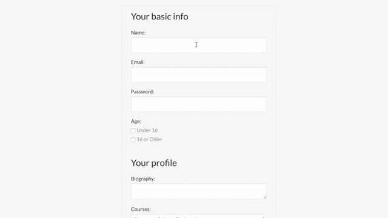

### La balise <form>

Pour déclarer un formulaire, tu dois toujours commencer par la balise `<form>`.

`<form>` est le conteneur dans lequel tu ajoutes les différentes composantes de ton formulaire.

`<form>` est généralement utilisé avec les attributs `action` et `method`.

* L'attribut `action` définit l'URL où doivent être envoyé les données
* L'attribut `method` définit la méthode utilisée pour envoyer le formulaire ("get" ou "post").

```html
<form action="/adoption-demand" method="post">

</form>
```

```alert-info
Étant donné que nous n'avons pour le moment aucun serveur où envoyer les données, nous laisserons les attributs `action` et `method` vides dans les prochains exemples.
```

### Ajouter un champ de saisie

Pour ajouter un champ de saisie dans ton formulaire, tu dois utiliser la balise `<input>`.

La balise `<input>` permet de créer différent types de champs : tu peux spécifier celui que tu veux avec l'attribut `type`. Par exemple, `type="text"` pour un champ texte :

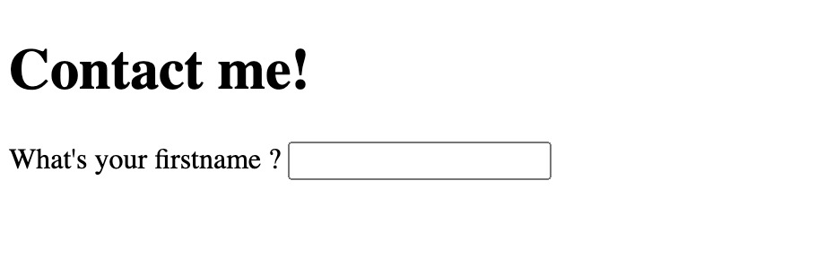

Pour des raisons d'accessibilité, pense à **toujours** ajouter une "étiquette" sur chacun des éléments de ton formulaire à l'aide de la balise `<label>`.

La balise `<label>` permet de préciser à quoi sert un élément du formulaire. Par exemple:

```html
<form>
    <label for="firstname">What's your firstname ?</label>
    <input type="text" id="firstname">
</form>
```

Comme tu peux le voir dans cet exemple, l'attribut `for` du `<label>` doit correspondre à l'attribut `id` de l'élément `<input>` afin de lier les deux. 

Une autre approche consiste à ajouter l'élément `<input>` dans la balise `<label>` :

```html
<label>What's your firstname ?
    <input type="text">
</label>
```

Dans ce cas, les attributs `for`et `id` ne sont pas nécessaires.

Enfin, tu peux ajouter l'attribut `required` pour indiquer au navigateur que le champ doit être rempli.

```xtext arrow
**🎯 À toi de jouer !**

Sur ton dossier de travail, crée un fichier contact.html.

Ajoute la structure d'un fichier HTML, et n'oublie pas les bonnes pratiques pour la balise `<head>` vu précédemment!

À l'intérieur du `<body>` tu peux ajouter la navigation et le pied de page que nous avons fait précédemment et à l'intérieur de la balise `<main>` ajoute un titre de niveau 1 "Me contacter". Ajoute ensuite une balise `<form>` avec deux champs textes (n'oublie pas les labels) pour demander à l'utilisateur son prénom et son nom de famille.

Tu peux contenir chaque `<input>` avec son `<label>` dans une balise `<p>`.
```

### Bouton de soumission

Enfin, tu peux utiliser une balise `<button>` avec le type `submit` pour compléter ton formulaire :

```html
<button type="submit">Valider mon inscription</button>
```

````alert-info
Le type `"submit"` sur un `<input>` te permet aussi de créer un bouton qui enverra le formulaire. Le texte du bouton est spécifié avec l'attribut `value` :

```html
<input type="submit" value="Valider mon inscription">
```

Cependant, la balise `<button>` te laisse plus de libertés : tu peux par exemple mettre une image dans ton bouton.
````


## Les types de champs "simples"

### Text

Le type `"text"` permet d'afficher un champ texte sur une seule ligne.

Tu peux l'utiliser pour les champs textes qui ne sont pas des emails ou des mots de passe.

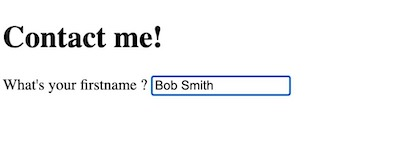

### Email

Le type `"email"` permet d'ajouter un champ email :

```html
<label>Quel est votre email: <input type="email" required></label>
```

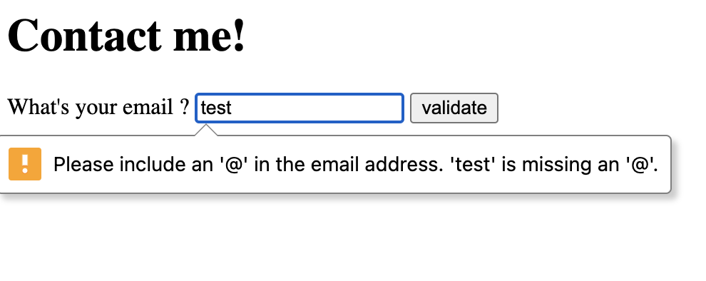

### Date

Le type `"date"` permet d'ajouter un sélecteur de date :

```html
<label>Quelle est votre date de naissance: <input type="date"></label>
```

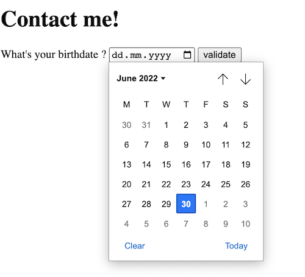

### Number

Le type `"number"` permet de sélectionner un nombre :

```html
<label>Nombre de personnes: <input type="number"></label>
```

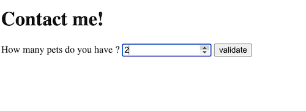

### Password

Le type `"password"` permet de taper un mot de passe, les caractères seront donc masqués :

```html
<label>Password: <input type="password"></label>
```

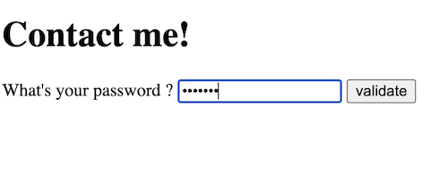

```xtext arrow
**🎯 À toi de jouer !**

Ajoute un champ email et date de naissance sur ton formulaire de contact. Pense à bien ajouter la balise `<label>`.
```

## Autres types de champs

### Case à cocher

Le type `"checkbox"` permet d'afficher une case à cocher sur la page. Tu peux utiliser l'attribut `checked` pour définir l'état initial de la checkbox :

```html
<label>S'inscrire à la newsletter <input type="checkbox" checked></label>
```

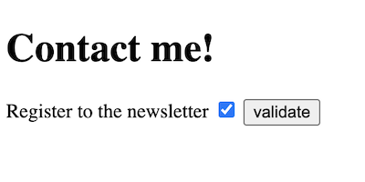

Lorsque tu as plusieurs checkboxes, tu peux les regrouper en utilisant la balise `<fieldset>` et ajouter une légende avec la balise `<legend>`.

La balise `<fieldset>` est utilisée pour regrouper plusieurs `<input>` et `<label>`:

```html
<fieldset>
    <legend>Veuillez choisir vos skills :</legend>

    <input type="checkbox" id="webdev" name="interest" value="coding">
    <label for="webdev">Developpement Web</label>

    <input type="checkbox" id="music" name="interest" value="music">
    <label for="music">Musique</label>
</fieldset>
```

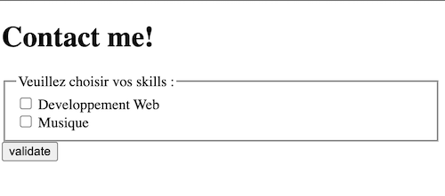

### Boutons radio

Le type `"radio"` permet d'afficher une sélection d'éléments et de laisser l'utilisateur choisir une option dans la liste.

De la même manière, tu peux utiliser la balise `<fieldset>` pour regrouper les éléments :

```html
<fieldset>
    <legend>Quel est votre langage de programmation favori:</legend>

    <input type="radio" id="javascript" name="favoriteLanguage" value="javascript">
    <label for="javascript">JavaScript</label>

    <input type="radio" id="python" name="favoriteLanguage" value="python">
    <label for="python">Python</label>

    <input type="radio" id="java" name="favoriteLanguage" value="java">
    <label for="java">Java</label>
</fieldset>
```

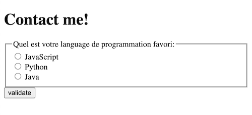

### Jauge

Le type `"range"` affiche un sélecteur permettant à l'utilisateur de choisir une valeur numérique entre un minimum et un maximum :

```html
<input type="range" id="volume" name="volume" min="0" max="11">
<label for="volume">Volume</label>
```

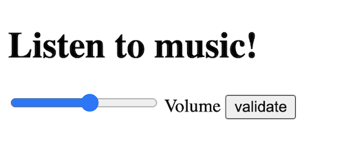

Dans cet example, l'utilisateur peut définir le volume entre 0 et 11 en déplaçant le curseur.

### Autres

Les types que nous avons vus sont les principaux types pour la balise `<input>`. Si tu souhaites en voir davantage, n'hésite pas à consulter la documentation du site MDN.

```resource
https://developer.mozilla.org/fr/docs/Web/HTML/Element/input
# <input> : l'élément de saisie dans un formulaire | MDN
```

```xtext arrow
**🎯 À toi de jouer !**

Ajoute une checkbox pour que l'utilisateur choisisse s'il veut aussi s'inscrire à la newsletter. Ajoute également des boutons radios (groupés avec un fieldset et une legende) pour que l'utilisateur choisisse quel genre de musique il aime. 

Ajoute ensuite un bouton "submit" afin que l'utilisateur puisse valider le formulaire. 
```

##  Les listes déroulantes

Tu peux créer des menus déroulants pour tes formulaire à l'aide de la balise `<select>`. 

À l'intérieur de la balise `<select>`, ajoute une balise `<option>` pour chaque choix que tu veux proposer. 

Le texte contenu dans la balise `<option>` sera affiché à l'utilisateur. Tu peux ajouter un attribut `value` à chaque option pour fournir une "représentation machine" : la valeur de l'attribut `value` sera utilisée par le programme qui traitera ton formulaire :

```html
<label for="pet-select">Quel animal voulez vous adopter?</label>
<select name="pets" id="pet-select">
    <option value="">--Veuillez choisir une option--</option>
    <option value="dog">Chien</option>
    <option value="cat">Chat</option>
    <option value="hamster">Hamster</option>
</select>
```

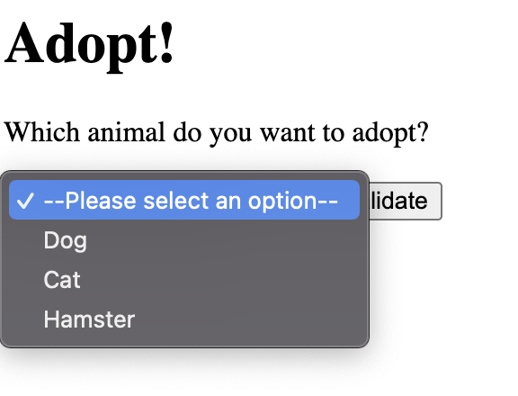

```xtext arrow
**🎯 À toi de jouer !**

Ajoute un menu déroulant à la suite de la date de naissance pour que les utilisateurs puissent choisir la raison de leur message.

Par exemple, "Information sur mes prestations", "Problème avec mon site internet", etc...
```

## Les zones de texte multilignes

La balise `<textarea>` ajoute une zone de texte multilignes. Elle est généralement utilisée pour que l'utilisateur tape un message ou du texte long.

Tu peux définir le nombre de lignes et de colonnes avec les attributs `rows` et `cols`. Tu peux également fixer la longueur maximum du texte avec `maxlength`, et le retour à la ligne automatique avec `wrap` :

```html
<label>Ecrivez votre message:
  <textarea id="message" name="message" rows="5" cols="33" maxlength="500" wrap placeholder="Tapez votre message ici..."></textarea>
</label>
```

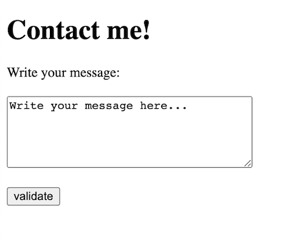

```xtext arrow
**🎯 À toi de jouer !**

Ajoute une balise `<textarea>` avant le bouton "submit" pour que les utilisateurs puissent écrire leur message.
```

## Récapitulatif

* Tu peux créer des formulaires en HTML en utilisant la balise `<form>`

* Lors de l'utilisation de la balise `<form>`, tu peux spécifier vers quelle URL et avec quelle méthode le formulaire doit être envoyé

* Chaque champ d'un formulaire doit être labélisé pour des raisons d'accessibilité

## Challenge

Mets en forme le travail que tu as réalisé durant cette quête et compare le résultat avec la solution qui est proposée ! 

### Critères de validation

* [ ] Le site contient un formulaire avec deux champs textes (nom et prénom), un champ email, un champ date de naissance, une checkbox, un textarea, un menu déroulant et un bouton d'envoi
* [ ] Chaque champ a son label

````solution
```html
<!DOCTYPE html>
<html lang="en">

<head>
    <title>Contactez-moi! | Bob Smith Webdesigner</title>
    <link rel="shortcut icon" href="favicon.ico" type="image/x-icon">
    <meta name="author" content="Bob Smith">
    <meta name="description"
        content="Webdesigner, graphiste et developpeur frontend freelance, je designe et developpe des applications web innovantes et créatives !">
    <meta property="og:image" content="https://placekitten.com/200/287">
    <meta property="og:title" content="Contactez-moi | Bob Smith Webdesigner">
    <meta property="og:description"
        content="Webdesigner, graphiste et developpeur frontend freelance, je designe et developpe des applications web innovantes et créatives !">

    <meta name="twitter:card" content="summary_large_image">
    <meta name="twitter:title" content="Contactez-moi | Bob Smith Webdesigner">
    <meta name="twitter:description"
        content="Webdesigner, graphiste et developpeur frontend freelance, je designe et developpe des applications web innovantes et créatives !">
    <meta name="twitter:site" content="@bob_smith">
    <meta name="twitter:image" content="https://placekitten.com/200/287">
</head>

<body>

    <header>
        <nav>
            <ul>
                <li><a href="index.html">Accueil</a></li>
                <li><a href="about.html">À propos</a></li>
                <li><a href="contact.html">Contact</a></li>
            </ul>
        </nav>
    </header>
    <hr>
    <main>

        <h1>Me contacter!</h1>
        <form>
            <label>Quel est votre prénom: <input type="text" /></label>
            <br>
            <label>Quel est votre nom: <input type="text" /></label>
            <br>
            <label>Quel est votre email: <input type="email"></label>
            <br>
            <label>Quel est votre date de naissance: <input type="date"></label>
            <br>
            <label for="contact-reason">Quel est la raison de votre contact ?</label>

            <select name="reason" id="contact-reason">
                <option value="">--Choisissez une option--</option>
                <option value="informations">Je souhaite plus d'informations sur vos prestations</option>
                <option value="bug">Reporter un bug sur le site web</option>
                <option value="discute">J'aimerais discuter</option>
            </select>
            <br>
            <label>S'inscrire à la newsletter <input type="checkbox" value="newsletter"></label>
            <br>
            <label>Ecrivez votre message:
                <br>
                <textarea id="message" name="message" rows="5" cols="33" maxlength="500" wrap placeholder="Tapez votre message ici...">
                </textarea>
            </label>
            <br>
            <input type="submit" value="Envoyer le formulaire">
        </form>
    </main>
    <hr>
    <footer>
        <nav>
            <ul>
                <li><a href="informations.html">Accueil</a></li>
                <li><a href="about.html">À propos</a></li>
                <li><a href="contact.html">Contact</a></li>
                <li><a href="contact.html">Contact</a></li>
            </ul>
        </nav>
        <p>Contact : <a href="mailto:bob.smith@gmail.com">bob.smith@gmail.com</a></p>
        <p>@Copyright 2022</p>
    </footer>
</body>

</html>
```
````