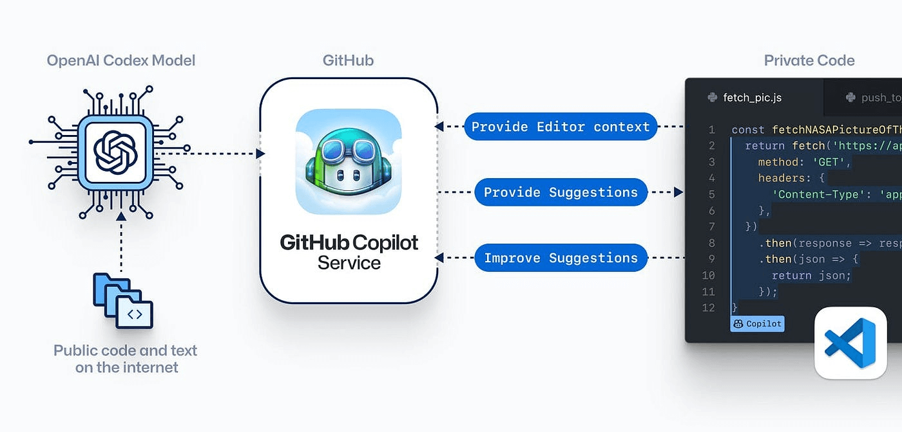
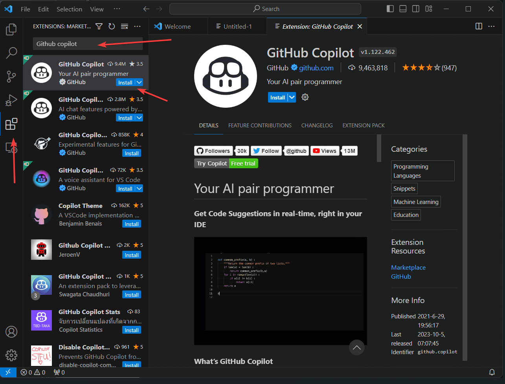
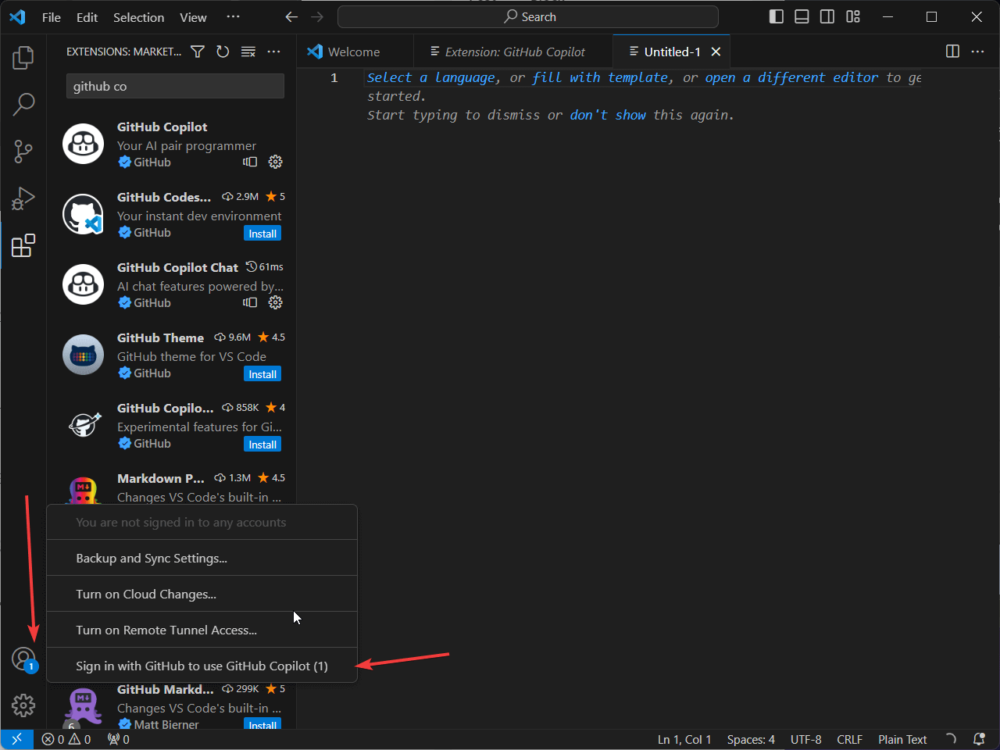
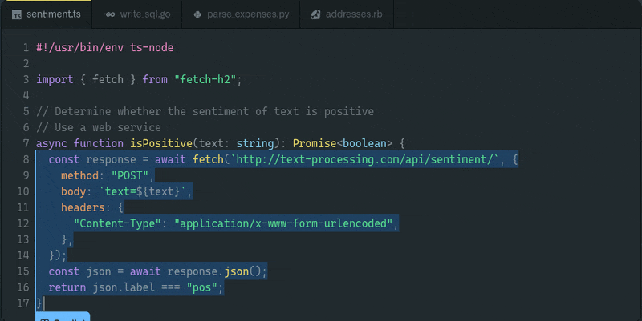
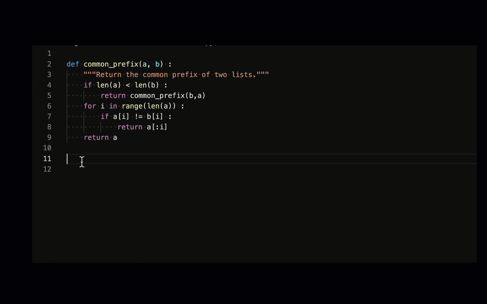
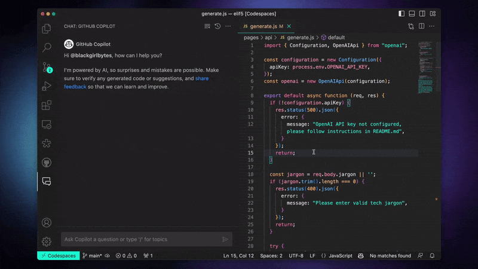
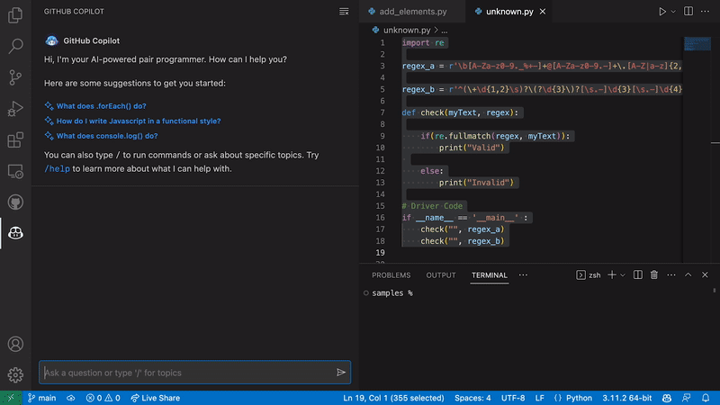
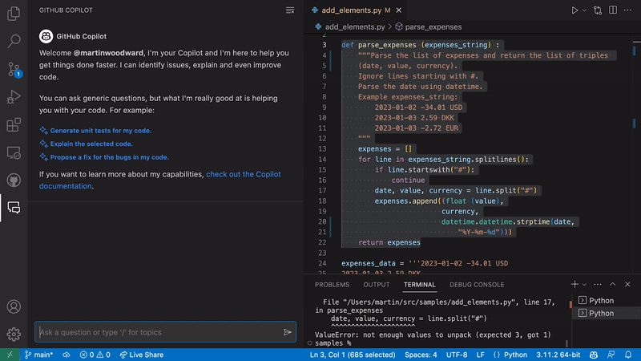
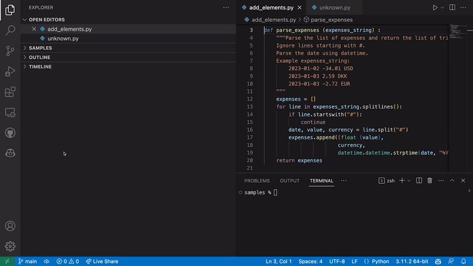

## Objectifs d'apprentissage

À la fin de cette leçon, vous aurez :

- Une compréhension claire de ce qu'est GitHub Copilot et de son fonctionnement
- Appris comment configurer GitHub Copilot sur votre machine locale
- Appris comment utiliser GitHub Copilot et ses principales fonctionnalités pour aider dans les tâches de programmation
- Compris comment évaluer les recommandations faites par GitHub Copilot

## Prérequis

Compréhension de base de :

- La plateforme GitHub
- Visual Studio Code (VS Code)
- Concepts de programmation
- Syntaxe d'au moins un langage de programmation

## Introduction

GitHub Copilot est un outil qui aide les développeurs à écrire du code plus facilement. Il utilise l'intelligence artificielle pour fournir des suggestions de complétion de code, proposer des modèles, créer des fonctions et même créer des classes entières. Cette leçon vous guidera pour comprendre comment fonctionne GitHub Copilot, les tâches qu'il peut aider à réaliser et comment en tirer le meilleur parti dans votre parcours de programmation.


## Sommaire

## Démarrer avec GitHub Copilot

### Quid GitHub Copilot?

GitHub Copilot est un outil qui sert de programmeur en binôme basé sur l'IA, alimenté par le modèle [Codex d'OpenAI](https://platform.openai.com/docs/guides/code). Il propose des suggestions de complétion de code, de simples lignes de code à des fonctions entières. Il apprend et s'améliore avec le temps en analysant les codes des dépôts publics sur GitHub. Il prend en charge plusieurs langages et frameworks tels que JavaScript, Python, TypeScript, Ruby, Java, etc.



### Configuration de GitHub Copilot sur Visual Studio Code

‼️ Copilot est gratuit pour les étudiants vérifiés, les enseignants et les responsables de projets open source populaires. Sinon, il nécessite un abonnement actif à GitHub pour l'utiliser.

🔬 GitHub Copilot fonctionne comme une extension de Visual Studio (VS) Code. Assurez-vous d'avoir la version la plus récente de Visual Studio Code avant d'installer Copilot.

Si vous avez déjà VS Code installé, vérifiez s'il est mis à jour en cliquant sur **Aide > Rechercher les mises à jour** sur Windows ou **Code > Rechercher les mises à jour** sur Mac.

Suivez les étapes ci-dessous pour installer GitHub Copilot avec VS Code :

1. Ouvrez Visual Studio Code.
2. Accédez à l'onglet **Extensions** sur le côté gauche de l'écran de VS Code. Tapez "GitHub Copilot" dans la barre de recherche en haut.
3. Cliquez sur la première option dans la liste déroulante, qui devrait être GitHub Copilot Official. Ensuite, cliquez sur le bouton "Installer".


    
Une fois l'installation terminée, GitHub Copilot s'activera automatiquement lorsque vous ouvrirez un nouveau fichier ou commencerez à taper dans un fichier existant. Pour cela, vous devez avoir un compte GitHub actif.

### Connectez-vous à votre compte GitHub sur VS Code

Vous devez être connecté à votre compte GitHub dans Visual Studio Code pour utiliser GitHub Copilot. Suivez ces étapes pour vous connecter à GitHub :

1. Cliquez sur l'icône "Comptes" dans le coin inférieur gauche de VS Code.
2. Cliquez sur "Connectez-vous à GitHub pour utiliser GitHub Copilot".
3. Dans la page de connexion du navigateur qui s'ouvre, saisissez vos identifiants GitHub et cliquez sur "Se connecter".
4. Après vous être connecté avec succès, fermez la fenêtre du navigateur.



💡 Voir comment [installer Copilot pour Vim/NeoVim](https://docs.github.com/en/copilot/getting-started-with-github-copilot?tool=vimneovim) sur MacOS, Windows et Linux

🔬 **Exercice**

Installez GitHub Copilot dans votre Visual Studio Code et créez un programme basique "Hello, World!" en utilisant les suggestions générées.

## Utiliser efficacement GitHub Copilot

Une fois installé, GitHub Copilot fonctionne directement dans votre éditeur. Les sections suivantes décrivent comment vous pouvez utiliser GitHub Copilot pour une programmation efficace en utilisant ses fonctions de suggestion de complétion de code, de tests unitaires, de requêtes SQL, etc.

### Complétion de code

Une des principales fonctionnalités de GitHub Copilot est sa capacité à fournir des suggestions de complétion de code en temps réel. Lorsque vous commencez à écrire une ligne de code, GitHub Copilot commencera à suggérer des complétions. Ces suggestions sont basées sur les motifs et les utilisations dans les dépôts de code qu'il a précédemment analysés. Vous pouvez accepter la suggestion en appuyant sur `Tab`.



🔬 **Exercice**
Écrivez une fonction qui calcule le factoriel d'un nombre donné. Utilisez GitHub Copilot pour compléter le code et suggérer la logique nécessaire pour calculer le factoriel.

### Transformer les commentaires en code

GitHub Copilot a été formé à la fois sur du code source et du texte en langage naturel. Cela lui permet de générer du texte, tout comme il le fait avec du code, avec la capacité de compléter vos commentaires pendant que vous les tapez. Des commentaires clairs et informatifs favorisent les suggestions de code pertinentes de Copilot.

Dans l'exemple ci-dessous, après que Copilot a complété notre explication en texte brut, nous utilisons la touche `Tab` pour lui faire générer le code correspondant ligne par ligne.


### Création de tests unitaires

GitHub Copilot simplifie également l'écriture de tests unitaires. Par exemple, considérons une fonction qui calcule le préfixe commun de deux listes, et nous voulons le tester. Pour créer ce test, nous commençons par importer le package de tests unitaires. Ensuite, nous écrivons une fonction de test. Copilot suggérera des complétions pour la fonction de test unitaire que nous pouvons accepter en utilisant la touche `Tab`.



### Création de requêtes SQL

GitHub Copilot peut également être utilisé pour générer des requêtes SQL. Dans l'exemple ci-dessous avec le langage Go, nous fournissons un schéma sous forme d'instruction CREATE TABLE. Une fois le schéma écrit, Copilot peut écrire une requête intégrée dans le code, et convertir le résultat en une classe. Cette fonctionnalité simplifie la création de requêtes SQL. Cependant, il est important de vérifier et de valider les requêtes générées pour s'assurer qu'elles répondent aux exigences spécifiques et aux bonnes pratiques.


🔬 **Exercice**
Utilisez Copilot pour générer une classe avec des requêtes SQL intégrées pour une base de données d'administration utilisateur.

### Refactorisation de code

Copilot peut également vous aider à refactoriser votre code existant en proposant des suggestions pour simplifier ou améliorer votre implémentation.

Considérez le code Ruby ci-dessous :

```ruby
def price_with_discount(price, discount_rate)
  price - (price * discount_rate)
end
```

Ce simple calcul de prix ne prend pas en compte les valeurs `nil`, les chaînes de caractères qui devraient être des nombres ou des valeurs raisonnables pour `price` ou `discount_rate`. Nous avons besoin que le code fasse ce qui suit :

1. S'assurer que `price` est un entier ou un nombre à virgule (non nul)
2. S'assurer que `price` n'est pas négatif
3. S'assurer que `discount_rate` est un nombre à virgule (non nul)
4. S'assurer que `discount_rate` n'est pas négatif et inférieur ou égal à 1

Copilot peut suivre ces instructions et générer le résultat suivant :

```ruby
def price_with_discount(price, discount_rate)
  raise ArgumentError, "Price must be a positive number" unless price.is_a?(Numeric) && price >= 0
  raise ArgumentError, "Discount rate must be a float between 0 and 1" unless discount_rate.is_a?(Float) && discount_rate >= 0 && discount_rate <= 1

  price - (price * discount_rate)
end
```

### Automatisation des tâches répétitives

Toutes les tâches répétitives telles que la création de getters et setters, les opérations CRUD standard et les conversions de formats peuvent être automatisées à l'aide de GitHub Copilot.

[https://www.youtube.com/watch?v=fU9fWqcou0o](https://www.youtube.com/watch?v=fU9fWqcou0o)

🔬 **Exercice - Implémentation d'algorithmes**

Implémentez la série de Fibonacci, l'algorithme de tri à bulles et l'algorithme de recherche binaire avec Copilot pour comprendre comment l'outil aide à écrire du code plus complexe. Ajoutez des commentaires à votre code et utilisez les suggestions de Copilot pour explorer d'autres algorithmes de tri et de recherche.

[https://www.youtube.com/watch?v=5XheKKZoGnE](https://www.youtube.com/watch?v=5XheKKZoGnE)

💡 **Conseils - Apprentissage de nouvelles techniques**

GitHub Copilot peut également être utilisé pour découvrir et explorer de nouveaux algorithmes, bibliothèques, fonctions et techniques de codage.

💡 **Raccourcis clavier**

Les raccourcis clavier les plus courants à retenir lors de l'utilisation de GitHub Copilot avec Visual Studio Code :

| Action | Windows / Linux | macOS |
| --- | --- | --- |
| Déclencher des suggestions en ligne | Alt + \ | Option + \ |
| Voir la suggestion suivante | Alt + ] | Option + ] |
| Voir la suggestion précédente | Alt + [ | Option + [ |
| Accepter une suggestion | Tab | Tab |
| Rejeter une suggestion en ligne | Esc | Esc |
| Afficher toutes les suggestions dans un nouvel onglet | Ctrl + Enter | Ctrl + Enter |

Vous pouvez également définir vos propres [raccourcis clavier](https://realpython.com/advanced-visual-studio-code-python/#keyboard-shortcuts) dans Visual Studio Code. Cela peut être utile si vous travaillez avec un clavier non américain.

## Copilot Chat - Interagir avec Copilot dans l'éditeur

### Qu'est-ce que GitHub Copilot Chat ?

GitHub Copilot Chat, actuellement en version bêta, est une interface de discussion intégrée dans des IDE pris en charge tels que Visual Studio Code, Visual Studio et JetBrains. Il fournit des réponses aux questions liées à la programmation directement dans ces environnements. Accessible aux abonnés individuels et commerciaux de GitHub Copilot, il aide les utilisateurs en évitant la nécessité de naviguer dans la documentation ou de rechercher des forums en ligne.

### Configuration de Copilot Chat dans VS Code

1. Lancez VS Code et cliquez sur l'icône de l'extension. *Icône d'extension de VS Code*
2. Tapez **Copilot** dans la barre de recherche
3. Sélectionnez **GitHub Copilot Chat**
4. Cliquez sur Installer
    
    [https://techcommunity.microsoft.com/t5/image/serverpage/image-id/485754i0B2619E27889869B/image-dimensions/799x473?v=v2](https://techcommunity.microsoft.com/t5/image/serverpage/image-id/485754i0B2619E27889869B/image-dimensions/799x473?v=v2)
    
5. Tout comme Copilot, vous devez vous connecter à votre compte GitHub pour activer Copilot Chat
6. Cliquez sur l'icône de GitHub Copilot Chat pour commencer.
    
    [https://techcommunity.microsoft.com/t5/image/serverpage/image-id/481396i6310CCCC3B4357FB/image-dimensions/801x600?v=v2](https://techcommunity.microsoft.com/t5/image/serverpage/image-id/481396i6310CCCC3B4357FB/image-dimensions/801x600?v=v2)
    

[https://www.youtube.com/watch?v=eCOsNCYxdYM](https://www.youtube.com/watch?v=eCOsNCYxdYM)

### Cas d'utilisation de Copilot Chat

Les principaux cas d'utilisation de Copilot Chat comprennent les suivants :

- **Génération de cas de test unitaires** : Copilot Chat peut générer des cas de test unitaires, suggérer des paramètres d'entrée et des sorties attendues, et tester les cas limites.



- **Explication du code et suggestions d'améliorations** : Il fournit des descriptions en langage naturel de la fonctionnalité du code et suggère des améliorations pour la lisibilité du code et la gestion des erreurs.



- **Proposition de corrections de code** : Offre des solutions et des extraits de code pour corriger les bugs en fonction du contexte.



- **Réponse aux questions de programmation** : Aide à résoudre des problèmes de programmation spécifiques sous forme de langage naturel ou de morceau de code.



### Bonnes pratiques et limitations

- **Bonnes pratiques** : Vous devez considérer Copilot Chat comme un outil, pas comme un remplacement de la programmation humaine, et suivre les bonnes pratiques de codage sécurisé. Les retours d'informations sont encouragés pour améliorer l'outil.
- **Limitations** : Copilot Chat a une portée limitée, peut présenter des biais potentiels et des risques de sécurité, et peut générer du code incorrect. Il n'est pas conçu pour les questions non liées à la programmation.

💡 Explorez d'autres [extensions Copilot](https://marketplace.visualstudio.com/search?term=copilot&target=VSCode&category=All) pour Visual Studio Code

## Évaluation des suggestions de GitHub Copilot

GitHub Copilot est un outil puissant. Sa capacité à suggérer des extraits de code en fonction de vos commentaires ou du code actuel peut simplifier votre processus de développement. Cependant, aucun outil, pas même un programmeur humain, n'est parfait à 100% du temps. Il est essentiel de toujours penser à évaluer de manière critique les suggestions fournies par Copilot. Suivez ces lignes directrices pour vous assurer de tirer le meilleur parti de Copilot en tant qu'outil de programmation en binôme.

### Pertinence contextuelle

Tout d'abord, assurez-vous que la suggestion est contextuellement pertinente pour la partie du code sur laquelle vous travaillez. Bien que Copilot ait une compréhension sophistiquée du langage, il ne comprend pas pleinement le contexte comme le ferait un humain. Évaluez si la solution proposée s'intègre dans le contexte de votre projet, tant en termes de code que des objectifs plus larges du projet sur lesquels vous travaillez.

### Vérification des erreurs

Vérifiez toujours les suggestions pour d'éventuelles erreurs. Les recommandations de Copilot peuvent parfois contenir des erreurs. Vérifiez que le code compile sans erreurs et ne introduit pas de bugs. Il est également conseillé de tester le nouvel extrait de code inséré de manière isolée si possible, et de s'assurer qu'il fonctionne comme prévu.

### Comprenez votre code

N'insérez jamais un morceau de code suggéré que vous ne comprenez pas. Vous devriez être en mesure d'expliquer comment chaque partie de votre code fonctionne. Si Copilot suggère quelque chose que vous ne comprenez pas, prenez le temps d'apprendre ce code avant de décider de l'inclure dans votre projet. Cela garantit que vous conservez le contrôle et la connaissance de votre propre code.

### Sécurité et bonnes pratiques

Évaluez si le code suggéré respecte les bonnes pratiques et les directives de codage sécurisé. Rappelez-vous que Copilot utilise des dépôts de code publics pour l'apprentissage, et tous les extraits de code qu'il a appris ne suivent peut-être pas les meilleures pratiques sécurisées.

De même, vérifiez le code par rapport aux normes de codage de votre projet et aux meilleures pratiques de l'industrie. Bien que Copilot puisse suggérer différentes façons d'obtenir un résultat, toutes ne correspondent peut-être pas aux meilleures pratiques établies.

### Efficacité du code

Évaluez l'efficacité du code fourni. Regardez la complexité temporelle, la complexité spatiale et tout potentiel d'optimisation. L'insertion d'un code inefficace dans une section critique de l'application pourrait entraîner des problèmes de performance à l'avenir.

💡 **En résumé**

Lors de l'évaluation des suggestions de Copilot, il est important de prendre en compte les facteurs suivants :
• **Exactitude** : Le code suggéré est-il correct ? Compile-t-il et fonctionne-t-il comme prévu ?
• **Sécurité** : Le code suggéré est-il sécurisé ? Respecte-t-il les meilleures pratiques en matière de sécurité ?
• **Lisibilité** : Le code suggéré est-il lisible ? Est-il facile à comprendre et à maintenir ?
• **Maintenabilité** : Le code suggéré est-il maintenable ? Est-il facile à modifier et à étendre ?
• **Efficacité** : Le code suggéré est-il efficace ? A-t-il de bonnes performances ?
• **Style de codage** : Le code suggéré correspond-il à votre style de codage ?

## Résumé

GitHub Copilot est un outil alimenté par l'IA qui aide les développeurs à écrire du code de manière plus efficace. Il propose des suggestions pour l'auto-complétion du code, la création de modèles et même de classes entières. Cette leçon donne un aperçu de GitHub Copilot, explique comment le configurer et explore ses principales fonctionnalités. Elle aborde des sujets tels que l'auto-complétion du code, la conversion des commentaires en code, la création de tests unitaires, la génération de requêtes SQL, la refonte du code, l'automatisation des tâches répétitives et l'utilisation de Copilot Chat. La leçon souligne l'importance d'évaluer de manière critique les suggestions de Copilot et fournit des bonnes pratiques pour utiliser l'outil de manière efficace.

### Recommended Resources

[https://www.youtube.com/watch?v=Fi3AJZZregI](https://www.youtube.com/watch?v=Fi3AJZZregI)

[https://www.youtube.com/watch?v=ImWfIDTxn7E](https://www.youtube.com/watch?v=ImWfIDTxn7E)

- [GitHub Copilot Official Document](https://copilot.github.com/)
- [What is the GitHub Copilot extension for Visual Studio?](https://learn.microsoft.com/en-us/visualstudio/ide/visual-studio-github-copilot-extension)
- [How to Use GitHub Copilot: Setting Up and Learning Various Useful AI Coding Methods](https://www.hostinger.com/tutorials/how-to-use-github-copilot)
- [8 things you didn’t know you could do with GitHub Copilot](https://github.blog/2022-09-14-8-things-you-didnt-know-you-could-do-with-github-copilot/)
- [Pour les plus curieux] [OpenAI’s Codex Model](https://platform.openai.com/docs/guides/code)