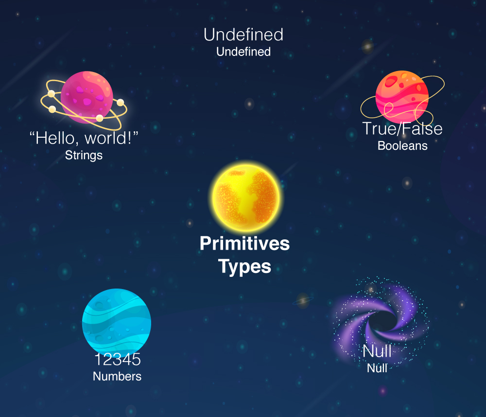
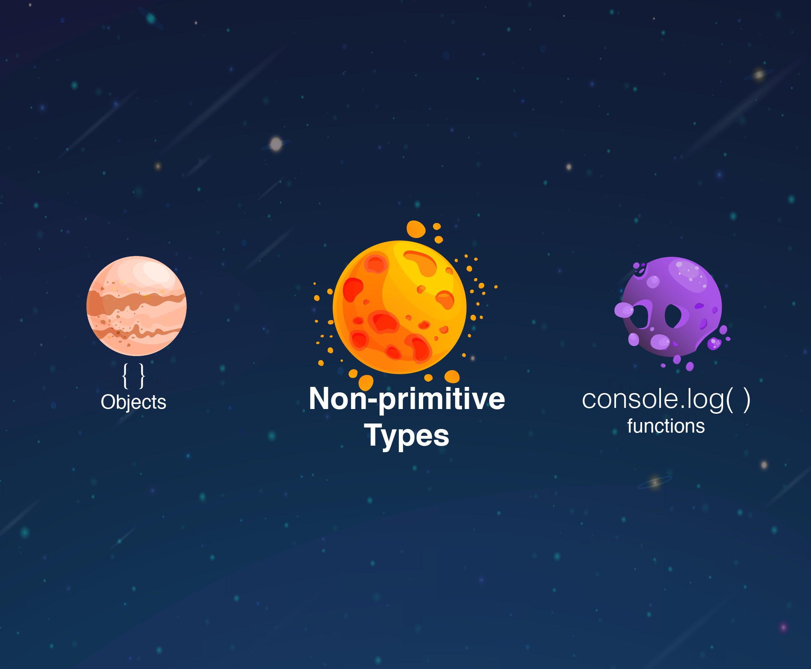

## Objectifs

* Vérifier le type d'une expression

## Pré-requis

Avoir validé les quêtes suivantes :

```quests
1262,1267,1268
```

## Introduction

Dans les quêtes précédentes, tu as **découvert ce qu'est Javascript et à quoi ressemble la syntaxe**. Tu as également appris comment **créer des variables**.

Dans cette quête, tu apprendras les différents types de valeurs qui peuvent être utilisés en Javascript.
Pour l'instant, nous n'avons utilisé que des **chaînes et des nombres**, mais il existe de nombreux autres types de données.

C'est parti !


## Sommaire

## L'opérateur "typeof"

En javascript, on peut utiliser un **opérateur** appelé "typeof" pour **voir** le **type de données** d'une valeur.
Pour ce faire, on peut simplement **écrire** `typeof` suivi de la valeur que nous voulons vérifier.


Ouvre la console du navigateur et essaye ce code :

```javascript
typeof 1;
```

Tu verras apparaître résultat `"number"` car la valeur `1` est bien un nombre.

## Deux catégories de types de données

En Javascript, il existe **sept** types de données différents. Ils sont classés en deux catégories :
**Primitifs** et **non-primitifs**.

### Les types primitifs

Une **valeur primitive** est une valeur qui **ne peut pas changer** (on dit généralement que ces valeurs sont **immutables**, qu'elles ne peuvent pas muter).

Pense aux nombres. Tu peux écrire un code comme celui-ci :

```javascript
let a = 1;
a = 2;
```

Dans ce code, tu modifies la valeur pointée par `a`. Mais tu n'as pas modifié la valeur `1`. Tu n'écrirais jamais quelque chose comme ça :

```javascript
1 = 2;
```

Tu ne peux pas modifier la valeur `1` pour qu'elle devienne `2`. Le nombre `1` sera toujours le nombre `1`. C'est ce que nous entendons par **immutable**.



Voici les types de données primitifs :

**Boolean**

Les booléens sont utilisés pour représenter le **vrai** (`true`) ou le **faux** (`false`).

```javascript
typeof true;
// "boolean"
```

**String**

Une "String" est une **chaîne (suite) de caractères**. Les chaînes sont toujours entourées de **guillemets doubles** (`""`) ou **simples** (`''`) .

```javascript
typeof "Hello, World !";
// "string"
```

**Number**

Les nombres sont une **représentation d'un nombre entier ou décimal.**

```javascript
typeof 1234;
// "number"
typeof 12.54;
// "number"
```

**Null**

La valeur `null` est utilisée pour **représenter une absence intentionnelle de valeur.**

Si tu utilises `typeof` avec `null`, tu verras que le **type de null** est **"object"** ;

C'est une **erreur** qui a été **implémentée dans l'ECMAScript depuis le début** et **ne peut plus être corrigée** de nos jours.

```javascript
let empty = null;
typeof empty;
// "object"
```

**Undefined**

`undefined` est la valeur par défaut d'une **variable qui existe** (car elle est déclarée) **mais qui n'a pas encore de valeur** (car elle n'a pas été initialisée/assignée).

```javascript
let notDefined;
typeof notDefined;
// "undefined"
```

```alert-warning
# Important
Il est important de comprendre que "undefined" ne s'applique qu'aux variables qui ont été créées, mais qui ne contiennent aucune valeur. 

Si tu essaies d'appeler une variable qui n'existe pas (qui n'a pas été déclarée), tu obtiendras une `ReferenceError`, ce qui n'est pas du tout la même chose.
```

```javascript
let notDefined;
console.log(notDefined);
// "undefined"

console.log(nothing);
// ReferenceError: nothing is not defined
```

Comme tu peux le voir, **même si le message d'erreur dit "non défini", ce qui peut prêter à confusion**, ce n'est pas la même chose que `undefined`. `ReferenceError` est une erreur fatale ☠️ qui **provoque l'arrêt de l'exécution du Javascript**.

### Types complexes (non-primitifs)



Les valeurs non primitives sont des valeurs qui **peuvent changer** (on dit qu'elles sont **mutables**). 

**Functions**

Une fonction est un bloc de code utilisé pour exécuter un ensemble d'instructions.

On peut exécuter (on dit aussi **appeler** ou **invoquer**) une fonction en écrivant son nom suivi de parenthèses.

*`console.log("hello")`*

```javascript
typeof console.log;
// "function"
```

```alert-info
L'opérateur `typeof` distingue les fonctions des objets. En fait, une fonction en Javascript peut être considérée comme un type particulier d'objet ! 
Tu pourras regarder [ici](https://developer.mozilla.org/en-US/docs/Web/JavaScript/Reference/Functions) quand tu auras le temps pour approfondir cela.
```

**Objects**

Nous parlerons davantage des objets dans une autre quête. Pour le moment, saches que les objets sont en quelque sorte des "boîtes" qui peuvent contenir des *clés* associées à des *valeurs,* un peu comme dans un dictionnaire où on a des mots associés à des définitions.

Ces paires *"clé/valeur"* sont entourés d'accolades pour délimiter l'objet décrit.

Les valeurs contenues dans un objet peuvent être de n'importe quel type, cela peut même être des fonctions ! Une fonction contenue dans un objet sera appelée **"méthode"**.

```javascript
const person = {
  name: "Bob", 
  age: 25, 
  sayHello: function(){
    console.log("Hello");
  }
}

person.sayHello();
// "Hello"

typeof person;
// "object"
```

**Array**

Les *Arrays* sont utilisés pour **stocker plusieurs valeurs au sein d'une même variable**.

```javascript
const colors = ["Red", "Blue", "Yellow"];

```

```alert-warning
Array n'est pas un type de donnée à proprement parler, c'est un "sous-type" (un cas particulier) du type Object. 
```

```javascript
typeof colors;
// "object"
```

**🔬 Fais une expérience**

Ouvre la console de ton navigateur et utilise l'opérateur `typeof` sur plusieurs valeurs différentes pour observer le résultat.

## Résumé

En Javascript, les types de données sont divisés en deux catégories : les types dits "primitifs" et les types "complexes" (non-primitifs) :

* Les types de données primitifs (immutables) :
    * Boolean
    * String
    * Number
    * Null
    * Undefined
* Les autres (mutables) :
    * Object
    * Function