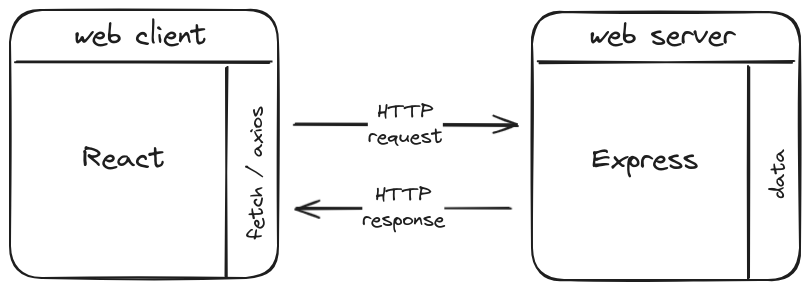
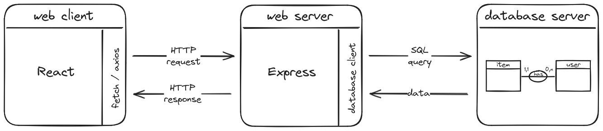
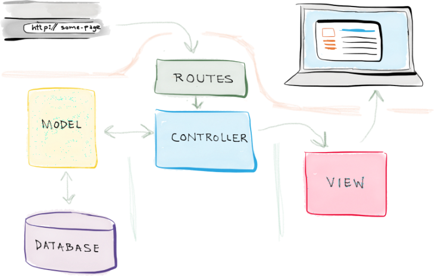
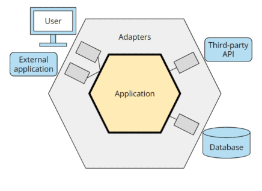
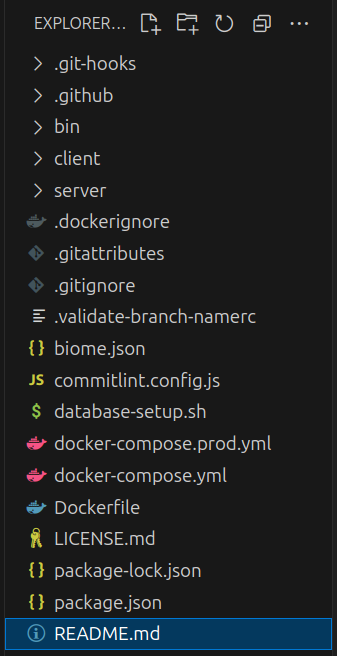
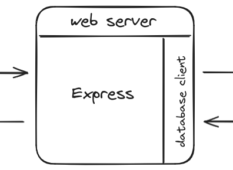

## Objectifs

- Découvrir différentes architectures web
- Comprendre la philosophie de notre monorepo JS

## Pré-requis

````stepper
# Valider les quêtes suivantes
```quests
2933, 484
```
# Être à l'aise avec l'architecture client-serveur du web

# Identifier les 3 étapes pour créer une application serveur avec Express
```javascript
import express from "express";

// Création de l'application Express

const app = express();

// Déclaration des routes

const sayHello = (req, res) => {
  res.send("Hello World!");
};

app.get("/", sayHello);

// Écoute du port

const port = 3310;

app.listen(port, () => {
  console.log(`Example app listening on port ${port}`);
});
```
````

## Introduction

Cette quête est une présentation générale de notre framework maison utilisés pendant les projets. Rappelle toi ce schéma :


Notre monorepo JS est un framework qui combine une application cliente React et une application serveur avec Express, le tout réuni dans un seul et même projet.

Plus encore, ce monorepo va te permettre d'aller plus loin sur la partie `data`. Voici un schéma étendu en ajoutant la communication avec une base de données :



Et surtout, nous allons aborder un gros pavé des manuels : l'architecture. Pourquoi parler architecture dans le cadre de la formation alors que nous restons sur des "petits" projets ?

Une architecture propose une structure claire et organisée pour une application web, permettant une séparation nette des préoccupations. Comprendre une architecture est crucial pour s'intégrer dans le développement d'une application web robuste et évolutive. Avoir un début du culture sur le sujet te permettra de te sentir plus à l'aise pour ton insertion professionnelle.

## Sommaire

## Des architectures (liste non exhaustive)

### Architecture MVC

L'**architecture MVC (Modèle-Vue-Contrôleur)** est centrée sur 3 responsabilités :

- **Modèle** : accéder aux données (le plus souvent d’une base de données, mais pas toujours).
- **Vue** : formater le contenu pour le renvoyer au client (en HTML, JSON, CSV…).
- **Contrôleur** : orchestrer la totalité (pour faire simple, disons tout ce qui n’est pas de la responsabilité d’un modèle ou d’une vue).

L'architecture MVC sert de base à beaucoup de framework leaders du marché comme Symfony, Laravel, Spring... C'est quasi un incontournable dans la vie des devs web. Cependant, dans l'univers JavaScript, elle est parfois remplacée par des approches plus modulaires ou adaptées aux spécificités de Node.js (comme les autres architectures que nous allons explorer).

```resource
https://blog.codeanalogies.com/2016/05/02/model-view-controller-mvc-explained-through-ordering-drinks-at-the-bar/
# Le Modèle-Vue-Contrôleur (MVC) expliqué à travers la commande de boissons au bar

```

```xtext arrow
Dans l'ordre :

- Le client (navigateur web, application mobile...) **envoie une requête** au serveur en utilisant une URL et une méthode HTTP (`HTTP Request`)..
- Le serveur reçoit la requête et, à l'aide d'un **système de routage**, détermine à quel contrôleur passer la requête en fonction de l'URL et de la méthode HTTP.
- Le contrôleur, qui est responsable de la logique pour **traiter la requête**, va utiliser un ou plusieurs modèles pour récupérer les données nécessaires.
- Les modèles, qui gèrent l'accès aux données, vont interroger la base de données pour **récupérer les données** nécessaires via une requête SQL (`SQL Query`).
- Le contrôleur, après avoir obtenu les données et appliqué la logique nécessaire, **met en forme les données** dans une vue.
- La vue, remplie avec les données, est intégrée dans la **réponse HTTP**.
- Finalement, le serveur **envoie la réponse** générée au client.
```

### Architecture hexagonale

L'**architecture hexagonale**, aussi appelée "port and adapter" (ports et adaptateurs), est une façon de structurer une application pour la rendre plus flexible, facile à tester, et indépendante des technologies externes (comme une base de données ou une API).

Le principe de base :

1. **Noyau central (domaine)** : contient les règles métier et la logique principale. Il est totalement indépendant des détails techniques.
2. **Ports** : des interfaces qui définissent les points d'entrée (ex. : API, interface utilisateur) et de sortie (ex. : stockage, communication avec d'autres systèmes).
3. **Adaptateurs** : des implémentations concrètes qui connectent les ports aux technologies externes (comme une base de données ou une interface utilisateur).

En isolant le cœur de l'application des détails techniques, une architecture hexagonale permet de facilement remplacer ou modifier des parties externes (comme changer de base de données) sans toucher à la logique métier.

C'est comme une prise électrique : le noyau est la prise standard, et les adaptateurs permettent de brancher différents appareils selon les besoins.



```alert-info
L'hexagone est une métaphore pour indiquer plusieurs interfaces autour du cœur de l'application. Mais en réalité, il s'agit d'une abstraction ; un cercle ou un carré fonctionnerait tout aussi bien !
```

### Architecture modulaire

Une **architecture modulaire**, est une façon d'organiser une application en **modules indépendants** qui regroupent les fonctionnalités liées. 

Chaque module agit comme un "compartiment" contenant tout ce dont il a besoin (comme des contrôleurs, des services, et des modèles) pour remplir une tâche spécifique. Par exemple, un module "utilisateurs" pourrait gérer tout ce qui concerne l'inscription, la connexion et le profil des utilisateurs.

C'est une architecture utilisée par des frameworks comme Nest.js pour rendre le code **plus clair**, **plus facile à maintenir** et **évolutif**. C'est aussi l'architecture que nous avons choisi pour la partie "serveur" de notre Monorepo JS.

## Le "JS Monorepo"

Le "JS Monorepo" est un framework maison, conçu pour te permettre de travailler sur le développement côté serveur (Express) et côté client (React) dans un seul et même projet.

À la `Wild Code School`, nous avons créé notre framework pour 2 raisons principales :

- te permettre de te concentrer sur le développement de ton application sans te soucier de la configuration de l'environnement de travail ;
- te rapprocher des codes complexes que tu pourras rencontrer en milieu professionnel.

```alert-warning
Ce Monorepo JS est un framework pédagogique. **Ce n'est pas un outil que tu retrouveras ensuite en entreprise.** Mais son architecture et les styles de code utilisés, inspirés des outils standards de l'industrie, te prépareront à travailler sur des "vrais" projets.
```

Avec ce framework, tu peux :

- Créer un projet complet avec une application cliente React et une application serveur avec Express en quelques minutes.
- Lancer les applications React et Express en parallèle pour travailler sur le développement côté client et côté serveur dans un seul et même projet.
- Profiter d'une architecture modulaire pour structurer ton projet et séparer les préoccupations.
- Utiliser des outils de développement comme Biome, Jest, etc., pour améliorer la qualité de ton code.
- Personnaliser ton projet en fonction de tes besoins et de tes préférences.
- Contribuer à l'amélioration du monorepo en proposant des idées, des suggestions ou des corrections.

```xtext callout
Si tu souhaites contribuer à l'amélioration de ce projet, tu peux le faire en commençant par lire ce document : [Contribution](https://github.com/WildCodeSchool/create-js-monorepo/blob/main/CONTRIBUTING.md).
```

### Visite Guidée

Avant que tu crées un projet avec le monorepo, voyons ensemble à quoi tu dois t'attendre.

Voici un aperçu de l'arborescence de ton projet :



Cela fait beaucoup de choses, mais voici l'essentiel :

- **`client`** : Ce dossier contiendra le code de ton application cliente React.
- **`server`** : Ce dossier contiendra le code de ton application serveur avec Express.
- **`package.json`** : Ce fichier contiendra les scripts pour "piloter" les 2 dossiers `client` et `server`.
- **`README.md`** : Ce fichier contiendra les informations clés pour démarrer.

### Côté serveur

Le dossier `server` contiendra le code de ton application serveur avec Express.

Voici quelques éléments que tu pourras trouver dans ce dossier :

```js wrap
server
├── package.json
├── database
│   └── client.ts
└── src
    ├── app.ts
    ├── main.ts
    ├── router.ts
    └── modules
        └── ...
```

C'est un parfait miroir de ce que tu as vu sur le schéma au début de cette quête : un serveur web composé d'une application Express et d'un client de base de données.



Une fois encore, tu découvriras chaque partie étape par étape durant ce parcours de quête. Je vais seulement te spoiler le fichier `server/index.js`.

### Le fichier main.ts du serveur

Le fichier `main.ts` du dossier `server/src` est le point d'entrée de ton serveur. C'est ce fichier qui, d'import en import, fera appel à toutes les composantes du projet pour créer, configurer et lancer ton application Express.

Voici à quoi ressemblera ce fichier `main.ts` :

```typescript
// Load environment variables from .env file
import "dotenv/config";

// Check database connection
// Note: This is optional and can be removed if the database connection
// is not required when starting the application
import "../database/checkConnection";

// Import the Express application from ./app
import app from "./app";

// Get the port from the environment variables
const port = process.env.APP_PORT;

// Start the server and listen on the specified port
app
  .listen(port, () => {
    console.info(`Server is listening on port ${port}`);
  })
  .on("error", (err: Error) => {
    console.error("Error:", err.message);
  });
```

Un peu flou ? Gommons quelques éléments pour y voir plus clair :

```typescript
// ...

// Le lien avec la base de données commence à apparaitre

import "../database/checkConnection";

// ...

// Récupération de l'application Express

import app from /* ... */;

// La déclaration des routes aurait pu apparaitre

/* ici */

// Écoute du port

const port = /* ... */;

app
  .listen(port, () => {
    console.info(`Server is listening on port ${port}`);
  })
  /* ... */;
```

C'est (presque) le même code que celui que nous avons utilisé pour lancer notre serveur Express dans une quête précédente :

```javascript
/* import express from "express"; */

// Création de l'application Express

const app = /* express() */;

// Déclaration des routes

/* ... */

// Écoute du port

const port = /* 3310 */;

app
  .listen(port, () => {
    console.log(`Example app listening on port ${port}`);
  });
  /* Nous avions mis de côté la gestion des erreurs */
```

C'est normal : même si nous avons construit un framework autour, l'application serveur reste une application Express "comme les autres".

````xtext callout
Ce que tu appris précédemment sur Express, la déclaration des routes, la construction des réponses HTTP... reste complètement valide.

Même si tu as l'impression de plonger dans un univers différent dans la suite du parcours, tu pourras toujours te raccrocher à ces notions.

```quests
2933
```
````

## Challenge

Afin de voir si tu as bien suivi, voici un quiz pour tester ta compréhension.

Tu dois répondre correctement à toutes les questions 😉