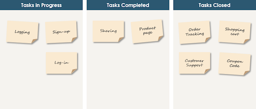
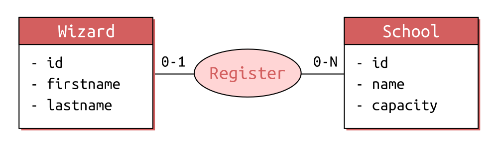
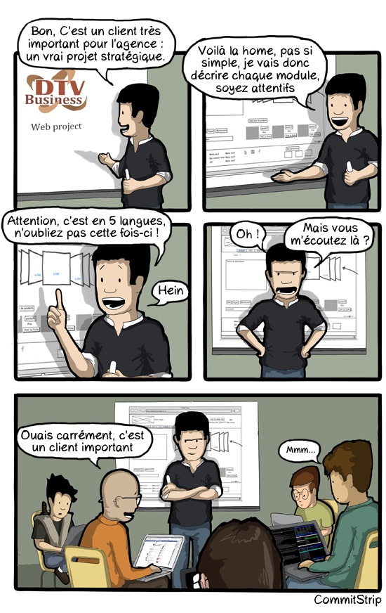
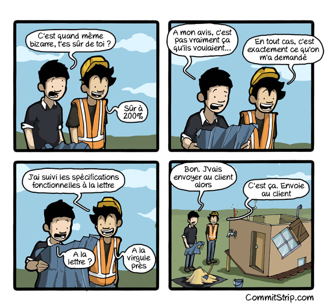
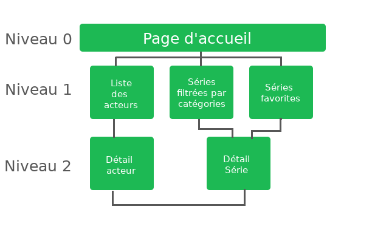
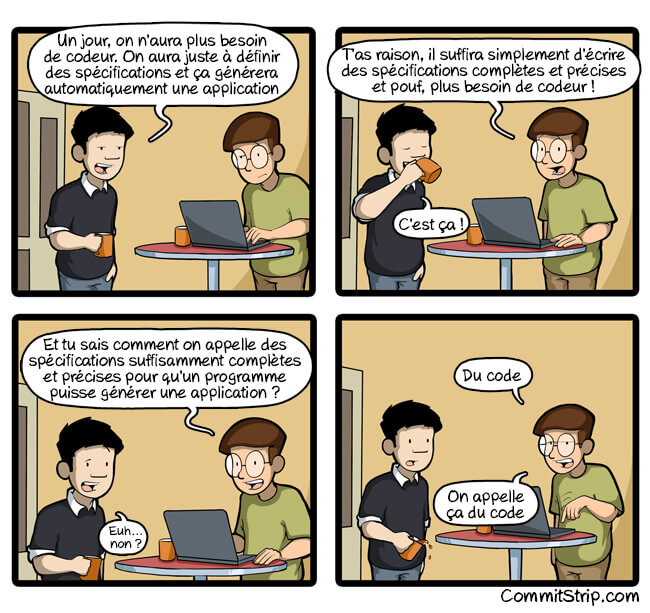
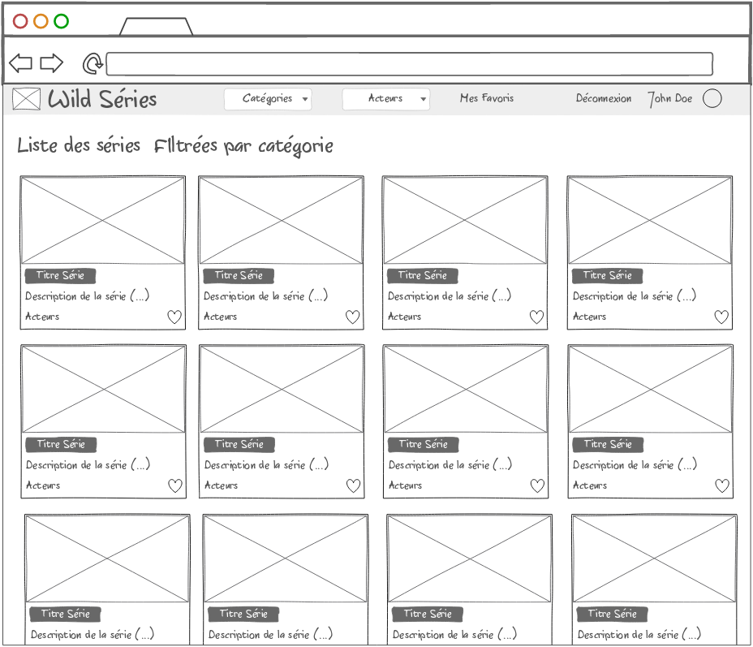
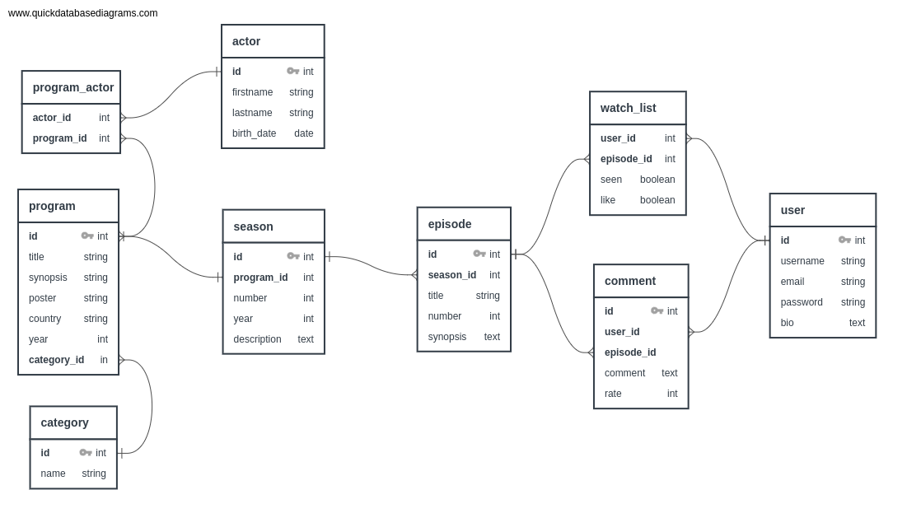
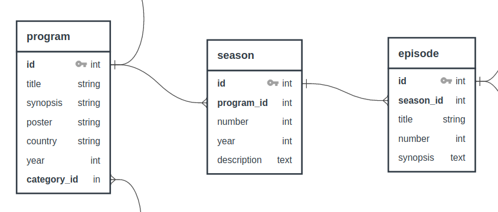

## Objectifs

- Comprendre et analyser les spécifications techniques et fonctionnelles
- Concevoir un wireframe
- Créer un styleguide

## Pré-requis

````stepper
# Valider les quêtes suivantes
```quests
1301, 504
```
# Savoir te repérer sur un "scrum board"

# Identifier les entités et leurs relations sur un MCD

````

## Sommaire

## Introduction

Cette quête est le point de départ d'un long parcours avec beaucoup d'Express. Ce parcours te guidera dans le développement d'un projet fil rouge : l'application web _Wild Series_.

```xtext callout
Démarrer un nouveau projet ne veut pas dire foncer tête baissée dans le code ! 🐑

Tu le sais déjà, tout projet doit démarrer par une **phase de conception**.
```

## Kick-off meeting

Ça y est ! Tu es dev web ! Et aujourd'hui, tu assistes au _kick-off_ du nouveau projet d’application web présenté par le _product owner_.



```alert-info
 _Si tu ne connais pas [CommitStrip](https://www.commitstrip.com/fr/?), ces planches humoristiques sont malheureusement souvent assez proches de la réalité_ 😂.
```

Voici le debrief de la présentation du PO :

- Le client souhaite une application web similaire à [Betaseries](https://www.betaseries.com/series)

- Les _user stories_ et _wireframes_ seront fournies par le client (sauf le _wireframe_ de la page d’accueil pour lequel il nous laisse carte blanche)

```resource
https://www.manager-go.com/gestion-de-projet/dossiers-methodes/kick-off-meeting
# Kick-off meeting
```

## Spécifications fonctionnelles



Les spécifications fonctionnelles décrivent les fonctionnalités de l’application. Elles sont rédigées avant le développement de l’application pour un projet en cycle en V et prendront corps tout au long de son déroulement en gestion de projet agile.

Dans le cadre d’une gestion de projet en cascade ou cycle en V, le périmètre fonctionnel est parfaitement cadré dès le début.


En méthode agile, les développeurs s’appuient plutôt sur un _product backlog_. Cependant, il arrive que des spécifications fonctionnelles soient fournies. Dans ce cas, elles permettent d’aider au découpage des _user stories_ et de leur répartition en différentes tâches.

```resource
https://docs.google.com/document/d/1JUu4AIbQ8XMlGUEjm-DfulNb0mSEP14GtZmG3Z20F94/edit#heading=h.i0q50nk96izu
# Exemple de spécifications fonctionnelles
Spécifications fonctionnelles issues du cahier des charges de la réalisation du site web de l’hôtel Paradis
```

### _Wild Series_, ce qui est attendu

✔️ Création d’une application web responsive et dynamique.

### Les principales fonctionnalités
✔️ Pouvoir afficher les séries par catégorie
✔️ Pouvoir afficher la distribution artistique des séries
✔️ Pouvoir ajouter des séries en favori
✔️ Pouvoir administrer tout le contenu du site
✔️ Pouvoir gérer les comptes utilisateurs

### Parcours utilisateur (arborescence) :



## Spécifications techniques



Les spécifications techniques abordent les aspects techniques de l’application.
Elles sont rédigées par des profils techniques (devs, tech lead, etc.), après avoir pris connaissance des spécifications fonctionnelles de l’application.

Elles comportent généralement les choix technologiques et les raisons de ces choix, les besoins matériels (serveurs, base de données, etc).

```resource
https://docs.google.com/document/d/1JUu4AIbQ8XMlGUEjm-DfulNb0mSEP14GtZmG3Z20F94/edit#heading=h.4hw2ngj10ef4
# Exemple de spécifications techniques
Spécifications techniques issues du cahier des charges de la réalisation du site web de l’hôtel Paradis
```

### La stack technique

- Côté Serveur : Express
- Côté client : React
- Côté style : CSS Modules (tu peux aussi donner une chance à [pico.css](https://picocss.com/) qui est un bon outil d'apprentissage).

### User stories et wireframes

Voici le *scrum board* réalisé suite aux *users stories*. Nous l’utiliserons tout le long de nos quêtes *Wild Series* :

````columns
**User stories** 📋
```xtext callout
en tant que contributeur, je souhaite ajouter une série
```
```xtext callout
en tant que contributeur, je souhaite modifier une série
```
```xtext callout
en tant que contributeur, je souhaite supprimer une série
```
!---
**In progress** 🤸
```xtext callout
en tant que visiteur, je souhaite récupérer les données d'une série
```
!---
**In review** 🧐
```xtext callout
en tant que visiteur, je souhaite récupérer la liste des séries
```
!---
**Done** ✅
```xtext callout
initialisation du projet
```
````

Certaines *user stories* pourront représenter une quête entière, d’autres pourront être découpées en plusieurs quêtes. De la même façon qu’une *user story* peut être découpée en plusieurs tâches.

Tu le retrouveras mis à jour au début de chaque quête.

Et ci-dessous, le wireframe fourni directement par le client.



### Modélisation de la base de données

Tu as de la chance : pour ce qui est de la base de données, tu n’as pas trop à te creuser la tête. L’équipe d’architectes DB de la Wild Code School a pris le temps de te soumettre une ébauche de schéma.

Attention, le visuel ci-dessous n’est pas contractuel !

Comme tu le sais déjà, une base de données, c’est vivant ! Ça peut évoluer au cours du temps selon les besoins. Mais cela te permet d’avoir un aperçu de ce dans quoi tu t’embarques :



```alert warning
Comme pour le scrum board, tu n'as pas forcément besoin que le schéma soit complet dès le départ : il évoluera. Tu as besoin du strict nécessaire pour démarrer. Au début d'un projet, concentre toi toujours sur la ressource centrale de ton application (dans le cas présent, les séries et l'entité `progam`).


```

## Challenge

### Homepage *Wireframe* & *Style Guide*

Pour ce projet, les *user stories* et le *wireframe* principal sont déjà réalisés.

Mais le wireframe n'est que la première étape dans le cycle "wireframe > maquette > prototype".

Bien que le *wireframe* de base soit fourni, tu dois encore :

* 🏗️ Réaliser le *wireframe* de la page d’accueil (en utilisant Figma par exemple).

  ```alert-info
  Donne libre cours à ta créativité, sans ajouter sur la page d’accueil des fonctionnalités qui ne sont pas présentes dans les *user stories*.
  ```
* Préparer le passage vers la maquette, ce qui te permettra de démarrer ton prototype. Tu dois :
  * 🎨 Choisir les couleurs principales et secondaires de ton application
  * 🖌️ Choisir tes typographies

À ton tour de réfléchir à la conception !


Comme cette application sera finalement unique et la tienne, nous te laissons le choix de la charte graphique : crée un *styleguide* à ton goût !

Pour exemple, voici ce à quoi peut ressembler un [StyleGuide](http://hugeinc.github.io/styleguide/demo/).

```alert-warning
Bien que cette ressource t'amène vers un dépôt Github te permettant de générer ton propre styleguide nous n'attendons pas de toi que tu le réutilises. Seulement que tu t'en inspires pour présenter les élèvements essentiels de ta charte graphique !
```

### Critères de validation

* Le lien vers le *wireframe* de la page d’accueil est disponible
* Le *styleguide* comporte a minima une palette de couleurs et une typographie et est fourni avec le wireframe.