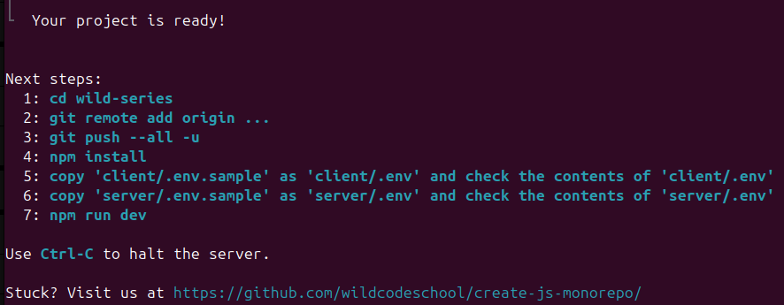
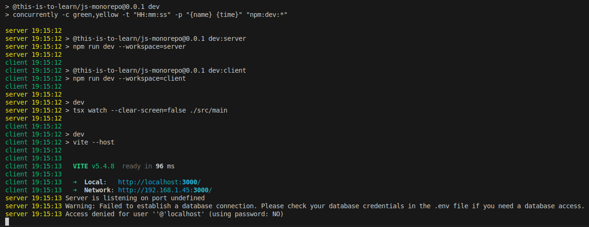

## Objectifs

- Créer un projet "Monorepo JS"
- Lancer les applications clientes et serveur en parallèle
- Créer une première route dans l'application Express

## Pré-requis

````stepper
# Valider les quêtes suivantes
```quests
1549, 588
```
# Avoir compris l'architecture globale du "JS Monorepo"
```xtext story
[...] voici l'essentiel :

- **`client`** : Ce dossier contiendra le code de ton application cliente React.
- **`server`** : Ce dossier contiendra le code de ton application serveur avec Express.
```
```alert-warning
Rappel : Ce Monorepo JS est un framework pédagogique. **Ce n'est pas un outil que tu retrouveras ensuite en entreprise.** Mais son architecture et les styles de code utilisés, inspirés des outils standards de l'industrie, te prépareront à travailler sur des "vrais" projets.
```
# Être à l'aise avec la syntaxe pour déclarer une route sur une application Express
```js
// Déclaration des routes

const sayHello = (req, res) => {
  res.send("Hello World!");
};

app.get("/", sayHello);
```
````

## Sommaire

## Introduction

Ça y est, après la phase de conception, tu vas enfin pouvoir commencer à entrer dans le code !

Pour commencer simplement, tu vas créer un projet vierge, le configurer et le versionner. C’est ce même projet que tu dois réutiliser à chaque nouvelle quête du parcours Wild Series pour qu’il soit finalisé à la fin de ta formation !

````columns
**User stories** 📋
```xtext callout
en tant que visiteur, je souhaite récupérer la liste des séries
```
```xtext callout
en tant que visiteur, je souhaite récupérer les données d'une série
```
```xtext callout
en tant que contributeur, je souhaite ajouter une série
```
```xtext callout
en tant que contributeur, je souhaite modifier une série
```
```xtext callout
en tant que contributeur, je souhaite supprimer une série
```
!---
**In progress** 🤸
```xtext callout
**initialisation du projet**
```
!---
**In review** 🧐
!---
**Done** ✅
````

## Créer un projet "Monorepo JS"

L'outil te met à disposition une commande pour créer un projet :

```bash
npm create @this-is-to-learn/js-monorepo@latest my-project
```

Tu dois la lancer dans ton terminal, dans le dossier où tu souhaites créer ton projet et en remplaçant `my-project` par le nom de ton projet. Par exemple :


```bash
npm create @this-is-to-learn/js-monorepo@latest wild-series
```

Cette commande va créer un nouveau dossier `wild-series` dans lequel tu trouveras un projet prêt à l'emploi.



Rends-toi ensuite dans le dossier de ton projet :

```bash
cd wild-series
```

Et lance l'installation des dépendances :

```bash
npm install
```

## Lancer les applications cliente et serveur

Pour lancer les applications cliente et serveur en parallèle, tu peux utiliser la commande suivante :

```bash
npm run dev
```

Cette commande va lancer l'application React et l'application Express en parallèle, et te permettre de travailler sur le développement côté client et côté serveur dans un seul et même projet.

Tu devrais voir apparaître des logs similaires dans ton terminal :



Tu peux également lancer les applications cliente et serveur séparément en utilisant les commandes suivantes :

```bash
npm run dev:client
npm run dev:server
```

### Mais comment ça marche ?

La commande `npm run dev` correspond à un script, défini dans le fichier `package.json` à la racine du projet :

```json hl[1,7]
  "scripts": {
    "build": "npm run build --workspaces --if-present",
    "check": "biome check --error-on-warnings --no-errors-on-unmatched --staged . && npm run check-types --workspaces --if-present",
    "clean": "node ./bin/clean",
    "db:migrate": "npm run db:migrate --workspace=server",
    "db:seed": "npm run db:seed --workspace=server",
    "dev": "concurrently -c green,yellow -t \"HH:mm:ss\" -p \"{name} {time}\" \"npm:dev:*\"",
    "dev:client": "npm run dev --workspace=client",
    "dev:server": "npm run dev --workspace=server",
    "prepare": "husky || true",
    "start": "npm run start --workspace=server",
    "test": "npm run test --workspaces --if-present"
  },
```

- **`concurrently`** : cet outil permet d'exécuter plusieurs commandes en parallèle dans le même terminal. C'est utile pour démarrer plusieurs processus en même temps, comme deux serveurs de développement.

- **`-c green,yellow`** : cette option configure les couleurs des sorties dans le terminal pour chaque commande exécutée par `concurrently`. La première commande aura sa sortie en vert, et la deuxième en jaune, ce qui facilite la distinction entre les sorties des différentes commandes.

- **`-t \"HH:mm:ss\"`** : cela définit le format de l'horodatage pour les sorties dans le terminal, ici en heures, minutes et secondes.

- **`-p \"{name} {time}\"`** : cela configure le préfixe de chaque ligne de sortie dans le terminal pour inclure le nom de la commande exécutée et l'horodatage, selon le format défini précédemment.

- **`\"npm:dev:*\"`** : cette partie spécifie les commandes à exécuter simultanément par concurrently. Le wildcard `*` indique de chercher toutes les commandes dans le `package.json` dont les noms commencent par `dev:`, comme `dev:client`, `dev:server`, etc., et de les exécuter en parallèle.

Tu as créé ton premier projet "Monorepo JS" et tu as lancé le client et le serveur en parallèle 🎉

Tu peux déjà voir l'application React dans ton navigateur en ouvrant l'adresse `http://localhost:3000`.

## Monorepo, côté Express

````xtext callout
Tu as déjà eu un aperçu dans une précédente quête, dans la partie "Visite guidée" :
```quests
1549
```
N'hésite pas à le relire si tu en resens le besoin.
````

Le dossier `server` contient (entre autre) le code d'une application Express.

Voici un aperçu des éléments du dossier `server` que nous allons aborder pendant le parcours _Wild Series_ :

```js wrap
server/
├── database/
│   └──  ...
├── src/
│   ├── modules/
│   │   ├── item/
│   │   │   ├── itemActions.ts
│   │   │   └── itemRepository.ts
│   │   └── ...
│   ├── app.ts
│   ├── main.ts
│   └── router.ts
├── tests/
│   └──  ...
├── .env
└── .env.sample
```

Comme tu peux le voir, le dossier `server` contient plusieurs dossiers et fichiers. Pour l'instant, Ouvrons à nouveau le fichier `src/main.ts` qui est le point d'entrée de l'application Express.

### Le fichier main.ts du serveur (bis)

Voici le code exact que tu devrais trouver dans `server/src/main.ts` :

```typescript
// Load environment variables from .env file
import "dotenv/config";

// Check database connection
// Note: This is optional and can be removed if the database connection
// is not required when starting the application
import "../database/checkConnection";

// Import the Express application from ./app
import app from "./app";

// Get the port from the environment variables
const port = process.env.APP_PORT;

// Start the server and listen on the specified port
app
  .listen(port, () => {
    console.info(`Server is listening on port ${port}`);
  })
  .on("error", (err: Error) => {
    console.error("Error:", err.message);
  });
```

````xtext arrow
Avant d'aller plus loin, regardons de plus près ces deux instructions :
    
```typescript hl[2,13]
// Load environment variables from .env file
import "dotenv/config";

// Check database connection
// Note: This is optional and can be removed if the database connection
// is not required when starting the application
import "../database/checkConnection";

// Import the Express application from ./app
import app from "./app";

// Get the port from the environment variables
const port = process.env.APP_PORT;

// Start the server and listen on the specified port
app
  .listen(port, () => {
    console.info(`Server is listening on port ${port}`);
  })
  .on("error", (err: Error) => {
    console.error("Error:", err.message);
  });
```

La première ligne charge les variables d'environnement depuis le fichier `.env` situé à la racine du dossier `server`. La deuxième ligne récupère depuis les variables d'environnement le port sur lequel le serveur doit écouter.
````

### Les variables d'environnement

Les variables d'environnement sont des variables qui modifient l'environnement d'exécution d'une application.

```xtext quote
Mais à quoi servent ces variables d'environnement ?
```

Elles sont utilisées pour stocker des informations sensibles ou des configurations spécifiques à l'environnement comme des mots de passe, des clés secrètes, des adresses de serveurs, etc.

Dans le cas de notre serveur Express, nous utilisons les variables d'environnement pour stocker le port sur lequel le serveur doit écouter, la clé secrète de l'application, les informations de connexion à la base de données, l'URL du client (pour la configuration CORS), etc.

Attention, les variables d'environnement ne doivent pas être partagées ou exposées publiquement. C'est pourquoi il est important de vérifier que le fichier qui les contient (le fichier `.env`) est bien ignoré par Git dans le fichier `.gitignore`.

Si tu en as pas déjà un, crée un fichier `.env` à la racine du dossier `server` et ajoute le contenu suivant :

```bash
# .env - Environment Variables

# Application Configuration
APP_PORT=3310
APP_SECRET=YOUR_APP_SECRET_KEY

# Database Configuration
DB_HOST=localhost
DB_PORT=3306
DB_USER=YOUR_DATABASE_USERNAME
DB_PASSWORD=YOUR_DATABASE_PASSWORD
DB_NAME=YOUR_DATABASE_NAME

# Client URL (for CORS configuration)
CLIENT_URL=http://localhost:3000

# About specific needs, please ask your trainer about the deployment project name and follow the pattern
# You can add as much variable as needed. Don't forget to tell your trainer about it. Otherwise, it could break on deployment
PROJECT_NAME_SPECIFIC_NAME=YOUR_SPECIFIC_VALUE
```

Ce contenu est un copié/collé du fichier d'exemple (*sample* en anglais) `.env.sample` à la racine du dossier `server`.

La variable `APP_PORT` définit le port sur lequel nous voulons que le serveur écoute. Dans cet exemple, le serveur écoute sur le port `3310`.

Nous reviendrons sur les autres variables d'environnement en temps voulu. Au passage et si tu en as pas déjà un, crée aussi un fichier `.env` à la racine du dossier `client` en te basant sur le fichier `client/.env.sample`.

````alert-warning
Modifier le fichier `.env` ne relance pas automatiquement le serveur. Si tu modifies `server.env` après avoir exécuté la commande `npm run dev`, tu devras relancer manuellement le serveur pour prendre en compte les nouvelles variables d'environnement.

Utilise `Ctrl+C` dans ton terminal pour arrêter le serveur, puis relance-le avec la commande suivante :

```bash
npm run dev
```
````

## Résumé

Pour créer et utiliser un nouveau projet "Monorepo JS", tu dois respecter les étapes suivantes :

- Créer le projet avec la commande `npm create @this-is-to-learn/js-monorepo@latest my-project` où `my-project` est le nom de ton projet.
- Te rendre dans le dossier de ton projet avec la commande `cd my-project`.
- Lancer l'installation des dépendances avec la commande `npm install`.
- Créer un fichier `.env` à la racine du dossier `server` et y ajouter les variables d'environnement nécessaires.
- Créer un fichier `.env` à la racine du dossier `client` et y ajouter les variables d'environnement nécessaires.
- Lancer les applications React et Express en parallèle avec la commande `npm run dev`.

## Challenge

Crée ton projet `wild-series`. Crée les fichiers `.env` et définis les variables d'environnement nécessaires.

Pour l'instant, si tu ouvres l'adresse `http://localhost:3310/` dans ton navigateur, tu auras une erreur 404 avec un message du genre `Cannot GET /`. Dans le fichier `server/src/main.ts`, ajoute une nouvelle route `GET /` pour afficher un texte de bienvenue `"Welcome to Wild Series !"`.

`````xtext arrow
Un peu d'aide avec TypeScript ?

````solution
Utilise le type `RequestHandler` d'Express :

```typescript
import type { RequestHandler } from "express";

const sayWelcome: RequestHandler = (req, res) => {
  // ...
};
```
````
`````

Pousse ton projet sur GitHub, et partage le lien de ton dépôt pour valider ta quête.

### Critères de validation

- [ ] Le projet est disponible sur GitHub.
- [ ] Les fichiers `.env` ne sont pas pushés.
- [ ] Quand tu clones le projet et lance les applications avec `npm run dev`, la page `http://localhost:3310/` affiche le message `"Welcome to Wild Series !"` dans ton navigateur.

````tabs files
!--- server/src/main.ts
```typescript
// Load environment variables from .env file
import "dotenv/config";

// Check database connection
// Note: This is optional and can be removed if the database connection
// is not required when starting the application
import "../database/checkConnection";

// Import the Express application from ./app
import app from "./app";

/* ************************************************************************* */

// Declaration of a "Welcome" route

import type { RequestHandler } from "express";

const sayWelcome: RequestHandler = (req, res) => {
  res.send("Welcome to Wild Series !");
};

app.get("/", sayWelcome);

/* ************************************************************************* */

// Get the port from the environment variables
const port = process.env.APP_PORT;

// Start the server and listen on the specified port
app
  .listen(port, () => {
    console.info(`Server is listening on port ${port}`);
  })
  .on("error", (err: Error) => {
    console.error("Error:", err.message);
  });
```
````