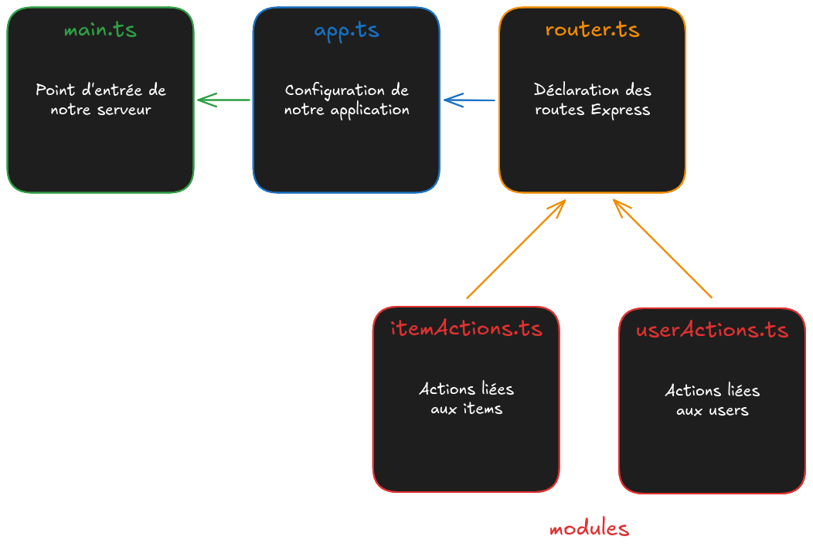
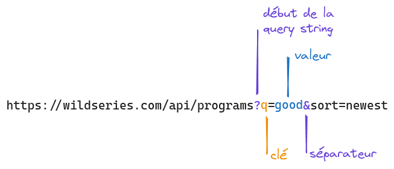
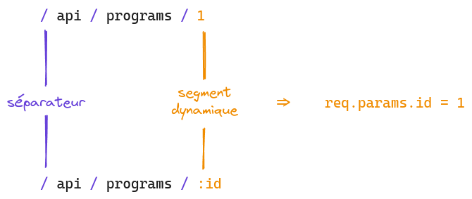

## Objectifs

- Utiliser des paramètres d'URL dans tes routes
- Intégrer des segments dynamiques dans tes chemins

## Pré-requis

````stepper
# Valider la quête suivante
```quests
590
```
# Avoir compris le système de routing du Monorepo

# Comprendre le concept de "query string"

```xtext story
Une chaîne de requête (_query string_ en anglais) est une partie d'une URL qui attribue des valeurs à des paramètres spécifiques. Ces paramètres de requête sont en général situés après le chemin d'accès, séparés par un point d'interrogation (`?`). Une chaîne de requête comprend généralement des champs ajoutés à une URL de base par un navigateur Web ou une autre application cliente [...]

[...] Dans les cas où une logique spéciale est invoquée, la chaîne de requête sera utilisée pour ajouter des options à cette logique et utilisée dans son traitement, en complément du composant de chemin de l'URL.

(https://fr.wikipedia.org/wiki/Cha%C3%AEne_de_requ%C3%AAte)
```
# Être à l'aise avec la syntaxe des "segment dynamique" dans React Router
```jsx
const router = createBrowserRouter([
  {
    path: "/articles/:id",
    element: <Article />,
  },
]);
```
```xtext story
Dans cet exemple, la route `"/articles/:id"` est configurée avec un segment dynamique `:id` : ce sont les `:` qui indiquent que le segment est dynamique. Cela signifie que l’URL `/articles/123` correspondra à cette route, où `123` est un exemple d’identifiant d’article. Grâce à ce segment dynamique, nous pouvons extraire l’identifiant de l’article directement depuis l’URL et l’utiliser pour afficher les détails de l’article correspondant.
```
````

## Sommaire

## Introduction

Dans les épisodes précédents, tu as exploré le système de routing côté serveur dans le Monorepo. Jusqu'à créer une nouvelle route pour récupérer la liste de tes séries.

Dans le développement web, tu devras souvent proposer des routes plus "fines" pour récupérer une liste filtrée (en fonction de critères de recherche par exemple), voire même des routes pour récupérer une ressource en particulier (ton profil, la page d'une série...).

Dans cette quête, tu vas utiliser `req.query` et `req.params` pour proposer ce genre de fonctionnalités.

## Avant de commencer

Assure-toi de partir d'un code fonctionnel. Depuis la création de ton projet Wild Series, voici les fichiers que tu as ouverts :

````tabs files
!--- server/src/main.ts
```typescript
// Load environment variables from .env file
import "dotenv/config";

// Check database connection
// Note: This is optional and can be removed if the database connection
// is not required when starting the application
import "../database/checkConnection";

// Import the Express application from ./app
import app from "./app";

// Get the port from the environment variables
const port = process.env.APP_PORT;

// Start the server and listen on the specified port
app
  .listen(port, () => {
    console.info(`Server is listening on port ${port}`);
  })
  .on("error", (err: Error) => {
    console.error("Error:", err.message);
  });
```
!--- server/src/router.ts
```typescript
import express from "express";

const router = express.Router();

/* ************************************************************************* */
// Define Your API Routes Here
/* ************************************************************************* */

// Define item-related routes
import itemActions from "./modules/item/itemActions";

router.get("/api/items", itemActions.browse);
router.get("/api/items/:id", itemActions.read);
router.post("/api/items", itemActions.add);

// Define program-related routes
import programActions from "./modules/program/programActions";

router.get("/api/programs", programActions.browse);

/* ************************************************************************* */

// Declaration of a "Welcome" route

import sayActions from "./modules/say/sayActions";

router.get("/", sayActions.sayWelcome);

/* ************************************************************************* */

export default router;
```
!--- server/src/modules/program/programActions.ts
```typescript
// Some data to make the trick

const programs = [
  {
    id: 1,
    title: "The Good Place",
    synopsis:
      "À sa mort, Eleanor Shellstrop est envoyée au Bon Endroit, un paradis fantaisiste réservé aux individus exceptionnellement bienveillants. Or Eleanor n'est pas exactement une « bonne personne » et comprend vite qu'il y a eu erreur sur la personne. Avec l'aide de Chidi, sa prétendue âme sœur dans l'au-delà, la jeune femme est bien décidée à se redécouvrir.",
    poster:
      "https://img.betaseries.com/JwRqyGD3f9KvO_OlfIXHZUA3Ypw=/600x900/smart/https%3A%2F%2Fpictures.betaseries.com%2Ffonds%2Fposter%2F94857341d71c795c69b9e5b23c4bf3e7.jpg",
    country: "USA",
    year: 2016,
  },
  {
    id: 2,
    title: "Dark",
    synopsis:
      "Quatre familles affolées par la disparition d'un enfant cherchent des réponses et tombent sur un mystère impliquant trois générations qui finit de les déstabiliser.",
    poster:
      "https://img.betaseries.com/zDxfeFudy3HWjxa6J8QIED9iaVw=/600x900/smart/https%3A%2F%2Fpictures.betaseries.com%2Ffonds%2Fposter%2Fc47135385da176a87d0dd9177c5f6a41.jpg",
    country: "Allemagne",
    year: 2017,
  },
];

// Declare the action

import type { RequestHandler } from "express";

const browse: RequestHandler = (req, res) => {
  res.json(programs);
};

// Export it to import it somewhere else

export default { browse };
```
!--- server/src/modules/say/sayActions.ts
```typescript
// Declare the action

import type { RequestHandler } from "express";

const sayWelcome: RequestHandler = (req, res) => {
  res.send("Welcome to Wild Series !");
};

// Export it to import it somewhere else

export default { sayWelcome };
```
````

## Qu'est-ce que req.query ?

Ouvre ton fichier `sayActions.ts` et ajoute un `console.info` comme ceci :

````tabs files
!--- server/src/modules/say/sayActions.ts
```typescript
// Declare the action

import type { RequestHandler } from "express";

const sayWelcome: RequestHandler = (req, res) => {
  console.info(req.query);

  res.send("Welcome to Wild Series !");
};

// Export it to import it somewhere else

export default { sayWelcome };
```
````

Ouvre maintenant l'adresse http://localhost:3310/?name=Jean dans ton navigateur (pense à relancer ton serveur au besoin avec `npm run dev`). Dans ton terminal, là où tu as lancé `npm run dev`, tu devrais voir une ligne similaire à celle-ci :

```log
server 16:37:11 { name: 'Jean' }
```

```xtext arrow
La partie `{ name: 'Jean' }` est la valeur de `req.query` quand ton URL se termine par `?name=Jean` : l'objet `req.query` dans Express contient les **paramètres de requête**, les paires clé-valeur de la chaine de requête (la _query string_).
```

Les paramètres de requête sont des informations envoyées dans l'URL d'une requête, après le symbole `?`. Tu peux les utiliser pour transmettre des données (non sensibles !!) telles que des critères de filtrage ou de recherche dans une requête HTTP.

Avec `req.query`, tu peux accéder à ces données et les utiliser pour modifier le comportement d'une route. Par exemple :

```typescript
// Declare the action

import type { RequestHandler } from "express";

const sayWelcome: RequestHandler = (req, res) => {
  console.info(req.query);

  res.send(`Welcome to Wild Series, ${req.query.name} !`);
};

// Export it to import it somewhere else

export default { sayWelcome };
```

Tu peux voir le message changer avec les URL suivantes :

* http://localhost:3310/?name=Paul
* http://localhost:3310/?name=Anne

### Exemple d'utilisation

Tu peux utiliser `req.query` pour permettre une recherche dans la liste des séries. Modifie ton fichier `programActions.ts` pour reproduire ce code :

````tabs files
!--- server/src/modules/program/programActions.ts
```typescript
// Some data to make the trick

const programs = [
  /* ... */
];

// Declare the action

import type { RequestHandler } from "express";

const browse: RequestHandler = (req, res) => {
  if (req.query.q != null) {
    const filteredPrograms = programs.filter((program) =>
      program.synopsis.includes(req.query.q as string)
    );

    res.json(filteredPrograms);
  } else {
    res.json(programs);
  }
};

// Export it to import it somewhere else

export default { browse };
```
````

Si `req.query.q` est défini (`!= null`), le code renverra la liste des séries dont le synopsis contient le texte demandé :

```typescript hl[12:17]
// Some data to make the trick

const programs = [
  /* ... */
];

// Declare the action

import type { RequestHandler } from "express";

const browse: RequestHandler = (req, res) => {
  if (req.query.q != null) {
    const filteredPrograms = programs.filter((program) =>
      program.synopsis.includes(req.query.q as string)
    );

    res.json(filteredPrograms);
  } else {
    res.json(programs);
  }
};

// Export it to import it somewhere else

export default { browse };
```

Si tu ouvres l'URL http://localhost:3310/api/programs?q=Eleanor, la liste contiendra uniquement la série _The Good Place_.

Si tu ouvres l'URL http://localhost:3310/api/programs, `req.query.q` n'est pas défini. C'est la liste complète qui sera renvoyée :

```typescript hl[12,18:19]
// Some data to make the trick

const programs = [
  /* ... */
];

// Declare the action

import type { RequestHandler } from "express";

const browse: RequestHandler = (req, res) => {
  if (req.query.q != null) {
    const filteredPrograms = programs.filter((program) =>
      program.synopsis.includes(req.query.q as string)
    );

    res.json(filteredPrograms);
  } else {
    res.json(programs);
  }
};

// Export it to import it somewhere else

export default { browse };
```

C'est un exemple de logique que tu peux construire dans une action à partir de `req.query`. Tu peux prendre un temps pour modifier le code et chercher sur un autre critère (année, pays...) : à toi d'imaginer ton filtre !

```xtext callout
Pourquoi `q=` dans l'URL ? En soi, tu peux appeler ton paramètre comme tu le souhaites, tant que ton code est cohérent : `req.query.toto` pour une URL contenant `toto=`. Pour notre exemple `q=`, nous avons choisi de [copier les géants](https://www.google.com/search?q=Des+nains+sur+des+%C3%A9paules+de+g%C3%A9ants) (prend le temps d'analyser l'URL de ce lien 😉).

Tu l'as peut être remarqué, mais quand tu lances une recherche depuis la page https://google.com, le moteur de recherche t'affiche les résultats sur une page dont l'URL commence par https://google.com/search?q= suivi des termes de ta recherche. Cette lettre `q` est l'abréviation de _query_ ("recherche" en français).
```

## Qu'est-ce que req.params ?

Comme `req.query`, `req.params` est un objet dans Express que tu peux utiliser pour accéder à des informations de l'URL. Commençons par le rendre visible !

Ajoute une nouvelle action `read` dans `programActions.ts` et une nouvelle route dans `api/programs/router.ts` :

````tabs files
!--- server/src/modules/program/programActions.ts
```typescript
// Some data to make the trick

const programs = [
  /* ... */
];

// Declare the action

import type { RequestHandler } from "express";

const browse: RequestHandler = (req, res) => {
  /* ... */
};

//*****************************************************

const read: RequestHandler = (req, res) => {
  console.info(req.params);

  res.send(`Hello Program ${req.params.id} !`);
};

//*****************************************************

// Export them to import them somewhere else

export default { browse, read };
```
!--- server/src/router.ts
```diff
// ...

router.get("/api/programs", programActions.browse);
+router.get("/api/programs/:id", programActions.read);

// ...
```
````

````alert-warning
Fais attention à bien exporter `read` à la fin de ton fichier `programActions.ts` :

```typescript
export default { browse, read };
```
````

Ouvre l'URL http://localhost:3310/api/programs/1 dans ton navigateur. Dans ton terminal, là où tu as lancé `npm run dev`, tu devrais voir une ligne similaire à celle-ci :

```log
server 16:37:11 { id: '1' }
```

```xtext arrow
La partie `{ id: '1' }` est la valeur de `req.params` quand ton URL se termine par `/api/programs/1` : l'objet `req.params` dans Express contient les paramètres d'URL, les segments entre 2 `/` dans l'URL qui matchent avec les marqueurs de ta route comme `:id`.
```

Le _path_ de ta route "read" a une syntaxe particulière : `"api/programs/:id"`. Tu indiques ici à ta route qu'elle va recevoir un paramètre appelé `id` lors de la réception de la requête. Tu récupéreras la valeur de ce paramètre dans `req.params`.

Autrement dit, tout ce qui se trouvera après le `/api/programs/` sera considéré comme étant un `id` et sera stocké dans `req.params`. Quelque soit la valeur que tu passes après le `/`. Ouvre l'URL http://localhost:3310/api/programs/toto et tu obtiendras dans ton terminal : 

```log
server 16:37:11 { id: 'toto' }
```

Le nom `id` est comme un nom de variable : c'est toi qui le choisis en fonction de ce que tu prévois de stocker dans ton paramètre. Express n'interprète pas, et ne comprend pas le mot `id`. Express se base uniquement sur la position des segments de l'URL en repérant les `/` :



Les paramètres d'URL sont des **parties nommées de l'URL** que tu peux utiliser pour récupérer des valeurs spécifiques envoyées par le client. Comme `req.query`, une fois les données récupérées, tu peux te servir de `req.params` pour construire des traitements particuliers.

### Exemple d'utilisation

Tu peux utiliser `req.params` pour récupérer les données d'une série en particulier à partir de son `id`. Modifie ton fichier `programActions.ts` pour reproduire ce code :

````tabs files
!--- server/src/modules/program/programActions.ts
```typescript
// Some data to make the trick

const programs = [
  /* ... */
];

// Declare the action

import type { RequestHandler } from "express";

const browse: RequestHandler = (req, res) => {
  /* ... */
};

const read: RequestHandler = (req, res) => {
  const parsedId = Number.parseInt(req.params.id);

  const program = programs.find((p) => p.id === parsedId);

  if (program != null) {
    res.json(program);
  } else {
    res.sendStatus(404);
  }
};

// Export them to import them somewhere else

export default { browse, read };
```
````

L'objet `req.params` est rempli avec des segments d'URL : tu récupéreras toujours des chaines de caractères. Avant d'utiliser une donnée de `req.params`, tu dois la convertir dans le bon type. C'est notre cas : nous attendons un nombre dans l'URL pour le comparer aux ids de nos séries :

```typescript hl[16:18]
// Some data to make the trick

const programs = [
  /* ... */
];

// Declare the action

import type { RequestHandler } from "express";

const browse: RequestHandler = (req, res) => {
  /* ... */
};

const read: RequestHandler = (req, res) => {
  const parsedId = Number.parseInt(req.params.id);

  const program = programs.find((p) => p.id === parsedId);

  if (program != null) {
    res.json(program);
  } else {
    res.sendStatus(404);
  }
};

// Export them to import them somewhere else

export default { browse, read };
```

Si `program` est défini (`!= null`), le code renvoie les données de la série demandée formatées en JSON. Sinon, c'est un statut 404 (`Not Found`) qui est renvoyé :

```typescript hl[20:24]
// Some data to make the trick

const programs = [
  /* ... */
];

// Declare the action

import type { RequestHandler } from "express";

const browse: RequestHandler = (req, res) => {
  /* ... */
};

const read: RequestHandler = (req, res) => {
  const parsedId = Number.parseInt(req.params.id);

  const program = programs.find((p) => p.id === parsedId);

  if (program != null) {
    res.json(program);
  } else {
    res.sendStatus(404);
  }
};

// Export them to import them somewhere else

export default { browse, read };
```

Tu peux tester avec les URL suivantes :

* http://localhost:3310/api/programs/1 : The Good Place
* http://localhost:3310/api/programs/2 : Dark
* http://localhost:3310/api/programs/0 : 404 (Not Found)

## Récapitulatif

Pour récupérer des informations depuis l'URL, Express te fournit 2 objets :

* L'objet `req.query` te donne accès aux paires clé-valeur de la _query string_. Tu peux l'utiliser pour récupérer le `"Eleanor"` dans `/api/programs?q=Eleanor`.
* L'objet `req.params` te donne accès aux valeurs des segments dynamiques de ta route. Tu peux l'utiliser pour récupérer le `"1"` dans `/api/programs/1`.
* Utilise `req.query` quand tu veux récupérer une partie d'une liste (toutes les séries dont la catégorie est "Comédie", tous les utilisateurs dont le nom commence par un "A"...) et `req.params` quand tu veux récupérer un seul objet (la série pour une page dédiée, mon profil utilisateur...).

## Avant de finir

Voici le code que tu devrais avoir dans ton projet Wild Series à ce stade :

````tabs files
!--- server/src/router.ts
```typescript
import express from "express";

const router = express.Router();

/* ************************************************************************* */
// Define Your API Routes Here
/* ************************************************************************* */

// Define item-related routes
import itemActions from "./modules/item/itemActions";

router.get("/api/items", itemActions.browse);
router.get("/api/items/:id", itemActions.read);
router.post("/api/items", itemActions.add);

// Define program-related routes
import programActions from "./modules/program/programActions";

router.get("/api/programs", programActions.browse);
router.get("/api/programs/:id", programActions.read);

/* ************************************************************************* */

// Declaration of a "Welcome" route

import sayActions from "./modules/say/sayActions";

router.get("/", sayActions.sayWelcome);

/* ************************************************************************* */

export default router;
```
!--- server/src/modules/program/programActions.ts
```typescript
// Some data to make the trick

const programs = [
  {
    id: 1,
    title: "The Good Place",
    synopsis:
      "À sa mort, Eleanor Shellstrop est envoyée au Bon Endroit, un paradis fantaisiste réservé aux individus exceptionnellement bienveillants. Or Eleanor n'est pas exactement une « bonne personne » et comprend vite qu'il y a eu erreur sur la personne. Avec l'aide de Chidi, sa prétendue âme sœur dans l'au-delà, la jeune femme est bien décidée à se redécouvrir.",
    poster:
      "https://img.betaseries.com/JwRqyGD3f9KvO_OlfIXHZUA3Ypw=/600x900/smart/https%3A%2F%2Fpictures.betaseries.com%2Ffonds%2Fposter%2F94857341d71c795c69b9e5b23c4bf3e7.jpg",
    country: "USA",
    year: 2016,
  },
  {
    id: 2,
    title: "Dark",
    synopsis:
      "Quatre familles affolées par la disparition d'un enfant cherchent des réponses et tombent sur un mystère impliquant trois générations qui finit de les déstabiliser.",
    poster:
      "https://img.betaseries.com/zDxfeFudy3HWjxa6J8QIED9iaVw=/600x900/smart/https%3A%2F%2Fpictures.betaseries.com%2Ffonds%2Fposter%2Fc47135385da176a87d0dd9177c5f6a41.jpg",
    country: "Allemagne",
    year: 2017,
  },
];

// Declare the actions

import type { RequestHandler } from "express";

const browse: RequestHandler = (req, res) => {
  if (req.query.q != null) {
    const filteredPrograms = programs.filter((program) =>
      program.synopsis.includes(req.query.q as string)
    );

    res.json(filteredPrograms);
  } else {
    res.json(programs);
  }
};

const read: RequestHandler = (req, res) => {
  const parsedId = Number.parseInt(req.params.id);

  const program = programs.find((p) => p.id === parsedId);

  if (program != null) {
    res.json(program);
  } else {
    res.sendStatus(404);
  }
};

// Export them to import them somewhere else

export default { browse, read };
```
````

Teste ces URLs dans ton navigateur pour t'assurer que ton serveur est fonctionnel avant d'attaquer le challenge :

* http://localhost:3310/api/programs => un tableau avec _The Good Place_ et _Dark_
* http://localhost:3310/api/programs?q=Eleanor => un tableau avec uniquement _The Good Place_
* http://localhost:3310/api/programs/1 => un objet avec les données de la série _The Good Place_
* http://localhost:3310/api/programs/0 => une erreur 404

## Challenge

Tu as mis en place des routes côté serveur pour "browse" et "read" les séries :

````columns
**User stories** 📋
```xtext callout
en tant que contributeur, je souhaite ajouter une série
```
```xtext callout
en tant que contributeur, je souhaite modifier une série
```
```xtext callout
en tant que contributeur, je souhaite supprimer une série
```
!---
**In progress** 🤸
!---
**In review** 🧐
```xtext callout
en tant que visiteur, je souhaite récupérer la liste des séries
```
```xtext callout
en tant que visiteur, je souhaite récupérer les données d'une série
```
!---
**Done** ✅
```xtext callout
initialisation du projet
```
````

Avant de les passer en "**Done** ✅", tu vas faire un "browse" et un "read" pour les catégories afin de reprendre les notions de cette quête.

- Créé un fichier `server/src/modules/category/categoryActions.ts` avec des données "en dur" :

````tabs files
!--- server/src/modules/category/categoryActions.ts
```typescript
// Some data to make the trick

const categories = [
  {
    id: 1,
    name: "Comédie",
  },
  {
    id: 2,
    name: "Science-Fiction",
  },
];

// Declare the actions

/* Here you code */

// Export them to import them somewhere else

export default { /* Here you export */ };
```
````

Complète `categoryActions.ts` et met à jour `router.ts` pour ajouter 2 routes à ton serveur :

- GET `/api/categories` qui renvoie la liste des catégories.
- GET `/api/categories/:id` qui renvoie une catégorie en particulier.

Pousse ton projet sur GitHub, et partage le lien de ton dépôt pour valider ta quête.

### Critères de validation

- [ ] Le projet est disponible sur GitHub.
- [ ] Quand tu clones le projet et lance les applications avec `npm run dev` :
  - [ ] La page http://localhost:3310/api/categories affiche la liste des catégories dans ton navigateur.
  - [ ] La page http://localhost:3310/api/categories/1 affiche la catégorie "Comédie" dans ton navigateur.

````tabs files
!--- server/src/modules/category/categoryActions.ts
```typescript
// Some data to make the trick

const categories = [
  {
    id: 1,
    name: "Comédie",
  },
  {
    id: 2,
    name: "Science-Fiction",
  },
];

// Declare the actions

import type { RequestHandler } from "express";

const browse: RequestHandler = (req, res) => {
  res.json(categories);
};

const read: RequestHandler = (req, res) => {
  const parsedId = Number.parseInt(req.params.id);

  const category = categories.find((p) => p.id === parsedId);

  if (category != null) {
    res.json(category);
  } else {
    res.sendStatus(404);
  }
};

// Export them to import them somewhere else

export default { browse, read };
```
!--- server/src/router.ts
```typescript
import express from "express";

const router = express.Router();

/* ************************************************************************* */
// Define Your API Routes Here
/* ************************************************************************* */

// Define item-related routes
import itemActions from "./modules/item/itemActions";

router.get("/api/items", itemActions.browse);
router.get("/api/items/:id", itemActions.read);
router.post("/api/items", itemActions.add);

// Define program-related routes
import programActions from "./modules/program/programActions";

router.get("/api/programs", programActions.browse);
router.get("/api/programs/:id", programActions.read);

// Define category-related routes
import categoryActions from "./modules/category/categoryActions";

router.get("/api/categories", categoryActions.browse);
router.get("/api/categories/:id", categoryActions.read);

/* ************************************************************************* */

// Declaration of a "Welcome" route

import sayActions from "./modules/say/sayActions";

router.get("/", sayActions.sayWelcome);

/* ************************************************************************* */

export default router;
```
````