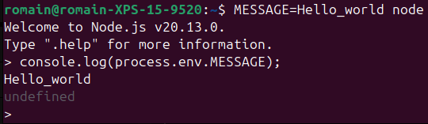
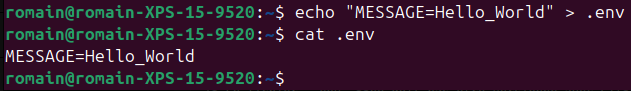
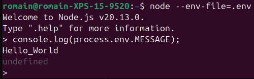
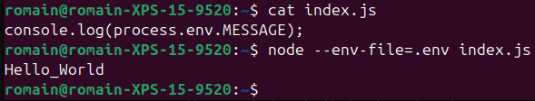

## Objectifs

* Comprendre le concept d'environnement.
* Utiliser un fichier `.env` avec la commande `node`.

## Pré-requis

````stepper
# Valider la quête suivante
```quests
1334
```
````

## Introduction

Les fichiers `.env` sont des fichiers de configuration utilisés pour stocker des variables d'environnement dans un format simple, lisible et facile à gérer. Ils sont largement utilisés dans les applications modernes, en particulier dans les projets basés sur des frameworks comme Node.js, Django, Laravel, et bien d'autres.

## Sommaire

## Variables d'environnement ?

Les variables d'environnement sont des variables qui sont définies dans le système d'exploitation ou dans le conteneur dans lequel l'application est exécutée.

Les variables d'environnement remplissent plusieurs rôles :

* Configuration dynamique : Les variables permettent d'adapter une application à différents environnements (développement, test, production).
* Sécurité : Elles permettent de stocker des informations sensibles hors du code source.
* Portabilité : En les utilisant, tu peux facilement déployer la même application sur plusieurs systèmes (Linux, macOS, Windows) en modifiant uniquement les valeurs des variables d'environnement.

### En pratique

Une variable d'environnement, comme une variable en JavaScript, est un nom associé à une valeur. Par convention, le nom doit être en majuscule :

```bash
MY_VARIABLE=Hello_world
```

Pour créer une variable d'environnement temporaire, tu peux la définir avant d'exécuter la commande `node`.

````tabs
!--- Linux et macOS
Ouvre un terminal et tape :

```bash
MESSAGE=Hello_World node
```
!--- Windows
La syntaxe est différente selon l'interface en ligne de commande que tu utilises sur Windows.

Avec PowerShell, ouvre un terminal et tape :

```bash
$env:MESSAGE="Hello_World" node
```

Avec CMD ouvre un terminal et tape :

```bash
set MESSAGE="Hello_World" node
```
````

Ici, une session `node` est démarrée avec la variable d'environnement `MESSAGE` contenant `Hello_World`.

Si tu tapes `console.log(process.env.MESSAGE)`, tu devrais voir `Hello_World` :



(Utilise la commande `.exit` pour quitter la session `node`)

## Utiliser un fichier .env

Définir les variables d'environnement lors du lancement de l'application comme dans l'exemple précédent n'est pas très pratique. Imagine si ton application nécessite plusieurs variables !

C'est là que les fichiers `.env` interviennent.

Un fichier `.env` est un fichier texte contenant des paires clé-valeur qui définissent des variables d'environnement pour une application. Ces variables peuvent être des informations sensibles ou spécifiques à un environnement, telles que :

* Les clés d'API
* Les URL des bases de données
* Les configurations spécifiques à l'environnement (développement, production, etc.)

Un fichier `.env` dans un projet réel pourrait ressembler à ça :

```bash
# Configuration de la base de données
DB_HOST=localhost
DB_PORT=5432
DB_USER=admin
DB_PASSWORD=secret

# Clés API
API_KEY=abcd1234xyz
```

Tu peux en créer un simple avec cette commande :

```bash
echo "MESSAGE=Hello_World" > .env
```

Contrôle ensuite le contenu du fichier `.env` avec la commande `cat` :



L'utilisation d'un fichier .env dépend du langage ou du framework que tu utilises. Avec la commande `node` tu peux utiliser l'option `--env-file=` suivi du chemin vers ton fichier. Toujours dans le même répertoire :

```
node --env-file=.env
```

Tu peux maintenant afficher le contenu de `process.env.MESSAGE` avec un `console.log` :



(Utilise la commande `.exit` pour quitter la session `node`)

Accéder aux variables via `process.env` marche également depuis un fichier `.js` exécuté avec `node`. Par exemple, si tu crées un fichier `index.js` avec ce code (dans le même dossier que ton fichier `.env`) :

```javascript
console.log(process.env.MESSAGE);
```

Tu peux l'exécuter avec la commande `node` et l'option `--env-file` :



```xtext callout
L'option `--env-file` est relativement récente. Tu entendras peut-être parler du module [dotenv](https://www.npmjs.com/package/dotenv) en discutant avec des devs : c'était la référénce pour utiliser un fichier `.env` avant l'ajout de l'option `--env-file` à la commande `node`.
```

### Bonnes pratiques

**⚠️ Ne publie jamais d'informations sensibles ! ⚠️**

**Le fichier `.env` doit TOUJOURS être ajouté dans le fichier `.gitignore` afin de ne pas partager des données sensibles via un dépôt public (sur GitHub par exemple) !**

```bash
# .gitignore
node_modules/
.env
```

Cependant, tu devrais mettre dans le dépôt un fichier d'exemple avec des valeurs fictives (appelé `.env.sample` par convention), permettant de savoir quels paramètres sont nécessaires pour que l'application fonctionne. N'importe qui pourra ensuite créer localement son propre `.env` à partir de cet exemple.

```bash
# .env.sample file

# Configuration de la base de données
DB_HOST=localhost
DB_PORT=5432
DB_USER=YOUR_DB_USER
DB_PASSWORD=YOUR_DB_PASSWORD

# Clés API
API_KEY=YOUR_SECRET_API_KEY
```

## Résumé

* Les paramètres qui dépendent de l'environnement doivent être stockés dans un fichier `.env`, sous la forme `KEY=valeur` (une paire clé-valeur par ligne).
* Ce fichier est passé à la commande `node` avec l'option `--env-file`.
* Les variables sont ensuite accessibles dans l'application, via `process.env.KEY` (remplace `KEY` par le nom de ta variable).
* Le fichier `.env` **ne doit pas être versionné avec Git** (utilise .gitgnore).

## Challenge

Crée une petite application JavaScript qui va afficher ce message :  

`I am <name>, wilder in <city>, and I love <language>`.

Les valeurs `<name>`, `<city>` et `<language>` doivent être remplacées par des variables d'environnement `MY_NAME`, `MY_CITY` et `MY_LANGUAGE`.

Ces variables doivent être chargées depuis un fichier `.env`.

Afin de ne pas le partager, écris un "modèle" `.env.sample` : il doit indiquer les différentes paires clé-valeur à saisir dans le `.env` avec des valeurs fictives.

Partage ta solution sur un dépôt GitHub contenant :

* Le code JavaScript
* Le fichier `.env.sample`.
* Le fichier `.gitignore`.

### Critères de validation

* [ ] L'application utilise les variables d'environnement.
* [ ] Le fichier `.env.sample` fournit un exemple de ce à quoi le fichier `.env` devrait ressembler.

Ce que tu devrais avoir dans :

````tabs files
!--- app.js

```javascript
console.log(
  `I am ${process.env.MY_NAME}, wilder in ${process.env.MY_CITY}, and I love ${process.env.MY_LANGUAGE}`
);
```

!--- .gitignore

```shell
.env
```

!--- .env.sample

```shell
MY_NAME=Bob
MY_CITY=Paris
MY_LANGUAGE=Javascript
```
````