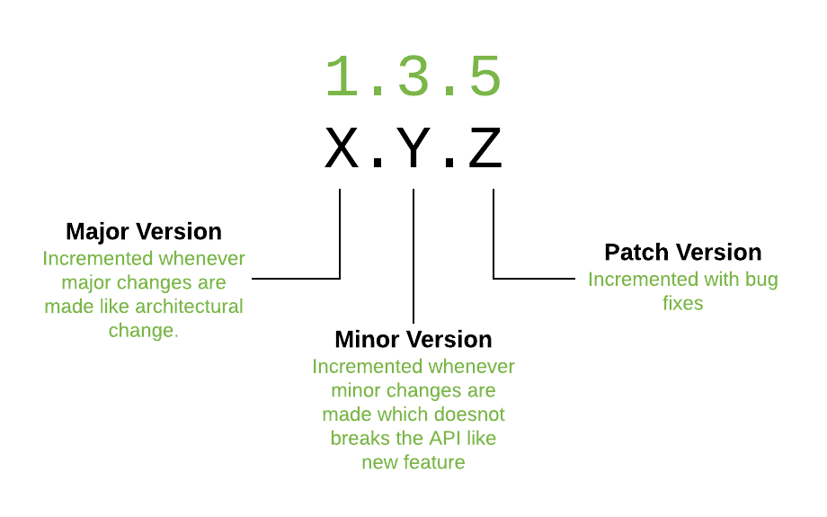

## Objectifs

* Savoir comment fonctionne le **versioning sémantique**.
* Gérer les **dépendances** et les **dépendances de développement** dans `package.json`.
* En savoir plus sur l'écosystème de Node et NPM.

## Pré-requis

````stepper
# Valider la quête suivante
```quests
1797
```
````

## Introduction

Jusqu'à présent, tu as appris à utiliser NPM de manière basique.

Cette quête a pour but d'approfondir un peu plus ta connaissance de NPM, de ses alternatives et des problèmes plus généraux de gestion des dépendances dans tes applications.

## Sommaire

## Versionnage sémantique

Théoriquement, les numéros de version des paquets sur NPM doivent suivre une convention : le **versionnage sémantique** (semver). C'est un moyen de faire évoluer la version d'un logiciel donné de manière explicite, afin de minimiser les incompatibilités et les erreurs.

```xtext callout
**Important !**

Le concept du versionnage sémantique (semver) est primordial dans la gestion des dépendances d’un projet. Le versionnage sémantique repose sur trois niveaux de version :  

- **Patch** : Correction de bugs sans impact sur la compatibilité, modification du dernier chiffre (ex. 1.0.1 → 1.0.2).  
- **Minor** : Ajout de nouvelles fonctionnalités sans rupture de compatibilité, modification du deuxième chiffre (ex. 1.0.0 → 1.1.0).  
- **Major** : Modification qui casse la compatibilité avec les versions précédentes ("breaking change" en anglais), modification du premier chiffre (ex. 1.0.0 → 2.0.0).  

Pour limiter la portée des mises à jour d'une dépendance, c'est possible d'utiliser des symboles comme `~` (mises à jour mineures et correctifs uniquement) ou `^` (correctifs uniquement) dans le fichier *package.json*.

C'est important de bien versionner les packages pour éviter des problèmes d'incompabilité de code.
```



En moins bref :

```youtube
https://www.youtube.com/watch?v=kK4Meix58R4
```

```resource
https://docs.npmjs.com/about-semantic-versioning
# NPM docs
Semantic versioning
```

```resource
https://semver.org/
# Semantic versioning
Le site officiel
```

**❓Quiz**

```quiz
true|||true|||true
# Combien de parties devrait avoir un numéro de version suivant le "versioning sémantique" ?
[] 2 : Version majeure et version mineure
[x] 3 : Version majeure, mineure et patch
[] 4 : Version majeure, mineure, patch et hotfix. 
# Tous les paquets sur NPM suivent très strictement la convention de "versionnement sémantique".
[] Vrai
[x] Faux
# Théoriquement, nous pouvons mettre à jour un paquet NPM donné de la version 2.5.3 à la version 2.9.1 sans nous soucier de la compatibilité avec notre code.
[x] Vrai
[] Faux
# Théoriquement, nous pouvons mettre à jour un paquet NPM donné de la version 3.2.6 à la version 4.1.1 sans nous soucier de la compatibilité avec notre code.
[] Vrai
[x] Faux
# Comment pouvons-nous spécifier que nous voulons seulement accepter les mises à jour de correctifs d'un paquet avec la version 1.2.3 ?
[x] 1.2
[x] 1.2.x
[] 1.2.3
[x] ~1.2.3
[] 1.x
[] 1
# Comment pouvons-nous spécifier que nous voulons seulement accepter les mises à jour mineures et les correctifs d'un paquet de version 1.2.3 ?
[x] ^1.2.3
[] 1.2
[] 1.2.x
[] 1.2.3
[x] 1.x
[x] 1
```

## Le fichier package.json

Voici un exemple :

```json
{
  "name": "my-super-project",
  "version": "1.0.0",
  "description": "An app that's going to change the world",
  "main": "app.js",
  "scripts": {
    "start": "node app.js",
    "start:watch": "nodemon app.js",
    "clean-packages": "rm -rf node_modules"
  },
  "keywords": ["super", "awesome"],
  "author": "Dave Lopper",
  "license": "ISC",
  "dependencies": {
    "chalk": "^4.1.2"
  },
  "devDependencies": {
    "nodemon": "^2.0.12"
  }
}
```

Comme tu l'as déjà vu, ce fichier contient des informations comme l'auteur du projet, le numéro de la version actuelle, la description, etc. Ici, nous allons nous concentrer sur certaines propriétés clés :

### dependencies

C'est là que nous spécifions quels paquets et quelles versions de ces paquets sont nécessaires à notre projet. Les paquets sont automatiquement ajoutés dans cette section lorsque tu fais `npm install <some-package>`.
Regarde la vidéo ci-dessus sur le versionnement sémantique pour comprendre comment tu peux spécifier des plages de versions.

### devDependencies

Ici, tu spécifieras les paquets que tu utilises exclusivement lors du développement. Ces paquets ne seront pas nécessaires en production. Par exemple, les paquets de test, webpack, nodemon, etc.

Les paquets sont automatiquement ajoutés dans cette section lorsque tu fais `npm install --save-dev <some-package>` ou `npm install -D <some-package>`.

### scripts

Ici tu peux définir les commandes que npm pourra exécuter avec `npm run <nom-du-script>`. Les scripts sont un bon moyen d'avoir des raccourcis et de documenter des tâches spéciales relatives au projet.

```resource
https://docs.npmjs.com/cli/v11/commands/npm-run-script
# NPM docs
Scripts
```

```resource
https://www.npmjs.com/package/npm-run-all
# npm-run-all
Un package permettant d'exécuter plusieurs commandes dans un seul script pour tout les OS
```

## Le fichier package-lock.json

Ce fichier est destiné à préserver un comportement cohérent du module en "verrouillant" les versions des paquets entre différents environnements. Tu ne devrais jamais avoir à modifier ce fichier toi-même car NPM le met à jour automatiquement lorsque tu installes ou désinstalles quelque chose.

```resource
https://docs.npmjs.com/cli/v11/configuring-npm/package-lock-json
# NPM docs
Package locks
```

**❓Quiz**

```quiz
true|||true|||true
# Le fichier package.json peut être utilisé pour configurer des alias de commandes utiles pour le projet.
[x] Vrai
[] Faux
# Je veux installer "jest", qui est un framework de test.
[x] npm install --save-dev jest
[] npm install jest
# C'est une bonne pratique d'éditer le fichier package-lock.json à la main
[] Vrai
[x] Faux
```

## Auditer les paquets pour les vulnérabilités de sécurité

Conscient des problèmes de sécurité dans son système de paquets, NPM a publié un outil pour analyser tes paquets et tester les failles de sécurité connues. Pour lancer la vérification, il suffit de taper ce qui suit à la racine de ton projet :

```
npm audit
```

```resource
https://docs.npmjs.com/auditing-package-dependencies-for-security-vulnerabilities
# NPM docs
Auditer des paquets
```

## Mise à jour des paquets

La mise à jour des paquets peut être importante, car les mises à jour de sécurité sont publiées assez souvent et peuvent protéger ton application contre des attaques potentielles :

```
npm update
```

Cela permettra de récupérer automatiquement la dernière version acceptable des paquets disponibles dans le registre NPM.

```resource
https://docs.npmjs.com/cli/v11/commands/npm-update
# NPM docs
Mettre à jour des paquets
```

## Correction d'un paquet

À un moment donné dans ta carrière de développeur, tu rencontreras peut-être des bibliothèques présentant un bug.

Si le bug est vraiment critique et empêche ton application de fonctionner correctement, si tu peux le corriger et si l'équipe à l'origine du paquet est trop lente pour le corriger elle-même ou accepter ta Pull Request, il sera peut-être judicieux de corriger le paquet que tu utilises.

Pour plus de détails :

```resource
https://www.npmjs.com/package/patch-package
# patch-package
Un outil pour t'aider à corriger un paquet en cas d'urgence
```

## Le modèle de dépendance

Tu sais que ton projet peut avoir des dépendances externes, mais as-tu réalisé que ces dépendances peuvent également avoir leurs propres dépendances, qui à leur tour ont leurs propres dépendances, et ainsi de suite ?


Comment NPM gère-t-il tout ce bazar ?
Voici un article très complet sur la façon dont NPM résout les dépendances :

```resource
https://lexi-lambda.github.io/blog/2016/08/24/understanding-the-npm-dependency-model/
# Understanding the npm dependency model
Et peut-être comprendre ce qu'est une "peer dependency"
```

## Des alternatives à la CLI de NPM

NPM a été publié pour la première fois en 2010. Au fil des années, des alternatives à l'interface de ligne de commande officielle de NPM sont apparues.

Ces alternatives ont pour but d'améliorer les performances, la sécurité et la stabilité par rapport à la CLI par défaut, tout en restant compatibles avec presque tous les paquets NPM existants.

### Yarn

Yarn a été publié en 2016, soutenu par de grandes entreprises comme Facebook et Google.
Tu peux l'installer avec NPM (ce qui est un peu bizarre, non ?) :

```
npm install -g yarn
```

```youtube
https://www.youtube.com/watch?v=0DGClZD5LEM
```

```resource
https://yarnpkg.com/
# Yarn
Le site officiel
```

### PNPM

PNPM (Performant NPM) version 1 est sorti en 2017. 
Au moment de la rédaction de cette quête, c'est le gestionnaire de paquets le plus rapide en ville d'après ses [benchmarks](https://pnpm.io/benchmarks). 
L'autre avantage principal est que PNPM supporte les mêmes commandes que la CLI par défaut de NPM. 

Si tu veux l'essayer :

```
npm install -g pnpm
```

```youtube
https://www.youtube.com/watch?v=KdHiziZsz7s
```

```resource
https://pnpm.io
# PNPM
Le site officiel
```

**❓Quiz**

```quiz
true|||true|||true
# Yarn a exactement les mêmes commandes que la CLI officielle de NPM.
[x] Faux
[] Vrai
# Une dépendance peut avoir des dépendances
[x] Vrai
[] Faux
# Comment rechercher les problèmes de sécurité connus dans nos dépendances ?
[] npm find-security-issues
[x] npm audit
[] npm run security-checks
```