La plateforme Odyssey sera votre compagnon quotidien et un élément clé de votre réussite. Conçue pour structurer votre apprentissage, faciliter les échanges et suivre votre progression, sa maîtrise vous permettra de tirer pleinement profit de votre formation à la Wild Code School.

### **Objectifs**

- Identifier les fonctionnalités clés de la plateforme Odyssey
- Comprendre le système pédagogique composé d'expéditions, quêtes et corrections
- Explorer les outils pédagogiques disponibles

À la connexion sur Odyssey, le Dashboard (tableau de bord) présente un aperçu des activités de la semaine : l'agenda hebdomadaire, l'expédition en cours et les quêtes en attente de correction.

Les **quêtes** représentent les briques fondamentales de votre parcours de formation. Elles combinent explications théoriques, exercices pratiques et ressources pédagogiques pour garantir une compréhension approfondie des concepts abordés tout au long de la formation. Les quêtes (réalisées ou non) sont accessibles dans la partie "Quêtes". 

Une **expédition** est un ensemble de quêtes à réaliser sur une période donnée (souvent une semaine), et dans un ordre précis. Une fois la période terminée, l'expédition n'est plus visible depuis votre dashboard mais elle reste disponible dans l'onglet Agenda.

Il est recommandé de compléter l'expédition dans le délai imparti. En cas d'impossibilité,  il est souvent préférable de commencer l'expédition suivante, afin de suivre le rythme du groupe. Quand vous aurez du temps, vous pourrez revenir sur les quêtes manquantes dans la partie "Quêtes".  

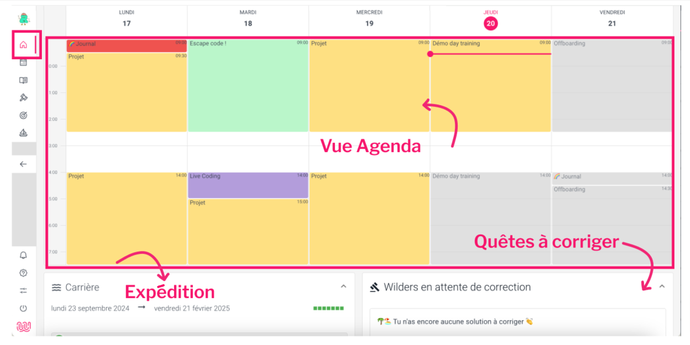NB : la disposition peut changer en fonction de la taille de votre écran.

L'agenda permet de visualiser les semaines passées et futures de la formation. Pour les semaines à venir, des modifications peuvent survenir, notamment concernant les intervenants ou les projets. Certains événements contiennent des liens ou de la documentation, accessibles 20 minutes avant le début de l'événement.

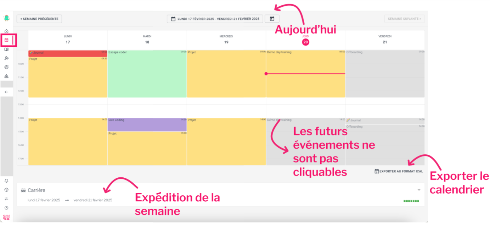

À noter : Vous pouvez également exporter ce calendrier au format iCal, pour y accéder depuis Google Calendar, MS Outlook, ou autre...

## **Quêtes**

L'ensemble des quêtes disponibles est réparti par catégorie. À chaque expédition, la liste de quêtes s'enrichit. Un indicateur permet de visualiser rapidement les quêtes restant à réaliser et celles déjà effectuées.

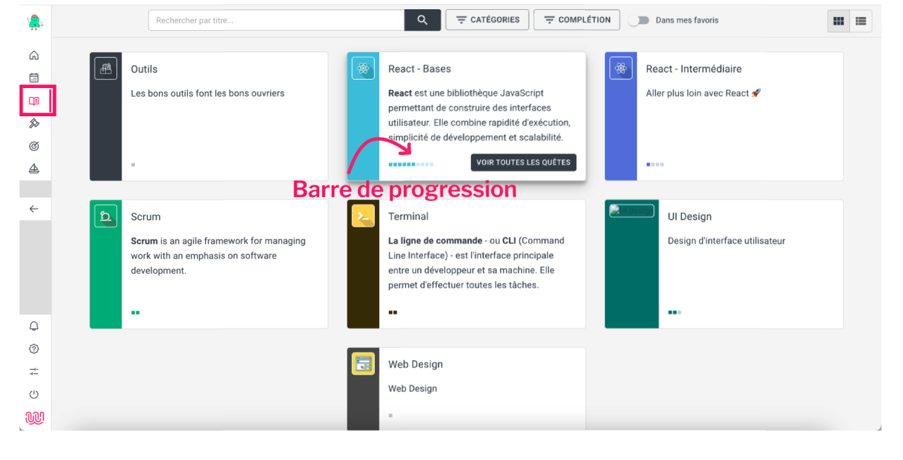

## **Corrections**

La pédagogie de la Wild Code School repose sur un modèle collaboratif et interactif incluant différents types de validation des quêtes.  Il existe plusieurs types de validation :

- **Auto-validation** : Si vous pensez avoir bien compris la notion, ou si vous pensez avoir bien effectué la mission, vous pouvez valider la quête.
- **Correction par l'équipe pédagogique** : Validation des compétences spécifiques, notamment par le biais des checkpoints.
- **Correction par les pairs (peer reviewing)** : Après avoir effectué une quête, vous corrigez les quêtes des autres Wilders. Une ou plusieurs corrections positives sont nécessaires pour valider une quête.
- **Validation par quiz** : Des questions pour tester votre compréhension des concepts clés. Un score minimum est nécessaire pour valider la quête.
- **Validation par code** (Javascript) : Un système qui teste automatiquement votre code. La réussite de tous les tests est obligatoire pour valider la quête.


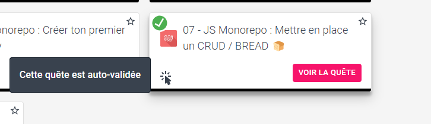


### La correction par les pairs
La correction par les pairs présente plusieurs avantages : 

- **Diversité des approches** : Elle permet d'explorer le travail et les méthodes des autres Wilders, découvrant ainsi différentes solutions - certaines plus élégantes, d'autres plus performantes et parfois des méthodes différentes mais équivalentes.
- **Préparation professionnelle** : En situation professionnelle, les projets évoluent constamment sans repartir de zéro à chaque changement dans l'équipe. Le peer reviewing vous entraîne à identifier rapidement les solutions pertinentes et apprendre à faire des feedback constructifs, compétence essentielle pour votre future carrière professionnelle.

Concernant ces corrections, **l'essentiel est d'être bienveillant et constructif**. 

- Si la solution d'un autre Wilder vous semble correcte mais peu performante : vous pouvez valider la quête en laissant un commentaire indiquant une meilleure piste.
- Idem si vous repérez un petit bug n'entachant pas le travail global. Globalement, l'objectif est d'être constructif dans les commentaires que vous laissez.

Vous pouvez accéder à votre profil, vos attestations, la langue par défaut et modifier les paramètres d'affichage dans l'onglet Mes informations du menu en bas à gauche.
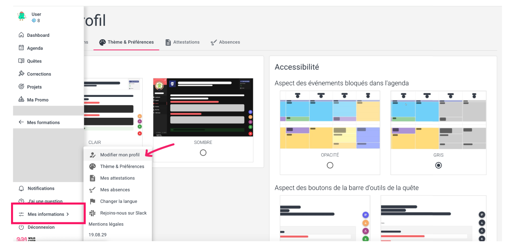

Accessible via le bouton boussole :compass: situé en bas à droite de la page, cette partie propose des fonctionnalités essentielles pour optimiser votre parcours d'apprentissage :

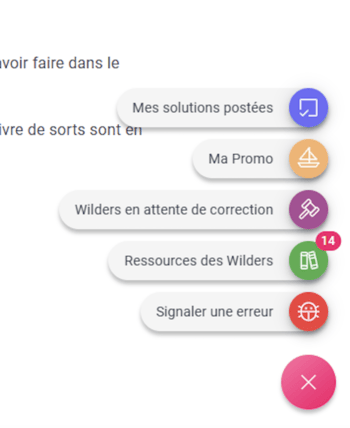


- **Mes solutions postées** - accès aux solutions soumises 
- **Ma promo** - voir l'avancement de la promo sur cette quête 
- **Wilders en attente de la correction** - voir la liste des Wilders en attente de correction pour les quêtes
- **Ressources des Wilders** - possibilité de proposer des ressources complémentaires pour cette quête, immédiatement visibles par tous les Wilders. Vous pouvez consulter les ressources proposées par les autres Wilders et voter pour celles que vous préférez.
- **Signaler une erreur** - pour rapporter tout bug dans une quête (faute de frappe, lien mort, etc.)

Pour les quêtes nécessitant la soumission de votre travail pour validation, vous trouverez une zone dédiée en bas de page. Cette zone vous permet de partager vos solutions et livrables selon les critères spécifiques de chaque quête.

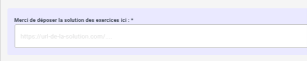

## Note et retours sur les quêtes

Chaque quête dispose d'un espace dédié pour partager vos avis. Vos commentaires sur les quêtes sont essentiels à notre démarche d'amélioration continue. Chaque feedback contribue directement à l'évolution de notre plateforme et de nos contenus. Merci pour votre participation !

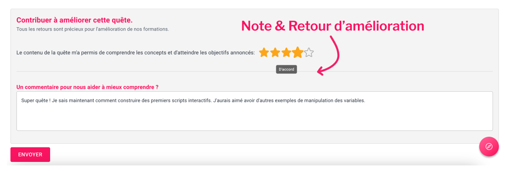

## J'ai une question

La partie "J'ai une question" vous donne accès au système de ticketing géré par l'équipe Student Success de la Wild Code School. 
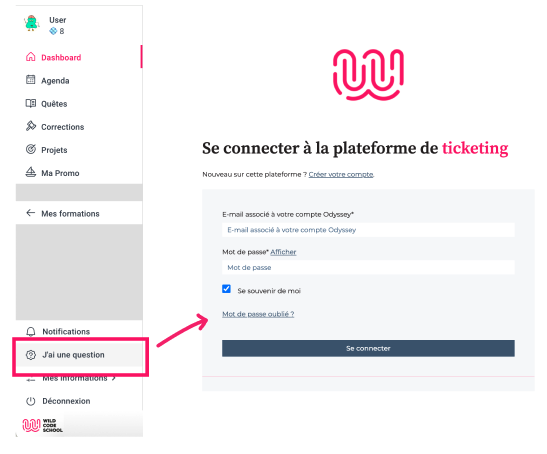

## Émargement 
L'émargement est activé par votre formateur.rice lors de chaque séance de formation à 9h et à 14h. Une fois activé, un espace dédié apparaît à l'écran vous permettant d'insérer votre signature électronique. 

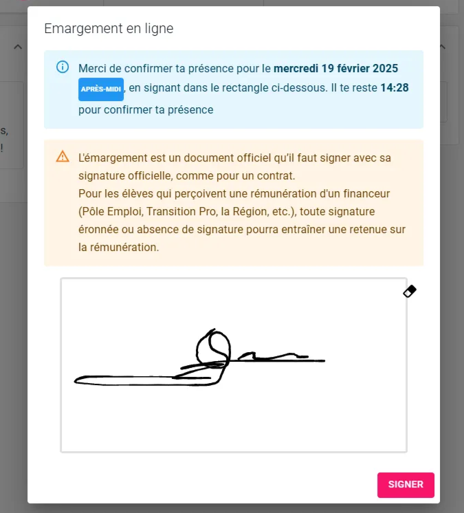

## Mes absences
Dans l'onglet **'Mes informations' > 'Mes absences'**, un espace dédié vous permet de suivre vos absences et d'envoyer vos justificatifs.

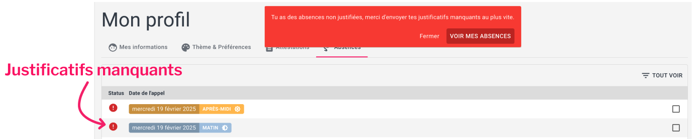

Au cours de votre formation, des enquêtes apparaîtront régulièrement sur la plateforme. Merci de les compléter avec attention et dans les délais impartis.

Vos retours sont essentiels pour nous permettre d'améliorer continuellement la qualité de nos formations. Chaque avis partagé contribue directement à l'évolution de nos programmes et à l'enrichissement de l'expérience d'apprentissage pour l'ensemble de la communauté Wild Code School.

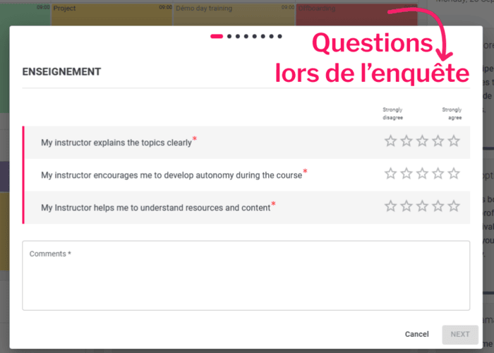

### 📝 Quiz

```quiz

# La durée "classique" d'une expédition est :
[] une heure
[] une journée
[x] une semaine

# Le contenu d'une quête est disponible :
[x] sans limite de durée, même après la fin d'une expédition
[] sans limite de durée, uniquement si on a posté une solution
[] uniquement le temps de l'expédition

# La correction par les pairs permet (sélectionner TOUTES les réponses correctes) :
[x] d'explorer diverses solutions techniques
[x] d'apprendre à faire des feedback constructifs
[] de dire "je suis ton pair" comme Dark Vador

# Les événements futurs dans l'agenda (sélectionner TOUTES les réponses correctes) :
[] les titres se débloquent 20 minutes à l'avance
[x] les titres sont toujours disponibles
[x] le contenu se débloque 20 minutes à l'avance
[] le contenu est toujours disponible

# La partie "Signaler une erreur" permet de signaler un lien mort.
[] Faux
[x] Vrai

# La partie Feedback de chaque quête permet de commenter la qualité d'une quête.
[] Faux
[x] Vrai


```