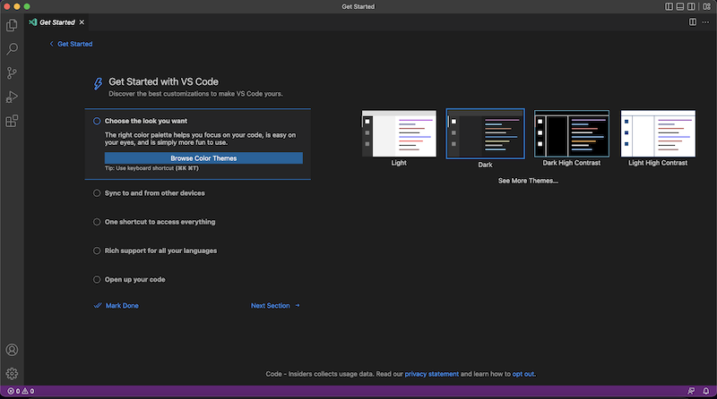
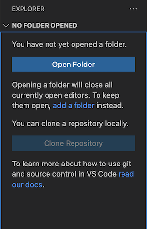
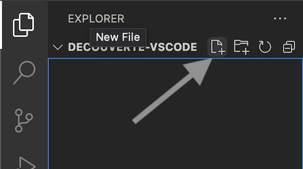
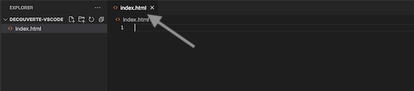
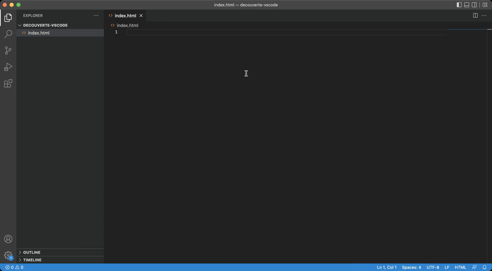
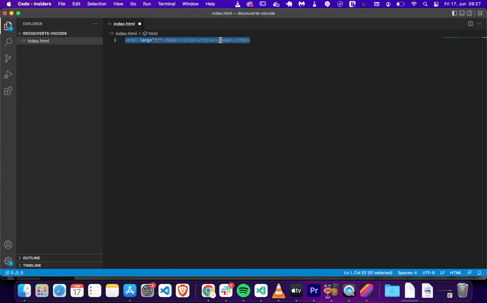
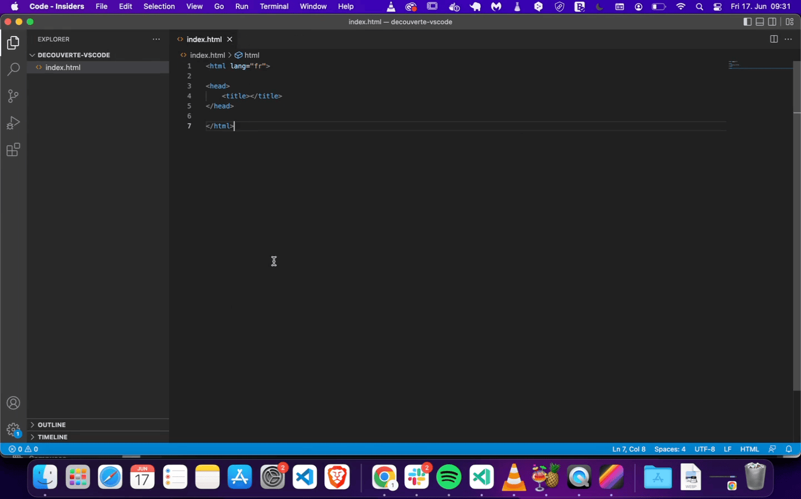
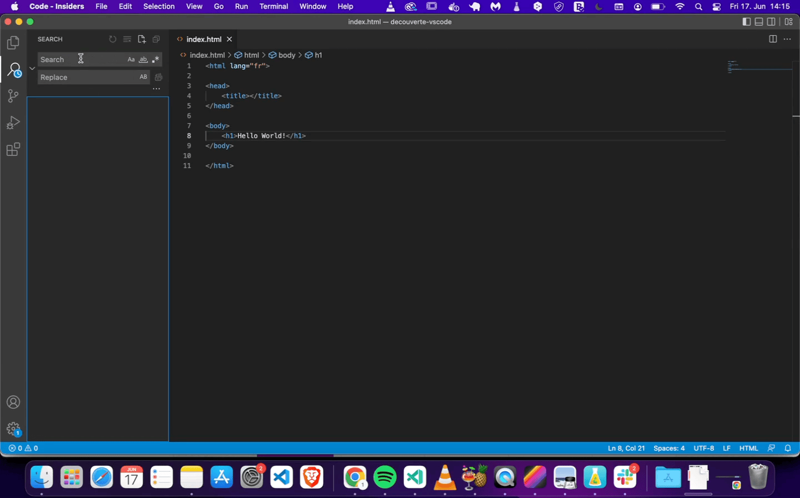
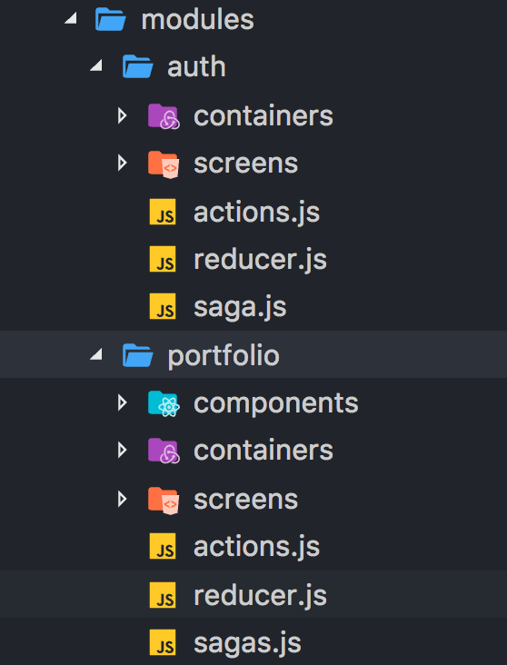
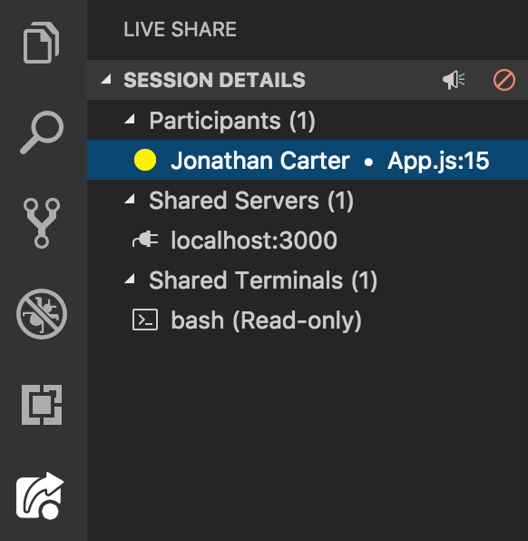

# Introduction

Visual Studio Code est un **éditeur de code** permettant d'écrire facilement et simplement du code. Les éditeurs de code possèdent de nombreux outils permettant d'accélérer la production de code en facilitant la syntaxe, le formatage, la navigation dans le code, l'auto-completion, les tests, la gestion de versioning, etc.

# 🤓 À la fin de cette quête tu sauras :

✅ Qu'est ce qu'un éditeur de code
✅ Comment installer Visual Studio Code.
✅ Comment faire les premières modifications de ton installation.
✅ Comment utiliser les différentes fonctionnalités de Visual Studio Code.

- - -

# Qu'est-ce qu'un éditeur de code?

Un **éditeur de code** (**IDE** **I**ntegrated **D**evelopment **E**nvironment) est un programme qui permet de créer, modifier, débugger et compiler des fichiers de code source.

Ils offrent de nombreux avantages tels que :

* Mise en évidence de la syntaxe spécifique au langage utilisé
* Indentation automatique du code
* Plug-ins permettant de détecter les erreurs dans le code

Il existe de nombreux éditeurs de code (IDE) différents, mais certains sont plus populaires que d'autres. Certains des plus populaires incluent:

* Visual Studio Code
* Sublime Text
* Vim

Nous te recommandons néanmoins d'utiliser l'éditeur Visual Studio Code, car il est gratuit et facile à installer et à utiliser.

# Installer Visual Studio Code

Pour installer Visual Studio Code, c'est très simple, il te suffit de te rendre sur la [page de téléchargement](https://code.visualstudio.com/) de visual studio et de télécharger la dernière version pour ton système d'exploitation.

Une fois le téléchargement terminé, installe le logiciel et tu n'as plus qu'à le lancer pour commencer à travailler avec Visual Studio!

```alert-info
VS Code est un logiciel open source édité par Microsoft. La version du site officiel contient cependant quelques ajouts de code propriétaire (télémétrie, lien avec un compte Microsoft...). Une version totalement Libre existe, [VSCodium](https://vscodium.com/), sans ces ajouts propriétaires, tout en restant totalement compatible. Si tu es sensible à ces questions, tu peux sans problème l'utiliser à la place de VSCode, la suite de cette quête restant valable.
```

# Présentation de l'interface

La première fois que tu vas lancer Visual Studio, tu devrais arriver sur une interface similaire à celle ci:

Attention, l'interface de Visual Studio évolue au fur et à mesure du temps, et il est possible que ton interface soit un peu différente de celle-ci.

Sur l'interface principale, nous pouvons voir sur le côté gauche les onglets suivants :

* Explorer
* Search
* Source control
* Run and Debug
* Extensions

Voyons ces panneaux un peu plus en détail.

## Explorer

#### Choisir un dossier de travail

L'*explorer* te permet de créer de nouveau fichier et dossier au sein de ton **dossier de travail.**
Mais avant de pouvoir créer des fichier et dossier, il te faut tout d'abord indiquer le dossier dans lequel tu souhaites travailler.

```alert-warning
Lorsque tu travailles sur un projet, fais attention de toujours ouvrir directement le dossier du projet **et non un dossier parent**, c'est très important car sinon tu risques de rencontrer des problèmes lors de l'installation de librairies, l'utilisation de Git...
```

Commence par créer un dossier "decouverte-vscode" sur ton bureau. Pour l'ouvrir dans VSCode et explorer son contenu, clique sur "Open Folder", puis sélectionne le dossier souhaité.


À présent, tu peux constater que le panneau à gauche a changé pour afficher le dossier en cours.

#### Créer un nouveau fichier

Pour créer un nouveau fichier, c'est très simple! Passe ta souris sur le panneau de gauche et tu devrais voir apparaître 4 icônes à côté du nom du dossier de travail.


Clique sur la première icône pour créer un fichier. À présent, tu es invité à donner un nom à ton fichier, appelons-le `index.html`, appuie ensuite sur la touche entrée pour confirmer.

À présent, tu peux voir que Visual Studio a ouvert un nouvel onglet sur ton espace de travail.


#### Écrire du code

Commençons à présent à écrire du code pour découvrir les fonctionnalités de Visual Studio.

Commençons à créer notre page HTML, dans l'éditeur crée une balise `<html lang="fr">`. Première bonne nouvelle, comme tu peux le constater, Visual Studio ferme automatiquement la balise HTML pour toi !! Impressionnant, n'est-ce pas ?



À présent, à l'intérieur de la balise html ajoutons une balise `<head>` et à l'intérieur de la balise `<head>`, ajoutons une balise `<title>`.

Ton code devrait à présent ressembler à ça:
`<html lang="fr"><head><title></title></head></html>`

#### Formater le code

En HTML, afin d'améliorer la lisibilité des éléments, nous utilisons une technique appelée "indentation", l'indentation consiste à ajouter des espaces blancs (ou des tabulations) afin d'améliorer la lisibilité des éléments.

Les indentations sont effectués à chaque fois que nous créons une balise à l'intérieur d'une autre.

Par exemple, le code précédent devrait ressembler à ça avec une bonne indentation:

```html
<html lang="fr">

<head>
    <title></title>
</head>

</html>
```

Il est possible d'indenter son code à la main en utilisant la touche tabulation, mais Visual Studio propose une solution pour que le code soit formaté automatiquement.

Pour cela, sélectionne tout le document et effectue un clic droit puis "Format document" ou "Formatter le document". Le document devrait alors se réarranger tout seul.



#### Formater le code à chaque sauvegarde

Il est possible de configurer ton éditeur de code pour que le code se formate automatiquement lorsque tu sauvegardes, pour cela, clique sur le menu "Manage" en bas du panneau de gauche et sélectionne l'option "Settings".

Cherche maintenant dans la barre de recherche "format" et active l'option "format on save", ferme à présent l'onglet settings. Tu peux tester la fonctionnalité en créant une nouvelle balise sur ton document et en sauvegardant.



À présent, ajoute une balise `<body>` après la balise `<head>`, et un `<h1>` avec le texte "Hello world" à l'intérieur. Sauvegarde ton document (ctrl ou cmd + s) et tu verras ton code s'indenter automatiquement!

```alert alert-info
Il est également possible de configurer un enregistrement automatique (c'est-à-dire que tu n'as plus à enregistrer manuellement, cela se fait automatiquement à chaque fois que tu modifies un caractère dans ton code). Tout ceci est affaire de goût, si tu souhaites l'activer, ouvre le menu File et coche "Auto Save".
```

#### Voir son code dans le navigateur

Si tu souhaites voir le résultat de ton code dans ton navigateur, clique droit sur le nom du fichier HTML et sélectionne "Open Containing Folder", "reveal in finder" ou "reveal in explorer".

Visual Studio Code va alors ouvrir le dossier dans lequel se trouve ton fichier, il ne te reste plus qu'à l'ouvrir avec ton navigateur web favori!

## Search

Le deuxième panneau que nous avons est le panneau recherche. Dans ce panneau tu peux chercher du texte et le remplacer.

Lorsque tu effectues des recherches dans Visual Studio Code, la recherche est effectuée dans **tous les fichiers** présents dans ton dossier de travail!

Tape dans la barre de recherche "Hello world" et appuie sur la touche entrée, pour voir le résultat. Tu devrais voir que la phrase 'Hello World" est présente dans un seul fichier, index.html

À présent dans le champ remplacer, tape "Hey there!" et clique sur le bouton "remplacer",  le texte devrait alors être remplacé.



```alert-info
La fonction rechercher/remplacer possède également des options complémentaires qui peuvent se révéler très pratiques (sensible ou non à la casse, préservation de la casse, recherche uniquement dans la sélection, *etc.*)
```

#### Raccourcis clavier

VS code possède un très grand nombre de raccourcis clavier([pour windows](https://code.visualstudio.com/shortcuts/keyboard-shortcuts-windows.pdf), [pour linux](https://code.visualstudio.com/shortcuts/keyboard-shortcuts-linux.pdf) ou [pour mac](https://code.visualstudio.com/shortcuts/keyboard-shortcuts-macos.pdf)). Si cela peut paraître un peu intimidant, rassure toi, tu n'as pas à tous les apprendre. Cependant, connaître certains d'entre eux peux te permettre de gagner énormément en rapidité et productivité, c'est aussi là tout l'intérêt d'un IDE : te faire gagner du temps ! Tu peux aussi personnaliser tous les raccourcis si ceux par défaut ne te conviennent pas.


```ressource
https://blog.webdevsimplified.com/2020-08/10-best-keyboard-shortcuts/
# Exemple de quelques raccourcis utiles
Si tu connais peut-être les raccourcis classique comme CTRL+C / CTRL+V (pour un copier coller), VS code va beaucoup plus loin, cette ressource te donne une dizaine de raccourcis qu'il peut-être intéressant de connaître.
```

## Source Control

Le troisième panneau nous permet d'utiliser Git au sein de Visual Studio, nous verrons l'utilisation de Git et Github lors de prochaines quêtes.


## Run and Debug Code

Ce panneau te permet d'exécuter et de déboguer ton code, c'est un outil très puissant pour déboguer une application JavaScript, nous le verrons plus en détail dans une autre quête.


## Extensions

Enfin, le dernier panneau te permet de télécharger des extensions pour Visual Studio Code, il en existe énormément avec toutes sortes de fonctionnalités, pour installer une extension, il te suffit de taper le nom de l'extension pour la chercher suivi de la touche entrée et de cliquer sur "installer".

Attention, l'installation d'extensions peut rendre ton éditeur de code plus lent en plus de surcharger ton interface, nous te conseillons donc de n'installer que celles qui te sont le plus utiles et de désinstaller les extensions que tu n'utilises plus.

Voici une petite liste d'extensions très utilisées:


* [Live server](https://marketplace.visualstudio.com/items?itemName=ritwickdey.LiveServer)


Live server est une extension qui te permet de lancer un petit serveur de développement. Il intègre des fonctionnalités comme le "hot reloading", ce qui veut dire que ta page se rafraîchira automatiquement chaque fois que tu sauvegarderas tes fichiers (html, css ou js), pratique, non?


* [Material icon theme](https://marketplace.visualstudio.com/items?itemName=PKief.material-icon-theme)


Material icon theme ajoutera de belles icônes à côté de tes fichiers. Cela rend l'interface plus simple et agréable à lire.

* [Live share](https://marketplace.visualstudio.com/items?itemName=MS-vsliveshare.vsliveshare)

Live share te permets de collaborer avec d'autres personnes en temps réel directement dans Visual Studio Code.


* Il existe également des extensions propres à chaque langage/bibliothèque/framework (JS, PHP, React, Symfony...). Tu les installeras au fur et à mesure de tes besoins dans la formation.
- - - 

# ☝️ Résumé

Visual Studio Code est l'éditeur de code le plus populaire, en plus d'être un éditeur totalement gratuit, il intègre des fonctionnalités qui facilitent le développement d'application. 

Visual Studio Code est entièrement personnalisable grâce à l'installation d'extensions et thème pour aller encore plus loin. 

- - -