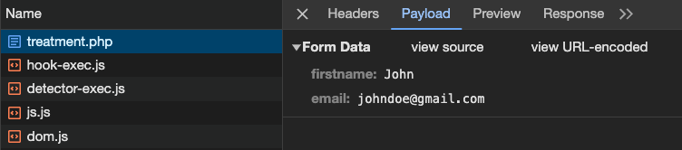
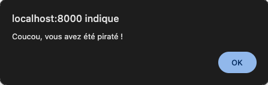

```title-book
 Introduction
```
Dans cette quête, nous allons aborder la manière de récupérer et d'afficher les données issues d'un formulaire.
Cela va se passer côté serveur avec PHP.


# 🤓 À la fin de cette quête, tu seras en mesure de :

- ✅ Connaitre les différentes méthodes de récupération de données suite à la soumission d'un formulaire
- ✅ Récupérer ces données et les utiliser dans le contexte voulu
- ✅ Afficher les données et mettre en place une protection contre les injections XSS (Cross-site scripting)

## Sommaire


## Mise en place

Reprenons l'exemple donné à la fin de la quête traitant de la structure HTML d'un formulaire. 

```quests
2943
```

À peu de choses près, voici ce que nous avions :
```html
<form action="treatment.php" method="post">
    <label for="firstname">Nom</label>
    <input type="text" id="firstname" name="firstname">

    <label for="email">Email</label>
    <input type="email" id="email" name="email">

    <input type="submit" value="Valider">
</form>
```

Parlons plus en détail des attributs `action`, `method` et de ce fameux `name` placé sur les champs du formulaire.

## Envoi des données : l'attribut _action_

Lorsque l'utilisateur soumet le formulaire, une **requête HTTP** est créée. 

Elle a pour destination le fichier défini dans l'attribut `action` de ta balise `<form>` et elle contient toutes les données saisies par l'utilisateur.

Dans notre exemple, la redirection se fera donc vers le fichier se trouvant à l'adresse **treatment.php**

```alert-info
Si jamais l'attribut `action` est vide ou non présent, alors la redirection se fera vers l'adresse courante, c'est-à-dire sur la même page que celle affichée dans le navigateur au moment de la soumission.
```

## Verbe HTTP : l'attribut _method_

Pour un formulaire HTML, il existe deux méthodes de transmission de données : **GET** et **POST**. Nous l'avons évoqué dans une précédente quête, pour choisir l'une ou ou l'autre de ces deux méthodes, il faut utiliser l'attribut `method` de ta balise `form`.

```html
  <form method="post" action="treatment.php">
```
ou
```html
  <form method="get" action="treatment.php">
```

Quelle différence y a-t-il entre ces deux méthodes ?

### La méthode GET

- Utilisée pour envoyer les données via l'URL.
- Les données sont visibles dans la barre d'adresse du navigateur.
- Principalement utilisée pour des actions non sensibles et persister des données de page en page ou pouvoir communiquer ou conserver l'état d'un formulaire (partage ou sauvegarde en favoris d'une recherche par exemple).
- Limite de taille pour les données transmises (2048 caractères maximum autorisés dans une URL).
- _**get**_ sera la **valeur par défaut** si l'attribut `method` est **absent ou vide**.

Lorsque tu soumets ton formulaire, qu'observes-tu ? Rien ? Regarde bien la barre d'adresse de ton navigateur.

```
http://localhost:8000/treatment.php?firstname=John&email=johndoe%40gmail.com
```

Que s'est-il passé ?

En précisant que la méthode d'envoi des données du formulaire est en **GET**, toutes les données vont transiter par l’URL.

En effet, tu peux constater qu'à la suite de l'URL de notre page `http://localhost:8000/treatment.php`, on retrouve un ensemble de `clé=valeur`. Avec, devant, un `?` pour indiquer le début de la liste des paramètres. Chaque paire de clé/valeur est ensuite séparée par des `&` (appelé couramment _"ET commercial"_ mais le vrai nom typographique est _"esperluette"_).

Tu auras remarqué que chaque clé correspond à l'attribut `name="..."` de chaque champ de ton formulaire et que chaque valeur associée correspond aux données saisies dans les champs correspondants.

```alert-info
Dernier point de détail, où est passé le `@` de l'adresse mail ?!?
Il a été remplacé par `%40`. À l'origine, il n'est pas prévu qu'une URL comporte des caractères spéciaux. Certains caractères sont donc substitués par leur version encodée. C'est ainsi que les espaces, eux, sont remplacés par `%20` par la plupart des navigateurs. Ou par le signe "+" dans le cas de firefox. (Le signe "plus", étant lui même remplacé par `%2` )
```

### La méthode POST

- Les données sont envoyées de manière invisible (dans le corps de la requête HTTP) et ne sont pas affichées dans l'URL.
- Adaptée pour des actions plus sensibles (formulaire d'inscription ou de connexion par exemple). 
 ⚠️ **Attention**, cela ne veut pas dire que la soumission des données est plus sécurisée qu'avec la méthode **GET**.
- Pas de limite de taille prédéfinie pour les données.

Les données ne sont plus présentes dans l'URL, mais elles sont bien "cachées" quelque part. 

```
http://localhost:8000/treatment.php
```

```alert-warning
Avant de soumettre ton formulaire, ouvre ta console et rends-toi sur l'onglet Réseaux (ou Network en anglais).
```


Grâce à ta console ouverte, tu peux  suivre l'état de toutes tes requêtes HTTP vers le serveur. 
Si tu cliques sur la ligne _treatment.php_ après avoir soumis le formulaire, tu peux accéder à ces données dans le nouvel onglet _**Payload**_ qui est apparu. Tu peux y retrouver toutes les informations envoyées par le formulaire.



Bon, très bien, tu sais par où ça passe à présent et tu perçois un peu mieux la différence entre ces deux méthodes.. 

Regardons à présent comment récupérer les données côté serveur.


## Récupération des données

À la réception de la **requête HTTP**, PHP va prendre ces données et les mettre dans des "boîtes" que tu vas pouvoir utiliser.
En voici quelques-unes : 
- `$_GET`
- `$_POST`
- `$_REQUEST`
- `$_FILES`

Ces boîtes sont de la famille des **superglobales** et tu vas pouvoir y accéder dans ton fichier de traitement de données. 
Les **superglobales** sont des **variables prédéfinies** toujours accessibles indépendamment de leur portée. Elles contiennent des informations importantes sur le script en cours d'exécution et sont automatiquement créées par PHP.

```ressource
https://www.php.net/manual/en/language.variables.superglobals.php
# Les superglobales PHP
Les variables internes qui sont toujours disponibles, quel que soit le contexte
```
Le point commun à toutes ces **superglobale** est leur type. Elles sont en effet toutes de type _**array**_, ce sont des tableaux.

### GET

Pour récupérer les valeurs d'une requête HTTP envoyées avec une méthode **GET**, tu pourras par exemple utiliser la **superglobale** `$_GET` et parcourir ses index qui correspondent aux valeurs des attributs `name` des champs du formulaire.


```html
<!-- index.html -->
<input ... name="firstname">
<input ... name="email">
```

⬇️

```php
//treatment.php
$firstname = $_GET["firstname"];
$email = $_GET["email"];
```

```xtext arrow
Dans notre exemple, on récupère le prénom et l'email de notre utilisateur aux index _**firstname**_ et _**email**_ du tableau `$_GET` que l'on stocke ici dans des variables du même nom.
```

Tu peux vérifier le contenu de l'ensemble de cette variable `$_GET` en faisant un  _**var_dump()**_ :

```php
var_dump($_GET);
```

```alert-info
# Astuce

Tu peux transmettre des données en GET vers une autre page simplement en créant un lien et sans utiliser de formulaire :

```html
<a href="page.php?nom=John&age=25">Cliquez ici</a>
```

### POST

Le formulaire a été soumis avec la méthode **POST** ?
Aucun problème, cela fonctionne exactement pareil.
Tu vas pouvoir récupérer les données grâce a la **superglobale** `$_POST` qui est donc aussi un tableau.

```html
<!-- index.html -->
<form method="post">
    <input ... name="firstname">
    <input ... name="email">
</form>
```
⬇️

```php
//treatment.php
$firstname = $_POST['firstname'];
$email = $_POST['email'];
```

Tu peux vérifier le contenu de l'ensemble de cette variable en faisant un _**var_dump()**_ :

```php
var_dump($_POST);
```

```alert-info
# En résumé
- Utilise POST pour des informations sensibles qu'on ne souhaite pas afficher dans la barre d'adresse ou de la donnée volumineuse (c'est-à-dire pour la plupart des formulaires).
- Utilise GET dans les autres cas, tels que les formulaires de recherche principalement.
```


### Aller plus loin

La requête HTTP est au cœur des préoccupations quotidiennes du développeur web.
Découvre plus en détail les règles et les contraintes de ce protocole applicatif en consultant la ressource ci-dessous.

```quests
102
```

Consulte la ressource ci-dessous pour en apprendre plus sur les caractères spéciaux encodés dans une URL.

```resource
https://www.w3schools.com/tags/ref_urlencode.asp
# Caractères spéciaux dans l'URL
```

## Traitement des données

Maintenant que nous avons récupéré nos données à l'endroit qui nous intéresse, qu'allons-nous en faire ?
Cela va dépendre de ta logique métier et de l'utilisation de ton application web.
Tu vas pouvoir les afficher, les manipuler, les stocker en BDD, les transférer par mail, etc. 

Si tu soumets ton formulaire en POST et que tu souhaites afficher le champ **Nom**, voici ce que tu pourrais faire :
```php
<p>Bonjour <?php echo $_POST['firstname'] ?> !</p>
<!-- ou avec la syntaxe courte de la fonction echo() -->
<p>Bonjour <?=$_POST['firstname']?> !</p>
```

C'est aussi simple que ça ?
Oui.
Enfin presque.
Nous verrons plus détail la manipulation, la sécurisation et la persistance des données dans une autre quête. Mais pour le moment, attardons-nous un instant sur une première faille de sécurité : les injections de scripts (XSS).

## Failles XSS : Cross-site scripting

Les attaques XSS (Cross-Site Scripting) sont l'une des vulnérabilités les plus courantes sur le web. Elles surviennent lorsque des données non fiables sont insérées dans une page web sans être correctement échappées ou filtrées, permettant ainsi à un attaquant d'injecter et d'exécuter du code JavaScript malveillant côté client. 
Cela peut entraîner le vol de sessions utilisateur, la redirection vers des sites frauduleux, même la compromission du compte utilisateur ou toute autre modification de l'interface et de l'expérience utilisateur.

### 🔬 Expérience

Avec ton navigateur, accède à la page contenant ton formulaire et insère ce code dans le champ **Prénom** :

```js
<script>alert('Coucou, vous avez été piraté !')</script>
```

Que se passe-t-il lorsque tu soumets le formulaire et que la page _**treatment.php**_ cherche à afficher le prénom ?
😱

Eh oui, le script est exécuté.
Imagine les conséquences s'il s'agit d'un message enregistré en BDD (comme un commentaire de forum par exemple) puis affiché à tous les utilisateurs. L'utilisateur malveillant pourrait laisser libre court à toute sa créativité pour prendre le contrôle de l'interface grâce à cette formidable porte d'entrée.

### Protection en PHP : htmlentities()

Un bon moyen de se protéger est traduire tous les caractères utilisés pour générer du code HTML comme les chevrons `<` et `>`. Il existe une fonction PHP pour ça : [htmlentities()](https://www.php.net/manual/fr/function.htmlentities.php).

En utilisant cette fonction partout où tu affiches des données provenant d'un utilisateur, tu protèges ton application, et donc tes utilisateurs, des injections XSS.
Voici ce que cela donne :

```php
<p>Bonjour <?php echo htmlentities($_POST['firstname']) ?> !</p>
<!-- ou avec la syntaxe courte de la fonction echo() -->
<p>Bonjour <?=htmlentities($_POST['firstname'])?> !</p>
```

## 🎯 Exercice

Reprenons notre exemple précédent et affichons un message à l'utilisateur suite à la soumission du formulaire.

- Crée un fichier `index.html` qui contient un formulaire permettant à l'utilisateur de saisir les données suivantes :
  - l'objet de son message (par exemple : Prendre rendez-vous, Demander un devis, M'inscrire à la newsletter, …)
  - son nom
  - son email
- Crée un fichier `treatment.php` dans le même dossier que le fichier `index.html` et affiche le message ci-dessous où **les mots en gras** sont remplacés par les données saisies de l'utilisateur.
- Le formulaire enverra les données en **POST** vers ce fichier.
- Attention aux failles XSS 🤓

```xtext story
Bonjour _**NOM**_,
Merci pour votre message.
Vous nous avez indiqué vouloir _**SUBJECT**_.
Nous vous contacterons à l'adresse _**EMAIL**_ très rapidement.
À bientôt,
```

>💡 Tips 
Pour gérer l'**objet du message**, tu peux utiliser des champs `<input>` de type _radio_  ou une liste déroulante avec un champ `<select>`. Regarde la quête qui t'est donnée en ressource complémentaire.


````solution

# Fichier index.html : le formulaire avec _input radio_

```html
<form action="treatment.php" method="post">
    <fieldset>
        <legend>Je souhaite</legend>
        <label>
            <input type="radio" name="subject" value="prendre rendez-vous">
            Prendre rendez-vous
        </label>
        <label>
            <input type="radio" name="subject" value="demander un devis">
            Demander un devis
        </label>
        <label>
            <input type="radio" name="subject" value="être inscrite&#183;e à la newsletter">
            M'inscrire à la newsletter
        </label>
    </fieldset>

    <label for="name">Nom</label>
    <input type="text" id="name" name="name">

    <label for="email">Email</label>
    <input type="email" id="email" name="email">

    <input type="submit" value="Valider">
</form>
```

# Fichier treatment.php : l'affichage


```php
<p>
    Bonjour <?=htmlentities($_POST['name'])?>,
    <br>
    Merci pour votre message.
    <br>
    Vous nous avez indiqué vouloir <strong><?=htmlentities($_POST['subject'])?></strong>.
    <br>
    Nous vous contacterons à l'adresse <?=htmlentities($_POST['email'])?> très rapidement.
    <br>
    À bientôt,
</p>
```

````