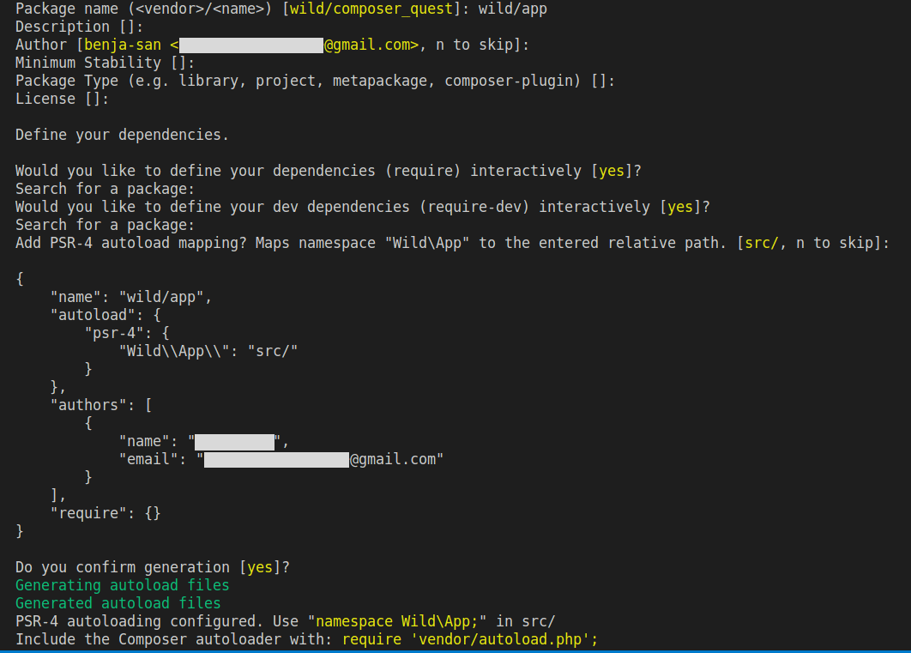

```title-book
Introduction
```


Pour rappel, composer est un gestionnaire de dépendances Libre, écrit en PHP.
Il permet à ses utilisateurs de déclarer et d'installer les bibliothèques (_packages_) dont le projet principal a besoin. 
Une bibliothèque est un ensemble de scripts écrits en PHP mettant à disposition des fonctions, constantes et classes afin de faciliter et d'accélérer les développements. 

Composer embarque également un système d’_autoloading_ pour tes classes.


Cette quête va t’apprendre à charger automatiquement tes classes en utilisant l’_autoload_ de Composer.
Tu verras l'installation des packages dans la quête suivante.

## 🤓 À la fin de cette quête, tu seras capable de :
- ✅ Comprendre comment les classes sont chargées en PHP
- ✅ Utiliser l’autoloader de composer

# Initialisation d'un projet Composer

Avant toute utilisation de Composer, il faut vérifier si tu utilises bien une version à jour.
Pour cela, Composer te fournit une méthode pour se mettre à jour automatiquement.

**TODO:** Lance la commande suivante :

```sh
composer self-update
```

Afin d'initialiser un projet qui va utiliser Composer, place toi **à la racine** de ton projet et lance la commande :

```sh
composer init
```

Cette commande est interactive. Elle va donc te demander de renseigner des informations spécifiques à ton projet.

```alert-warning
Attention, si un fichier `composer.json` est déjà présent dans ton projet, cette commande va l'écraser et le remplacer avec le fichier `composer.json` nouvellement initialisé.
```



Une fois que tu as répondu à toutes les questions, Composer te crée un fichier très important : <i>**composer.json**</i>

Ce fichier contient toutes les informations relatives à ton projet que tu as renseignées dans ton terminal.
Il contiendra également la liste des dépendances à gérer.

Voici le contenu de ce fichier :

```json
{
    "name": "wild/app",
    "description": "Wild composer quest",
    "autoload": {
        "psr-4": {
            "App\\": "src/"
    },
    "authors": [
        {
            "name": "wilderName",
            "email": "wilder@email.com"
        }
    ],
    "require": {}
}
```

# Chargement des classes (Autoloading)

Maintenant que tu as vu la POO (Programmation Orienté Objet), tu veux utiliser des objets !

```alert-info
Dans certains cas, il arrive que différentes classes, fonctions ou constantes portent le même nom (d'une bibliothèque à une autre par exemple). Afin d'éviter tout conflit PHP met à disposition des espaces de noms: les **namespaces**.
Il s'agit de "dossiers virtuels" qui permettent de faire la distinction entre une `Class Cat` importée d'une bibliothèque externe et une `Class Cat` définie dans ton projet par exemple.Ainsi, si ta classe Cat se trouve dans le _Namespace Animal_, le vrai nom complet de la classe sera `Animal\Cat` et non pas `Cat` (ce qui permet bien de différencier deux classes portant le même nom mais dans des namespace différents). Ce nom, composé du _namespace_ associé au nom de la classe est appelé **nom pleinement qualifié** de la classe ou _Fully Qualified Class Name_ (FQCN) en anglais.
```

Pour utiliser les classes dans ton projet tu vas devoir importer un à un les fichiers _.php_ qui les contiennent (avec `include` ou `require`). 

À mesure que le nombre de fichiers grandit, cela devient vite ingérable ! C'est pour cela que PHP propose un système d'_autoloading_.

```alert-info
Même si, en théorie, tu peux créer plusieurs classes dans un même fichier, c'est une très mauvaise pratique. Si tu souhaites utiliser l'_autoload_, tu vas devoir faire attention de toujours créer **une seule classe par fichier**, et t'assurer que le fichier PHP ait bien le **même nom** que la classe. Soit pour "`Animal/Cat`", un fichier `Cat.php`, pour "`Animal/Dog`", un fichier "`Dog.php`", _etc._
```

Tu ne vas pas l'utiliser directement, car le paramétrage peut devenir fastidieux.
Tu vas donc utiliser le système d'*autoloading* de Composer.

Résultat: Composer va se charger d'importer automatiquement tous les fichiers PHP de ton projet et de les rassembler sous un seul *namespace* racine que tu auras défini dans ton fichier *composer.json*.

Lors de la dernière phase d'initialisation de ta commande `composer init`  L'invite de commande te propose automatiquement de bénéficier de l'autoloading en intégrant une entrée `autoload:` à l'interieur de ton fichier composer.json.
Pour en savoir plus, jette un oeil à la documentation [Composer autoloading](https://getcomposer.org/doc/01-basic-usage.md#autoloading).

```alert-info
Important: Si jamais tu viens à changer les informations de ton fichier composer.json, sache qu'après toute modification du fichier il est nécessaire de lancer la commande `composer install` pour que les changements soient pris en compte.
```

Si tu as décidé de générer l'autoload de manière automatique, tu pourras accèder au dossier `vendor/`. Dans ce dossier, un fichier `autoload.php` est généré. C'est lui qui va se charger d'importer tes classes, *etc.* **Il est nécessaire de <b>`require`</b> le fichier <i>****autoload.php****</i> dans ton <i>****index.php****</i>, pour pouvoir utiliser les namespaces.**

```alert-info
Si tu modifies l’autoload dans ton composer.json après l’installation, il faudra jouer la [commande](https://getcomposer.org/doc/03-cli.md#dump-autoload-dumpautoload-) `composer dump-autoload` pour que les changements soient pris en compte.
```

```resource
https://www.php.net/manual/en/language.namespaces.php
# Les namespaces en PHP
Les namespaces en PHP.
```

```resource
https://getcomposer.org/doc/01-basic-usage.md#autoloading
# Composer autoloading
Composer *autoloading*.
```

```resource
https://grafikart.fr/tutoriels/autoload-561#autoplay
# Vidéo sur l'autoloading
Vidéo sur l'*autoloading*.
```

```resource
http://php.net/manual/fr/language.oop5.autoload.php
# Autoloading en PHP
La doc officielle de PHP sur l'*autoloading*.
```

```resource
https://www.php-fig.org/psr/psr-4/
# PSR-4 : Autoloader
PSR-4 : Autoloader.
```

```quiz
true|||true|||true
# Quelle commande permet de générer un fichier composer.json ?
[x] composer init
[] composer install
[] composer update
# Si vous venez de récupérer un projet et que vous constatez qu’il comporte un fichier composer.json mais pas de vendor, que devez vous faire ?
[] télécharger le vendor sur packagist
[x] taper la commande composer install
[] créer un dossier vendor dans le projet
# Qu’est ce que le FQCN ?
[] Le chemin exacte dans le répertoire vers la classe, par exemple : src/controller/HomeController
[x] Le nom composé du namespace et du nom de la classe, par exemple App\Controller\HomeController
[] Le nom composé du namespace et du nom de la classe, par exemple App/Controller/HomeController
# Il est possible d'avoir deux classes ayant exactement le même nom dans un même projet
[x] vrai
[] faux
# Dans quel ordre faudrait-il exécuter ces commandes pour créer un nouveau projet utilisant Composer ?
[] composer init / composer install / composer self-update
[] composer install / composer init / composer self-update
[x] composer self-update / composer init / composer install
```

# 💪 Challenge
## Créer une architecture de projet

Tu dois créer une architecture minimaliste de projet.

L'arborescence des dossiers doit être la suivante :

```shell
public/
    index.php
src/
    Hello.php
```

- le fichier _index.php_ est l'entrée de l'application.
- le fichier _Hello.php_ contient une classe nommée `Hello` qui devra posséder une méthode `talk`. Cette dernière devra retourner "Hello World !".
- le vendor n'est pas versionné (ne le `add` pas avec git ou ajoute le dans le `.gitignore`)

```alert-warning
Attention, cette classe doit se trouver dans le namespace `App` !

## Critères de validation
- Ton code est sur un repository personnel sur GitHub.
- Ton arborescence correspond à ce qui a été demandé dans le challenge
- Ton _composer.json_ contient une section `autoload` avec la déclaration de ton namespace racine `App\`
- Ton fichier _index.php_ instancie et utilise un objet `App\Hello`