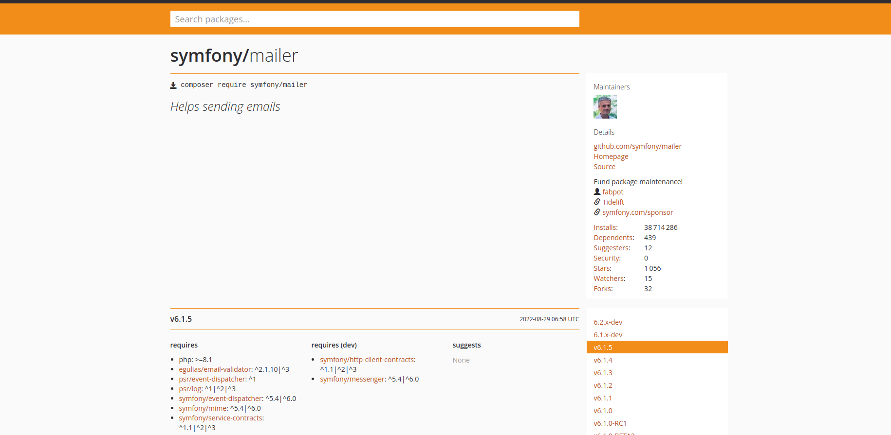
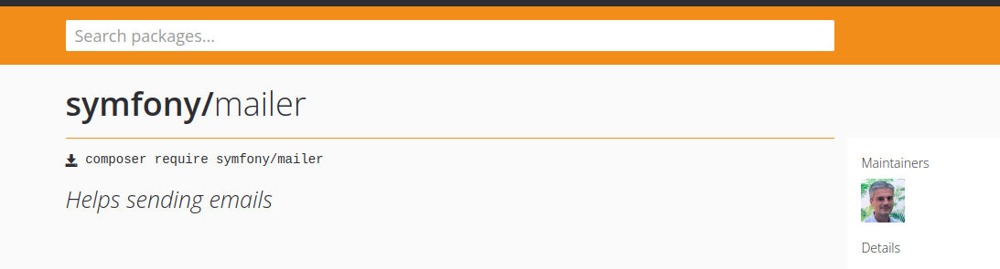
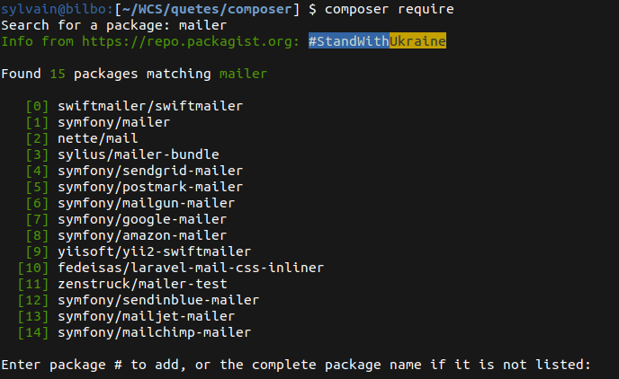

**⚠️ Avant de commencer cette quête, tu dois avoir terminé les quêtes suivantes :**

```quests
1144
```

```title-book
Introduction
```

Sur la quête "Composer 2 - PSR-4 & Autoload", tu as vu comment utiliser l’*autoloader* de Composer avec tes propres classes.
La vocation première de Composer est d’être un gestionnaire de dépendances, c’est ce que tu vas utiliser dans cette quête.
Tu vas voir comment installer une bibliothèque externe à ton projet et utiliser l’*autoloader* pour la charger.

## 🤓 À la fin de cette quête, tu seras capable de :

* ✅ Rechercher un package
* ✅ Installer un package dans ton projet
* ✅ Maîtriser les commandes `composer require`, `require-dev`

# Dépendances

Mais qu'est-ce qu'une dépendance ? Une dépendance est une librairie (= bibliothèque ou *package*) développée par un tiers et que tu vas pouvoir réutiliser dans ton projet.

En effet, les problématiques rencontrées sont souvent les mêmes, et il existe déjà des librairies, la plupart du temps Open Source (mais pas obligatoirement), qui résolvent ces problèmes.
Selon la popularité des librairies, ces dernières bénéficient souvent de toute une communauté de développeurs et d'utilisateurs qui les mettent à jour et les font évoluer.

Par exemple, pour envoyer un mail, il existe la librairie [Mailer](https://packagist.org/packages/symfony/mailer).

```alert-error
Il faut faire très attention aux librairies que tu vas choisir, car tu vas intégrer du code que tu ne maîtrises pas.
Cela peut potentiellement être dangereux. Il est donc vivement recommandé de choisir uniquement des librairies sûres.
```

Comment définir qu'une librairie est sûre :

* Elle est activement maintenue (il y a des commits réguliers)
* Elle possède une communauté importante (forums...)
* Elle dispose d'une documentation complète et claire
* Elle est dans un état stable (pas de beta, alpha... en production)

Tu ne peux pas installer n'importe quelle librairie via Composer. Toutes les librairies disponibles à l'installation sont présentes sur le site [https://packagist.org](https://packagist.org/).

Packagist fournit des informations sur :

* Le nombre de téléchargements
* Le nombre de projets dépendants
* Le Github du projet
* Les versions
* Les dépendances de la dépendance XD
* ...



# Comment installer une librairie ?

Deux possibilités :

**1 - Tu connais l'identifiant de la librairie :**

Cet identifiant est disponible sur la page de la librairie en question sur Packagist.


Il te suffit donc, à la racine de ton projet, dans ton terminal, de lancer la commande encadrée en rouge dans l'image ci-dessus.

```sh
// Si installé globalement
composer require <vendor>/<package_name>
```

`<vendor>` représentant le nom de l'éditeur du package, et `<package_name>` le nom de ce dernier.

**2 - Tu ne connais pas l'identifiant de la librairie :**

Dans ce cas tu peux directement taper :

```sh
composer require
```



Ce dernier va te proposer de saisir un nom de librairie et te suggérer ce qui lui semble cohérent par rapport à ta saisie.
Il te suffit de suivre les indications de ton terminal. Composer t'informe des actions qu'il réalise.

À la fin de l'installation, il est important de noter deux choses inscrites dans le terminal :

* `Writing lock file` (cf. section lock file)
* `Generating autoload files` (cf. [Composer 1 - Autoload](https://odyssey.wildcodeschool.com/quests/1144))

Il faut aussi noter que ton fichier *composer.json* a été mis à jour. Il contient maintenant ceci :

```json
{
    "name": "wcs/quete_composer",
    "description": "Projet quête composer",
    "authors": [
        {
            "name": "WCS",
            "email": "formateur@wildcodeschool.fr"
        }
    ],
    "require": {
        "vendor/package_name": "^1.0"
    }
}
```

La librairie a été ajoutée dans la section `require`. Dans l'exemple ci-dessus, `^1.0` correspond au numéro de version du package.

Le code de la librairie a également été téléchargé dans le dossier _vendor/_.

```alert-error
# Attention
Le dossier _vendor/_ ne doit **jamais** être versionné sinon le poids du _repository_ s'alourdirait considérablement et inutilement... Pense donc à bien ajouter `vendor/` dans ton fichier *.gitignore*.
```

```resource
https://packagist.org/
# The PHP Package Repository
The PHP Package Repository.
```

# Lock File


Le fichier _composer.lock_ est directement lié au fichier _composer.json_ que tu as vu plus haut.
À la fin de l'installation d'une librairie, Composer t'indique `Writing lock file`.
Cela signifie que `Composer` va soit créer le fichier _composer.lock_, soit le mettre à jour s'il existe déjà.

### composer.lock VS composer.json

Le fichier _composer.json_ contient des informations sur le projet, la liste des dépendances qu'il utilise, les versions de ces dépendances ainsi que les règles pour les mettre à jour.

Le fichier _composer.lock_, quant à lui, contient la liste de toutes les dépendances (dont les dépendances de dépendances) ainsi que les **versions précises** installées.

Cela peut sembler une petite différence mais c'est en fait très différent car chaque mise à jour d'une dépendance peut entraîner un bug ou une incompatibilité.

Il faut impérativement versionner ton fichier _composer.lock_ (en plus du fichier _composer.json_) pour s'assurer que tous les développeurs utilisent les mêmes versions de dépendances.

### install VS update

De la même manière qu'il existe deux fichiers _composer.lock_ et _composer.json_, il existe deux commandes pour les manipuler.

```sh
composer update

// OU

composer install
```

Contrairement à ce que l'on pourrait croire, la commande `install` n'est pas utilisée uniquement lors de l'installation, mais également pour les mises à jour.
Cette commande va lire le fichier _composer.json_, et, si le fichier _composer.lock_ est présent,  installer les versions précises des dépendances qu'il contient (si différentes de celles déjà installées). Le fichier composer.lock sert donc de référence à cette commande et n'est pas modifié.
La commande `update` va, elle, lire le fichier _composer.json_ et mettre à jour si nécessaire les dépendances en fonction des règles spécifiées. Dans ce cas, le fichier _composer.json_ sert de base et le fichier _composer.lock_ sera mis à jour.

```alert-warning
Le dossier _/vendor_ étant régulièrement mis à jour, son contenu est amené à être régulièrement modifié/écrasé. De plus, ce dernier ne doit pas être versionné. De ce fait, il ne faut donc **JAMAIS** modifier directement le contenu d'un fichier contenu dans ce dossier _/vendor_, car cette modification ne sera pas versionnée et sera ré-écrasée dès que tu mettras à jour un _package_.
```

```resource
http://www.weblogin.fr/blog/composer-update-et-composer-install
# Composer install vs update
Composer install vs update.
```

```resource
https://madewithlove.com/tilde-and-caret-constraints/
# Gestion des mises à jour
Gestion des mises à jour avec Composer.
```

```resource
https://semver.org/
# Semver
Indirectement lié à Composer. La numérotation des versions de logiciel.
```

# 💪 Challenge
### Installer et utiliser un *package* externe

Un peu de fun pour ce challenge, tu vas utiliser un package inutile mais parfait pour t'entraîner !

https://packagist.org/packages/gipetto/cowsay

Ce package te permettra de faire parler une vache dans ton terminal.


- Créé un nouveau dossier, déplace toi dedans et directement tape la commande permettant d'installer le package [CowSay](https://packagist.org/packages/gipetto/cowsay)

```hidden
Indice|||bash|||Essaye déjà de trouver la commande pour ajouter un package dans ton projet puis vérifie ici|||0|||Hide
composer require gipetto/cowsay
```

- Créé un fichier `index.php` et insère le code permettant de faire parler la vache. Lis bien la documentation du package pour comprendre comment faire. Attention, la documentation montre uniquement comment utiliser le package de façon générique. Dans ton cas, il faudra dès la première ligne require le fichier *autoload.php* qui se trouve dans ton dossier *vendor*

```hidden
Indice|||php|||Essaye de trouver comment charger le fichier d'autoload puis vérifie ici|||0|||Hide
require 'vendor/autoload.php';
```

- Enfin, execute ce code dans ton terminal ! `php index.php` 

Et si tu le souhaites, trouve le moyen de faire tirer la langue à la vache :)


### Critères de validation

- Ton code est sur un repo personnel sur Github.
- Lorsqu'on execute le fichier index.php la vache apparaît

Aide à la validation pour les correcteurs : Clonez le repository github et tapez uniquement `composer install` Ceci installera les dépendances du projet et vous pourrez ensuite tester le code.