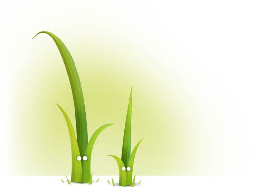

```title-book

Introduction

```

⚠️ Avant de commencer cette quête, tu dois avoir terminé la quête suivante

```quests
1623
```

# TWIG



Parmi ses fonctionnalités, le moteur de template Twig permet de gérer la structure des pages. Bien utiliser son moteur te permettra de développer des applications maintenables et évolutives.

## 🤓 À la fin de cette quête, tu seras capable de :

* ✅ Utiliser l'héritage dans Twig
* ✅ Inclure des composants de template

# Le principe d'héritage

Comme en Programmation Orientée Objet, Twig inclut un système d'héritage de template dans son moteur.
Cette fonctionnalité sera incontournable pour tout projet multipages afin de te permettre de créer un squelette de base à ton application. L'idée est la suivante: des templates "enfants" vont pouvoir hériter de ce qui a déjà été défini dans les templates "parents", à savoir le code HTML déjà écrit !
### Création du squelette

Que pourrait contenir ce squelette ?
Tout ce que tu as besoin de répéter sur chaque page HTML !
Soit par exemple :

```twig
{# layout.html.twig #}
<!doctype html>
<html lang="fr">
<head>
    <meta charset="utf-8">
    <meta http-equiv="x-ua-compatible" content="ie=edge">
    <meta name="viewport" content="width=device-width, initial-scale=1">

    <title>Wilders.co</title>

    <link rel="stylesheet" href="/assets/css/style.css"> 
    <link rel="icon" href="/assets/images/favicon.png">
</head>

<body>
</body>
</html>
```

Rien de nouveau pour toi ici, tu as dans cet exemple toutes les balises nécessaires pour chacune des pages qui feront partie de ton application.

Généralement, ce squelette est appelé *base.html.twig* ou *layout.html.twig*.

Comme chacune de tes pages de ton site contiendra les éléments de ce squelette, il faut maintenant l'imaginer comme un calque que tu pourras poser sur tous tes fichiers, simplement en l'appelant !
Dans l'état, il manque quelque chose d'important dans cet exemple. Permettre d'indiquer les endroits où tu laisses la possibilité d'ajouter du code lorsque l'on utilisera ce calque.

Par exemple entre les deux balises body, pour injecter le contenu principal de la page considérée.
Voici comment l'indiquer dans notre exemple

```twig
{# layout.html.twig #}
<!doctype html>
<html lang="fr">
<head>
    <meta charset="utf-8">
    <meta http-equiv="x-ua-compatible" content="ie=edge">
    <meta name="viewport" content="width=device-width, initial-scale=1">

    <title>Wilders.co</title>

    <link rel="stylesheet" href="/assets/css/style.css"> 
    <link rel="icon" href="/assets/images/favicon.png">
</head>

<body>
    
</body>
</html>
```

Tu as remarqué que nous avons ajouté `` entre les deux balises `body`. C'est donc dans ces *blocks* qu'il sera possible d'écrire du code si tu hérites de ce squelette.
Le mot *content* a été choisi arbitrairement, tu aurais pu l'appeler *body* ou autre mot approprié.

### Héritage du squelette

Maintenant que tu as un squelette utilisable, tu vas pouvoir en hériter dans un autre fichier.

```twig
{# hello.html.twig #}



    Hello World !

```

Et c'est tout !
Tout d'abord tu indiques que tu souhaites hériter de *layout.html.twig* (ton squelette) grâce au mot clé `extends`.
Ensuite, tu as la possibilité d'utiliser les blocs mis à ta disposition par le squelette. Dans notre exemple, le `block content`.
Par cette manipulation, tu as en réalité généré un fichier HTML complet qui sera servi sur le navigateur de l'utilisateur final.

```alert-warning
En héritant d'un layout, il est obligatoire d'insérer le contenu uniquement à l'intérieur d'un élément block. Dans le cas contraire, le moteur de template ne saura pas où afficher le contenu et lancera une erreur.
```

### Allons plus loin dans l'héritage

Avec l'exemple que tu viens de voir, nous rencontrons des limites :

"Comment puis-je alors avoir un title différent pour chacune de mes pages ?"

Deux solutions.

La première consisterait à modifier le *layout.html.twig* en ajoutant un bloc *title*, comme ceci :

```twig
{# layout.html.twig #}
<!doctype html>
<html lang="fr">
<head>
    <meta charset="utf-8">
    <meta http-equiv="x-ua-compatible" content="ie=edge">
    <meta name="viewport" content="width=device-width, initial-scale=1">

    <title></title>

    <link rel="stylesheet" href="/assets/css/style.css"> 
    <link rel="icon" href="/assets/images/favicon.png">
</head>

<body>
    
</body>
</html>
```

et dans ce cas, si tu n'indiques pas le contenu du bloc *title* quand tu hérites de ce *layout*, la page générée n'aura pas de contenu pour la balise `<title>`, et donc pas de titre. Le bloc n'a pas de contenu par défaut.

La seconde solution, qui serait plus appropriée dans notre exemple, serait plutôt d'indiquer du contenu par défaut dans notre bloc title, comme ceci

```twig
{# layout.html.twig #}
<!doctype html>
<html lang="fr">
<head>
    <meta charset="utf-8">
    <meta http-equiv="x-ua-compatible" content="ie=edge">
    <meta name="viewport" content="width=device-width, initial-scale=1">

    <title>Wilders.co</title>

    <link rel="stylesheet" href="/assets/css/style.css"> 
    <link rel="icon" href="/assets/images/favicon.png">
</head>

<body>
    
</body>
</html>
```

Ainsi, lorsque tu hériteras de ce *layout*, tu pourras soit :
- Ne pas utiliser le bloc title et dans ce cas, ce sera celui par défaut (Wilders.co dans cet exemple)
- Écraser entièrement le bloc title et mettant celui que tu souhaites

```twig
{# admin.html.twig #}


    Interface d'administration


    Hello admin !

```

- Ou enfin, conserver le title par défaut et y ajouter du contenu personnalisé selon la page où l'on se trouve, grâce à la fonction Twig `{{ parent() }} qui reprend le contenu du bloc parent !

```twig
{# contact.html.twig #}


    {{ parent() }} - Contactez-nous !


    Utilisez ce formulaire pour nous contacter :
    {# formulaire de contact (...) #}

```

Ceci affichera comme title : "Wilders.co - Contactez-nous !"

```alert-info
Si tu souhaites un exemple concret où ce système est appliqué, observe dans les onglets de ton navigateur les "title" de chaque page de la documentation de [twig](https://twig.symfony.com) !
```

Cet exemple s'applique aussi bien pour les title que pour les blocs de styles, scripts ou autres contextes.
Il est d'ailleurs d'usage de créer des blocs pour `title`, `stylesheet`, `content` et `javascript` dans les layouts principaux.

```resource
https://www.smashingmagazine.com/2011/10/getting-started-with-php-templating
# Ressource très complète sur les templates
Regarde toute la **première partie** de l'article sur l'intérêt général des *templates*. Attends cependant d'avoir terminé de lire le reste de la quête avant de revenir sur la seconde qui présente Twig.
```

Vidéo sur le principe d'héritage avec Twig

```youtube
https://www.youtube.com/watch?v=sAxuqMB7eUY
```

# Le principe d'inclusion

L'inclusion avec Twig permet d'améliorer la modularité de tes applications.

Normalement, tu ne devrais pas être très dépaysé avec l'inclusion de *templates* avec Twig : ça ressemble cette fois beaucoup à ce que tu fais déjà quand tu utilises `include` (ou `require`) pour inclure un fichier PHP dans un autre.

Quand tu développeras des applications avec Twig, l'idée sera de réflechir en terme de composants.

Les vertus de découper en composants sont multiples :
- Réutilisation du code (DRY)
- Organisation du code (maintenabilité, évolutivité)
- Fichiers plus lisibles, moins chargés (maintenabilité, évolutivité)

Un exemple courant serait une [card](https://getbootstrap.com/docs/4.0/components/card/), que l'on utiliserait sur plusieurs pages.

```twig
{# component/_card.html.twig #}
<article>
  <header></header>
  <div>
    <h1>{{ activity.title }}</h1>
    <p>{{ activity.content }}</p>
  </div>
</article>
```

C'est tout ce que contiendrait ce fichier !
Il ne sera jamais utilisé en tant que vue complète mais tout le temps en tant que composant. Il ne doit surtout pas hériter du *layout* par exemple.
Une bonne pratique consiste à nommer ces composants en préfixant avec un underscore. Ici *_card.html.twig*

```alert-info
Cette pratique de nommage est recommandée dans la liste des [bonnes pratiques de Symfony](https://symfony.com/doc/current/best_practices.html#templates), commence dès maintenant à prendre de belles habitudes !
```

Voici maintenant comment ce composant pourrait être utilisé

```twig
{# activities.html.twig #}


    {{ parent() }} - Liste de nos activités


    
        
    

```

Dans cet exemple, nous supposons que notre contrôleur nous aura envoyé un tableau `activities`. Ainsi une card sera affichée pour chaque activité.
# 💪 Challenge

### Héritage et inclusion

```alert-info
Pour ce challenge tu repartiras du dépôt Github que tu as déjà utilisé lors de la quête précédente : <https://github.com/WildCodeSchool/quest-twig>
```

- Commence par créer le fichier `src/View/layout.html.twig` avec le code suivant :

```twig
{# layout.html.twig #}
<!doctype html>
<html lang="fr">
<head>
    <meta charset="utf-8">
    <meta http-equiv="x-ua-compatible" content="ie=edge">
    <meta name="viewport" content="width=device-width, initial-scale=1">

    <title></title>

    <link rel="stylesheet" href="/assets/css/style.css"> 
    <link rel="icon" href="/assets/images/favicon.png">
</head>

<body>
    
</body>
</html>
```

- Un fois le fichier créé, modifie ce *layout* pour avoir un *title* par défaut
- Crées une page `src/View/home.html.twig` qui hérite du *layout.html.twig*
- Cette page utilisera le titre parent et ajoutera "- Accueil"
- Créé un composant pour une navbar (ne t’embête pas avec la mise en forme pour cette quête) et inclus le dans ton fichier *layout.html.twig*
- Envoie le résultat sur ton dépôt GitHub et poste le lien en solution


### Critères de validation

- Pour corriger, clone le projet et pense à lancer un `composer install`. Le dossier `vendor` ne doit pas être inclus dans le versionnage sous git.
- `parent()` est utilisé dans le fichier *home.html.twig*

- [Les bonnes pratiques de nommage](https://symfony.com/doc/current/best_practices.html#templates) sont appliquées