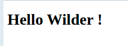

```title-book
Introduction
```

Avant de commencer cette quête, veilles à bien avoir fait les quêtes précédentes :

```quests
1623,1614
```

Tu commence à utiliser TWIG et tu as réussi à générer tes premières vues à l'aide de template *html.twig* ? 
Félicitations! 


```spacer-medium
```

Il est temps maintenant que tu apprennes à utiliser les globales.

```title-magnify
Pourquoi faire ?
```

Comme tu as pu le voir dans les quêtes précédentes, lorsque tu souhaites transmettre des informations à un *template* Twig, tu dois les passer en utilisant la méthode `$twig->render()` comme dans l'exemple qui suit : 


*index.php*

```php
$name = 'Wilder';

echo $twig->render('home.html.twig', ['name' => $name]);
```

*home.html.twig*

```twig
<body>
    <h1>Hello {{ name }} !</h1>
</body>
```

Ce qui donne comme résultat :

Parfait 👏👏👏!

```spacer-medium
```

🤔 Maintenant, que se passerait-il si tu voulais afficher une variable dans un template de footer qui se trouverait inclut dans toutes les pages de ton site?

Par exemple le footer suivant :

*_footer.html.twig*

```twig
<footer>
    <p>
        Ce site a été réalisé par {{author}}.
    </p>
</footer>

```


Inclus dans les pages suivantes :


Ici le footer attend qu'on lui passe le **nom de l'auteur** du site dans une variable *author*.

Et comme le footer est présent dans toutes les pages, cela signifie que la variable doit être passée dans toutes les pages 😱 :


*index.php*

```php
$author = 'Oscar Wilder';

echo $twig->render('index.html.twig', ['author' => $author]);
```

*page1.php*

```php
$author = 'Oscar Wilder';

echo $twig->render('page1.html.twig', ['author' => $author]);
```

*page2.php*

```php
$author = 'Oscar Wilder';

echo $twig->render('page2.html.twig', ['author' => $author]);
```

😖 Tu l'auras compris cette méthode est longue et fastidieuse (et pas très *DRY*).

Alors comment faire autrement ?

```spacer-large
```

```title-attention2
Les globales !!
```


Au lieu de venir passer ton paramètre à chaque appel de la fonction `$twig->render()` tu peux transmettre à tes vues en passant par une globale comme l'exemple suivant :


*twig.php*

```php
<?php

require_once __DIR__ . '/../vendor/autoload.php';

$loader = new Twig\Loader\FilesystemLoader(__DIR__ . '/../src/View');
$twig = new Twig\Environment($loader, ['debug' => true]);
$twig->addExtension(new Twig\Extension\DebugExtension());

//On ajoute la globale author à l'initialisation de l'objet Twig
$author = 'Oscar Wilder';
$twig->addGlobal('author', $author);
```

Ensuite, on le récupère dans le footer comme d'habitude :
*_footer.html.twig*

```twig
<footer>
    <p>
        Ce site a été réalisé par {{author}}.
    </p>
</footer>

```

😄 Et voilà c'est terminé ! Ton footer est maintenant bien alimenté par le nom de l'auteur sans que tu aies besoin de le passer à la méthode `$twig->render()`.

```alert-warning
Attention néanmoins à ne pas abuser des globales. 

En effet, toutes les informations que tu mettras en global seront transmises à toutes les vues de ton site (y compris à celles qui ne les utilisent pas !). Quel que soit le contexte, en programmation c'est une bonne pratique d'être parcimonieux avec l'utilisation de variables globales.
Aussi n'utilise les globales que pour les données transverses à ton site, pour le reste il vaut mieux utiliser `$twig->render()`.
```

# 💪 Challenge

### Ajouter un email de contact dans un pied de page

```alert-info

Pour ce challenge tu repartiras du dépôt Github que tu as déjà utilisé lors de la quête précédente : <https://github.com/WildCodeSchool/quest-twig>

```

- Commence par créer le fichier `src/View/_footer.html.twig` avec le code suivant :

```twig
<footer>
    <p>
        Pour nous contacter : <a href="mailto:{{contactEmail}}">{{contactEmail}}</a>
    </p>
</footer>
```

- Ensuite, rends toi dans le fichier 'src/View/layout.html.twig' que tu as créé lors de la quête précédente et inclus le footer dans la balise body, juste aprés le block content
- Va ensuite ajouter une globale comme dans l'exemple montré plus haut dans le fichier `config/twig.php`. Stocke dans cette globale une adresse email
- Vérifie que sur ta page tu as maintenant bien un footer avec une adresse email de contact 🤓
- Crée ensuite dans public un fichier `details.php` qui appelle une vue `details.html.twig` (que tu dois créer) et qui héritera de layout.html.twig
- Vérifie que sur cette nouvelle page aussi tu as bien l'email qui apparait 🤓🤓  
- Envoie le résultat sur ton dépôt GitHub et poste le lien en solution


### Critères de validation

- Pour corriger, clone le projet et pense à lancer un `composer install` si ce n'est pas déjà fait.
- Il y a bien un $twig->addGlobal() dans `config/twig.php` pour déclarer un email de contact
- Il y a bien l'inclusion du fichier `src/View/_footer.html.twig` dans le `layout.html.twig`

- Le dossier `vendor` de ton projet n'est pas versionné sous git.