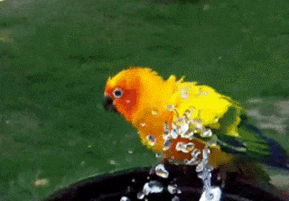

# Prérequis

```quests
2241
```

```title-book
Introduction
```

```story
Un objet a des caractéristiques (les propriétés), mais peut également effectuer des actions. Un animal pourra se déplacer, manger, se laver, parler, *etc.* Ces actions vont être définies dans des **méthodes**, qui permettent notamment de manipuler les propriétés de l'objet.



Pour démarrer, place toi sur la branche **poo3** du repository [WildZoo](https://github.com/WildCodeSchool/php-wildzoo).
```

## 🤓 À la fin de cette quête, tu seras capable de :
- ✅ Comprendre le concept de méthode
- ✅ Créer une méthode
- ✅ Accéder aux propriétés depuis une méthode
- ✅ Utiliser une méthode


# La bonne méthode

En plus des propriétés qui la caractérisent, une classe est dotée de **fonctions**, appelées **méthodes** dans le contexte objet. Celles-ci vont lui permettre d'effectuer des actions, comme modifier des propriétés, ou retourner des informations.
La logique de notre code va se retrouver dans ces méthodes. Les méthodes s'écrivent exactement comme des fonctions, avec un nom, des paramètres obligatoires ou optionnels, des accolades contenant le corps de la fonction. Les paramètres et la valeur de sortie seront typés.

Commençons par créer une première méthode afin de faire parler notre animal

```php hl[11:14]
<?php

class Animal
{
    public string $name;
    public float $size = 100;
    public bool $carnivorous = false;
    public int $pawNumber;
    public string $threatenedLevel = 'NE';

    public function speak(): string
    {
        return 'Welcome to the zoo';
    }
}
```

Tu vois que la méthode `speak()` s'écrit à l'intérieur des accolades de la classe. Pour garder le code lisible, écris toutes tes propriétés en premier, puis toutes tes méthodes en dessous.

La classe défini maintenant des propriétés **et** des actions, les méthodes. Ici, la méthode ne fait que renvoyer un texte, qui sera le même pour tous les animaux.

```alert-info
Comme pour les propriétés, tu vois le mot-clé "public" juste avant "function". Nous parlerons de sa signification dans la prochaine quête lorsque nous aborderons le concept de visibilité.
```

🖥️ Ajoute la méthode `speak()` dans le fichier *Animal.php*. Sur l'interface web, tu dois voir maintenant le texte 'Welcome to the zoo' lorsque tu survoles un animal.

# Utiliser une méthode

Ici le code fourni appelle la méthode `speak()`, mais si tu veux l'utiliser toi même il suffit de l'appeler à partir d'un objet.

🖥️ Dans *index.php*, ajoute la ligne :

```php hl[8]
$lion = new Animal();
$lion->name = 'lion';
$lion->pawNumber = 4;
$lion->carnivorous = true;
$lion->size = 70;
$lion->threatenedLevel = 'VU';

echo $lion->speak();
```

tu devrais voir la phrase apparaître en haut de ta page. Côté syntaxe, tu retrouves quelque chose de similaire à l'utilisation des propriétés, tu pars d'un objet instancié, ici `$lion`, tu ajoutes la flèche `->` puis le nom de la méthode avec ses parenthèses, ici `speak()`.


# Accéder aux propriétés avec $this

Une méthode permet de manipuler les *propriétés* de l'objet. Tu as vu jusqu'à présent qu'une variable définie en dehors d'une fonction n'était pas accessible à l'intérieur d'une fonction et *vice versa*, les portées sont limitées.
C'est un peu différent à l'intérieur d'une classe ! Les méthodes d'une classe ont la possibilité d'accéder aux propriétés de la classe, ce qui s'avère très pratique. Pour cela, tu vas utiliser le mot clé `$this` dans ta méthode.

```php
public function speak(): string
{
    return 'Welcome to the zoo, I am a ' . $this->name;
}
```

La méthode `speak()` a été modifiée afin d'utiliser la propriété `$name`, via la syntaxe `$this->name`.

🖥️ Modifie la méthode et survole les animaux sur ton interface. Tu vois maintenant que chaque animal affiche son nom, le lion dit "I am a lion" et le perroquet "I am a parrot".

Mais c'est quoi ce `$this` ? 
Lorsque tu veux utiliser le nom du lion depuis ton fichier *index.php*, on a vu qu'il fallait faire `$lion->name`, ce qui va récupérer la valeur associée à cette propriété pour cet objet, ici la chaîne de caractère "lion". Chaque animal représenté est une **instance différente et unique** de la classe Animal. 

Dans la méthode `speak()`, tu veux utiliser la propriété `$name` depuis **l'intérieur de ta classe** (tu es dans le fichier *Animal.php*). Tu ne peux pas faire `$lion->name` ou `$parrot->name` car la classe n'a pas "connaissance" du nom de ses éventuelles instances. 
Quand tu fais `$lion->speak()` dans *index.php*, le code dans la méthode est exécuté et tu souhaites accéder à la propriété associé à cet objet `$lion`.  Ici `$this` représente donc **l'instance en cours d'utilisation**. Si tu appelles la méthode sur l'objet `$lion`, `$this` correspond à `$lion` et donc `$name` vaut 'lion' pour cet objet. 
De même si tu fait `$parrot->speak()`, le `$this` correspondra à l'instance `$parrot` et le `$name` pour cet objet sera alors "Parrot".

# Des paramètres

Une méthode est une fonction de classe, elle a le même fonctionnement, elle peut donc prendre des paramètres. Ceux-ci ont la même portée que pour des fonctions classiques. Tu ne dois pas confondre ces variables "paramètres" avec les propriétés accessible via `$this`.

Pour le moment tes animaux parlent uniquement l'anglais. Nous allons faire en sorte de gérer aussi le français. Au moment d'appeler la méthode, tu pourras spécifier la langue. Les paramètres peuvent prendre des valeurs par défaut, ici "fr" :

```php
public function speak(string $lang = 'fr'): string
{
    if($lang === 'fr') {
        $message = 'Bienvenue au zoo, je suis un ';
    } else {
        $message = 'Welcome to the zoo, I am a ';
    }
    
    return $message . $this->name;
}
```

Dans la méthode, on mélange un paramètre externe `$lang` (qui n'est pas une propriété de ton animal et n'est accessible que dans cette méthode) avec `$name` qui lui une propriété et s'appelle donc via la syntaxe `$this->name`. 

🖥️ Met à jour la méthode `speak()` dans la classe Animal, puis ajoute ces lignes dans *index.php*

```php
echo $lion->speak('fr');
echo $lion->speak('en');
echo $lion->speak();
```

- Sur le premier appel, tu demandes au lion de parler en français. 
- Sur le second, tu lui demandes de parler en anglais.
- Sur le troisième, tu n'indiques pas d'argument, la valeur par défaut "fr" va donc s'appliquer et le texte sera de nouveau en français.

Au survol des images, c'est la langue par défaut qui s'applique maintenant et tu as donc également du français.

### Challenge

À toi de créer ta méthode. Dans le zoo certains animaux sont plus dangereux que d'autres et il est intéressant de l'indiquer pour que les visiteurs soient vigilants. Nous allons partir de critères très simples, un animal sera considéré dangereux si sa taille ($size) est supérieure à 50 ET s'il est carnivore. C'est par exemple le cas du lion.

🖥️ Créé une méthode appelée `isDangerous()`. Elle ne prends pas de paramètre. Elle doit cependant renvoyer un booléen indiquant si l'animal est dangereux ou non, en fonction des critères de taille et de régime alimentaire explicité juste au dessus.
Une fois défini, vérifie sur ton interface web qu'une nouvelle icône apparaît bien, indiquant si l'animal est dangereux ou non. N'hésite pas à faire varier les propriétés de tes animaux pour t'assurer que le comportement de la méthode est correct.

Poste le code de ta méthode `isDangerous()` en solution.

### Critères de validation
- La méthode est correctement typée et retourne bien un booléen
- La méthode renvoie `true` si l'animal à une taille > 50 et est carnivore, sinon elle renvoie `false`.

==$==


```php
public function isDangerous(): bool
{
    return $this->size > 50 && $this->carnivorous === true;        
}
```