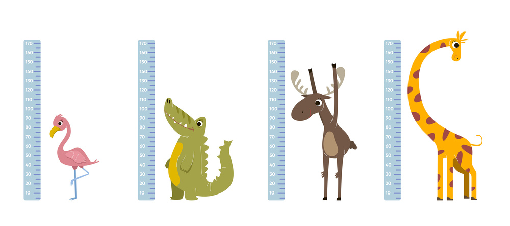
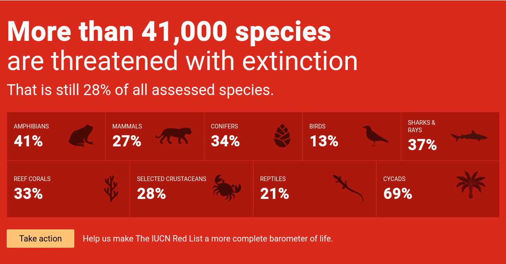

# Prérequis

```quests
2258
```

```title-book
Introduction
```

```story
Nouvelle quête, nouvelle branche, passe sur la **poo5** du [Wildzoo](https://github.com/WildCodeSchool/php-wildzoo).
Dans cette quête tu vas découvrir un nouvel élément de ta classe, les constantes.
```

```alert-warning
Tu as sans doute déjà vu la notion de constante en PHP, avec le mot clé `define()`. Ces constantes sont ensuites accessibles partout dans ton script. Cependant, l'objet de cette quête - même s'il y a de forte similitude - porte sur les constantes **de classe**, en POO. Il ne faut donc pas confondre les deux ;-). 
```

## 🤓 À la fin de cette quête, tu seras capable de :

* ✅ Faire la différence entre variables et constantes
* ✅ Créer une constante de classe
* ✅ Utiliser une constante de classe

# Définition

## Constante vs Variable

Dans une classe, tu as déjà vu les propriétés et les méthodes. Un troisième élément peut y-être défini, les **constantes**.
À la différence d'une propriété (appelée aussi variable de classe) dont la valeur peut changer d'une instance à l'autre, une constante de classe est un élément **dont la valeur est immuable**, elle sera la même pour tous les objets d'une même classe.

Comme nous l'avons vu précédemment, chaque instance d'une classe possède des propriétés identiques, mais des valeurs différentes pour ces propriétés. Le nom du lion n'est pas le même que celui du perroquet, de même que sa taille, *etc.*

Imagine un instant que tu souhaites gérer une unité de longueur pour la taille de tes animaux, en mètres ou en centimètres. Tu fixes une limite, si la taille est inférieure à 100, tu veux l'afficher en centimètre, si la taille est supérieure à 100, tu vas afficher la valeur en mètres. Or, un mètre vaut 100 centimètres. Quelque soit l'animal que tu vas créér, cette données **ne pourra jamais changer**, elle est **constante** et donc commune à tous tes animaux. C'est cela la différence entre une propriété (variable) et une constante de classe.

**La propriété est propre à l'instance, tandis que la constante est propre à la classe !** Pour chaque animal créé, un mètre fera toujours 100cm !


Dans d'autres contextes, une constante pourrait être la température du zéro absolu, la valeur de pi, le rayon de la terre, la vitesse de la lumière, le nombre de carte dans un jeu de tarot, un tableau contenant les lettres de l'alphabet latin, *etc.*

## Syntaxe pour créer une constante

Pour ajouter une constante à une classe, tu vas utiliser le mot clé `const` suivi du nom de la constante en majuscule (les mots séparés par des *underscores*). Attention, contrairement aux variables, il n'y a pas de dollar avant un nom de constante.
La constante peut avoir une visibilité pour déterminer si elle est visible ou non depuis l'extérieur. Puisqu'une constante n'est pas modifiable, sauf cas particulier elle est généralement définie en `public`.
Généralement, dans ta classe, pour faciliter la lisibilité, tu organiseras les éléments dans cet ordre de haut en bas : constantes, propriétés, méthodes (avec le constructeur en premier s'il y a lieu)

Regarde la [documentation PHP](https://www.php.net/manual/fr/language.oop5.constants.php), elle te montrera quelques cas d'utilisation.

```php hl[5]
<?php

class Animal
{
    public const CENTIMETERS_IN_METER = 100;

    private string $name;
    private float $size = 100;
    private bool $carnivorous = false;
    private int $pawNumber;
    private string $threatenedLevel = 'NE';
    
    public function __construct(string $name, int $pawNumber)
    {
        $this->name = $name;
        $this->setPawNumber($pawNumber);
    }

    // ....
}
```

### Depuis l'extérieur d'une classe

Pour utiliser une propriété depuis l'extérieur, tu utilises la syntaxe `$objet->propertyName`, car la propriété est propre à l'objet.
Pour la constante, ça n'aurait pas de sens puisqu'elle est liée directement à la classe. Pour y accéder, il faut utiliser la syntaxe `ClassName::CONSTANT_NAME`. 

🖥️ Dans *index.php*, affiche la constante avec : 

```php
var_dump(Animal::CENTIMETERS_IN_METER);
```

Ce n'est plus une flèche `->` qui est utilisée pour la constante, mais un double deux points `::` (aussi appelé [opérateur de résolution de portée](https://www.php.net/manual/fr/language.oop5.paamayim-nekudotayim.php)). La flèche est donc pour ce qui a trait à l'objet, le `::` pour ce qui a trait à la classe.

### Depuis l'intérieur d'une classe

Depuis l'intérieur d'une classe, pour une propriété tu utilises la syntaxe `$this->propertyName`, où `$this` représente l'objet en cours d'exécution.

Pour une classe, tu peux toujours utiliser `ClassName::CONSTANT_NAME`, mais il y a un mot-clé qui permet à une classe de faire référence à elle-même, c'est `self`. Ainsi à l'intérieur d'elle-même, tu feras plutôt `self::CONSTANT_NAME`.

# Quand utiliser des constantes

Reprenons l'idée d'afficher la taille en mètres ou centimètres en-dessous ou au-dessus de 100.

🖥️ Commençons sans constante, ajoute le code de la méthode `getSizeWithUnit()` à ta classe **Animal**. Cette méthode va nous retourner la taille et l'unité correspondante.

```php
public function getSizeWithUnit() :string
{
    if($this->getSize() < 100) {
        return $this->getSize() . 'cm';     
    } else {
        return ($this->getSize() / 100) . 'm';
    }
}
```

Actualise ton interface, tu devrais voir les unités apparaître (et l'éléphant devrait être à 1m et non 100cm).
Cependant, dans ce code tu vois deux fois "100", le premier est la limite à partir de laquelle on souhaite passer de l'affichage en cm à celui en mètre (mais on pourrait fixer abitrairement cette limite à 50 ou 200). La seconde occurence correspond au nombre de cm dans un mètre.

Transforme maintenant le code en utilisant la constante définie au préalable.

```php
public function getSizeWithUnit() :string
{
    if($this->getSize() < 100) {
        return $this->getSize() . 'cm';     
    } else {
        return ($this->getSize() / self::CENTIMETERS_IN_METER) . 'm';
    }
}
```

C'est déjà plus clair : la valeur correspond aux centimètres dans un mètre, il n'y a plus de question à se poser. 
Cependant, il reste le premier "100" écrit "en dur", directement dans le code. Il faut éviter au maximum d'utiliser ces valeurs écrites directement, qu'on appelle aussi *magic numbers". C'est une mauvaise pratique car
- on comprend mal à quoi cette valeur sert.
- si tu souhaites modifier cette valeur, il faut potentiellement le faire à plusieurs endroits, ce qui est risque d'erreur.


🖥️ Ajoute une constante SIZE_UNIT_CHANGE_LIMIT pour remplacer ce *magic number*. Tu vas obtenir

```php

public const CENTIMETERS_IN_METER = 100;
public const SIZE_UNIT_CHANGE_LIMIT = 100;

public function getSizeWithUnit() :string
{
    if($this->getSize() < self::SIZE_UNIT_CHANGE_LIMIT) {
        return $this->getSize() . 'cm';     
    } else {
        return ($this->getSize() / self::CENTIMETERS_IN_METER) . 'm';
    }
}
```

Bravo ! Le code est maintenant plus compréhensible car les valeurs utilisées sont correctement nommées.

# 💪 Challenge

### Niveaux de menace


La propriété `$threatenedLevel` est de type `string`. Elle attend une des valeurs de la *red list* de l'IUCN. Cependant, à l'heure actuelle rien ne t'empêche d'y mettre n'importe quelle donnée.

* Dans le *setter* `setThreatenedLevel()`, tu vas faire en sorte de vérifier que le `$threatenedLevel` en paramètre, fait bien partie des valeurs suivantes :
    * NE (Not Evaluated)
    * DD (Data Deficient)
    * LC (Least Concern)
    * NT (Near Threatened)
    * VU (Vulnerable)
    * EN (Endangered)
    * CR (Critically Endangered)
    * EW (Extinct in the wild)
    * EX (Extinct)
* Ces valeurs vont être stockées dans une constante (une constante peut être de type *array*) nommée `THREATENED_LEVELS`
HINT : Utilise la fonction `in_array()` de PHP
* Poste le code de ta méthode `setThreatenedLevel()` en solution

### Critères de validation

* La constante de classe est correctement définie dans la classe **Animal**
* Elle contient un tableau reprenant les niveaux de menace de la *red list* (NE, DD, LC, NT, VU, EN, CR, EW, EX)
* La méthode `setThreatenedLevel()` vérifie que le niveau fait bien partie des valeurs de la constante `THREATENED_LEVELS` (utilisation de `in_array()`)
* Si le level est autorisé, il est passé à la propriété `$threatenedLevel`

==$==
```php
    public const THREATENED_LEVELS = ['NE', 'DD', 'LC', 'NT', 'VU', 'EN', 'CR', 'EW', 'EX',];
    
    //...

    public function setThreatenedLevel(string $threatenedLevel = 'NE'): void
    {
        if (in_array($threatenedLevel, self::THREATENED_LEVELS)) {
            $this->threatenedLevel = $threatenedLevel;
        }
    }
```