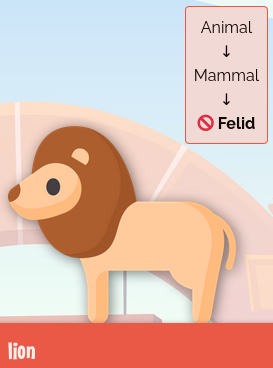
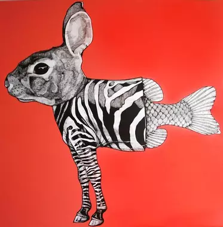
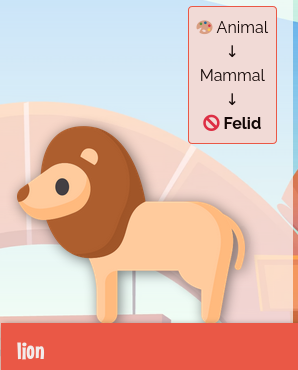
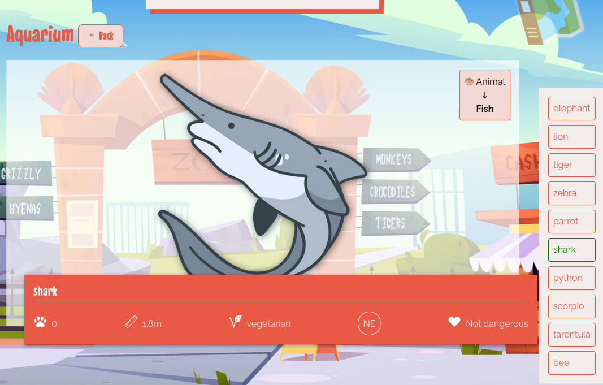

# Prérequis

```quests
2354
```

```title-book
Introduction
```

```story
Il est temps de passer à la branche **poo9** de ton [Wild zoo](https://github.com/WildCodeSchool/php-wildzoo). Dans cette quête, tu vas découvrir le concept d'abstraction et comprendre comment l'implémenter.
```

## 🤓 À la fin de cette quête, tu seras capable de :
- ✅ Comprendre le concept d'abstraction
- ✅ Créer une classe abstraite
- ✅ Implémenter une méthode abstraite

# Définition de l'abstraction
Une fois encore, l'un des objectifs de la programmation orientée objet est de coller au plus proche à la réalité métier. Jusqu'à maintenant, nous avons créé une classe **Animal**, puis des classes filles sur plusieurs niveaux, pour terminer par des classes avec le mot clé *final*.

```alert-info
Pour rappel, l'interface graphique t'indique dans un petit encart en haut à droite de chaque animal, les relations d'héritages entre les classes. Pour l'instant, le lion est une instance de **Felid** (classe finale 🚫), héritant de **Mammal**, qui hérite elle-même de **Animal**.
 

```

Maintenant, si on crée un nouvel animal directement à partir de la classe **Animal**, on obtient bien un objet de type **Animal**, mais d'un point de vue *métier*, pour notre zoo, cela n'a plus trop de sens, car ce pourrait-être aussi bien une fourmi qu'une baleine. Cette instance n'est plus représentative d'un d'animal précis, c'est un *concept*, une notion **abstraite**. De ce fait, il n'est pas logique de demander la *size* d'un concept d'animal aussi variable. La classe **Animal** est très utile pour y mettre du code commun entre tous les animaux, mais on souhaiterait **ne pas pouvoir directement instancier** cette classe. C'est à cela que sert le concept d'abstraction en POO, empêcher que l'on puisse instancier certaines classes, quand celles-ci ne représentent pas quelque chose de concret mais uniquement des concepts abstraits.



# Classe abstraite

Pour créer ce type de classe abstraite, il suffit d'utiliser le mot clé `abstract` devant le nom de la classe.

🖥️ Sur l'interface, tu vois un `$abstractAnimal` qui s'appelle "abstract". Dans le fichier *index.php*, tu constateras que c'est une instance d'Animal.

Modifie maintenant la classe **Animal** pour la rendre abstraite.

```php
abstract class Animal
{
    //...
}
```

Réactualise l'interface, tu vas obtenir une erreur.

```alert-error
Fatal error: Uncaught Error: Cannot instantiate abstract class App\Animal\Animal in ...
```

C'est normal, maintenant que la classe est devenue abstraite, PHP refuse de créer un objet directement à partir de celle-ci. Tu vas donc être forcé de passer par l'une de ses classes filles non abstraite. Efface ce `$abstractAnimal` et enlève le du tableau `$animals`. Réactualise, la page se réaffiche bien.

```alert-info
Tu constateras également sur le schéma récapitulatif de chaque animal, que la classe **Animal** est maintenant accompagnée du symbole 🎨 qui indique ici qu'elle est abstraite.


```

🖥️ Pour mettre en pratique, rend également la famille des Arthropodes abstraites. Tu ne peux plus instancier directement des **Arthropode**, mais toujours des **Arachnide** ou des **Insect**.


# Méthode abstraite
🖥️ De la même manière que pour les animaux, la classe **Area** est un concept abstrait, modifie-la en conséquence. 

Chaque classe fille d'**Area** (Aquarium, Desert...) correspond à une aire bien précise du zoo, ayant ses caractéristiques et étant adaptée à certains animaux. Par exemple, un aquarium est adapté aux animaux aquatiques, une volière aux animaux volants, *etc*. Lorsque tu ajoutes un animal dans une zone, il faudrait pouvoir vérifier que cet animal est bien compatible avec la zone en question.

Pour cela, on aimerait avoir une méthode `isValid(Animal $animal)` qui prendrait un animal en paramètre. La méthode renverrait un booléen si l'animal est compatible ou non avec la zone.
Cette méthode devra être utilisée dans la méthode `addAnimal()` et lever une exception si elle renvoie false, mets à jour comme cela :

```php
public function addAnimal(Animal $animal)
{
    if (!$this->isValid($animal)) {
         throw new \Exception('impossible d\'ajouter le ' . $animal->getName() . ' au ' . $this->getName());
    }
    
    $this->animals[] = $animal;
    
}
```

Cette validation se fait au niveau de la classe mère **Area**, car la logique est la même pour toutes les classes filles. 

🚫 Le code ne fonctionne pas pour le moment puisque la méthode méthode `isValid()` n'est pas encore créée. Cependant, la logique d'implémentation de `isValid()` est différente d'une **Area** à l'autre (entre un Aquarium, une jungle, un désert...), il n'est donc pas possible de définir UNE logique précise dans la classe **Area**, dont hériterait toutes les filles. La méthode DOIT exister dans chaque fille (avec la même signature) MAIS la logique d'implémentation (c'est-à-dire le corps de la méthode) est différente entre chacune de ces filles. C'est ce qu'on appelle une **méthode abstraite**. 

Pour créer une méthode abstraite, il faut ajouter le mot clé `abstract` devant le nom, mais **laisser le corps de la fonction vide**, donc finir la ligne directement par un point virgule, sans les accolades :

```php
abstract public function isValid(Animal $animal): bool;
```

Il faut indiquer les éventuels paramètres et leur type (ici `Animal $animal`), ainsi que le type de retour (ici `bool`). 
À partir de maintenant, toutes les classes filles héritent de la méthode abstraite et sont donc obligées d'implémenter une logique pour cette méthode, sinon PHP renverra une erreur.

```alert-warning
Une classe possédant au moins une méthode abstraite doit forcément être elle-même abstraite (et ne pourra donc plus être directement instanciée sans passer par une fille).
```

Si tu réactualises, tu vas avoir le message d'erreur suivant pour chaque classe fille d'**Area**, indiquant l'obligation d'implémenter la méthode `isValid()` héritée de la mère :

```alert-error
Fatal error: Class App\Area\XXXX contains 1 abstract method and must therefore be declared abstract or implement the remaining methods (App\Area\Area::isValid)
```

Dans chaque classe fille, tu vas donc devoir implémenter `isValid()` avec une logique qui lui est propre. Voici l'implémentation qui est attendue pour les 3 classes existantes :
 
- **Aquarium** : ne sont valides que les animaux de type **Fish**
- **Jungle** : accepte tous les animaux
- **Desert** : ne sont valides que les animaux ayant 4 pattes ou plus

```hidden
Click to reveal|||php|||Si tu as besoin d'aide, voici la solution attendue pour l'implementation de isValid() dans la classe Aquarium. Cela peut te servir de base pour les deux autres classes.|||0|||Hide
<?php

namespace App\Area;

use App\Animal\Animal;
use App\Animal\Fish;

class Aquarium extends Area
{
    public function isValid(Animal $animal): bool 
    {
        return $animal instanceof Fish;
    }
}
```

Une fois les 3 implémentations effectuées, tu vas encore avoir des erreurs car certains animaux sont actuellement affectés dans de mauvaises zones. Fais en sorte de corriger les erreurs en retirant ou modifiant les animaux qui seraient dans les mauvaises **Area** afin de suivre les règles métiers du zoo *(normalement le crocodile ne devrait pas se trouver dans l'aquarium car ce n'est pas un poisson, remplace-le par un requin (shark))* .

🖥️ Lorsque tu te rends sur la page d'une zone (en passant par la carte en haut à droite de l'interface), tu vois maintenant à droite de la page la liste de tous les animaux : en vert ceux qui sont acceptables dans cette zone, en rouge les autres.




## 💪 Challenge

Pour ce challenge, ajoute deux nouvelles classe fille d'**Area** : **Box** et **Cage**.

* Box acceptera uniquement les animaux de taille <50,
* Cage uniquement les animaux dangereux (utilise la méthode `isDangerous()` préalablement créée)

Puis ajoute des animaux compatible dans chacune.

## Validation
Les classes **Cage** et **Box** sont correctement créées et apparaissent sur la carte dans l'interface.
Des animaux compatibles avec la méthode `isValid()` sont ajoutés à ces deux nouvelles zones.

==$==
```php
<?php

namespace App\Area;

use App\Animal\Animal;

class Cage extends Area
{
    public function isValid(Animal $animal): bool {
        return $animal->isDangerous();
    }
}
```

```php
<?php

namespace App\Area;

use App\Animal\Animal;

class Box extends Area
{
    public function isValid(Animal $animal): bool {
        return $animal->getSize() < 50;
    }
}
```