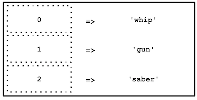

**⚠️ Avant de commencer cette quête, tu dois avoir terminé les quêtes suivantes :**

```quests
139
```

```title-book
Introduction
```

Un tableau (ou *array*) est une variable spéciale qui peut contenir plusieurs valeurs à la fois. Tu peux retrouver ce type de variable dans tous les langages de programmation.

Au fur et à mesure que tu avances dans la quête, n'hésite pas à tester le code qui t'est proposé, et à le manipuler, c'est le meilleur moyen d'apprendre.


Dans un second temps, tu vas découvrir les différentes façons de faire des boucles en PHP.
Les boucles sont des structures de contrôle très utilisées car elles vont te permettre de faire le même traitement plusieurs fois... En boucle !


## 🤓 **À la fin de cette quête, tu seras capable de:**

- ✅ Découvrir les variables de type "array"
- ✅ Apprendre à les déclarer et à les manipuler
- ✅ Découvrir des fonctions de traitements
- ✅ Comprendre l'utilité de faire des boucles
- ✅ Maîtriser les structures de contrôle for, while, foreach, break, continue


# Définition des tableaux

Commence par regarder cette vidéo jusqu'à la **minute 6** (tu regarderas la suite dans la quête suivante).

```youtube
https://www.youtube.com/watch?v=2Bc9wMsC-7M
```

Imagine, par exemple, que tu souhaites stocker la liste des armes d'Indy, ton code risque de ressembler à :

```php
$weapon1 = 'whip';
$weapon2 = 'gun';
$weapon2 = 'saber';
```


Notre objectif est de tout stocker au sein d'une seule et même variable ; On peut alors déclarer :

```php
$weapons = ['whip', 'gun', 'saber'];
```

```alert-info
Il est aussi possible de déclarer un tableau de la manière suivante : 
`$weapons = array('whip', 'gun', 'saber');`
Cette méthode n'est cependant presque plus utilisée depuis PHP 5.4
```

Tu remarques ici que le nom de la variable est au pluriel et cela est volontaire, étant donné que cette dernière va contenir plusieurs valeurs.
__On garde toujours une cohérence entre le nom de la variable et son contenu.__

Chaque valeur du tableau est séparée par une virgule.

Attention, nous avons déclaré ici ce que l'on appelle un __tableau à index numérique__, nous verrons pourquoi juste après.
Attention également aux simples quotes, ces dernières sont présentes car les valeurs sont de type "string". Mais sache qu'un tableau peut contenir tout type d'élément, par exemple:

```php
$elements = [1, 'deux', true, [], 1.8];
```

Ici, la variable `$elements` est un tableau qui contient, successivement, les éléments de type int, string, boolean, array (et oui un tableau peut contenir un autre tableau) et float.

### Le tableau indexé numériquement

Tu as vu comment stocker plusieurs informations au sein d'une seule et même variable, c'est génial, mais comment faire pour récupérer une valeur précise ?
Heureusement, les index sont là. Dans cette étape, tu vas voir les index numériques.
Lors de la déclaration d'un tableau, si tu ne précises pas les index, ces derniers seront par défaut numériques.
Un tableau indexé numériquement est tout simplement une liste d'éléments repérés chacun par un index numérique unique. Ainsi, le premier élément du tableau correspondra à l'index 0, le deuxième à l'index 1, le troisième à l'index 2, etc.
Tu noteras bien que la numérotation commence à 0 et non à 1 !

#### Accéder aux éléments d'un tableau

Pour accéder à un élément du tableau, il suffit d'y faire référence grâce à son index.
Reprenons notre exemple précédent, notre tableau d'armes :

```php
$weapons = ['whip', 'gun', 'saber'];
```

Dans ce tableau, _whip_ est situé à l'index 0 de notre tableau `$weapons`, _gun_ à l'index 1, et _saber_ à l'index 2.

Attention, pour rappel, le premier élément du tableau est référencé à l'index 0 !
Tu peux maintenant afficher les différentes valeurs du tableau de la manière suivante :

```php
echo $weapons[0]; // affiche : whip
echo $weapons[1]; // affiche : gun
echo $weapons[2]; // affiche : saber
```

*Représentation du tableau ci-dessus :*



Attention, dans l'exemple précédent, le code `echo $weapons[3];` renverrait une erreur. En effet, tu ne peux accéder à l'index d'un tableau qui n'existe pas.

#### Ajouter des éléments à un tableau

Bien entendu, un tableau peut avoir un nombre illimité de valeurs. Tu peux initialiser un tableau avec certaines valeurs, et en ajouter de nouvelles au fur et à mesure de l'exécution de ton script.

```phpsandbox
https://phpsandbox.io/n/q41-array-dump-1-lk0iu?&layout=Editor
```

`var_dump()` permet d'afficher des informations détaillées sur une variable et est très utilisé pour déboguer.
Le tableau `$weapons` contient 3 éléments de type string avec, pour chaque string, une longueur respective de 4, 3 et 5 caractères.

Ajoutons maintenant une nouvelle arme à notre tableau : _nuclear_.

```phpsandbox
https://phpsandbox.io/n/q41-array-dump-2-ckgay?&layout=Editor
```

Le tableau contient maintenant 4 éléments, la valeur 'nuclear' a été ajoutée à la suite des éléments existants.

```alert-info
La syntaxe [ ] après le nom d'une variable de type array permet d'indiquer que l'on ajoute une entrée au tableau. L'index utilisé pour le nouvel élément ajouté correspondra à l'index maximum courant +1.
```


```resource
http://php.net/manual/fr/function.var-dump.php
# var_dump()
Fonction utile pour le débugage, elle permet ici d'afficher en une fois tout le contenu du tableau.
```

### Le tableau associatif

Juste avant, tu as vu que chaque valeur de ton tableau pouvait être identifiée numériquement. Il s'agit du comportement par défaut lorsque tu déclares un tableau avec uniquement tes valeurs à l'intérieur.

Pour info, tu pourrais également déclarer ton tableau de valeurs ainsi :

```php
$weapons[0] = 'whip';
$weapons[1] = 'gun';
$weapons[2] = 'saber';
```

La déclaration ci-dessus est identique à celle vue précédemment :

```php
$weapons = ['whip', 'gun', 'saber'];
```

Lors de la déclaration d'un tableau associatif, on doit indiquer nous-mêmes les indices (= _index_) du tableau (c'est ce que l'on a fait au-dessus).

Dans la mesure où l'on est libre de les spécifier nous-mêmes, les indices peuvent être non seulement des entiers, mais également des chaînes de caractères. Dans ce cas, on parle de __clé__ (ou _key_). Ce type de tableau est très pratique pour donner plus de sens aux valeurs contenues.
Par exemple, on pourrait modifier la déclaration précédente en utilisant des clés plus explicites :

```php
$weapons['weapon_one'] = 'whip';
$weapons['weapon_two'] = 'gun';
$weapons['weapon_three'] = 'saber';
```

Ou encore :

```php
$weapons = [
  'weapon_one' => 'whip',
  'weapon_two'=>'gun',
  'weapon_three'=>'saber'
];
```

Notre variable `$weapons` est toujours de type _array_. Elle contient toujours plusieurs valeurs, mais ces dernières sont identifiées respectivement par les clés _weapon_one_, _weapon_two_, _weapon_three_.

Pour les afficher, on fera donc:

```php
echo $weapons['weapon_one']; // affiche : whip
echo $weapons['weapon_two']; // affiche : gun
echo $weapons['weapon_three']; // affiche : saber
```

Les tableaux associatifs te seront très utiles lors de l'utilisation de tableaux multidimensionnels. Tu verras ça dans la quête suivante.

Petite spécificité, si dans la suite de mon script j'exécute ceci :

```php
$weapons['weapon_one'] = 'dagger';
```

Je modifie la valeur située à la clé _weapon_one_, et l'exécution `echo $weapons['weapon_one'];` affichera maintenant la chaîne de caractères 'dagger'. C'est le même comportement que pour une variable.
Si tu rappelles le même élément en lui assignant une nouvelle valeur, la valeur précédente va être remplacée par la nouvelle. Il en est de même pour les tableaux indexés numériquement.

```resource
http://php.net/manual/fr/language.types.array.php
# PHP Manual
Documentation officielle PHP sur les tableaux
```

### Les fonctions utiles pour les tableaux

De nombreuses fonctions en PHP nous permettent de travailler sur les tableaux, des fonctions de mesure, de navigation, d'itération, de tri, et bien plus encore.
Ce sont des fonctions PHP dites _natives_ car elles font partie du langage PHP.

En voici quelques exemples:

- [count()](https://www.php.net/manual/fr/function.count.php)
  Permet de compter le nombre d'éléments d'un tableau.

```php
$weapons = ['whip', 'gun', 'saber'];
echo count($weapons); // affiche 3
```

- [sort()](https://www.php.net/manual/fr/function.sort)
  Permet de trier un tableau par ordre croissant de valeur.

```phpsandbox
https://phpsandbox.io/n/q41-array-sort-1-q9bis?&layout=Editor
```

Cela marche aussi si tu as un tableau ayant pour valeur des chaînes de caractères. Le tableau sera trié par ordre alphabétique.

```phpsandbox
https://phpsandbox.io/n/q41-array-sort-2-fawze?&layout=Editor
```

```alert-warning

  La fonction sort() ne sert qu'à trier des tableaux numériques. Si tu l'utilises sur un tableau associatif tu perds l'association clé => valeur.
  Note: Cette fonction assigne de nouvelles clés pour les éléments du paramètre array. Elle 
effacera toutes les clés existantes que vous aviez pu assigner, plutôt que de les trier.
```

Il existe d'autres fonctions pour un tableau associatif :
  - [rsort()](https://www.php.net/manual/fr/function.rsort.php)
  Permet d'effectuer un tri en ordre décroissant
  - [asort()](https://www.php.net/manual/fr/function.asort.php)
  Permet d'effectuer un tri sur les valeurs en gardant les clés intactes
  - [arsort()](https://www.php.net/manual/fr/function.arsort.php) Permet d'effectuer un tri sur les valeurs en gardant les clés intactes, mais dans un ordre *décroissant*
  - [ksort()](https://www.php.net/manual/fr/function.ksort)
  Permet d'effectuer un tri sur les clés en gardant les valeurs intactes
  - [krsort()](https://www.php.net/manual/fr/function.krsort)
  Permet d'effectuer un tri sur les clés en gardant les valeurs intactes mais dans un ordre *décroissant*


Dans chacune de ces fonctions, tu vas pouvoir définir si tu souhaites un tri ascendant ou descendant. N'hésite pas à consulter la documentation pour savoir comment procéder....

```alert-warning
Contrairement à la plupart des fonctions php, tu ne peux pas faire :
`$sortedWeapons = sort($weapons);`
En effet, l'utilisation de `sort()` (comme toute autre fonction de tri) modifie directement le tableau passé en paramètre et retourne TRUE ou FALSE selon si le tri a fonctionné ou non.
```

```alert-info
Toutes ces fonctions de tri travaillent sur le tableau lui-même, contrairement à la pratique normale qui serait de retourner le tableau trié.
```

- [in_array()](https://www.php.net/manual/fr/function.in-array)
  Permet de vérifier la présence d'une valeur dans un tableau.

```php
$weapons = ['whip', 'gun', 'saber'];
var_dump(in_array('whip', $weapons)); // affiche true
var_dump(in_array('shield', $weapons)); // affiche false
```

Cette fonction est très utile lorsque tu l'utilises dans une structure conditionnelle :

```phpsandbox
https://phpsandbox.io/n/q41-array-in-array-2jcen?&layout=Editor
```

- [array_sum()](https://www.php.net/manual/fr/function.array-sum)
  Permet de calculer la somme des valeurs d'un tableau.

```php
$values = [1, 2, 3, 4, 5];
echo array_sum($values); // affiche 15
```

```resource
http://php.net/manual/fr/ref.array.php
# PHP Manual - Fonctions sur les tableaux
```

```resource
http://www.progmatique.fr/article-33-Php-fonctions-manipuler-tableaux.html
# Fonctions principales en PHP
Il existe des dizaines d'autres fonctions sur les *array*. N'hésite donc pas à aller jeter un oeil par ici.

```

# Les boucles

### La boucle `for`
La boucle `for` est la plus simple à mettre en place. Tu vas indiquer à PHP de boucler un certain nombre de fois. C'est toi qui définis ce nombre. La boucle `for` intègre un compteur.

Sa notation est la suivante :

```php
for (debut; fin; pas) {
    // Do something
}
```

Dans l'exemple ci-dessus, ce qui est très important ce sont les expressions et leurs emplacements :

- debut : Dans cette première expression, tu vas initialiser une variable (souvent nommée `$i` mais ça n'est pas obligatoire) qui va te servir de compteur. Tu indiques donc ici à quelle valeur ta boucle va débuter.

- fin : Dans cette deuxième expression, tu vas définir la limite de ce compteur (sa valeur maxi ou mini en fonction du "pas"). La boucle s'arrête quand cette valeur est atteinte.

- pas : Dans cette troisième expression, tu vas définir l'action sur ton compteur à chaque tour de boucle, c'est à dire de combien (de quel "pas") la valeur de $i doit augmenter ou diminuer à chaque tour. Attention ici, il ne suffit pas d'indiquer une valeur de pas, mais bien de modifier la valeur actuelle du compteur en effectuant une affectation.

```php
// Exemple concret d'une boucle allant de 0 à 9 avec un pas de 1
for ($i = 0; $i < 10; $i = $i+1) {
    // Do something
}

// Mais j'aurais pu l'écrire comme cela
for ($counter = 0; $counter < 10; $counter++) {
    // Do something
}

// Et si j'avais voulu aller de 9 à 0
for ($i = 9; $i >= 0; $i--) {
    // Do something
}

```

```phpsandbox
https://phpsandbox.io/n/q41-array-loop-for-x1eri?&layout=Editor
```


```resource
http://php.net/manual/fr/control-structures.for.php
# PHP Manual - La boucle for
```

### La boucle `while`

```php
// Exemple de boucle while
$i = 0;
while ($i < 10) {
    // Do something
    $i++;
}

// Exemple de boucle infinie (À NE PAS FAIRE !!!)
$firstname = 'Henry';
while ($firstname != 'Indy') {
    $firstname = 'Indiana';
    // Do something...
}
```

Le premier exemple est simple, on boucle tant que `$i` est strictement inférieur à 10.
Le second est une boucle infinie. Étant donné que le `while` boucle tant que la condition est `true`, il faut bien veiller à ce que l'expression du while devienne `false`.

```resource
http://php.net/manual/fr/control-structures.while.php
# PHP Manual - La boucle while
```

### La boucle `foreach`
Le `foreach` permet de boucler sur les tableaux.

Il existe 2 façons de mettre en place un foreach :

```php
$movies = [
  "Les Aventuriers de l'arche perdue",
  "Indiana Jones et le Temple maudit",
  "Indiana Jones et la Dernière Croisade",
  "Indiana Jones et le Royaume du crâne de cristal",
  "Indiana Jones 5"
];

// Si tu n'as pas besoin des clés du tableau
foreach ($movies as $movie){
    // Do something...
    echo $movie;
    // Affiche "Les Aventuriers de l'arche perdue"
    // (au 1er tour, puis les autres valeurs aux tours suivants)
}

// Si tu as besoin des clés du tableau
foreach ($movies as $key => $movie){
    // Do something...
    echo $key;      // Affiche 0 (au 1er tour)
    echo $movie;    // Affiche "Les Aventuriers de l'arche perdue" (au 1er tour)
}
```

C'est à toi de choisir le nom des variables dans ton foreach (ici `$key` et `$movie`).

Comme pour tout nommage de variable, essaie d'avoir des noms ayant un sens. Par exemple ici, le tableau contenant des films s'appelle `$movies`. Quand tu boucles avec foreach, tu vas alors récupérer un film à chaque fois, d'où la variable s'appelant `$movie` (cette fois au singulier).

Cette approche pluriel/singulier est souvent utilisée car elle permet de facilement comprendre ce que contient la variable (le tableau dans son ensemble, ou un élément du tableau).


On dit que le `foreach` va __itérer__ sur chaque élément du tableau (ou de la collection).
Cela signifie que chaque élément va être lu séquentiellement à chaque tour de boucle.

L'élément en cours de lecture, ainsi que sa clé selon la notation du `foreach` (avec ou sans le `=>`), vont être affectés à des variables temporaires (`$key`, `$movie`). Récupérer la clé est surtout utile en présence d'un tableau associatif.

```resource
http://php.net/manual/fr/control-structures.foreach.php
# PHP Manual - La boucle foreach
```

```alert-error
# Boucles infinies
Attention: Si la condition d'arrêt d'une boucle est mal définie, cela peut être critique. En effet, la boucle sera infinie et plantera ton programme.
En PHP, si tu n'as pas modifié la configuration de base, les scripts ont une durée de vie de 30 secondes, donc ton navigateur (voire tout ton poste) peut ne pas répondre pendant maximum 30 secondes (il s'agit du paramètre max_execution_time dans ton fichier php.ini). Mais sur des langages de plus bas niveau, cela peut avoir des conséquences plus graves.
```

# 🧐 Récapitulons !

```quiz
false|||false|||true
# Quel est l'indice du 1er élément d'un tableau indexé numériquement ?
[] -1
[x] 0
[] 1
[] 2
# Quelle syntaxe utiliser pour créer un tableau ?
[] table()
[] { }
[x] [ ]
[] ( )
# Je souhaite récupérer le 6ème élément du tableau $students
[x] $students[5]
[] $students(6)
[] $students{4}
[] getIndice($students, 6)
# Comment ajouter un nouvel élément 'Bob' à mon tableau $students
[] $students = 'Bob';
[] $students['Bob'];
[] $students = ['Bob'];
[x] $students[ ] = 'Bob';
# Quelle syntaxe ne crée pas un tableau contenant les valeurs 'John' et 'Bob' ?
[] $students[0]='John'; 
[] $students[1]='Bob';
[x] $students['Bob'] = 'John';
[] $students = array('Bob', 'John');
[] $students = ['Bob', 'John'];
# Quelle fonction est utilisée pour trier un tableau par ordre décroissant ?
[] sort()
[] asort()
[x] rsort()
[] dsort()
# Que retourne : count( [ "john", "doe", [ "X", "Y" ], ] ) ?
[] 2
[x] 3
[] 4
[] 5
# Quelle fonction est utilisée pour trier les valeurs d'un tableau associatif par ordre ascendant en conservant les associations clé-valeur ?
[] ksort()
[x] asort()
[] krsort()
[] sort()
# Je souhaite récupérer l'age de Bob depuis le tableau suivant : $bob = [ "age" => 24, "height" => 180 ]
[] $bob[0]
[] $bob->age
[] \$bob[$age]
[x] $bob["age"]
```

# 💪 Challenge

### Créer la filmographie d'Indiana

1. Dans un fichier PHP, crée un tableau contenant 3 titres de films dans lesquels joue notre ami Indiana. Pour chaque film, associe son année de sortie (le titre du film sera la clé).
2. Une fois le tableau créé, réalise une boucle pour afficher la liste des films contenus dans le tableau ainsi que leur année de sortie associée. **Les films devront apparaître dans l'ordre décroissant de sortie** (du plus récent au plus ancien). Regarde du côté des fonctions de tri.

Pour chaque film, tu devras donc afficher: `2000 - movie_title`
`2000` étant l'année de parution du film.

### Critères de validation

* Le fichier contient un tableau associatif,
* Le tableau contient 3 films, avec, le titre comme clé et l'année de sortie comme valeur
* Une boucle est utilisée pour afficher dynamiquement les films et leur date.
* Les films sont triés dans l'ordre décroissant de leur sortie en utilisant une fonction de tri.
* Lorsque tu exécutes le script depuis ton terminal, tu affiches bien 3 lignes avec : `2000 - movie_title`

Pour soumettre ton travail, créé un nouveau notebook sur [https://phpsandbox.io/](https://phpsandbox.io/), puis poste le lien de ce dernier en solution ici.

==$==

```php
<?php

$movies = [
    'Indiana Jones and the Raiders of the Lost Ark' => 1981,
    'Indiana Jones and the Temple of Doom' => 1984,
    'Indiana Jones and the Last Crusade' => 1989,
];

arsort($movies);

foreach($movies as $title => $year) {
    echo $year . ' - ' . $title . PHP_EOL;
}
```