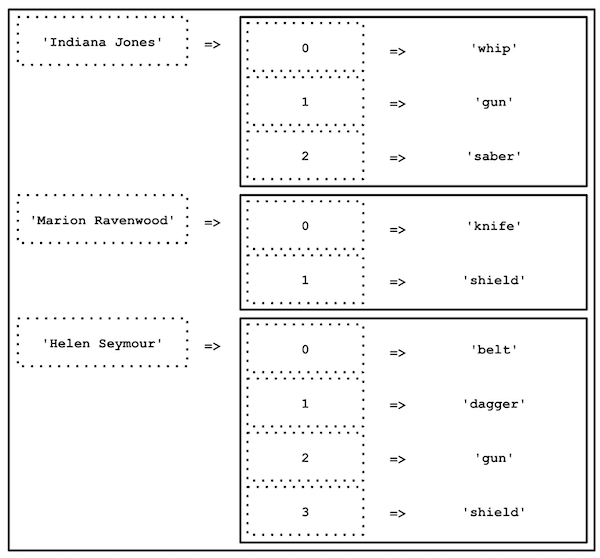

** ⚠️ Avant de commencer cette quête, tu dois avoir terminé les quêtes suivantes :**

```quests
1356
```

# Introduction

Dans la quête précédente, tu as découvert les tableaux à index numérique et les tableaux associatifs.

En PHP - et dans beaucoup d'autres langages de programmation - il est possible d'imbriquer des tableaux. Autrement dit, de créer un tableau avec plusieurs dimensions (des tableaux dans des tableaux).

C'est ce que nous allons voir ici.

## 🤓 **À la fin de cette quête, tu seras capable de:**

- ✅ Comprendre et manipuler les tableaux multidimensionnels


### Déclarer un tableau multidimensionnel

Pour commencer, regarde cette vidéo (tableaux multidimensionnels **à partir de 6'** )

```youtube
https://www.youtube.com/watch?v=2Bc9wMsC-7M
```

Dans la quête précédente, tu as eu à gérer un tableau avec une seule personne, ton ami Indiana. Mais comment faire si tu souhaites avoir au sein d'une même variable, les armes d'Indiana et de ses ennemis ?

Pour cela, il faut faire ce que l’on appelle un tableau multidimensionnel. Il s'agit d'un tableau qui va contenir en valeur d'autres tableaux (qui eux-mêmes peuvent contenir d'autres tableaux et ainsi de suite...).


```php
$weaponsIndiana = ['whip', 'gun', 'saber'];
$weaponsHelen = ['knife', 'shield'];
$weaponsRavenwood = ['belt', 'dagger', 'gun', 'shield'];
```

On peut mieux faire, tu ne crois pas ?

Grâce aux tableaux multidimensionnels, tu vas pouvoir tout regrouper au sein d'une seule et même variable, afin d'avoir tous les éléments disponibles simplement et rapidement.

Commence par déclarer ton tableau :

```php
$weapons = [];
```

`$weapons` est une variable de type tableau, qui, pour le moment, est vide.

Tu vas maintenant regrouper les armes de nos amis dans un seul et même tableau :

```php
$weapons = [
  ['whip', 'gun', 'saber'],
  ['knife', 'shield'],
  ['belt', 'dagger', 'gun', 'shield'],
];
```

`$weapons` est maintenant un __tableau multidimensionnel__, un tableau qui contient d'autres tableaux en valeur.
Grâce à lui, tu vas pouvoir manipuler une seule variable au lieu de 3.


```php
var_dump($weapons[0]); // affiche : ['whip', 'gun', 'saber']
var_dump($weapons[1]); // affiche : ['knife', 'shield']
var_dump($weapons[2]); // affiche : ['belt', 'dagger', 'gun', 'shield']
```

Bien que tu aies accès à toutes les armes depuis une seule et même variable, il te faut quand même identifier quelles armes appartiennent à quel personnage.

Pour ce faire, tu vas utiliser le nom de chaque personnage en tant que clé. Tu auras donc un tableau associatif, et pour chaque clé, tu vas y associer le tableau contenant les armes.

```php
$weapons = [
    'Indiana Jones' => ['whip', 'gun', 'saber'],
    'Marion Ravenwood' => ['knife', 'shield'],
    'Helen Seymour' => ['belt', 'dagger', 'gun', 'shield']
];
```


### Accéder à un élément du tableau

Tu peux afficher les différentes armes en passant par les index/clés des élements du tableau :

```phpsandbox
https://phpsandbox.io/n/q42-multi-array-qld58?&layout=Editor
```

*Représentation visuelle du tableau multidimensionnel* `$weapons` :


**Note 1 :** Dans notre exemple, les tableaux imbriqués sont indexés numériquement, mais il pourrait très bien s'agir de tableaux associatifs.

**Note 2 :**  Il n'y a de limite que la compréhension du tableau, mais tu peux imaginer des tableaux à 3, 4, 5 dimensions ou plus.

### Parcourir un tableau multidimensionnel

Lors de la quête précédente tu as vu comment parcourir un tableau simple à l'aide des boucles.
Comme tu peux t'en douter, qui dit tableaux imbriqués, dit ... boucles imbriquées !

L'idée est la suivante : on parcourt le premier niveau du tableau, puis, pour chaque niveau on parcourt les sous-niveaux, ...etc.

Tu auras donc une boucle dans une boucle dans une boucle ... (autant de fois que de dimensions dans ton tableau).

Si tu as un doute sur l'utilisation des boucles, je t'invite à revoir la quête précédente (voir _Prérequis_ en haut de page).

```resource
https://www.php.net/manual/fr/language.types.array.php
# PHP Manual
Documentation officielle PHP sur les tableaux
```

# 💪 Challenge

### Créer la filmographie d'Indiana II

1. Sur un nouveau notebook [PHPSandbox](https://phpsandbox.io/), crée un tableau contenant 3 films dans lesquels joue notre ami Indiana ([Utilise IMDB](https://www.imdb.com/) pour t'aider si besoin.), avec le titre des films en clés.

```alert-info
Pense aux tableaux à plusieurs dimensions
```

2. Une fois le tableau créé, réalise les boucles nécessaires pour afficher la liste des films ainsi que les acteurs associés.
 Pour chaque film, tu devras afficher :
```
Dans le film <movie_title>, les principaux acteurs sont : 
- <actor_1>
- <actor_2>
- <actor_3>
```
> En remplaçant <movie_title> et <actor_N> par les données de ton tableau.
### Critères de validation

- Le fichier contient un tableau multidimensionnel, et on y retrouve bien 3 films, ainsi que 3 acteurs minimum par film.
- Le tableau est correctement parcouru et lorsque tu lances le script dans ta console, cela affiche
```
Dans le film <movie_title>, les principaux acteurs sont : 
- <actor_1>
- <actor_2>
- <actor_3>
```

Pour soumettre tes solutions, poste le lien du notebook.

==$==
```php
// You can write an array on multiple lines to improve readability 
$movies = [
    'Indiana Jones and the Raiders of the Lost Ark' => [
        'Harrison Ford',
        'Sean Connery',
        'Alison Doody',
    ],
    'Indiana Jones and the Temple of Doom' => [
        'Harrison Ford',
        'Kate Capshaw',
        'Ke Huy Quan',
    ],
    'Indiana Jones and the Last Crusade' => [
        'Harrison Ford',
        'Karen Allen',
        'Paul Freeman',
    ],
];

foreach ($movies as $title => $actors) {
    echo 'Dans le film ' . $title . ', les principaux acteurs sont : ' . PHP_EOL;
    foreach ($actors as $actor) {
        echo '- ' . $actor . PHP_EOL;
    }
}
```