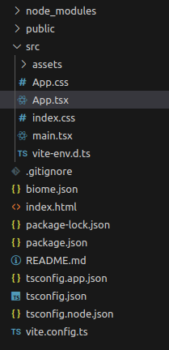

## Objectifs

* Initialiser une application React
* Découvrir les fichiers générés par l'initialisation

## Pré-requis

````stepper
# Répondre à la question "c'est quoi React ?"
```xtext story
**React** (aussi appelé **React.js** ou **ReactJS**) est une **bibliothèque open source JavaScript** pour créer des interfaces utilisateurs. Elle est maintenue par **Meta** (anciennement **Facebook**) ainsi que par une communauté de développeurs individuels et d'entreprises **depuis 2013**.

Le but principal de cette bibliothèque est de faciliter la création d'application web monopage, via la création de composants dépendant d'un état et générant une page (ou portion) HTML à chaque changement d'état.

React est une bibliothèque qui ne gère que l'interface de l'application [...]
```
Source : https://fr.m.wikipedia.org/wiki/React
````


## Introduction

Afin de découvrir la bibliothèque React et ses principales fonctionnalités, nous allons créer pas à pas un projet qui prendra ici la forme d'un pokedex en Typescript.

```xtext intro
Rassure-toi si tu ne connais pas Typescript : tout code JavaScript est du code TypeScript valide. Tu as appris Typescript depuis le début de ta formation 🎉

Intégrer Typescript dans ce projet te donnera des indications précieuses sur des erreurs courantes : c'est comme avoir une IA qui relie ton code en direct et te prévient dès qu'il y a une incohérence.
```

Ce pokedex va nous permettre de découvrir :

- L'affichage d'un composant
- Les props
- Le state
- L'affichage d'une liste
- L'affichage conditionnel
- La gestion des évènements

À la fin, nous devrions avoir un pokedex qui nous permet d'afficher une liste de Pokemon, de filtrer cette liste en fonction du type de Pokemon et de sélectionner un Pokemon dans cette liste pour afficher sa photo.


## Sommaire

## Un peu d'histoire

Suite à l'adoption massive de sa bibliothèque, en 2016 l'équipe en charge du développement de React a sorti un installateur nommé [Create React App](https://github.com/facebook/create-react-app).

Ce dernier permet d'initialiser des applications monopage (**Single Page Application ou SPA**), d'avoir un serveur de développement (permettant notamment de reconstruire l'application lors de la modification des fichiers), de "construire" (build) l'application afin de la mettre en production, et tout un tas d'autres choses que tu trouveras sur la [documentation officielle](https://create-react-app.dev/).

Le tout **sans aucune configuration** !

```xtext story
Create React App est un bon choix pour :

* **Apprendre React** dans un environnement de développement confortable et riche en fonctionnalités.
* Démarrer une nouvelle SPA.
* Créer des exemples avec React pour vos bibliothèques et composants.
```

Source : https://github.com/facebook/create-react-app?tab=readme-ov-file#popular-alternatives

```xtext arrow
Si tu lis la suite du paragraphe, tu verras des alternatives intéressantes pour des configurations plus complexes :

* S'intégrer dans un framework existant avec Symfony et Webpack Encore ;
* Exploiter des fonctionnalités avancées comme le Server-Side Rendering dans Next.js ;
* ...

 Tu es dans un cadre d'apprentissage et ces alternatives intéressantes ne te correspondent pas pour l'instant. Mais ce que tu apprendras te permettra de t'intégrer dans tous les outils qui permettent l'utilisation de React.
```

Les choses évoluent *vite* dans le développement web, et c'est en 2020 qu'un nouvel outil commence à faire parler de lui, conçu par le créateur d'un framework concurrent (VueJS). Cet outil se nomme [ViteJS](https://vitejs.dev/).

Cet outil se différencie de CRA (creat react app) par de nombreux aspects :

* Il ne permet pas seulement d'initialiser et de faciliter le développement d'applications React, mais de plusieurs frameworks.
* Comme son nom l'indique, il est beaucoup plus rapide.
* Tu peux démarrer sans configuration et ensuite personnaliser la configuration très facilement en ajoutant notamment des plugins.

```resource
https://semaphoreci.com/blog/vite
# 4 raisons de préférer Vite à Create-React-App
```

```resource
https://blog.logrocket.com/vite-3-vs-create-react-app-comparison-migration-guide
# Vite 3.0 vs. Create React App : Comparaison
```

## Comment ça marche ?

Ouvre un terminal et saisis la commande suivante, en remplaçant `my-react-app` par le nom de ton projet :

```bash
npm create vite@latest my-react-app
```

Appuie sur Entrée** pour lancer l'installation.

```alert-warning
La commande peut varier selon la version de npm installée.  
Consulte la [documentation officielle](https://vitejs.dev/guide/) en cas de doute.
```  

À la question `Select a framework`, choisis `React` :

```
? Select a framework: › - Use arrow-keys. Return to submit.
    Vanilla
    Vue
❯   React
    Preact
    Lit
    Svelte
    Solid
    Qwik
    Others
```

Puis, à la question `Select a variant`, choisis `Typescript` :

```
✔ Select a framework: › React
? Select a variant: › - Use arrow-keys. Return to submit.
❯   TypeScript
    TypeScript + SWC
    JavaScript
    JavaScript + SWC
    Remix ↗
```

Rends-toi dans le répertoire créé avec la commande `cd`. Tu peux lister les fichiers créés par l'installateur avec la commande `ls`. Voici ce que tu devrais avoir comme résultat :

```
eslint.config.js  public     tsconfig.app.json   vite.config.ts
index.html        README.md  tsconfig.json
package.json      src        tsconfig.node.json
```

L'installation de base intègre `eslint`. Pendant les projets de la formation, tu utiliseras obligatoirement `biome` qui est un concurrents à `eslint`. Tu peux faire les modifications suivantes si tu veux changer pour `biome` dans ton pokédex perso et avoir la même configuration que pour les projets en équipe. Si tu souhaites rester sur `eslint` sur ton projet perso pokédex, lance la commande `npm install` et saute les étapes suivantes :

``````stepper nonLinear
# Échange tes dépendances

Désinstalle ce qui est lié à `eslint` :

```bash
npm uninstall @eslint/js eslint eslint-plugin-react-hooks eslint-plugin-react-refresh globals typescript-eslint
```

Oui, ça fait beaucoup de choses en moins 😅

Comme dans tout projet node, installe le reste des dépendances avec `npm install`.

Enfin, ajoute `@biomejs/biome` :

```bash
npm install --save-dev --save-exact @biomejs/biome
```

# Modifie package.json

Enlève le script `lint` qui exécute la commande `eslint .` et ajoute les scripts `check` et `check:fix` pour exécuter la commande `biome check src` (avec l'option `--write` pour `check:fix`) :

```diff
  ...
  "scripts": {
    "dev": "vite",
    "build": "tsc -b && vite build",
    "check": "biome check src",
    "check:fix": "biome check --write src",
    "preview": "vite preview"
  },
  ...
```

# Initialise Biome

Avec la commande :

```
npx @biomejs/biome init
```

Maintenant, tu devrais avoir un fichier `biome.json` à la racine de ton projet. Vérifie que le contenu correspond à cette configuration (tu auras peut-être à changer la propriété `"indentStyle"`) :

```json
{
	"$schema": "https://biomejs.dev/schemas/1.9.4/schema.json",
	"vcs": {
		"enabled": false,
		"clientKind": "git",
		"useIgnoreFile": false
	},
	"files": {
		"ignoreUnknown": false,
		"ignore": []
	},
	"formatter": {
		"enabled": true,
		"indentStyle": "space"
	},
	"organizeImports": {
		"enabled": true
	},
	"linter": {
		"enabled": true,
		"rules": {
			"recommended": true
		}
	},
	"javascript": {
		"formatter": {
			"quoteStyle": "double"
		}
	}
}
```

Au passage, supprime le fichier `eslint.config.js` : tu n'en as plus besoin.

# Vérifie le code

Lance le script `check` :

```
npm run check
```

Plusieurs messages d'erreurs devraient apparaitre dans ton terminal. Tu peux demander à Biome de corriger automatiquement tout ce qui peut l'être de manière fiable avec :

```
npm run check:fix
```

Dans `main.tsx`, l'erreur sur `document.getElementById("root")!` nous a demandé quelques heures pour comprendre le message et choisir une bonne correction : regarde directement la solution.

`````solution
````tabs
!---main.tsx
```jsx
import { StrictMode } from "react";
import { createRoot } from "react-dom/client";
import "./index.css";
import App from "./App.tsx";

const rootElement = document.getElementById("root");

if (rootElement == null) {
  throw new Error(`Your HTML Document must contain a <div id="root"></div>`);
}

createRoot(rootElement).render(
  <StrictMode>
    <App />
  </StrictMode>,
);
```
````
`````

Pour le reste, suis les feedbacks que tu voies dans le terminal. Tu ne devrais avoir à modifier que le fichier `App.tsx`.

`````solution
````tabs
!---App.tsx
```jsx
import { useState } from "react";
import viteLogo from "/vite.svg";
import reactLogo from "./assets/react.svg";
import "./App.css";

function App() {
  const [count, setCount] = useState(0);

  return (
    <>
      <div>
        <a href="https://vite.dev" target="_blank" rel="noreferrer">
          
        </a>
        <a href="https://react.dev" target="_blank" rel="noreferrer">
          
        </a>
      </div>
      <h1>Vite + React</h1>
      <div className="card">
        <button type="button" onClick={() => setCount((count) => count + 1)}>
          count is {count}
        </button>
        <p>
          Edit <code>src/App.tsx</code> and save to test HMR
        </p>
      </div>
      <p className="read-the-docs">
        Click on the Vite and React logos to learn more
      </p>
    </>
  );
}

export default App;
```
````
`````
``````

Pour vérifier si ton installation fonctionne, tape la commande suivante pour lancer l'application React en mode "développement" :

```
npm run dev
```

## Qu'avons-nous là ?

Si tu ouvres le répertoire de l'application dans ton IDE favori, tu devrais avoir quelque chose comme ça : 



Ce qui va nous intéresser ici, c'est le répertoire `src` : c'est notre répertoire de travail. C'est ici que nous rangerons nos composants (que nous découvrirons plus loin dans le parcours), ainsi que tous les fichiers CSS et les fichiers JavaScript / Typescript.

Dans ce répertoire, le fichier à regarder en premier est le fichier `App.tsx`. C'est le composant principal de notre application (tu peux noter également le fichier CSS du même nom qui comme tu l'as sûrement deviné peut servir à styliser le composant App).

## Récapitulatif

* Utilise ViteJS pour initialiser une application React.
* L'architecture des fichiers sera toujours plus ou moins la même, peu importe l'outil que tu utilises pour développer ton application.

## Challenge

Tu dois initialiser une application avec ViteJS, React, Typescript et la mettre sur un repository GitHub : elle servira de base pour la réalisation de ton pokedex !

### Critère d'acceptation

* [ ] Le repository est disponible sur GitHub et contient une application React initialisée avec ViteJS.
* [ ] L'application utilise Typescript.