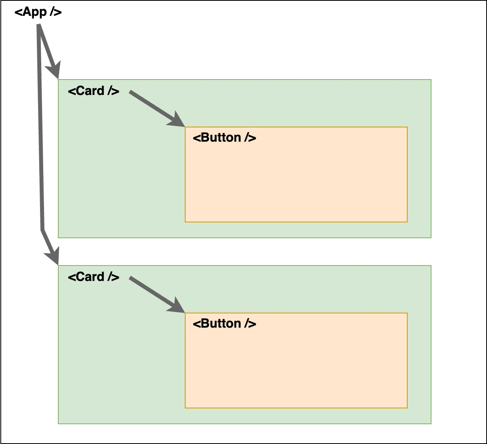

## Objectifs

* Passer des données d'un composant à un autre grâce aux props

## Pré-requis

````stepper
# Valider les quêtes suivantes
```quests
2328, 2332, 2336
```
````

````alert-warning
Avant de commencer cette quête, modifie le fichier `tsconfig.app.json` de ton projet pokedex. Tu dois supprimer les lignes qui commencent par `-`, et ajouter les lignes qui commencent par `+` :

```diff
{
  "compilerOptions": {
    "target": "ES2020",
    "useDefineForClassFields": true,
    "lib": ["ES2020", "DOM", "DOM.Iterable"],
    "module": "ESNext",
    "skipLibCheck": true,

    /* Bundler mode */
    "moduleResolution": "bundler",
    "allowImportingTsExtensions": true,
    "isolatedModules": true,
    "moduleDetection": "force",
    "noEmit": true,
    "jsx": "react-jsx",

    /* Linting */
    "strict": true,
    "noUnusedLocals": true,
    "noUnusedParameters": true,
-    "noFallthroughCasesInSwitch": true
+    "noFallthroughCasesInSwitch": true,
+    "noImplicitAny": false
  },
  "include": ["src"]
}
```

Les notions abordées dans cette quête vont déclencher des nouveaux messages de Typescript. Pour faire les choses une étape à la fois, nous les désactivons pour l'instant et nous les traiterons dans la quête suivante.
````

## Introduction

Dans les quêtes précédentes, nous avons vu comment créer et afficher des composants, comment afficher des données dans des composants, ainsi que comment utiliser des expressions dans le JSX.

Dans cette quête, tu vas découvrir comment passer des valeurs d'un composant à un autre.


## Sommaire

## Une histoire d'arborescence

Si tu te souviens bien, dans les quêtes précédentes, nous avons vu la hiérarchie des composants dans React. Les `props` dans React permettent de faire passer des informations d'un composant à un autre. Mais attention : les `props` peuvent être transmises **uniquement** d'un composant **parent** vers un composant **enfant**.

Regarde ce schéma :



Tu peux voir que `App` peut transmettre des `props` à chacun de ses composants `Card`. Chaque composant `Card` peut lui-même transmettre des `props` à son composant `Button`.

## Comment procéder ?

Garde en tête que les composants React sont des fonctions. Tu peux imaginer le code suivant en JavaScript "vanilla" :

```js render
!--- App.js
import SayHello from "./SayHello";

function App() {
  document.body.innerText = SayHello("Wilder");
}

export default App;
!--- SayHello.js
function SayHello(name) {
  return `Hello ${name}!`;
}

export default SayHello;
!--- index.js
import App from "./App";

App();
```

````xtext arrow
Dans `App.js`, nous avons créé une fonction `App` et importé une fonction `SayHello` depuis un autre fichier (`SayHello.js`). La fonction `SayHello` attend en paramètre une chaine de caractère que nous lui passons lors de l'appel dans `App` :

```js
SayHello("Wilder")
```
````

En React, la même chose donnerait :

```jsx render
!--- App.js
import SayHello from "./SayHello";

function App() {
  return SayHello("Wilder");
}

export default App;

!--- SayHello.js
function SayHello(name) {
  return `Hello ${name}!`;
}

export default SayHello;
```

````xtext arrow
Une grosse différence : c'est React qui gère la manipulation du DOM à notre place. Cette partie du code dans le premier exemple a disparu :

```js
document.body.innerText =
```
````

Dans React, tu dois passer les props au travers d'un objet et non pas directement la valeur comme dans `SayHello("Wilder")`. Si par le plus grand des hasards tu appelles cet objet `props` dans le composant `SayHello`, cela donne :

```jsx render
!--- App.js
import SayHello from "./SayHello";

function App() {
  return SayHello({name: "Wilder"});
}

export default App;

!--- SayHello.js
function SayHello(props) {
  return `Hello ${props.name}!`;
}

export default SayHello;
```

```xtext arrow
Dans React, le nom `props` est une convention pour le premier paramètre d'une fonction composant. Ici, c'est le paramètre qui représente l'objet avec toutes les valeurs envoyées du composant parent `App` au composant enfant `SayHello`.
```

Dernier point : dans React, tu manipules tes composants avec la syntaxe JSX. Plutôt que la syntaxe JS `SayHello({name: "Wilder"})`, tu peux appeler tes composants avec la syntaxe JSX et passer tes props comme tu utiliserais des attributs en HTML :

```jsx render
!--- App.js
import SayHello from "./SayHello";

function App() {
  return <SayHello name="Wilder" />;
}

export default App;

!--- SayHello.js
function SayHello(props) {
  return `Hello ${props.name}!`;
}

export default SayHello;
```

```xtext arrow
Dans notre composant `App`, nous avons appelé notre composant `SayHello` en lui passant en `props` un couple clé/valeur : la clé est `name` et la valeur est `"Wilder"`.
```

En fait, `props` est un objet qui contient toutes les clés/valeurs passées au composant. Tu peux le voir dans cet exemple :

```jsx console
!--- App.js
import SayHello from "./SayHello";

function App() {
  return <SayHello name="Alice" age={25} />;
}

export default App;

!--- SayHello.js
function SayHello(props) {
  console.log(props);

  return `Hello my name is ${props.name}, I'm ${props.age}!`;
}

export default SayHello;
```

```xtext arrow
Tu peux voir que la syntaxe est différente pour `name` et pour `age`. Les chaînes de caractères peuvent être passées dans les `props` avec des `""` comme les attributs HTML. C'est le cas pour `name="Alice"`.

Pour toutes les autres valeurs (nombre, objet, variable...), tu dois utiliser des `{}` pour entourer ta valeur JavaScript. C'est le cas pour `age={25}`.
```

### Quelles valeurs je peux faire passer en props ?

Dans react, tu peux passer n'importe quel type de valeur en props à tes composants. Des types primitifs (string, number, boolean...) et non primitifs (function, object) :

```jsx console
!--- App.js
import Cart from "./Cart"

function App() {
  const product = {
    name: "apples",
    price: 1.5,
    quantity: 2
  }

  const calculate = (product) => product.price * product.quantity

  return <Cart product={product} calculate={calculate} />;
}

export default App;

!--- Cart.js

function Cart(props) {
  console.log(props);

  return `You bought ${props.product.quantity} ${props.product.name} for ${props.calculate(props.product)}€`;
}

export default Cart;
```

```alert-warning
Attention cependant à la façon dont tu passes tes `props`. Seules les chaînes de caractères statiques comme `"Hello wilder !"` peuvent être passées entre guillemets. Expressions, variables, fonctions et même les template strings doivent être passées entre accolades.
```

### Rendre les choses plus lisibles

Une dernière chose : tu peux déstructurer l'objet `props` dans le composant qui l'utilise.

Reprenons notre composant `Cart` qui actuellement ressemble à ceci :

```jsx
function Cart(props) {
  return `You bought ${props.product.quantity} ${props.product.name} for ${props.calculate(props.product)}€`;
}

export default Cart;
```

Tu peux déstructurer l'objet `props` afin d'améliorer la lisibilité :

```jsx
function Cart(props) {
  const { product, calculate } = props;

  return `You bought ${product.quantity} ${product.name} for ${calculate(product)}€`;
}

export default Cart;
```

Le JSX est plus lisible de cette manière. Pour aller plus loin, tu peux déstructurer tes `props` directement dans les paramètres de ta fonction composant :

```jsx
function Cart({ product, calculate }) {
  return `You bought ${product.quantity} ${product.name} for ${calculate(product)}€`;
}

export default Cart;
```

C'est cette syntaxe nous utiliserons par défaut.

## Récapitulatif

* Les `props` sont toujours passées d'un composant parent vers un composant enfant.
* Le mot-clé `props` est une convention pour l'objet en paramètre d'une fonction composant.
* Les `props` peuvent être de n'importe quel type.
* Les `props` sont **toujours** en lecture seul.

## Challenge

Dans ce challenge, tu vas utiliser le système de props pour transmettre des données entre tes composants `App` et `PokemonCard`.


````alert-warning
Rappel : avant de commencer ce challenge, tu dois modifier le fichier `tsconfig.app.json` de ton projet pokedex. Ton fichier doit contenir la règle `"noImplicitAny": false` :

```diff hl[22]
{
  "compilerOptions": {
    "target": "ES2020",
    "useDefineForClassFields": true,
    "lib": ["ES2020", "DOM", "DOM.Iterable"],
    "module": "ESNext",
    "skipLibCheck": true,

    /* Bundler mode */
    "moduleResolution": "bundler",
    "allowImportingTsExtensions": true,
    "isolatedModules": true,
    "moduleDetection": "force",
    "noEmit": true,
    "jsx": "react-jsx",

    /* Linting */
    "strict": true,
    "noUnusedLocals": true,
    "noUnusedParameters": true,
    "noFallthroughCasesInSwitch": true,
    "noImplicitAny": false
  },
  "include": ["src"]
}
```

Les props déclenchent de nouveaux messages de Typescript. Pour faire les choses une étape à la fois, nous les désactivons pour l'instant et nous les traiterons dans la quête suivante.
````

````stepper nonLinear
# Crée une nouvelle branche

Ouvre ton projet existant et crée une nouvelle branche appelée `props.1`. Cette branche sera utilisée pour développer les fonctionnalités liées aux props. Assure-toi de partir de la branche `components.2`.

# Ajoute un paramètre props

Dans ton composant `PokemonCard`, ajoute un paramètre `props` à la fonction `PokemonCard`. Ensuite, utilise `console.log(props)` à l'intérieur de la fonction pour afficher l'objet `props` dans la console de ton navigateur. À ce stade, tu devrais voir dans la console un objet vide.

```js
const pokemonList = [
  {
    name: "bulbasaur",
    imgSrc:
      "https://raw.githubusercontent.com/PokeAPI/sprites/master/sprites/pokemon/other/official-artwork/1.png",
  },
  {
    name: "mew",
  },
];

function PokemonCard(props) {
  console.log(props);

  // ...
}

export default PokemonCard;
```

# Transmets un pokémon à PokemonCard via une prop

Copie le tableau `pokemonList` du composant `PokemonCard` dans le composant `App` :

```jsx
import "./App.css";

import PokemonCard from "./components/PokemonCard";

const pokemonList = [
  {
    name: "bulbasaur",
    imgSrc:
      "https://raw.githubusercontent.com/PokeAPI/sprites/master/sprites/pokemon/other/official-artwork/1.png",
  },
  {
    name: "mew",
  },
];

function App() {
  return (
    <div>
      <PokemonCard />
    </div>
  );
}

export default App;
```

Dans le composant `App`, là où tu utilises le composant `PokemonCard`, ajoute une prop appelée `pokemon` et attribue-lui un Pokémon du tableau `pokemonList` :

```jsx
<PokemonCard pokemon={pokemonList[0]} />
```

Ce `pokemon` va ainsi passer à ton composant `PokemonCard` : le `console.log` dans `PokemonCard` devrait maintenant afficher un objet qui contient une propriété `pokemon`.

# Déstructure props pour en extraire l'objet pokemon

Dans le composant `PokemonCard`, remplace le paramètre `props` par `{ pokemon }`. Ensuite :

* Supprime le `console.log(props)` : ton code ne déclare plus de variable `props`.
* Supprime la ligne `const pokemon = pokemonList[0];`  : cette variable `pokemon` fait doublon avec le `pokemon` que tu reçois des props.
* Supprime le tableau `pokemonList` : le tableau qui compte maintenant est celui dans `App`.

Le Pokémon devrait s'afficher comme avant dans ton navigateur. Mais maintenant, ton composant `PokemonCard` est devenu complètement dynamique : il affiche les informations du `pokemon` qu’il reçoit en prop, au lieu d’être figé sur un Pokémon spécifique. Le code reste figé dans `App`, mais dans `PokemonCard`, il s'adapte en fonction des données passées en prop : c'est l'objectif pour cette étape du projet.
````

Assure-toi que ton composant `PokemonCard` utilise l'objet `pokemon` des `props` pour recevoir les données du Pokémon et que tout fonctionne correctement.

Fournis le lien vers la branche `props.1` de ton dépôt GitHub pour valider cette étape.

### Critères de validation

* Le composant `PokemonCard` attend une `prop` `pokemon`.
* Le composant `App` envoie les données d'un pokémon au composant `PokemonCard` via une `prop` `pokemon`.
* Le pokémon s'affiche correctement.

Ce que tu devrais avoir dans :

````tabs files
!--- App.tsx

```jsx
import "./App.css";

import PokemonCard from "./components/PokemonCard";

const pokemonList = [
  {
    name: "bulbasaur",
    imgSrc:
      "https://raw.githubusercontent.com/PokeAPI/sprites/master/sprites/pokemon/other/official-artwork/1.png",
  },
  {
    name: "mew",
  },
];

function App() {
  return (
    <div>
      <PokemonCard pokemon={pokemonList[0]} />
    </div>
  );
}

export default App;
```

!--- PokemonCard.tsx

```jsx
function PokemonCard({ pokemon }) {
  return (
    <figure>
      {pokemon.imgSrc != null ? (
        
      ) : (
        <p>???</p>
      )}
      <figcaption>{pokemon.name}</figcaption>
    </figure>
  );
}
export default PokemonCard;
```
````