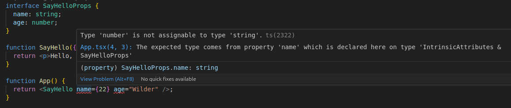

## Objectifs

* Utiliser TypeScript pour typer les props de tes composants.

## Pré-requis

````stepper
# Valider les quêtes suivantes
```quests
2328, 2332, 2336, 2374
```
````

## Introduction

Dans les quêtes précédentes, nous avons vu comment créer et afficher des composants, comment afficher des données dans des composants, comment utiliser des expressions dans le JSX, et comment faire passer des props entre les composants.

Depuis le début, ton projet intègre TypeScript. Pourtant tu n'as jamais eu à typer quoi que ce soit. TypeScript a "deviné" tout seul le typage à partir du contexte : c'est [l'inférence de type](https://www.typescriptlang.org/docs/handbook/type-inference.html). Le mécanisme fonctionne bien, mais ne peut pas tout deviner. Dans cette quête, tu vas apprendre à typer explicitement les props.


## Sommaire

## Une histoire de contrats

Tu as peut-être déjà entendu parler **d'interfaces** en programmation, sans rentrer dans les [détails](https://en.wikipedia.org/wiki/Interface-based_programming) de la programmation orienté objet, une interface en programmation est un contrat (un ensemble de conditions) que doivent remplir deux parties afin de pouvoir interagir ensemble.

Comme dans le monde réel lorsque tu loues quelque chose : tu signes (et respectes !) un contrat qui te permet d'accéder à un bien ou à un service.

Qu'est-ce que ces histoires de contrat ont à voir avec React alors !? TypeScript fournit un système d'interfaces !

Pour le moment, lorsque tu passes tes `props` d'un composant à un autre, tu peux passer n'importe quel type de données :

```jsx live
function SayHello({name, age}) {
  return <p>Hello, my name is {name}, and i'm {age}.</p>;
}

function App() {
  return <SayHello name="Wilder" age={22} />;
} 

export default App;
```

En tant qu'être humain, tu peux te tromper sur les types ou bien omettre de passer des `props` qui sont nécessaires au bon fonctionnement de ton composant :

```jsx live
function SayHello({name, age}) {
  return <p>Hello, my name is {name}, and i'm {age}.</p>;
}

function App() {
  return <SayHello name={22} age="Wilder" />;
} 

export default App;
```

Imagine aussi que d'autres développeurs récupèrent tes composants : il serait facile pour eux de faire des erreurs s'ils ne savent pas exactement comment fonctionne ton composant.

Il serait plus simple d'avoir un contrat qui décrit précisément quelles `props` sont attendues, de quels types, si elles sont obligatoires ou optionnelles, etc.

## Comment ça marche ?

Prenons un premier exemple (tiré de la [doc officielle de TypeScript](https://www.typescriptlang.org/docs/handbook/2/everyday-types.html#interfaces)) :

```js
function printCoord(pt) {
  console.log("The coordinate's x value is " + pt.x);
  console.log("The coordinate's y value is " + pt.y);
}
 
printCoord({ x: 100, y: 100 });
printCoord({ X: 100, Y: 100 }); // can you see the problem ?
```

J'ai volontairement fait une faute de frappe sur la dernière ligne : `X` et `Y` sont en majuscules. Ce sont des choses qui arrivent, mais rien en JavaScript ne permet de détecter ce genre d'erreur : la syntaxe du code est valide.

Avec TypeScript, tu peux déclarer explicitement le type d'une variable ou d'un paramètre de fonction. Par exemple, tu peux préciser qu'un paramètre est un nombre en ajoutant `: number` derrière le nom du paramètre :

```js
function foo(x: number) {
  console.log(x);
}

foo(42); // ok
foo("42"); // no !!!
```

Pour tes déclarations, tu peux également utiliser les types `string`, `boolean`... et des types complexes comme les tableaux et objets. Pour un objet, tu peux déclarer une interface avec toutes ses propriétés. Par exemple, pour un point avec des coordonnées x et y :

```js
interface Point {
  x: number;
  y: number;
}
```

Tu peux ensuite utiliser ton interface `Point` pour typer une variable ou un paramètre en précisant `: Point`. C'est la même syntaxe que pour les types primitifs `number` ou `string` :

```js hl[1]
function printCoord(pt: Point) {
  console.log("The coordinate's x value is " + pt.x);
  console.log("The coordinate's y value is " + pt.y);
}
```

Le code complet :

```js
interface Point {
  x: number;
  y: number;
}

function printCoord(pt: Point) {
  console.log("The coordinate's x value is " + pt.x);
  console.log("The coordinate's y value is " + pt.y);
}
 
printCoord({ x: 100, y: 100 });
printCoord({ X: 100, Y: 100 }); // error !!!
```

---

Tu peux utiliser le même genre de contrat pour typer les props d'un composant React :

```jsx
interface SayHelloProps {
  name: string;
  age: number;
}

function SayHello({name, age}: SayHelloProps) {
  return <p>Hello, my name is {name}, and i'm {age}.</p>;
}

function App() {
  return <SayHello name="Wilder" age={22} />;
} 

export default App;
```

Cette fois, TypeScript vérifie la cohérence de ton code et te prévient en cas d'erreur :



````alert-warning
Ici, nous avons utilisé une interface pour typer les props attendues pour ce composant. C'est la syntaxe mise en avant dans la documentation de React. Dans d'autres exemples sur le net, tu verras l'utilisation d'un type plutôt qu'une interface :

```jsx hl[1:4]
type SayHelloProps = {
  name: string;
  age: number;
}

function SayHello({name, age}: SayHelloProps) {
  return <p>Hello, my name is {name}, and i'm {age}.</p>;
}

function App() {
  return <SayHello name="Wilder" age={22} />;
} 

export default App;
```

Le résultat serait le même pour notre exemple. Nous utilisons l'interface pour être cohérent avec la documentation officielle.

Si tu veux creuser le sujet sur la différence entre type et interface, cet article résume assez bien les choses : [Types vs. Interfaces in TypeScript](https://blog.logrocket.com/types-vs-interfaces-typescript/)
````

Comme tu as vu dans l'exemple précédent, nous avons forcé le passage des props, qui sont donc désormais obligatoires. Mais comment faire si des propriétées sont optionnelles ?

Dans TypeScript, tu peux ajouter le signe `?` sur ces propriétés pour préciser qu'elle sont optionnelles :

```jsx
interface SayHelloProps {
  name: string;
  age?: number;
}

function SayHello({ name, age }: SayHelloProps) {
  return (
    <p>
      Hello, my name is {name}
      {age != null && `, and I'm ${age}.`}
    </p>
  );
}

function App() {
  return (
    <>
      <SayHello name="Wilder" age={22} />
      <SayHello name="Toto" /> {/* Pas d'âge fourni ici */}
    </>
  );
}

export default App;
```

## Récapitulatif

Tu as vu comment typer les props avec TypeScript avec une interface. Tu peux utiliser des types primitifs pour tes props comme `number`, `string` `boolean`... Mais également des tableaux, des objets et bien plus encore :

```jsx
interface SayHelloProps {
  name: string;
  address: {
    city: string;
  };
}

function SayHello({ name, address }: SayHelloProps) {
  return (
    <p>
      Hello, my name is {name}, and I live in {address.city}.
    </p>
  );
}

function App() {
  return <SayHello name="Wildo" address={{ city: "Reims" }} />;
} 

export default App;
```

## Challenge

Dans ce challenge, tu vas mettre en place la validation des props avec TypeScript.

````stepper nonLinear
# Crée une nouvelle branche

Ouvre ton projet existant et crée une nouvelle branche appelée `props.2`. Cette branche sera utilisée pour développer les fonctionnalités liées à TypeScript. Assure-toi de partir de la branche `props.1`.

# Définis le type des props

Dans ton composant `PokemonCard`, utilise une interface pour définir le type des props. Tu dois fournir une définition complète de la forme pour la prop `pokemon`.

Pour rappel, `pokemon` est un objet avec la forme suivante :

```js
{
  name: "...",
  imgSrc: "...",
}
```

Son "type" est un `objet` , avec une propriété `name` (requise) et une propriété `imgSrc` (optionnelle).
````

Assure-toi que la validation de types avec TypeScript fonctionne correctement. Dans ton fichier `tsconfig.app.json`, supprime la ligne `"noImplicitAny": false` :

```diff
{
  "compilerOptions": {
    "target": "ES2020",
    "useDefineForClassFields": true,
    "lib": ["ES2020", "DOM", "DOM.Iterable"],
    "module": "ESNext",
    "skipLibCheck": true,

    /* Bundler mode */
    "moduleResolution": "bundler",
    "allowImportingTsExtensions": true,
    "isolatedModules": true,
    "moduleDetection": "force",
    "noEmit": true,
    "jsx": "react-jsx",

    /* Linting */
    "strict": true,
    "noUnusedLocals": true,
    "noUnusedParameters": true,
+    "noFallthroughCasesInSwitch": true
-    "noFallthroughCasesInSwitch": true,
-    "noImplicitAny": false
  },
  "include": ["src"]
}
```

Si les données passées en props ne correspondent pas au type défini, tu devrais voir des avertissements dans ton IDE.

Fournis le lien vers la branche `props.2` de ton dépôt GitHub pour valider cette étape.

### Critères de validation

* Le composant `PokemonCard` définit les types de ses props.
* Le pokémon s'affiche correctement.

Ce que tu devrais avoir dans :

````tabs files
!--- PokemonCard.tsx

```jsx
interface PokemonCardProps {
  pokemon: {
    name: string;
    imgSrc?: string;
  };
};

function PokemonCard({ pokemon }: PokemonCardProps) {
  return (
    <figure>
      {pokemon.imgSrc != null ? (
        
      ) : (
        <p>???</p>
      )}
      <figcaption>{pokemon.name}</figcaption>
    </figure>
  );
}

export default PokemonCard;
```

````