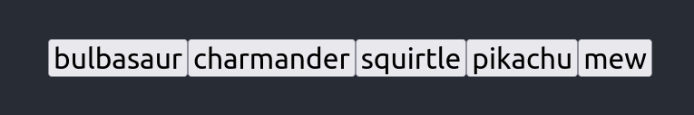

## Objectifs

* Répéter une même structure HTML pour chaque élément contenu dans un tableau.
* Comprendre la mystérieuse prop `key`.

## Pré-requis

````stepper
# Valider les quêtes suivantes
```quests
2328, 2332, 2336, 2374, 2375, 2376
```
````

## Introduction

Dans les quêtes précédentes, nous avons vu comment créer des composants, comment leur transmettre des données au travers des props ou encore comment utiliser les expressions JavaScript pour afficher conditionnellement du contenu.

Nous allons maintenant découvrir comment répéter un bloc d'affichage pour chaque élément contenu dans un tableau.


## Sommaire

## Petit retour sur les expressions

Tu as appris que pour répéter des instructions, tu dois utiliser des boucles (`for`/`while`). 

Malheureusement, dans le `return` d'une fonction composant, tu peux uniquement te servir d'expressions. Quelque soit la façon de l'écrire, une construction `return for` ne fonctionne pas en JS/TS :

```jsx render
function App() {
  const cart = ["apple", "banana", "grape", "watermelon"];

  return (
    <div>
      <h1>shopping list</h1>
      <ul>
        {for (const article of cart) {
          <li>{article}</li>
        }}
      </ul>
    </div>
  );
}

export default App;
```

Heureusement, le JavaScript nous fournit de nombreuses méthodes pour interagir avec les tableaux (listes de données). Ces méthodes sont des expressions puisqu'elles retournent une valeur. Une méthode des tableaux qui va beaucoup nous intéresser dans React est la méthode `map`.

## Comment ça marche ?

```jsx live editor
function App() {
  const cart = ["apple", "banana", "grape", "watermelon"];

  return (
    <section>
      <h1>shopping list</h1>
      <ul>
        {cart.map((article) => (
          <li>{article}</li>
        ))}
      </ul>
    </section>
  );
}

export default App;
```

Dans cet exemple, nous avons utilisé la méthode `map()` sur notre tableau d'articles. Pour chaque article, l'expression construit un `<li>` avec la valeur contenue à cet index 🪄.

Tu peux faire la même chose avec des structures de données plus complexes (tout en respectant la règle selon laquelle, entre des accolades `{}`, le JSX ne peut afficher que des types primitifs) :

```jsx live
function App() {
  const cart = [
    { name: "apple", emoji: "🍏" },
    { name: "banana", emoji: "🍌" },
    { name: "grape", emoji: "🍇" },
    { name: "watermelon", emoji: "🍉" },
  ];

  return (
    <section>
      <h1>shopping list</h1>
      <ul>
        {cart.map((product) => (
          <li>
            {product.emoji} {product.name}
          </li>
        ))}
      </ul>
    </section>
  );
}

export default App;
```

Tu peux aussi le faire avec des composants react en passant les valeurs en props :

```jsx live console
interface ArticleProps {
  name: string;
  emoji: string;
}

function Article({ name, emoji }: ArticleProps) {
  return (
    <li>
      {emoji} {name}
    </li>
  );
}

function App() {
  const cart: ArticleProps[] = [
    { name: "apple", emoji: "🍏" },
    { name: "banana", emoji: "🍌" },
    { name: "grape", emoji: "🍇" },
    { name: "watermelon", emoji: "🍉" },
  ];

  return (
    <section>
      <h1>shopping list</h1>
      <ul>
        {cart.map((article) => (
          <Article name={article.name} emoji={article.emoji} />
        ))}
      </ul>
    </section>
  );
}

export default App;
```

Dans la littérature, cela s'appelle le **component mapping** !

Regarde le dernier exemple : dans la console, un message y apparaît 🤨 (il apparaît en réalité sur tous les exemples précédents).

Le message t'indique que dans les éléments produits par notre `map`, tu dois renseigner une prop `key`. Aussi, le message te renvoie vers une [page de la documentation](https://react.dev/learn/rendering-lists#keeping-list-items-in-order-with-key).

## Comprendre les clés

Afin que React puisse identifier quel élément d'une liste de données (un tableau) est contenu dans le JSX, il a besoin d'un **identifiant unique**. Cet identifiant prend la forme d'une props que tu dois passer à chaque noeud JSX produit par un `map`. Cette props se nomme `key` (c'est un mot-clé réservé).

Concrètement ça donne :

```jsx live console
function App() {
  const cart = [
    { name: "apple", emoji: "🍏" },
    { name: "banana", emoji: "🍌" },
    { name: "grape", emoji: "🍇" },
    { name: "watermelon", emoji: "🍉" },
  ];

  return (
    <section>
      <h1>shopping list</h1>
      <ul>
        {cart.map((article, index) => (
          <li key={index}>
            {article.emoji} {article.name}
          </li>
        ))}
      </ul>
    </section>
  );
}

export default App;
```

Ici nous avons pris l'index du tableau auquel se trouve l'élément que l'on injecte dans le JSX, et comme tu peux le constater, l'erreur n’apparaît plus !

Cependant...

```alert-error
Utiliser **l'index d'un tableau** est acceptable uniquement si le tableau n'est pas amené à être muté.

Pour faire simple, la plupart du temps c'est une **mauvaise pratique**.
```

Considère le code suivant :

```jsx live console
import { useState } from "react";

const initialCart = [
  { name: "apple", emoji: "🍏" },
  { name: "banana", emoji: "🍌" },
  { name: "grape", emoji: "🍇" },
  { name: "watermelon", emoji: "🍉" },
];

function App() {
  const [cart, setCart] = useState(initialCart);

  const removeArticle = (article) => {
    setCart(cart.filter((item) => item !== article));
  };

  return (
    <section>
      <h1>shopping list</h1>
      <ul>
        {cart.map((article, index) => (
          <li key={index}>
            {article.emoji} {article.name}
            <input type="text" defaultValue={article.name} />
            <button onClick={() => removeArticle(article)}>remove</button>
          </li>
        ))}
      </ul>
    </section>
  );
}

export default App;
```

Dans cet exemple, j'ai implémenté une fonction qui permet de supprimer l'élément avec un bouton à cliquer.

```xtext arrow
Supprime l'élément "banana" de la liste avec le bouton "remove" et tu va constater un bug : le texte présent dans l'input de "grape" ne correspond plus à l'item du tableau !

Pourquoi ? Parce que React optimise le rendu en ne recalculant l'affichage que des éléments dont la `key` a changé. Comme tu décales tous les indexes du tableau au moment de la suppression, c'est l'élément présent à l'ancien index qui s'affiche.
```

**Ce que tu dois retenir :**

> Utilise un **identifiant unique et invariant** à chaque élément que tu veux mapper.

Voici un exemple qui fonctionne :

```jsx live console
import { useState } from "react";

const initialCart = [
  { name: "apple", emoji: "🍏" },
  { name: "banana", emoji: "🍌" },
  { name: "grape", emoji: "🍇" },
  { name: "watermelon", emoji: "🍉" },
];

function App() {
  const [cart, setCart] = useState(initialCart);

  const removeArticle = (article) => {
    setCart(cart.filter((item) => item !== article));
  };

  return (
    <section>
      <h1>shopping list</h1>
      <ul>
        {cart.map((article) => (
          <li key={article.name}>
            {article.emoji} {article.name}
            <input type="text" defaultValue={article.name} />
            <button onClick={() => removeArticle(article)}>remove</button>
          </li>
        ))}
      </ul>
    </section>
  );
}

export default App;
```

Ici, nous avons utilisé le nom de l'article comme clé. Il est unique, donc le rendu est cohérent. 

```alert-warning
Dans ce cas, nous avons eu de la chance car tous les noms des articles sont uniques. Avec un jeu de données réelles, tu dois t'assurer que chaque donnée possède bien un identifiant unique.
```

## Et c'est tout ?

Bien-sûr que non ! Qui dit tableau, dit méthode de tableau. Voici un petit exemple :

```jsx live console
function Article({ name, emoji }) {
  return (
    <li>
      {emoji} {name}
    </li>
  );
}

function App() {
  const cart = [
    { name: "apple", emoji: "🍏" },
    { name: "banana", emoji: "🍌" },
    { name: "grape", emoji: "🍇" },
    { name: "watermelon", emoji: "🍉" },
  ];

  return (
    <section>
      <h1>shopping list</h1>
      <ul>
        {cart
          .filter((article) => article.name.includes("e"))
          .map((article) => (
            <Article
              key={article.name}
              name={article.name}
              emoji={article.emoji}
            />
          ))}
      </ul>
    </section>
  );
}

export default App;
```

Dans cet exemple, nous avons filtré le tableau du state afin de ne récupérer que les fruits contenants la lettre "e", avant de faire le `map` servant à l'affichage.

De [nombreuses méthodes](https://developer.mozilla.org/fr/docs/Web/JavaScript/Reference/Global_Objects/Array) de tableau existent : tu peux en essayer d'autres en fonction de tes besoins.

## Challenge

Dans ce challenge, tu vas générer un bouton pour chaque Pokémon dans le composant `App` en utilisant la méthode `map` pour parcourir `pokemonList`.

````stepper nonLinear
# Crée une nouvelle branche

Ouvre ton projet existant et crée une nouvelle branche appelée `rendering-list.1`. Cette branche sera utilisée pour développer les fonctionnalités liées à la génération dynamique de boutons. Assure-toi de partir de la branche `state.1`.

# Supprime les boutons "statiques"

Dans le composant `App`, commence par supprimer les boutons "bulbasaur" et "mew" :

```jsx
import { useState } from "react";
import "./App.css";

import PokemonCard from "./components/PokemonCard";

const pokemonList = [
  {
    name: "bulbasaur",
    imgSrc:
      "https://raw.githubusercontent.com/PokeAPI/sprites/master/sprites/pokemon/other/official-artwork/1.png",
  },
  {
    name: "mew",
  },
];

function App() {
  const [pokemonName, setPokemonName] = useState("bulbasaur");

  const pokemon = pokemonList.find((pokemon) => pokemon.name === pokemonName);

  if (pokemon == null) {
    throw new Error("Invalid pokemon name");
  }

  return (
    <div>
      <nav>
        {/* plus de boutons en dur ! */}
      </nav>
      <PokemonCard pokemon={pokemon} />
    </div>
  );
}

export default App;
```

# Génére un bouton pour chaque Pokémon

Utilise la méthode `map` pour parcourir `pokemonList` directement dans la partie `<nav>` du composant `App`.

Pour chaque Pokémon, génère un bouton avec son nom. Assure-toi d'ajouter une `key` unique à chaque bouton pour aider React à identifier les éléments de manière efficace : les pokémons n'ont pas d'id, mais leur `name` est unique 😉

# Manipule l'état

Modifie le code pour que le clic sur un bouton Pokémon appelle `setPokemonName` afin de mettre à jour le Pokémon affiché dans App. Tu dois ajouter un gestionnaire d'événements (`onClick`) sur les boutons générés avec `map` pour gérer cette fonctionnalité.
````

Ajoute quelques pokémons à la liste :

```jsx
const pokemonList = [
  {
    name: "bulbasaur",
    imgSrc:
      "https://raw.githubusercontent.com/PokeAPI/sprites/master/sprites/pokemon/other/official-artwork/1.png",
  },
  {
    name: "charmander",
    imgSrc:
      "https://raw.githubusercontent.com/PokeAPI/sprites/master/sprites/pokemon/other/official-artwork/4.png",
  },
  {
    name: "squirtle",
    imgSrc:
      "https://raw.githubusercontent.com/PokeAPI/sprites/master/sprites/pokemon/other/official-artwork/7.png",
  },
  {
    name: "pikachu",
    imgSrc:
      "https://raw.githubusercontent.com/PokeAPI/sprites/master/sprites/pokemon/other/official-artwork/25.png",
  },
  {
    name: "mew",
  },
];
```

Tu devrais obtenir ce rendu :



Vérifie que les boutons pour chaque pokémon mettent à jour correctement le pokémon affiché dans `App`.

Fournis le lien vers la branche `rendering-list.1` de ton dépôt GitHub pour valider cette étape.

### Critères de validation
- Le composant `App` affiche un bouton par pokémon.
- Chaque bouton a une `key` unique.
- Les boutons sont fonctionnels.

Ce que tu devrais avoir dans :

````tabs files
!--- App.tsx
```jsx
import { useState } from "react";
import "./App.css";

import PokemonCard from "./components/PokemonCard";

const pokemonList = [
  {
    name: "bulbasaur",
    imgSrc:
      "https://raw.githubusercontent.com/PokeAPI/sprites/master/sprites/pokemon/other/official-artwork/1.png",
  },
  {
    name: "charmander",
    imgSrc:
      "https://raw.githubusercontent.com/PokeAPI/sprites/master/sprites/pokemon/other/official-artwork/4.png",
  },
  {
    name: "squirtle",
    imgSrc:
      "https://raw.githubusercontent.com/PokeAPI/sprites/master/sprites/pokemon/other/official-artwork/7.png",
  },
  {
    name: "pikachu",
    imgSrc:
      "https://raw.githubusercontent.com/PokeAPI/sprites/master/sprites/pokemon/other/official-artwork/25.png",
  },
  {
    name: "mew",
  },
];

function App() {
  const [pokemonName, setPokemonName] = useState("bulbasaur");

  const pokemon = pokemonList.find((pokemon) => pokemon.name === pokemonName);

  if (pokemon == null) {
    throw new Error("Invalid pokemon name");
  }

  return (
    <div>
      <nav>
        {pokemonList.map((onePokemonFromTheList) => (
          <button
            key={onePokemonFromTheList.name}
            type="button"
            onClick={() => setPokemonName(onePokemonFromTheList.name)}
          >
            {onePokemonFromTheList.name}
          </button>
        ))}
      </nav>
      <PokemonCard pokemon={pokemon} />
    </div>
  );
}

export default App;
```
````