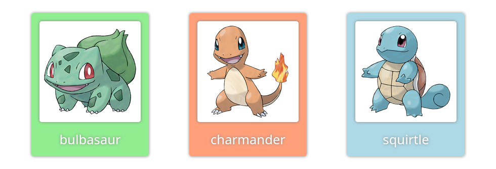

## Objectifs

* Appliquer du style CSS à des composants React
* Expérimenter plusieurs techniques

## Pré-requis

````stepper
# Valider les quêtes suivantes
```quests
2328, 2332, 2336, 2374, 2375, 2376, 2378
```
````

## Introduction

Le style de notre application a un impact très important sur l'apparence des composants, l’interaction utilisateur et son ressenti. Nous allons aborder des premières méthodes simples pour styliser une application React.

Il y a de multiples façons de styliser une application React, et nous allons en examiner seulement quelques-unes. Garde en tête qu'il n'y a pas de bonne ou de mauvaise façon de styliser : utilise la façon qui s'adapte le mieux à ton projet ! 



## Sommaire

## Appliquer du CSS avec des classes

Dans React, tu peux spécifier une classe CSS sur un élément JSX avec la prop `className`. Cela fonctionne exactement comme l'attribut `class` en HTML.

```alert warning
Pourquoi ne pas utiliser `class` comme en HTML ? Parce que le mot `class` est déjà un mot-clé en JavaScript. Les personnes qui ont conçu React ont donc choisi d'utiliser `className` pour éviter de générer des erreurs.
```

Par exemple :

```jsx

```

Tu peux ensuite écrire le code CSS correspondant dans un fichier CSS séparé, comme tu en as l'habitude :

```css
.avatar {
  border-radius: 50%;
}
```

React n'impose pas la façon d'intégrer tes fichiers CSS dans ton application. Dans le cas le plus simple, tu peux ajouter une balise `<link>` à ton code HTML.

Une autre option : la plupart des frameworks basés sur React te permettent d'importer des fichiers CSS directement dans un composant. Quelque chose comme ça :

```jsx
import "./App.css";

function App() {
  return <p className="my-class">Hello world</p>
}
```

👍 *Avantages :* facile à mettre en œuvre, car tu connais déjà le CSS. S'adapte également bien avec des framework CSS comme [Tailwind CSS](https://tailwindcss.com/) (tu peux voir le [guide d'installation avec Vite](https://tailwindcss.com/docs/guides/vite), ou choisis un autre framework CSS sur [State of CSS survey](https://2022.stateofcss.com/en-US/css-frameworks/)).

👎 *Inconvénients :* difficile à maintenir, plus difficile à faire évoluer. Impossible de calculer des styles dynamiques.

**🔬 Expérimente :**

Tu peux faire des essais dans le "bac à sable" ci-dessous en modifiant `App.css` :

```jsx live
!--- App.js
import PokemonCard from "./PokemonCard";

import "./App.css";

function App() {
  return <PokemonCard />;
}

export default App;
!--- PokemonCard.js
function PokemonCard() {
  return (
    <figure className="card">
      
      <figcaption>bulbasaur</figcaption>
    </figure>
  );
}

export default PokemonCard;
!--- App.css
.card {
  width: 200px;
}

.card-img {
  width: 100%;
  height: auto;
}
```

`````xtext arrow
Voici ma version si tu veux voir un résultat fini :

````solution
```jsx live
!--- App.js
import PokemonCard from "./PokemonCard";

import "./App.css";

function App() {
  return <PokemonCard />;
}

export default App;
!--- App.css
.card {
  width: 200px;
  padding: 1rem;
  background-color: lightgreen;
  border-radius: 5px;
  box-shadow: 0px 0px 5px gray;
  color: white;
  font-size: 1.6rem;
  text-align: center;
  text-shadow: 0px 0px 5px gray;
}

.card-img {
  width: 100%;
  height: auto;
  margin-bottom: 0.5rem;
  background-color: white;
  border-radius: inherit;
  box-shadow: inherit;
}
!--- PokemonCard.js
function PokemonCard() {
  return (
    <figure className="card">
      
      <figcaption>bulbasaur</figcaption>
    </figure>
  );
}

export default PokemonCard;
```
````
`````

## Utiliser l'attribut "style"

Tout comme en HTML, tu peux utiliser l'attribut `style` dans ton application React pour appliquer du CSS. Mais avec quelques légères différences : au lieu d'écrire le CSS "inline", tu dois le passer sous la forme d'un objet. Dans cet objet, les noms des propriétés doivent être en **camelCase**, et les valeurs doivent être des chaines de caractères :

```jsx
const container = {
  display: "flex",
  flexDirection: "column",
  alignItems: "center",
  justifyContent: "center",
};

function App() {
  return (
    <section style={container}>
      <h1 style={{color: "#0d1a26", fontWeight: "400"}}>Hey! We're using inline style!</h1>
    </section>
  );
}
```

Dans l'exemple ci-dessus, `style={{}}`sur le `h1` n'est pas une syntaxe spéciale, mais un objet `{}` littéral à l'intérieur des accolades de l'attribut `style={}`. React recommande d'utiliser l'attribut style uniquement lorsque les styles dépendent de variables JavaScript :

```jsx

```

👍 *Avantages :* comme nous avons affaire à un objet, nous pouvons l'étendre et ajouter d'autres propriétés, changer les valeurs de manière conditionnelle.

👎 *Inconvénients :* impossible d'utiliser les [media queries](https://developer.mozilla.org/fr/docs/Web/CSS/Media_Queries/Using_media_queries) et les [pseudo-classe](https://developer.mozilla.org/fr/docs/Web/CSS/Pseudo-classes).

**🔬 Expérimente :**

Tu peux faire des essais dans le "bac à sable" ci-dessous en modifiant le composant `PokemonCard` :

```jsx live
!--- App.js
import PokemonCard from "./PokemonCard";

function App() {
  return <PokemonCard />;
}

export default App;
!--- PokemonCard.js
const card = {
  width: "200px",
};

function PokemonCard() {
  return (
    <figure style={card}>
      
      <figcaption>charmander</figcaption>
    </figure>
  );
}

export default PokemonCard;
```

`````xtext arrow
Voici ma version si tu veux voir un résultat fini :

````solution
```jsx live
!--- App.js
import PokemonCard from "./PokemonCard";

function App() {
  return <PokemonCard />;
}

export default App;
!--- PokemonCard.js
const card = {
  width: "200px",
  padding: "1rem",
  backgroundColor: "lightsalmon",
  borderRadius: "5px",
  boxShadow: "0px 0px 5px gray",
  color: "white",
  fontSize: "1.6rem",
  textAlign: "center",
  textShadow: "0px 0px 5px gray",
};

function PokemonCard() {
  return (
    <figure style={card}>
      
      <figcaption>charmander</figcaption>
    </figure>
  );
}

export default PokemonCard;
```
````
`````

## Utiliser des modules CSS

[Les Modules CSS](https://github.com/css-modules/css-modules) peuvent t'aider à déclarer tes classes CSS avec une portée locale pour un composant. Concrètement, cela signifie que les noms de classes vont être générés par un algorithme pour obtenir des noms uniques pour chaque composant. Cela permet d'éviter les conflits de noms de classes que tu pourrais répéter dans ton application (avoir plusieurs classes `.button` qui se contredisent par exemple).

Un module est un fichier CSS normal. Par exemple, un fichier `MyComponent.module.css` :

```css
.container {
    display: flex;
    flex-direction: column;
    align-items: center
    justify-content: center;
}

.title {
    color: #0d1a26;
    font-weight: 700;
}
```

Ensuite, tu peux l'importer dans ton composant. Le composant utilisera les styles importés avec l'attribut `className` :

```jsx
import styles from './MyComponent.module.css';

function MyComponent() {
  return (
    <section className={styles.container}>
      <h1 className={styles.title}>Hey! We're using CSS modules!</h1>
    </section>
  );
};
```

👍 *Avantages :* pas de conflit dans les noms de classe.

👎 *Inconvénients :* difficile de partager le même style entre les composants.

**🔬 Expérimente :**

Tu peux faire des essais dans le "bac à sable" ci-dessous en modifiant `PokemonCard.module.css` :

```jsx live
!--- App.js
import PokemonCard from "./PokemonCard";

function App() {
  return <PokemonCard />;
}

export default App;
!--- PokemonCard.js
import { card, cardImg } from './PokemonCard.module.css'

function PokemonCard() {
  return (
    <figure className={card}>
      
      <figcaption>squirtle</figcaption>
    </figure>
  );
}

export default PokemonCard;
!--- PokemonCard.module.css
.card {
  width: 200px;
}

.cardImg {
  width: 100%;
  height: auto;
}
```

`````xtext arrow
Voici ma version si tu veux voir un résultat fini :

````solution
```jsx live
!--- App.js
import PokemonCard from "./PokemonCard";

function App() {
  return <PokemonCard />;
}

export default App;
!--- PokemonCard.js
import { card, cardImg } from './PokemonCard.module.css'

function PokemonCard() {
  return (
    <figure className={card}>
      
      <figcaption>squirtle</figcaption>
    </figure>
  );
}

export default PokemonCard;
!--- PokemonCard.module.css
.card {
  width: 200px;
  padding: 1rem;
  background-color: lightblue;
  border-radius: 5px;
  box-shadow: 0px 0px 5px gray;
  color: white;
  font-size: 1.6rem;
  text-align: center;
  text-shadow: 0px 0px 5px gray;
}

.cardImg {
  width: 100%;
  height: auto;
  margin-bottom: 0.5rem;
  background-color: white;
  border-radius: inherit;
  box-shadow: inherit;
}
```
````
`````

## What else ?

Tu as vu dans cette quête des premiers outils pour appliquer du CSS dans ton application React. Rappelle toi qu'il existe beaucoup d'autres manières pour styler tes composants : cette quête est un point de départ qui couvre les plus simples, les méthodes qui n'impliquent pas d'installer des outils supplémentaires.

Tu découvriras d'autres outils plus complexes dans la suite de ton parcours. Garde également un oeil sur des ressources comme le [State of CSS](https://2024.stateofcss.com/en-US/tools/#css_in_js) pour rester à jour.