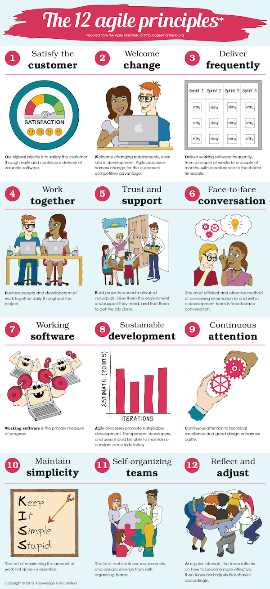
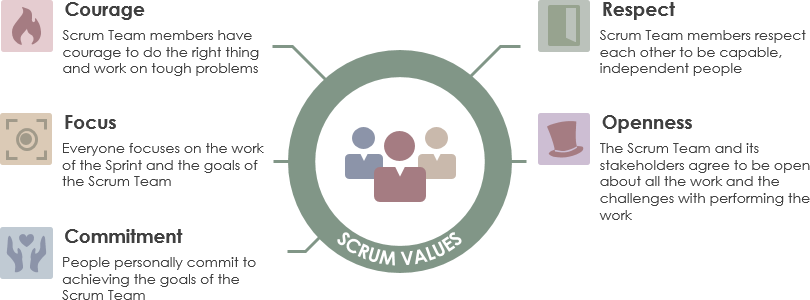
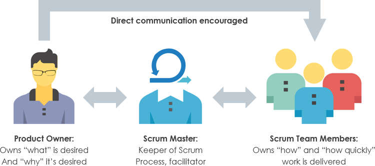
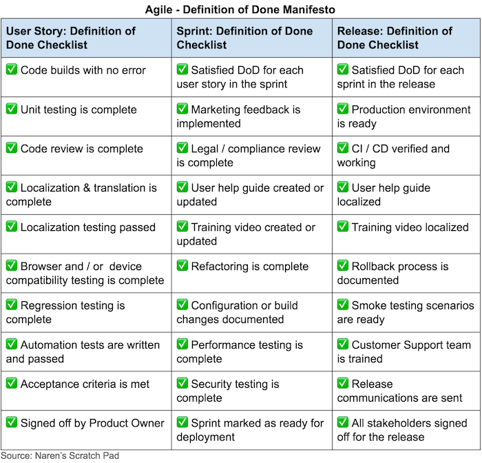

# Introduction

Tu dois être **bien organisé** quand tu travailles sur un projet, surtout quand tu travailles sur de gros projets qui impliquent de nombreux développeurs.

**Pour cela, il est important d'avoir** de l'agilité pour être capable de **s'adapter au changement facilement et rapidement** pour **réagir aux changements ou aux opportunités du marché**.

La méthodologie **Scrum fournit un ensemble d'outils et de règles pour aider les équipes à être plus agiles et plus organisées.**

Dans cette quête, nous allons parler de **ce qu'est Scrum et Agile et comment l'utiliser sur vos projets.**


## 🤓 À la fin de cette conférence, tu comprendras :

* ✅ **Ce qu'est Agile**
* ✅ **Qu'est-ce que SCRUM**
* ✅ **Comment créer un product backlog**

- - -

# 📕 L'histoire d’agile ?

L'agile est née d'une observation : **durant les années 90, le développement de logiciels a connu une crise.**

À cette époque **les ordinateurs étaient de plus en plus performants,** le marché changeait, mais **l'industrie n'était pas capable de s'adapter.**

Le **temps entre les besoins des entreprises et la production** était d'environ **trois ans**...

En conséquence, **de nombreux projets ont été annulés parce que**, le temps qu'ils soient lancés, **le produit était déjà obsolète.**

Un **groupe de développeurs de logiciels a décidé de s'attaquer à ce problème** et de **trouver une solution**.

Au **printemps 2000**, 17 développeurs de logiciels se sont réunis en Oregon pour "parler, skier, se détendre, et essayer de trouver un terrain d'entente - et bien sûr, pour manger" et c'est ainsi que le **manifeste agile** **est né** !

```youtube
https://youtu.be/WKIy8nssMQc
```

## ✒️ Le manifeste agile

Le **manifeste agile** est une liste de quatre valeurs et douze principes.

Ces quatre valeurs sont :

* **Les Individus et les interactions** sont plus importants que les processus et les outils
* **Un logiciel fonctionnel** est plus important qu'une documentation complète
* **La Collaboration avec le client** est plus importante que la négociation du contrat
* **Répondre au changement** est plus important que de suivre un plan

## 🙌 Les douze principes :

* Notre plus grande priorité est de **satisfaire le client par une livraison rapide et continue** de logiciels de valeur.
* **Nous accueillons les demandes de changements**, **même tardives** dans le développement. Les processus agiles exploitent **le changement pour l'avantage concurrentiel du client**.
* Livrer des logiciels fonctionnels fréquemment, de quelques semaines à quelques mois, avec une préférence pour les délais courts.
* **Les personnes clientes et les membres de l'équipe de développement doivent travailler ensemble** quotidiennement tout au long du projet.
* Construire des projets autour d'individus motivés. **Donnez-leur l'environnement et le soutien dont ils ont besoin,** et **faites-leur confiance** pour faire le travail.
* La méthode la plus efficace pour transmettre des informations à une équipe de développement et au sein de celle-ci est la conversation en face à face.
* Un **logiciel fonctionnel** est la principale mesure du progrès.
* **Les processus agiles favorisent le développement durable**. Les sponsors, les développeurs et les utilisateurs doivent être capables de maintenir un rythme constant indéfiniment.
* **L'attention constante portée à l'excellence technique et à une bonne conception améliore l'agilité.**
* **La simplicité**--l'art de maximiser la quantité de travail non fait--est **essentielle.**
* Les meilleures architectures, exigences et conceptions émergent des équipes qui s'organisent elles-mêmes.
* À intervalles réguliers, l'équipe réfléchit à la manière de devenir plus efficace, puis ajuste son comportement en conséquence.



*Source : [https://www.knowledgetrain.co.uk/agile/agile-principles](https://www.knowledgetrain.co.uk/agile/agile-principles)*

```youtube
https://www.youtube.com/watch?v=jSayJF0epJs
```

# ☂️ Le parapluie agile

Beaucoup de **méthodologies sont issues du manifeste agile**.

Ce que nous appelons le "**parapluie agile**" est un ensemble de méthodes et de cadres de travail construits autour du concept de philosophie agile.

Les **cadres agiles** et les **méthodes** sont **classées** du **plus adaptatif** (peu de règles à suivre) au **plus normatif** (plus de règles à suivre).

Le cadre agile le plus utilisé et le plus populaire est appelé **scrum.**


Source : [https://www.pinterest.fr/pin/750201250400410536/](https://www.pinterest.fr/pin/750201250400410536/)

# 🤷 Scrum ?

Scrum est **l'un des Framework agiles les plus utilisés**.

Il **aide les équipes à travailler et à collaborer ensemble,** un peu comme une **équipe de rugby qui se prépare pour le grand jeu** (le nom de scrum vient du rugby), scrum est axée sur **des améliorations continues.**

```resource
https://medium.com/serious-scrum/scrum-s-connection-to-rugby-597405fed5ec
# Scrum’s Connection to Rugby
```

L'idée de scrum est de briser la vision du **produit en petites tâches et en petite équipe et de diviser le temps en morceaux de cycles de développement d'une à quatre semaines.**

```youtube
https://www.youtube.com/watch?v=TRcReyRYIMg
```

## ❤️Scrum valeurs



**Il y a cinq valeurs dans la méthodologie Scrum qui sont:**

* **Focus**
* **Engagement**
* **Respect**
* **Ouverture**
* **Courage**

*Source : [https://www.visual-paradigm.com/scrum/the-5-scrum-values/](https://www.visual-paradigm.com/scrum/the-5-scrum-values/)*

## 🏉 L'équipe scrum

Habituellement, une équipe scrum est composée

* d'un **product owner**
* de L'équipe de développement
* du **Scrum master**



# Le Product Owner

Le Product Owner est une figure centrale de l'équipe Scrum.

C'est lui qui **possède la vision** du produit, il sait **pourquoi le produit doit exister**, **quel problème le produit va résoudre et à qui** le produit est destiné.

Il est également **le porte-parole de la vision des utilisateurs et des stakeholders** (la direction).

Son rôle principal est de **filtrer**, **attribuer** et **prioriser** la **tâche** (les témoignages d'utilisateurs) **en tenant compte de leur impact potentiel sur l'entreprise.**

```youtube
https://www.youtube.com/watch?v=502ILHjX9EE
```

# Le product backlog

Le product backlog est une liste de tâches.

Une tâche peut être :

* Une **nouvelle fonctionnalité**
* Une **amélioration d'une fonctionnalité existante**
* Un **bug fix**
* Un **changement d'infrastructure**

Le backlog est la **seule chose à laquelle tu peux te référer** **quand tu travailles dans une équipe scrum**.

**Rien ne peut être fait qui n'est pas dans le product backlog**.

Les **tâches** du product backlog sont **généralement** **rédigées sous forme d'histoires écrites selon le point de vue de l'utilisateur**.
Nous les appelons **user stories**.

# User stories

Les user stories sont une façon structurée d'exprimer un besoin utilisateur.

Elles sont une **simple description de la tâche à accomplir écrite du point de vue d'un utilisateur.**

Une histoire d'utilisateur doit être écrite **suivant cette structure:**

> En tant que [personne], je [veux], [afin que]

Ex :

> En tant que manager, je veux être capable de comprendre les progrès de mon équipe, afin de mieux rendre compte de nos succès et de nos échecs.

```youtube
https://www.youtube.com/watch?v=apOvF9NVguA
```

## 💬 Témoignages d'utilisateurs - INVEST

Pour **vérifier la qualité d'une user story**, nous pouvons **utiliser les critères INVEST**.

* **Indépendant:**
Chaque user story doit être **indépendante des autres.**

* **Négociable**
Les **détails doivent être négociables**. En fait, il faut répondre aux questions "Quoi" et "Pourquoi", mais pas aux questions "Comment".

* **Valeur**
Les user stories **doivent soutenir la valeur commerciale**. Cette **valeur commerciale doit être claire**.

* **Estimable**
Une **histoire d'utilisateur doit pouvoir être estimée par l'équipe de développement.**

* **Small**
Une **histoire d'utilisateur doit être assez petite pour pouvoir être réalisée en peu de temps.**

* **Testable**
Une histoire d'utilisateur doit être facilement testable grâce à des **critères d'acceptation.**

```youtube
https://www.youtube.com/watch?v=VePSZcTBVNM
```

# 🏃 Le sprint

**Le sprint est le coeur de scrum**. Les sprints sont **de courtes périodes de temps pendant lesquelles l'équipe scrum va travailler à la réalisation de certaines tâches spécifiques.**

Un sprint peut durer d'**une semaine à un maximum d'un mois**.

Le sprint **démarre** par un **planning** qui consiste à **préparer le sprint** et se termine par la **rétrospective**.

Pendant le sprint, l'**équipe tient des réunions quotidiennes** pour partager ce que chacun fait et faire part des difficultés éventuelles.

```youtube
https://www.youtube.com/watch?v=7wGQU37fyiI
```

# ✅ Définition of done

Il est important de **fixer la définition** quand une tâche ou un projet est **considéré comme "fait".**

Pour cela, **il existe un ensemble de critères qui pourraient être définis.**

Voici un exemple de **liste de contrôle** pour la **définition of "done":**



*Source : [https://medium.com/@narenscratchpad/agile-definition-de-la-liste-de-contrôle-pour-l'usager-de-l'histoire-imprimer-et-lâcher-52b7ad8d49de](https://medium.com/@narenscratchpad/agile-definition-de-la-liste-de-contrôle-pour-l'usager-de-l'histoire-imprimer-et-lâcher-52b7ad8d49de)*

```youtube
https://www.youtube.com/watch?v=pYOJyQoBT3U
```

# 📚 Ressources

Si tu veux en savoir plus sur scrum, consulte le guide officiel scrum ici :

```resource
https://scrumguides.org/
# Scrum Guide est le guide de référence pour Scrum
```

```quiz 
false|||true|||true
# Quelles solutions les méthodes agiles apportent-elles ?
[x] Être plus flexible  
[x] Réagir au changement  
[] Créer des process 
[] Créer de la documentation
# Quel est le framework Agile le plus utilisé ?
[x] Scrum  
[] Kanban
[] XP  
[] RUP
[] Cristal
# Qu'est-ce qu'un sprint ?
[x] Une courte période de temps pendant laquelle l'équipe travaille  
[] Un marathon  
[] Une technique pour rester concentré pendant la journée
# Quelle est la durée habituelle d'un sprint ?
[x] 1 semaine - 1 mois  
[] 1 heure - 1 jour  
[] 1 jour - 1 semaine
```