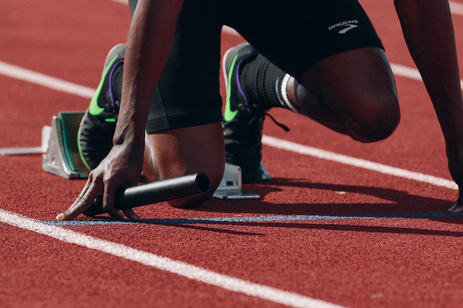
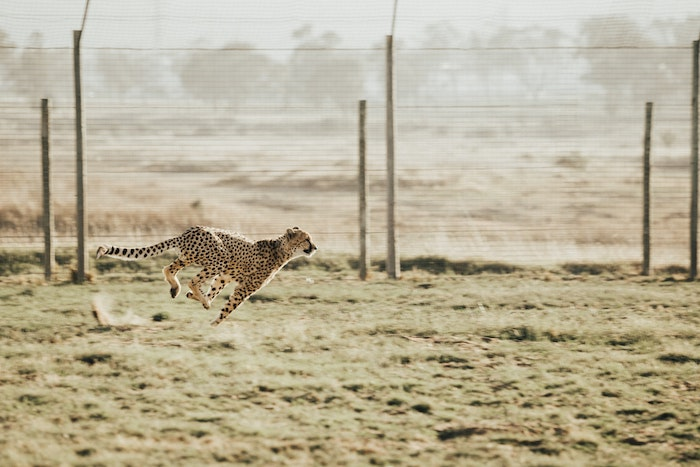
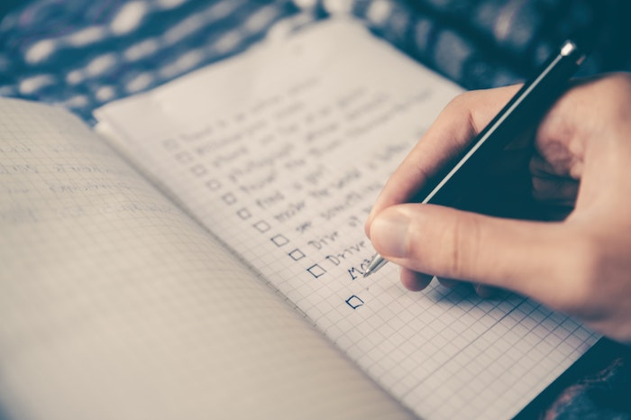
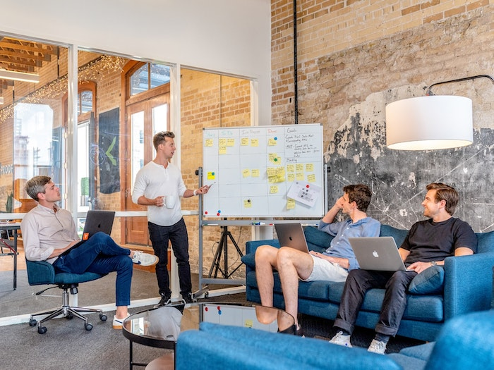
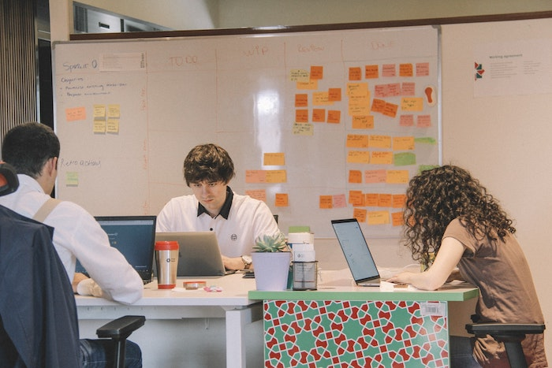
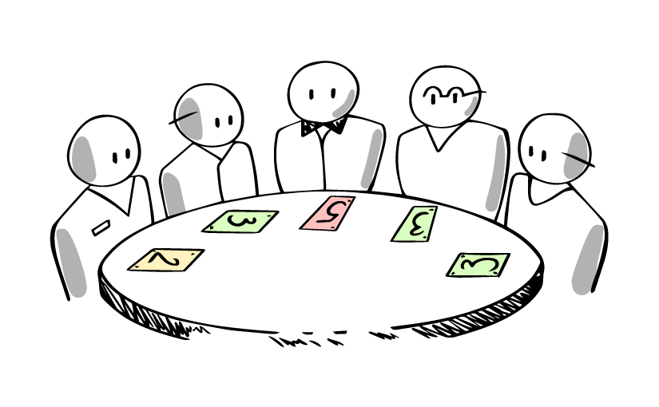
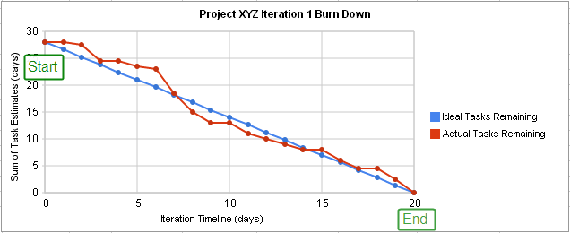

Dans la quête précédente, nous avons parlé de ce que sont Scrum et Agile.

Tu as appris ce qu'est scrum et son écosystème, puis nous avons plongé dans ce qu'est un backlog produit et comment nous pouvons créer un backlog à partir de zéro et ajouter nos user stories à notre backlog.

Maintenant que tes user stories et ton backlog sont configurés, il est temps de créer notre premier sprint.



- - -

## 🤓 À la fin de cette conférence, tu comprendras :

* ✅ **Qu'est-ce qu'un sprint**
* ✅ **Comment démarrer et mener un sprint**

## 🤷 Chapitre 01 : Définition

Qu'est-ce qu'un sprint ?



**"Le Sprint est un concept clé de la méthode Scrum**, une boite de temps d'**une semaine à un mois** durant laquelle un produit utilisable et potentiellement livrable est créé.

Un **nouveau Sprint** **démarre immédiatement après la fin du Sprint précédent**.

Les sprints contiennent et se composent du **sprint planning**, des **daily scrum**, du **travail quotidien de l'équipe de développement**, de la **sprint review** et de la **sprint rétrospective**.

**Pendant le sprint:**

* On ne fait aucun changement qui pourrait mettre en danger le but du sprint
* Les objectifs de qualité ne diminuent pas ;
* **La portée peut être clarifiée** et **re-négociée** entre le propriétaire du produit et l'équipe de développement à mesure que l'on en apprend plus.

Chaque sprint peut être considéré comme un projet dont l'horizon n'excède pas un mois.

Comme les projets, les **Sprints sont utilisés pour accomplir quelque chose**.

Chaque Sprint doit préciser **ce qui doit être réalisé** ainsi qu'**un plan flexible qui guidera sa réalisation**.

Les sprints sont **limités à un mois calendaire**.

Lorsque la durée d'un sprint est trop longue, la définition de ce qui est construit peut changer, la complexité peut augmenter, et le risque peut s'accroître.

Source : [scrumguides.org/scrum-guide.html#events-sprint](http://scrumguides.org/scrum-guide.html#events-sprint)

## 🗓️ Chapitre 02 : La planification des sprints



La première étape pour commencer ton sprint est **le sprint planning.**

Pendant le sprint planning, l'équipe de développement, le scrum master et le product owner se rencontrent pour **définir le sprint.**

Le sprint planning **doit être séparé en deux parties**.

La première partie se concentre sur le **quoi** (ce que nous allons construire) et la seconde partie est plus axée sur le **comment** (comment nous allons le faire).

#### 🎯 L'objectif du sprint (Quoi)



Cette partie est **préparée par le product owner**, après avoir discuté avec les **stakeholders** (la direction).
Le product owner va **sélectionner les user stories** et **écrire le sprint goal**.

Il **ajoutera la velocité estimée de l'équipe** et le **nombre d'heures de projet disponibles.**

Il **définira la durée du sprint** ainsi que l'heure et le lieu exacts du **daily scrum** et de la **démo de fin de sprint**.

Tu peux utiliser **ce document** pour préparer le planning du sprint.

```resource
https://docs.google.com/document/d/1y7ol9Qg2M_f5ocCUCCIgcN-J23-bKA-6eoubl2UFCHw/edit?usp=sharing
# 📚 Resource: Sprint goal template
```

#### 👨‍💻 Meet the team



Une fois que le propriétaire du produit a défini la portée du sprint, il va **débuter la réunion avec l'équipe**, et il va **expliquer** le **but** du sprint à tout le monde ainsi que la **valeur commerciale et l'impact**.

Ensuite, il présentera les **user stories** qui feront partie du sprint.

#### 🃏 Planning poker



La deuxième étape est le **planning poker**, le **product owner** (ou scrum master) **présentera les différentes user stories** à l'équipe et **demandera à ceux-ci d'attribuer un certain nombre de points à chacun d'entre eux**.

Cet exercice est appelé **planning poker** car tu le feras généralement avec un **jeux de cartes spéciales** (qui représentent généralement des nombres de la séquence de Fibonacci).

Pour jouer au planning poker, le Product Owner ou le Scrum Master présente une user story et **tout le monde doit donner sa note au même moment pour que personne ne soit influencé.**

Si tout le monde est d'accord sur le nombre de points, c'est parfait, sinon, on **demande aux deux extrêmes** (le plus bas et le plus grand) d'**expliquer leur opinion sur les raisons pour lesquelles ils pensent que ce sera plus facile ou plus difficile.**

Ensuite, nous **recommençons à nouveau jusqu'à ce que tout le monde soit d'accord** sur ce point.
Le planning poker est aussi un bon moment pour **décider qui peut travailler sur quelle tâche.**

**Regarde cette vidéo qui t'explique comment jouer au planning poker**

```youtube
https://www.youtube.com/watch?v=gE7srp2BzoM
```

Pour jouer au planning poker, tu peux **utiliser une application sur ton téléphone portable** :

```resource
https://play.google.com/store/apps/details?id=artarmin.android.scrum.poker
# 📚 Resource: Scrum Poker Cards (Agile) - Applications on Google Play
```

```resource
https://apps.apple.com/us/app/scrum-poker-planning-cards/id893134104
# 📚Resource: ‎Scrum Poker Planning (cards) - Application ios 
```

#### 🎬 Vidéo : Scrum board

```youtube
https://www.youtube.com/watch?v=Rdl9_X3IOuE
```

## 👩‍💻 Chapitre 03: Daily Scrum

Un des rituels que tu feras chaque jour est le **daily scrum**.

Le daily scrum est une petite réunion où tout le monde se tient debout et dit ce qu'il a fait la veille, quel est son plan pour la journée et s'il fait face à des difficultés.

Cette réunion est **très importante**, parce que c'est le moment où tu peux savoir **qui travaille sur quoi** et aussi partager si tu as des **difficultés** afin que quelqu'un puisse t'aider, il est aussi important de peut-être s'adapter au cas où le projet irait plus lentement et que tu sentes que quelque chose pourrait prendre plus de temps ou moins de temps que prévu.

#### 🎬 Vidéo : Daily Scrum

```youtube
https://www.youtube.com/watch?v=xcC0LmkzG9g
```

## 👨‍💻 Chapitre 04 : Le sprint board

Un sprint board est un tableau que tu peux réaliser sur papier ou sur un tableau blanc, ou à l'aide d'un logiciel de gestion de projet comme Jira ou Trello.

Il présente généralement 3 colonnes "To do" - "In progress" - "Done".

Les user stories sous forme de carte sont alors placées sur ce tableau et déplacées par les membres de l'équipe en fonction de l'avancée de la user story.


## 📉 Chapitre 05 : Le burndown chart

Le burndown chart est une représentation du travail restant dans un graphique.

Il représente le nombre de story points à travers le temps.



Dans cet exemple, tu peux voir que le **projet commence avec 30 story points**, et finit à 0 quand tout est fait (après 20 jours dans ce cas).

En bleu, tu peux voir la courbe **idéale**, mais comme tu le sais, certains jours peuvent être plus compliqués que d'autres en ce qui concerne ce sur quoi tu travailles.

Tous les jours, **une fois la journée terminée**, tu dois **compter le nombre de points que tu as fait** et **les reporter dans le tableau de progression**, alors tu auras une idée sur **la façon dont le projet se déroule**.

```youtube
https://youtu.be/rCY0XrSef1A
```

## Chapitre 06 : sprint Rétrospective 

"La rétrospective du sprint est une occasion pour l'équipe de mêlée de s'inspecter et de créer un plan d'améliorations à mettre en place lors du prochain sprint.

La rétrospective du sprint a lieu après la sprint review et avant la planification du prochain sprint. 

Il s'agit d'une réunion de trois heures maximum pour les sprints d'un mois. Pour les sprints plus courts, l'événement est généralement plus court. Le Scrum Master s'assure que l'événement a lieu et que les participants comprennent son but.

Le Scrum Master s'assure que la réunion est positive et productive. Le Scrum Master apprend à tous à respecter le temps imparti. Le Scrum Master participe à la réunion en tant que membre de l'équipe.

Le but de la rétrospective Sprint est :


* d'inspecter comment s'est déroulé le dernier Sprint en ce qui concerne les personnes, les relations, le processus et les outils ;
* d'identifier et ordonner les principaux éléments qui ont bien fonctionné et les améliorations potentielles ; et,
* de créer un plan pour mettre en place des améliorations dans la façon dont l'équipe Scrum fait son travail.

Le Scrum Master encourage la Scrum Team à améliorer, dans le cadre du processus Scrum, son processus de développement et ses pratiques afin de le rendre plus efficace et agréable pour le prochain Sprint. 

Pendant la rétrospective de chaque Sprint, la Scrum Team planifie des moyens d'augmenter la qualité du produit en améliorant les processus de travail ou en adaptant la définition of "done", si cela est approprié et n'entre pas en conflit avec les normes du produit ou de l'organisation.

À la fin de la rétrospective du sprint, l'équipe Scrum devrait avoir identifié les améliorations qu'elle mettra en place lors du prochain sprint. Bien que les améliorations puissent être mises en place à tout moment, la rétrospective du sprint offre une opportunité formelle de se concentrer sur l'inspection et l'adaptation."

*Source:* [https://www.scrumguides.org/scrum-guide.html#events-retro](https://www.scrumguides.org/scrum-guide.html#events-retro)

```youtube
https://www.youtube.com/watch?v=MiaZhJyYUj0
```

# ☝️ Résumé

* Les sprints sont de courtes périodes de temps pendant lesquelles l'équipe **scrum va travailler à la réalisation de certaines tâches spécifiques**
* Les sprints peuvent durer entre 1 semaine et 1 mois
* Le sprint **débute par un sprint planning** et **finissent par une rétrospective**
* Le **burndown chart est un graphique qui montre les progrès de l'équipe**