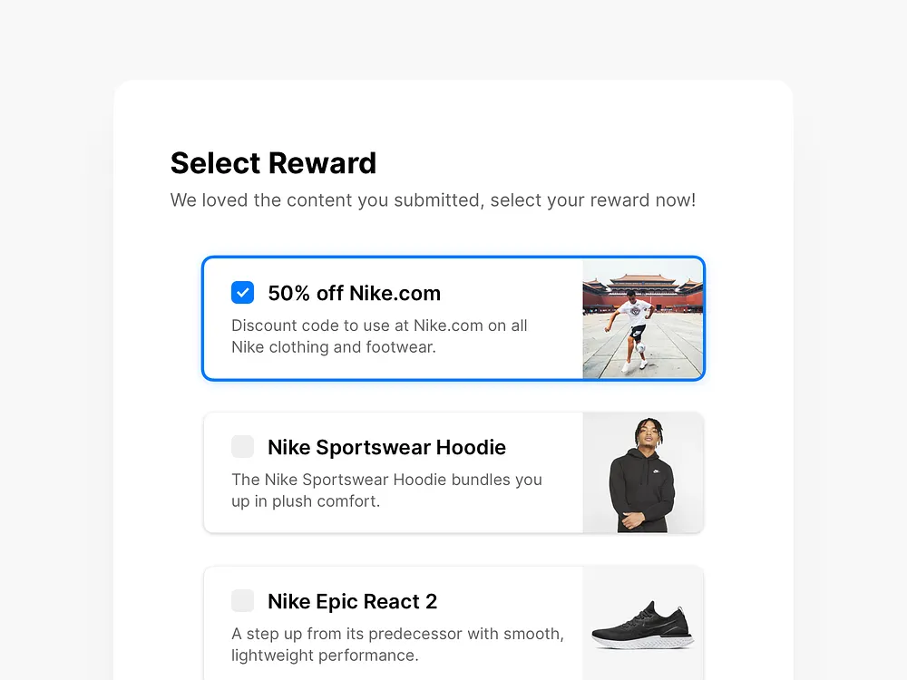
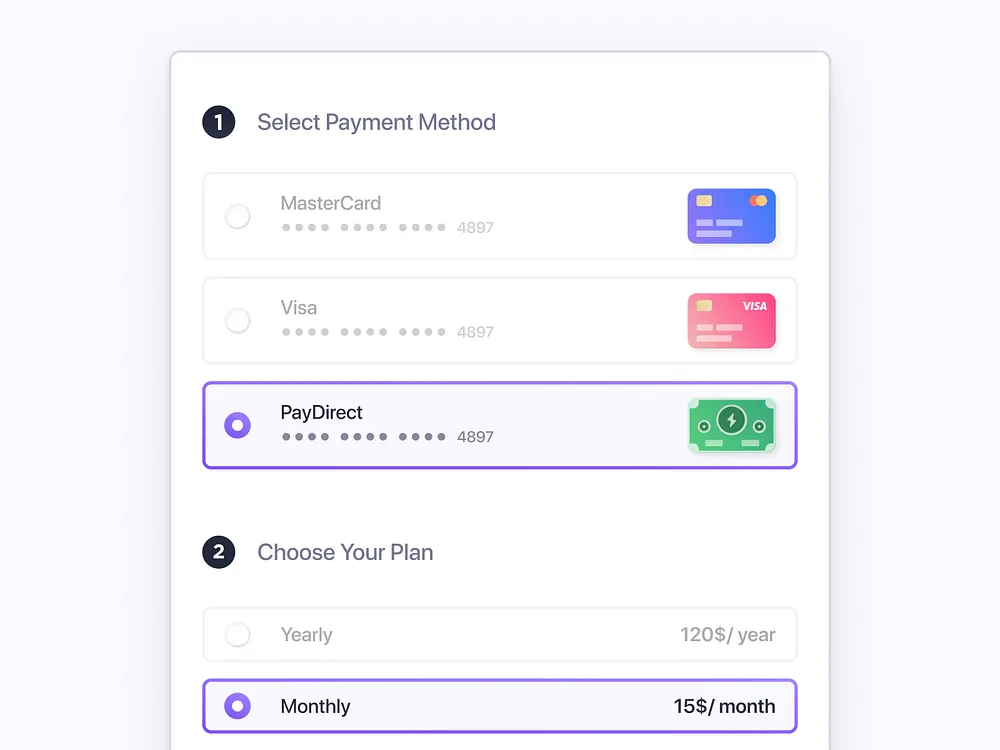
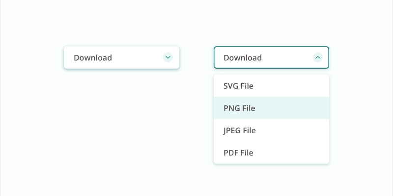
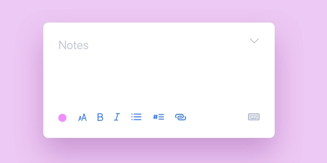
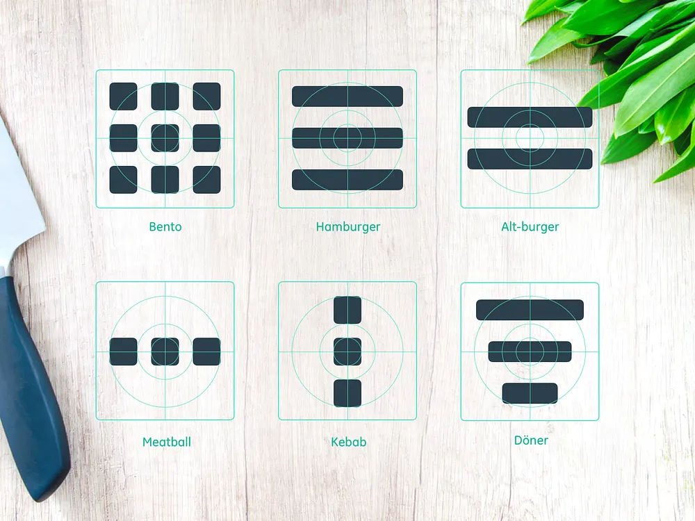
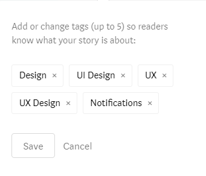
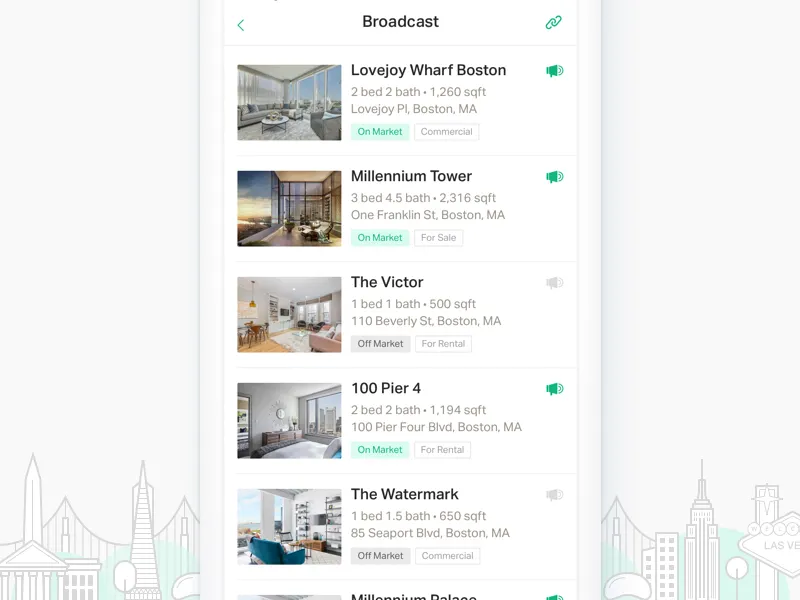
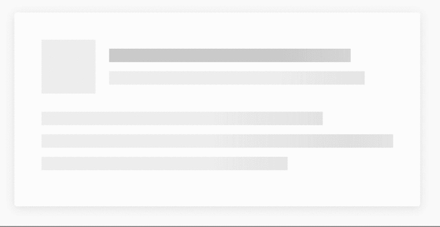
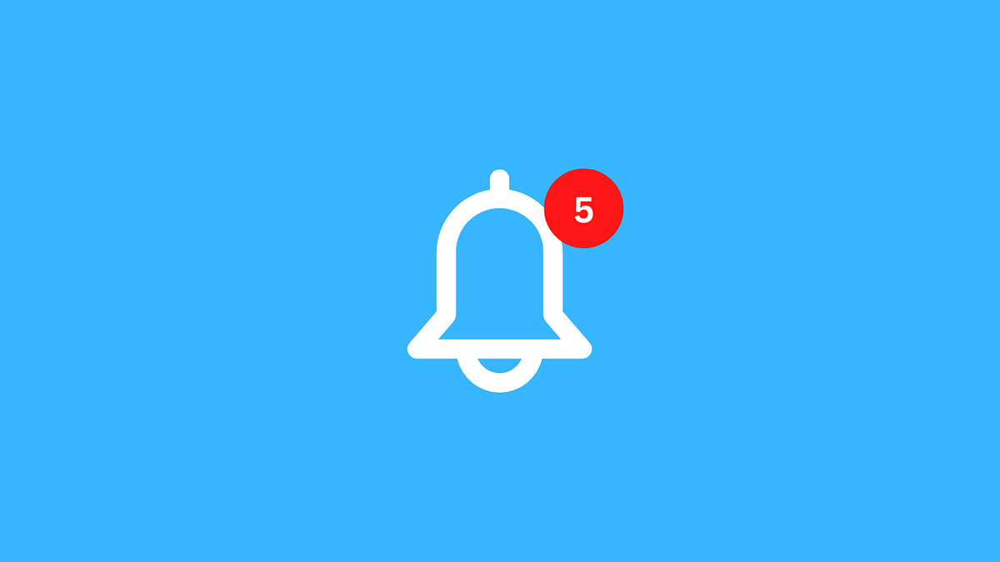

```title book
Les composants de l’interface utilisateur, c’est quoi ?
```

Lorsque vous faites le design d’une interface, vous devez tout faire pour **garder une cohérence et une logique dans vos choix**. En tant qu’utilisateurs, nous nous sommes familiarisés avec certaines mécaniques. Par exemple, pour la plupart d’entre nous, nous savons qu’une icône d’avion en papier situé à proximité d’un champ de texte signifie qu’au clic/appui, nous enverrons le message saisi, et ce même sans qu’un libellé “envoyer” ne soit accolé.

S’assurer de faciliter la vie de nos utilisateurs les aide ainsi à réaliser les actions avec __plus d’efficience et de satisfaction__.

#### 🤓 A la fin de cette quête, tu sauras :

✅ ce que sont les composants d'interface utilisateur,
✅ quels sont les principales catégories et types de composants,
✅ comment et dans quel but les utiliser.


---

## Les composants, ces briques de Lego 🧱

Les composants d’interface utilisateur correspondent à tous les éléments visuels que l’on pourrait “découper” dans une interface. Cela comprend, par exemple : 
- __les inputs__, ou éléments avec lesquels nous pourrons effectuer des actions et des choix : checkboxes, boutons radio, listes déroulantes, boutons, switch, champs textes, date pickers…
- __les icônes__,
- les composants de __navigation__ : menus burger & co, fil d’ariane, carousels, champs de recherche, pagination, tags, tab bars/onglets, listes…
- les composants d’__information__ : tooltips, loaders, barres de progression, notifications, pop-ups/fenêtres modales…
- les __conteneurs__ : zones dépliables/accordéons, zones modulables, cartes…

Et ces composants, on va les assembler comme des Legos. C’est cette construction qui donnera les écrans et pages de notre interface utilisateur, en suivant la charte graphique (ou plutôt, design system) établie.

### Les inputs 

#### Checkboxes

_Harry Burns_

Ces petites coches permettent, souvent dans un formulaire ou une liste, de __sélectionner un ou plusieurs choix__ (ex : choix de filtres dans une recherche). Les checkboxes sont aussi utilisables pour des options booléennes de par leur fonction binaire (ex : accepter ou refuser des conditions)


#### Boutons radio


_Simon Lürwer_

Comme les checkboxes, les boutons radios souvent trouvés dans les formulaires permettent d’effectuer un choix. La grande différence, hormis leur affichage traditionnel en rond, est qu’ils offrent __un choix UNIQUE entre plusieurs options__ (ex : couleur d’un article)

#### Boutons

_Gal Shir_

C’est l’un des fondamentaux de l’interface utilisateur. Le plus souvent accompagné d’un libellé d’action, d’une icône ou les deux, il propose à l’utilisateur la __réalisation d’une action__ (envoyer un formulaire, valider une opération…)

#### Listes déroulantes


_Maaike Koolbergen_

Un encart, traditionnellement accompagné d’une petite flèche, qui au clic/appui offre __une liste de choix qui se “déroule”__.

```alert info 
Elles sont à utiliser avec précaution, car elles peuvent dégrader l’expérience utilisateur si elles sont mal exploitées. Par exemple, lorsque peu d’options sont disponibles, on pourra leur préférer des boutons radio. Moins de clics, toutes les options directement visibles…

Pour aller plus loin, vous pouvez regarder la conférence "You Know What? Fuck Dropdowns." : https://www.youtube.com/watch?v=hcYAHix-riY

```

#### Switches/toggle

_Atlassian_

Proches des checkboxes dans leur fonctionnement “on/off”, en termes d’expérience utilisateur ces petites barres coulissantes ne seront néanmoins pas utilisées pour faire des choix multiples mais plutôt à privilégier pour __des choix d’activation/désactivation d’options__.


#### Champs textes

_Yaroslav Samoilov_

Rien de plus simple : __une zone dédiée à la saisie de texte__. Elle peut être en une ligne (input), en plusieurs (textarea), signifiée par un cadre, un fond … Simplistes, on s’assurera néanmoins de les soigner : __un champ pour saisir un nombre à deux chiffres sera bien différent visuellement d’un champ pour envoyer un message privé__ !

#### Date/time pickers

_Edoardo Mercati_

Trouvable lorsque l’on doit choisir une date ou une heure dans une interface, on pourra les retrouver __sous forme de petits calendriers__ en tooltip sur ordinateur ou __en boîte modale__ sur smartphone.


### Icônes

_Anton Klapko_

Ces __illustrations simplifiées__ sont utilisables __pour la navigation ou donner une information__. Il est préférable de les penser en __vectoriel__, et qu’elles puissent être affichables __en tout petit__. Elles se doivent d’être explicites, représentatives de l’action ou de l’information pour aider l’utilisateur à se repérer et naviguer dans l’interface. 

_Eddie Lobanovskiy_

Elles peuvent être interactives dans un contexte de navigation/opérations ou simplement informatives (attention à ne pas perdre les utilisateurs entre les icônes interactives et informatives !)


### Navigation
#### Menus burger/bento/döner...


_Alex Lockwood_

Est-ce en référence au "menu" que tous ont un petit nom de plat ? Sûrement ! Toujours est-il qu’on trouve dans cette catégorie un ensemble de pictogrammes de menus aux significations différentes :

- Le __menu hamburger__, universel, souvent positionné en haut à gauche,  est un set de trois lignes indiquant qu’un menu liste est disponible au clic/appui.

- Le __menu döner__, composé de lignes se réduisant en tailles, est plutôt utiliser pour des systèmes de filtres.

- Le __menu bento__, quant à lui, représente souvent un menu dont les éléments sont disposés en forme de grille.

- Le __menu kebab__ : les trois petits points représentant généralement que des options complémentaires sont disponibles pour la page/écran ou un de ses sous-éléments.

#### Fil d’ariane

_Sharon Olorunniwo_

Celui qu’on appelle “breadcrumb” en anglais : souvent représenté par une succession de liens entrecoupée par des chevrons, il permet à l’utilisateur __de savoir où il en est dans un process__, ou alors de lui indiquer les catégories/sous-catégories d’un produit par exemple, et lui offrir la possibilité de remonter dans ce fil.

#### Carrousels

Une __succession d’encarts/images défilantes__ pouvant emmener directement vers des endroits clés d’un site, ou que l’on souhaite délibérément mettre en avant (exemple : une promotion, une news importante…).

#### Champs de recherche

_Jan Hoffman_

__Dérivés d’un champ texte__, ils s’accompagnent souvent d’une petite loupe, et fréquemment d’un menu contextuel proposant rapidement des pages/écrans/résultats en lien avec la recherche (typiquement : Google !)

#### Pagination

_Oleg Frolov_

__Liste de numéros ou de points en bas de pages__, pouvant être accompagnées de raccourcis type “première page”, “dernière page”, ils sont utilisés souvent pour des affichages de listes de contenus : résultats de recherches, produits, actus…
Niveau expérience utilisateur, on peut trouver l'alternative du __“scroll infini”__, chargeant automatiquement de nouveaux résultats lorsque l’on atteint le bas de page (YouTube).

#### Tags

_Alex Zlatkus_

Ils permettent de trouver du contenu dans des __thématiques liées par des mots-clés__. Leur avantage est leur transversalité et la possibilité de les combiner : on peut sélectionner une catégorie comme une propriété et un mot-clé associé à un produit par exemple.
Selon les contextes, on peut proposer la création de tags personnalisés à l’utilisateur.

#### Tab bars/onglets

_Hoang Nguyen_

Contenant un certains nombre de raccourcis, elle permet aux utilisateurs de se __déplacer rapidement entre les principales sections d’un système__ (souvent utilisée en bas des applications via de simples icônes)

#### Listes 

_Emily Feng_

Une __succession d’”items”__, horizontale, verticale ou en grille, qui peut être organisée selon de nombreuses possibilités : alphabétique, numérique, chronologique, aléatoire…

### Information

#### Tooltips


Aussi appelées “Infobulles” en français, elles permettent d’afficher des __conseils/infos complémentaires au survol__ d’un élément, voire parfois d’effectuer des actions contextuelles simples rapidement.

#### Loaders

_Kickass_

On retrouvera ici tous les composants permettant d’indiquer à l’utilisateur __qu’un chargement de contenu/une opération est en cours__, l’invitant à patienter : les traditionnels petits sabliers, barres de chargement… mais aussi des formes plus créatives, comme des animations, ou plus user-friendly, comme __le "skeleton screen"__, une structure squelette qui représente la disposition du futur contenu :




#### Barres de progression


Les barres de progression aident les utilisateurs à __visualiser où ils en sont dans une série d'étapes__. On en trouve par exemple lors des achats, marquant les différentes étapes qu'un utilisateur comme la facturation et l'expédition.

#### Notifications



Vous trouverez ces petits points partout sur les interfaces aujourd'hui, possiblement accompagnés de chiffres ou de glyphes. __Ils informent facilement d’une nouveauté__ sans être sur l’écran concerné, ni passer par un moyen envahissant : message, erreur, réussite, actu…

#### Pop-up/fenêtre modale

_Joshua Krohn_

Une fenêtre modale est une petite fenêtre contenant du contenu ou un message __qui va venir se superposer sur l’écran/page__. Elle est souvent accompagnée d’un layout, un arrière-plan semi-opaque, pour recentrer l’attention sur elle le temps qu’elle soit refermée.
Elle peut servir dans de nombreux cas : on la trouvera souvent pour confirmer une action sensible (ex : “Voulez-vous vraiment supprimer cet élément” ?)


### Conteneurs

#### Zones dépliables/accordéons

_Louvrissime_

Les accordéons permettent aux utilisateurs de __développer et de réduire des sections de contenu__. Ils aident à naviguer rapidement dans entre les infos et permettent d'inclure de grandes quantités d'informations dans un espace limité.

#### Cartes

_Crank_

Les cartes, ou cards, sont de __petits encarts rectangulaires ou carrés__ qui contiennent différents types d'informations, sous la forme de boutons, de texte, de médias... Les cartes agissent comme un point d'entrée pour l'utilisateur, affichant différents types de contenu côte à côte sur lesquels l'utilisateur peut ensuite cliquer. Les cartes sont un excellent choix de conception d'interface utilisateur si vous souhaitez utiliser intelligemment l'espace disponible et présenter à l'utilisateur plusieurs options de contenu, sans les faire défiler dans une liste traditionnelle.

---
## En conclusion

Cette liste est loin d'être exhaustive : tout élément imbricable dans une interface est un composant !
Pour aller plus loin, nombreux frameworks en lignes présentent leur librairie de composants :

https://m3.material.io/components
https://ionicframework.com/docs/components
https://atlassian.design/components/

Des presets de composants sont aussi proposés sous de nombreux formats de template : Figma, Xd, voire même Illustrator...

---


## ☝️ Résumé
- Les composants d'interface utilisateur __sont des éléments "sécables" de l'interface__ que l'on assemble pour créer les pages/écrans.
- Il en existe __de nombreux types__, de nouveaux voient le jour régulièrement, et tous ont des fonctions différentes : permettre une action, naviguer, donner une information...
- On peut les rassembler dans des kits que l'on appellera des __librairies de composants__, utilisables à souhait pour homogénéiser les interfaces.