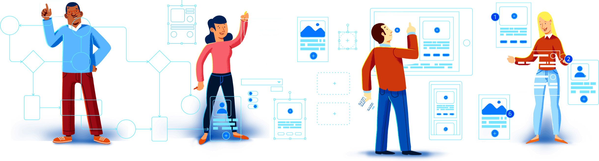
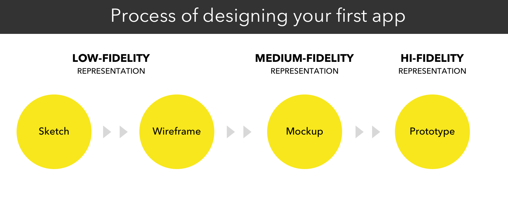
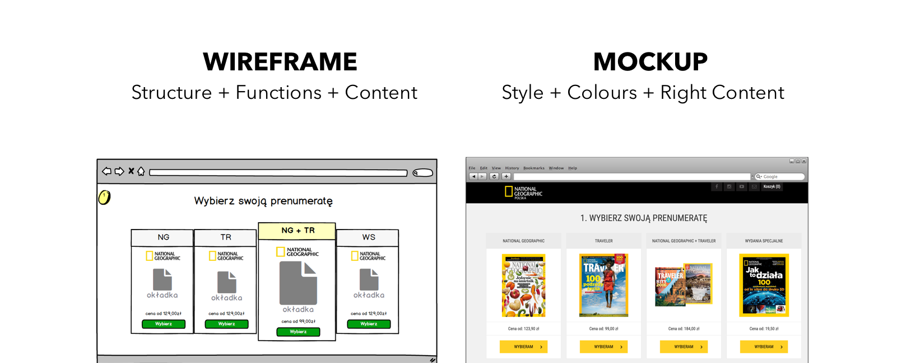
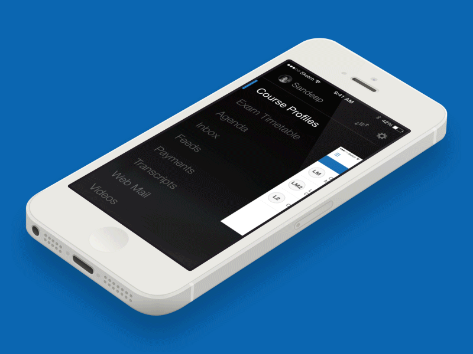
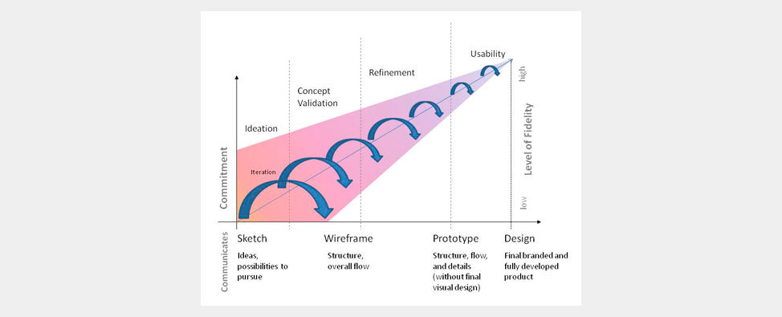

# Introduction

Un prototype permet de **tester la perception, l'usabilité et le parcours utilisateur** d'une interface en amont du développement du produit final. Il donne vie à une idée ou à un concept tout en permettant d'adapter sa solution avant de consacrer beaucoup de temps et de budget à la production d’un produit fini.

## 🤓 **À la fin de cette quête vous saurez:**

✅Quels sont les différents niveaux de fidélité
✅Comprendre l'évolution de la basse à la haute fidélité
✅ Distinguer wireframes, maquettes et prototypes

# 

# 👉 Où commencer ?

### Besoins utilisateurs > Récit utilisateur > Contenu > Wireframes > Maquettes > Prototypes

Qu'il s'agisse d'esquisses ou de prototypes, **les solutions designées doivent répondre aux besoins spécifiques des utilisateurs.** En ayant ces besoins en tête, il sera plus facile de commencer à matérialiser les différentes possibilités et interactions.

---

## La basse fidélité

Pour commencer, il est recommandé de vous munir d'un stylo et d'une feuille de papier et de griffonner, de prendre des notes sur les idées et les connecteurs et de sélectionner éventuellement le contenu prioritaire.

Dès que vous vous sentez à l'aise avec certaines des solutions explorées, vous pouvez les transformer en interface numérique, sous forme de maquettes ou de prototype interactif, pour valider les concepts avec vos utilisateurs, ou apporter ces croquis et ces notes lors d'une réunion avec votre équipe ou les parties prenantes pour expliquer et explorer les possibilités de manière plus tangible.

Les wireframes sont utiles pour valider les possibilités avant d'y consacrer trop d'efforts, en s'assurant qu'il s'agit d'un processus itératif à partir de zéro.

---

# Wireframes, Maquettes & Prototypes

Il y a parfois une certaine confusion lorsque nous parlons de wireframes et de maquettes. Eh bien, pour vous qui lisez ces lignes, nous espérons que ce doute n'existera plus.

Pour l'un et l'autre de ces exemples, si vous ajoutez de l'interactivité et des zones cliquables, il s'agit d'un prototype. Un prototype basse-fidélité, basé sur des wireframes, ou un prototype haute-fidélité, construit sur des maquettes haute-fidélité.

### Wireframes

Le wireframe comprend le type de contenu des différentes parties qui structurent la page. Il s’agit du squelette de la future interface, l’aspect esthétique y est simplifié. Un wireframe est comme le plan d'un bâtiment. Lorsque quelqu'un veut construire un bâtiment massif, il ne commence pas tout de suite, n'est-ce pas ? Au lieu de cela, il esquisse, dessine, fait les plans, calcule, etc.
Il en va de même pour la conception de sites Web et d'applications.

Un prototype basse fidélité, basé sur un wireframe par exemple, peut être utilisé pour effectuer des tests : il permet aux testeurs de se concentrer sur l'architecture et le contenu de l'interface, sans se préoccuper de l'aspect esthétique. Il s'agit d'un moyen rapide pour avoir des retours de vos utilisateurs et collaborateurs sur le produit, et facilite le processus itératif.

---

## La haute fidélité

### Maquettes

La maquette offre une perspective réaliste du rendu final. Elle concerne l’aspect graphique du site, et applique normalement la charte graphique de l’entreprise. Alors qu'un wireframe représente principalement la structure d'un produit, une maquette montre à quoi il ressemblera. Cependant, une maquette n'est pas cliquable (tout comme le wireframe). Contrairement au wireframe, la maquette est un affichage de moyenne ou haute fidélité du design.
Une maquette vous aide à prendre les décisions finales concernant les couleurs, le style visuel, la typographie d'un produit etc.

### Prototypes haute fidélité

Le prototype est une simulation du projet final. Il contient les interactions présentes sur l'interface, ce qui permet de tester l’usabilité et le parcours utilisateur.
Contrairement aux deux précédents, un prototype est cliquable et permet donc à l'utilisateur, ou acteurs du projet, d'expérimenter le contenu et les interactions de l'interface. En fait, un prototype est très proche du produit final lui-même.
Mais ce n'est pas le produit final !

La différence entre le produit final et le prototype est principalement que l'interface et le backend ne sont pas souvent liés dans le cas d'un prototype. Cela est fait pour réduire les coûts de développement jusqu'à ce que l'interface utilisateur soit approuvée. Une fois le prototype testé, l'équipe peut passer à l'intégration.

Exemple de prototype intéractif

#### Avantages du prototypage haute-fidélité

* **Engagement** : les parties prenantes peuvent voir leur idée se matérialiser et seront en mesure de juger dans quelle mesure la solution répond à leurs attentes, désirs et besoins.
* Les tests utilisateurs impliquant des prototypes haute-fidélité permettront aux évaluateurs de **recueillir des informations avec un haut niveau de validité et d'applicabilité**. Plus le prototype est proche du produit fini, plus l'équipe de conception aura confiance dans la manière dont les gens réagiront, interagiront et percevront la conception.
* Très utile pour **vendre/présenter** de nouveaux produits à d'éventuels investisseurs.

#### Inconvénients du prototypage haute-fidélité

* Ils prennent généralement beaucoup **plus de temps à produire** que les prototypes basse-fidélité.
* Lors du test des prototypes, les utilisateurs sont plus enclins à se concentrer et à faire des commentaires sur les caractéristiques superficielles, plutôt que sur le contenu.
* Les prototypes de logiciels peuvent donner aux utilisateurs une **fausse impression** de la qualité de l'article fini.
* Apporter des modifications aux prototypes peut prendre beaucoup de temps, ce qui retarde l'ensemble du projet. Cependant, les prototypes de basse fidélité peuvent généralement être modifiés en quelques heures, voire en quelques minutes, par exemple lorsque des méthodes d'esquisse ou de prototypage sur papier sont utilisées.

Ce schéma montre l'évolution du processus itératif et collaboratif de conception d'interface. Source : UXMatter

---

# ☝️En résumé

* Le prototypage vous aide à valider les idées à un stade précoce du développement.
* La basse fidélité peut consister en des croquis réalisés au stylo et au papier.
* N'hésitez pas à partager vos esquisses pour obtenir des suggestions : le plus tôt sera le mieux.
* La haute fidélité doit être interactive, animée et similaire au produit final.