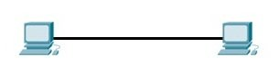
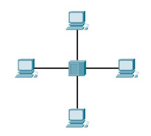
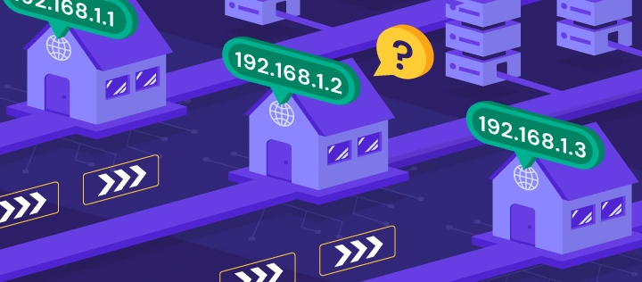
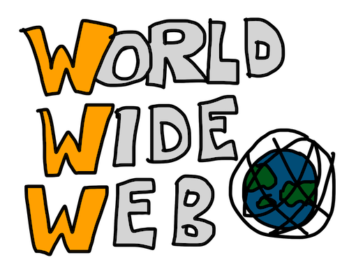
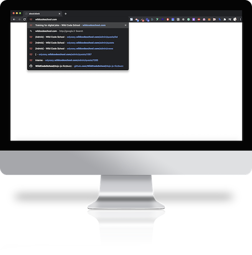
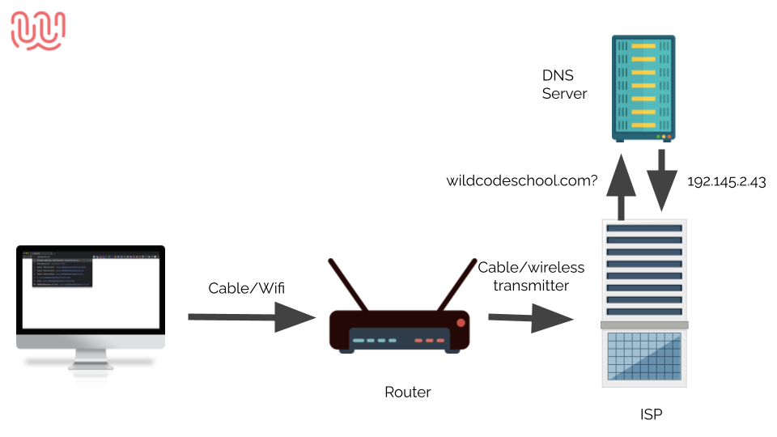
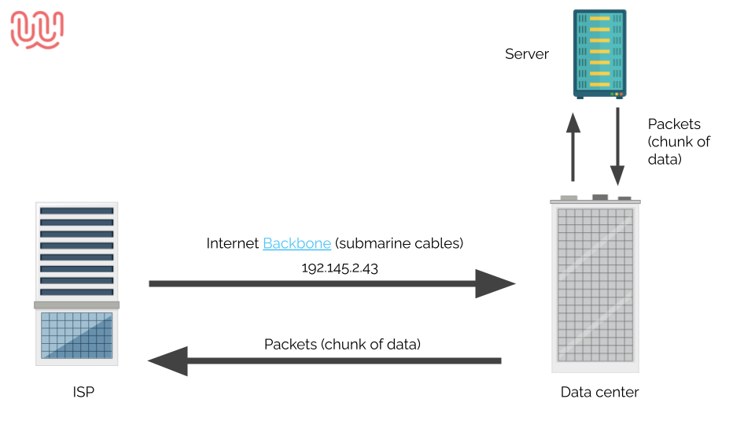
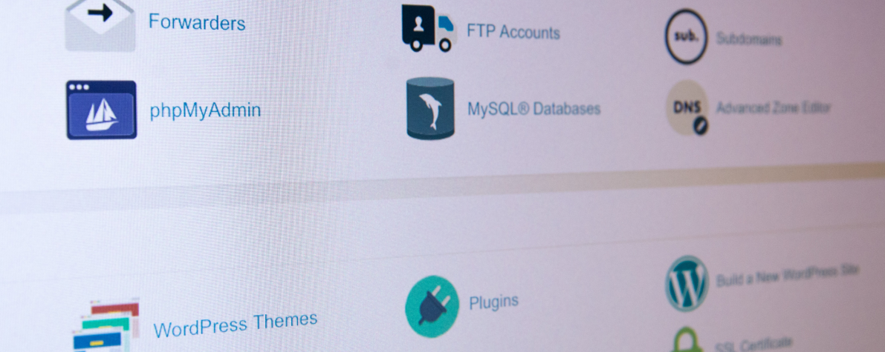
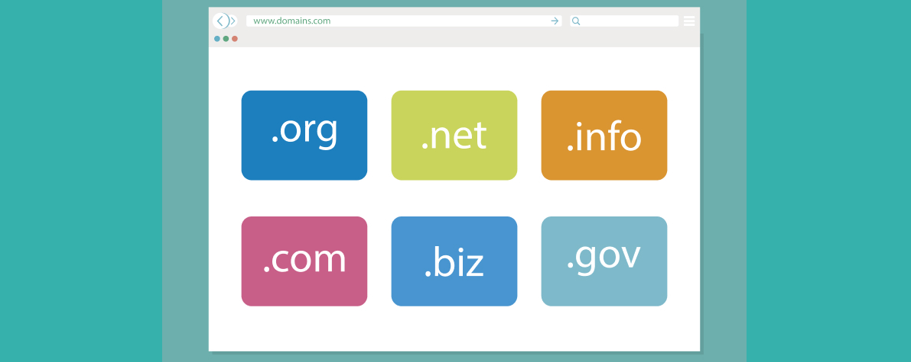

# Introduction au web et à internet

Le web? Internet?

Qu'est-ce que c'est exactement et comment cela fonctionne? C'est ce que vous allez découvrir dans ce cours! Vous apprendrez les bases de ce qu'est le web et d'internet.
Nous verrons ce que signifie un "Client" et un "Serveur" mais également ce qu'est un hébergeur, un nom de domaine ainsi que comment fonctionne notre navigateur en détail.


#### 🤓 À la fin de cette quête, tu sauras :

✅ Ce qu'est le web et internet
✅ Le fonctionnement de base d'un navigateur internet
✅ Ce qu'est un Client et un serveur
✅ Ce qu'est un hébergeur et un nom de domaine

- - -

# Qu'est-ce qu'internet ?


Ce qu'on appelle internet est un **vaste réseau d'ordinateurs** qui communiquent ensemble à l'aide de **protocoles standardisés**.

Internet est composé de milliers de **réseaux privés et publics** **interconnectés** entre eux. Les ordinateurs qui communiquent ensemble sont appelés **« nœuds »**.

Chaque nœud peut héberger **un ou plusieurs sites web**. Lorsque vous vous connectez à un site web, votre ordinateur se connecte au nœud qui héberge ce site.

Les **protocoles** utilisés sur internet permettent de faire **circuler les données** entre les différents nœuds. Le plus connu est le protocole **HTTP** (HyperText Transfer Protocol).


## L'évolution d'internet en vidéo

```youtube
https://www.youtube.com/watch?v=OzDgI0sJQBA
```

# Qu'est-ce qu'un réseau ?

On appelle "réseau" deux machines ou plus **connectés entre elles**. Ces machines peuvent **partager des ressources** comme des imprimantes, une connexion internet, une application, etc.

Ces machines sont souvent reliées entre elles à l'aide de **système de connexion sans fil** ou bien avec des **câbles**.



# Qu'est-ce qu'une adresse ip?


*source: [https://www.hostinger.com/tutorials/what-is-ip-address](https://www.hostinger.com/tutorials/what-is-ip-address)*

Lorsque tu te connectes à un réseau, ta machine se voit assigner une **adresse unique**. Un peu à la manière de ton adresse postale, cette adresse permet de **situer ta machine dans le réseau** et de pouvoir **envoyer et recevoir des requêtes**.

Une adresse ip est une **succession de 4 nombres allant chacun de 0 à 255 séparés par un point**.

*ex: 62.255.173.183*

# Qu'est-ce que le web ?


Nous venons de voir qu'internet est un réseau de machines connectées entre elles.

Mais le réseau internet n'est que la connexion entre les machines. Comment arrive-t-on à accéder à des ressources sur ces machines?

Le World Wide Web (ou Web) est un **ensemble de sites ou de pages Web stockés dans des serveurs Web** et connectés à des ordinateurs locaux **via** **internet**.

Ces sites web contiennent des pages de **texte**, des **images** **numériques**, des **audios**, des **vidéos**, etc.

# Que se passe-t-il lorsque j'essaie d'accéder à un site web ?



Imaginons que tu veuilles visiter le site Web de la Wild Code School.

Tu tapes l'URL dans la barre de navigation de ton navigateur et appuies sur la touche Entrée.



Ton navigateur va alors envoyer cette demande à ton **router** (ta box internet) à travers ton **réseau local**.

Ton router va alors, à travers des câbles ainsi que des antennes transmettre la demande à ton **fournisseur d'accès à internet** (orange, free, bouygues, etc..).

Nous avons vu précédemment que les machines sur le réseau ont des adresses ip, pour le moment, tu demandes à accéder au site web "wildcodeschool.com" ce site se trouve sur une machine, quelque part, dans le monde.

Pour pouvoir y accéder, il va falloir **trouver l'adresse de la machine qui correspond à l'url que tu as fournie** à ton navigateur.

Le **DNS** (Domain Name System) est un **registre**, un peu à la manière d'un annuaire, qui répertorie les adresses des machines correspondantes aux domaines.

Ta demande va être transmise à un **DNS** qui va trouver l'adresse de la machine (l’adresse ip du serveur qui héberge le site wildcodeschool.com est [104.21.79.167](http://104.21.79.167/) en revanche, comme tu peux le voir sur la page, l’hébergeur a été paramétré pour refuser les connexions via l'adresse ip)



Dernière étape, ton fournisseur d'accès va alors **envoyer la demande**, à l'aide d'antennes et de câbles sous-marins, **jusqu'à la machine** qui contient la ressource.

La machine va alors **répondre à la demande**, qui prendra alors le chemin inverse jusque ta machine via ton fournisseur d'accès à internet.

Et tout ça, en un clignement d'œil...

# Comprendre l'architecture client/serveur

L'architecture client/serveur est le mode de communication **le plus répandu sur Internet**.

Cette architecture se définit par **une entité qui fournit un service à une autre entité**.

Dans un environnement client/serveur, le client est l'entité qui demande un service à un autre ordinateur, appelé serveur. Voyons cela plus en détail:

## Le client

Ce qu'on appelle client est une application qui utilise les services d'un serveur pour effectuer des tâches.

Tu en utilises un à l'instant même ou tu lis ces lignes ! Et oui, ton navigateur est ce qu'on appelle un **client**.

#### Un Navigateur?

Ce qu'on appelle Navigateur désigne un logiciel qui permet de naviguer sur internet. C'est-à-dire de lire des pages web.

Il existe une multitude de navigateurs, dont tu connais certainement les noms, les plus populaires sont:
Google Chrome, Safari, Mozilla Firefox et Microsoft Edge.

Nous te recommandons, pour la formation d'utiliser un navigateur moderne comme Mozilla Firefox ou Google Chrome, ces navigateurs sont les plus adaptés pour apprendre le code et profiter au maximum des possibilités offertes par les navigateurs.

```resource
https://www.mozilla.org/fr/firefox/new/
# Télécharger Firefox
```

```resource
https://www.google.com/intl/fr/chrome/
# Télécharger Chrome
```

Lorsque tu utilises ton navigateur pour afficher une page web, ton navigateur (le client) va effectuer ce qu'on appelle une **requête HTTP** à un serveur, et le serveur va répondre à la requête en renvoyant la ressource correspondante.

## Un serveur?

Ce qu'on appelle serveur, c'est simplement un ordinateur dont le but est de répondre à des demandes de clients.

Le serveur est généralement une machine, connectée en permanence à internet, et dont le but est de recevoir des requêtes et d'y répondre.

Par exemple, lorsque vous utilisez votre navigateur pour visiter le site de google, votre client va effectuer une demande HTTP aux serveurs sur lesquels sont stockées les pages de google. Et le serveur va répondre en renvoyant les ressources associées.

Les sites que l'on voit sur notre navigateur sont des pages HTML, le serveur de google va donc répondre en renvoyant une page HTML qui sera ensuite lue par le navigateur, et grâce à ça, la page va s'afficher !

# Qu'est ce qu'un hébergeur ?


Les sites internet que nous allons créer ont besoin d'être accessibles sur internet, et comme nous l'avons vu précédemment les sites internet sont stockés sur des **serveurs.**

Il est possible de louer de l'espace sur un serveur grace à ce qu'on appelle un **hébergeur web.**

Il existe de nombreux hébergeurs sur internet, ce qui est important lorsqu'on choisit un hébergeur web, c'est de s'assurer de la qualité de celui-ci, un bon hébergeur doit être sécurisé, rapide et offrir une bonne assistance technique.

## Nom de domaine



Par défaut, lorsque tu souscris à un hébergement,  tu peux accéder à ta machine en utilisant son adresse ip, cependant, ce n'est pas pratique pour tes utilisateurs pour se souvenir de ton site internet.

C'est pourquoi il faudra maintenant investir dans un **nom de domaine.** Un nom de domaine se compose de deux parties:

* Le nom (ex: wildcodeschool)
* L'extension (ex: .com)

Il existe une multitude d'extensions (.com, .fr, .net, .news, etc...) mais les plus efficaces restent les .com et .fr !

- - -

# ☝️ Résumé

* Internet est un vaste réseau d'ordinateurs qui communiquent ensemble à l'aide de **protocoles** standardisés.
* Le web est un **ensemble de sites ou de pages Web stockés dans des serveurs Web et connectés à des ordinateurs locaux via internet**.
* L'architecture **client/serveur** est le mode de communication le plus répandu sur Internet.
* Un hébergeur web est un hébergeur qui propose à des clients une connexion à son serveur, en échange d'une somme d'argent.
* Un nom de domaine est un nom unique et une extension qui pointe vers une adresse IP sur internet.